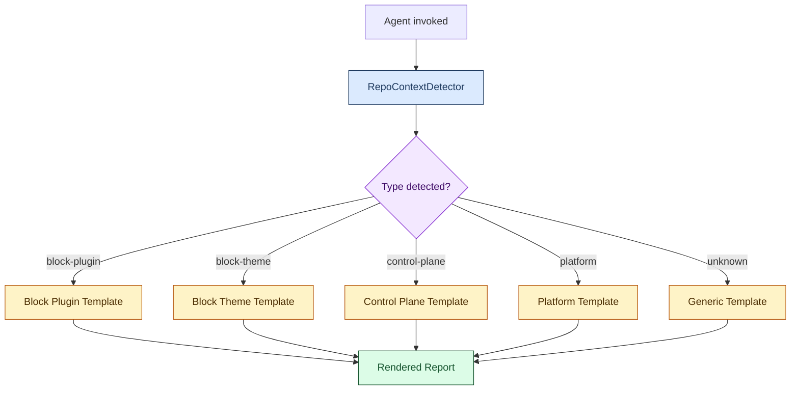

# Reporting Agent v2 — Specification

**Version:** 2.0  
**Status:** Active  
**Supersedes:** Reporting Agent v1.3

---

## 1. Executive Summary

Reporting Agent v2 is a single, portable agent that supports heterogeneous repository types within the LightSpeed organisation. It detects the repository type automatically from file structure and GitHub topic metadata, then selects the appropriate Markdown report template with typed, contextually relevant sections.

**Supported repository types:**

| Type | Key | Detection Signals |
|---|---|---|
| GitHub control-plane | `control-plane` | `repo === '.github'`, `topic:control-plane`, `agents/` + `workflows/` dirs |
| WordPress block plugin | `block-plugin` | Root `.php` file + `block.json`, `topic:wordpress-plugin` |
| WordPress block theme | `block-theme` | `theme.json`, `style.css` + `functions.php`, `topic:block-theme` |
| Platform / infrastructure | `platform` | `Dockerfile`, `*.tf`, `Chart.yaml`, `topic:platform` |
| Unknown (fallback) | `unknown` | No distinctive signals |

---

## 2. Goals

1. **Single unified agent** — one `.github/agents/reporting.agent.md` for all repository types.
2. **Automatic context detection** — zero manual configuration for standard LightSpeed repositories.
3. **Repository-aware templates** — each type has sections relevant to its domain.
4. **Org-wide rollout** — 5+ repositories adopt v2 within 2 weeks of publication.

---

## 3. Architecture

### 3.1 Component Diagram



### 3.2 Module Overview

```
agents/metadata-agent/
├── lib/
│   ├── context/
│   │   └── repo-context-detector.js   # RepoContextDetector class
│   └── templates/
│       └── repo-templates.js           # Template registry + render function
└── __tests__/
    └── context/
        └── repo-context-detector.test.js
```

### 3.3 `RepoContextDetector`

**Location:** `agents/metadata-agent/lib/context/repo-context-detector.js`

**Responsibility:** Given a repository name, list of file paths, and optional GitHub repository metadata, return a `RepoContext` object describing the repository type.

**Interface:**

```js
const detector = new RepoContextDetector({ owner: 'lightspeedwp' });
const ctx = detector.detect(repoName, filePaths, repoMeta);
// ctx.type        — 'block-plugin' | 'block-theme' | 'control-plane' | 'platform' | 'unknown'
// ctx.templateKey — same as type (used for template selection)
// ctx.signals     — array of evidence strings used for detection
// ctx.meta        — normalised repository metadata
```

**Detection priority (highest to lowest):**

1. Control-plane
2. Block plugin
3. Block theme
4. Platform
5. Unknown (fallback)

### 3.4 Template Registry

**Location:** `agents/metadata-agent/lib/templates/repo-templates.js`

**Responsibility:** Map repository type keys to Markdown report template functions and render a report from a `TemplateContext`.

**Interface:**

```js
const { renderTemplate } = require('./lib/templates/repo-templates');
const report = renderTemplate(ctx.templateKey, {
  repoName: 'my-plugin',
  owner: 'lightspeedwp',
  date: '2026-08-29',
  period: '2026-08',
});
```

---

## 4. Detection Specification

### 4.1 Control-Plane Signals

| Signal | Condition |
|---|---|
| `repo-name:.github` | `repoName === '.github'` |
| `topic:control-plane` | `repoMeta.topics` includes `'control-plane'` |
| `has:workflows+agents` | Both `.github/workflows` and `agents` directories present in file list |

### 4.2 Block Plugin Signals

| Signal | Condition |
|---|---|
| `has:php-root-file` | `.php` file at repository root (non-nested) |
| `has:block.json` | Any `block.json` file in file list |
| `has:composer.json` | `composer.json` at root |
| `topic:wordpress-plugin` | `repoMeta.topics` includes `'wordpress-plugin'` |
| `topic:gutenberg` | `repoMeta.topics` includes `'gutenberg'` |

**Detection rule:** (`has:php-root-file` AND `has:block.json`) OR (`topic:wordpress-plugin` AND (`has:block.json` OR `has:composer.json`))

### 4.3 Block Theme Signals

| Signal | Condition |
|---|---|
| `has:theme.json` | `theme.json` at root |
| `has:style.css` | `style.css` at root |
| `has:functions.php` | `functions.php` at root |
| `has:templates-directory` | Path starting with `templates/` in file list |
| `topic:wordpress-theme` | `repoMeta.topics` includes `'wordpress-theme'` |
| `topic:block-theme` | `repoMeta.topics` includes `'block-theme'` |

**Detection rule:** `has:theme.json` OR (`has:style.css` AND `has:functions.php`) OR topic-based detection

### 4.4 Platform Signals

| Signal | Condition |
|---|---|
| `has:dockerfile` | `Dockerfile` (case-insensitive) at root |
| `has:terraform` | Any `*.tf` file |
| `has:helm-chart` | `Chart.yaml` or `Chart.yml` |
| `topic:platform` | `repoMeta.topics` includes `'platform'` |
| `topic:infrastructure` | `repoMeta.topics` includes `'infrastructure'` |

---

## 5. Template Specification

Each template produces a Markdown document with:

1. **YAML frontmatter** — `title`, `description`, `file_type: report`, `category`, `created_date`, `version`, `repository`, `authors`, `tags`
2. **Header** — Report title, repository link, period, generated date
3. **Summary** — Editable placeholder
4. **Type-specific sections** — Domain sections relevant to the detected repository type (see §5.1–5.5)
5. **Shared sections** — Development Activity (PRs + Issues), Blockers & Risks, Next Steps
6. **Footer** — Reporting Agent v2 attribution link

### 5.1 Block Plugin Template

Additional sections: Plugin Health, Block Inventory, Test Coverage, Security & Compliance.

### 5.2 Block Theme Template

Additional sections: Theme Health, Template & Pattern Inventory, Design System (theme.json), Accessibility Checks, Performance.

### 5.3 Control-Plane Template

Additional sections: Agent & Automation Health, Workflow Activity, Issue & PR Metrics, Test Coverage, Security & Compliance.

### 5.4 Platform Template

Additional sections: Infrastructure Health, Deployment Activity, Security.

### 5.5 Unknown / Generic Template

Sections: Summary, Development Activity, Blockers & Risks, Next Steps.

---

## 6. Integration with Reporting Agent

The Reporting Agent (`.github/agents/reporting.agent.md`) surfaces context detection in its conversation flow:

1. User provides or agent resolves the repository name.
2. Agent calls `RepoContextDetector.detect()` with available file/topic signals.
3. Agent calls `renderTemplate(ctx.templateKey, ctx)` to scaffold the report.
4. Agent presents the scaffold and guides the user through filling in the editable sections.

If the detected type is `unknown`, the agent prompts the user to confirm or override the type before rendering.

---

## 7. Constraints & Non-Goals

- **No I/O in detector or templates** — both modules are pure functions; file system reads are performed by the caller (agent or integration script).
- **No API calls in templates** — templates produce static Markdown; live data population is a separate concern for the metadata-agent API layer.
- **No auto-commit** — the rendered report is presented to the user for review before being saved.

---

## 8. Test Strategy

| Scope | Tool | Target |
|---|---|---|
| `RepoContextDetector` unit | Jest | All detection paths, priority order, edge cases, context object shape |
| Template rendering | Jest | Each template renders without error; required sections present |
| Integration | Jest | Detect + render pipeline for all five repository types |

**Test location:** `agents/metadata-agent/__tests__/context/repo-context-detector.test.js`

---

## 9. Acceptance Criteria

- [x] `RepoContextDetector` returns correct type for all five supported repository type scenarios
- [x] All five templates render valid Markdown with required frontmatter fields
- [x] Detection priority is respected (control-plane > block-plugin > block-theme > platform > unknown)
- [x] Agent prompt updated to v2.0 with multi-repo documentation
- [ ] Control-plane validation run produces a structurally valid report
- [ ] Block plugin validation run produces a structurally valid report
- [ ] Block theme validation run produces a structurally valid report

---

## 10. Related Documents

- [PLANNING.md](./PLANNING.md) — Phase planning and timeline
- [README.md](./README.md) — Project overview
- [Reporting Agent Spec](./../../../.github/agents/reporting.agent.md) — Agent prompt v2.0
- [GitHub Issue #1898](https://github.com/lightspeedwp/.github/issues/1898) — Master epic

---

*Generated by [Reporting Agent v2](https://github.com/lightspeedwp/.github/blob/develop/.github/agents/reporting.agent.md)*
