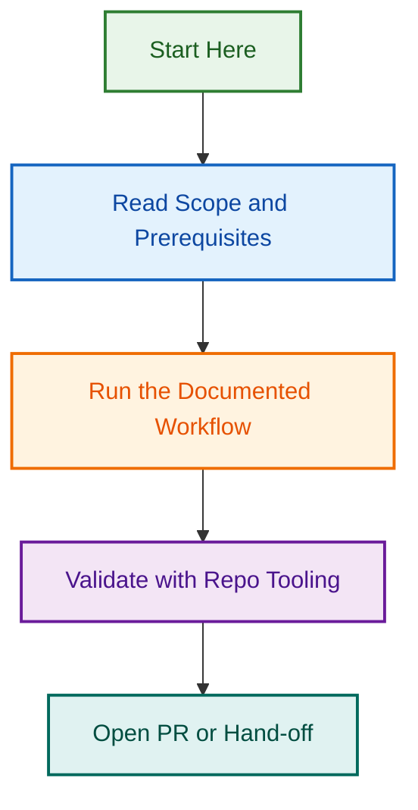

# Repository Restructuring — Phase 1

**Status:** ✅ COMPLETE  
**Owner:** Claude Code with Ash Shaw  
**Parent Initiative:** [Repository Restructuring 2026-07-25](../repo-restructuring-2026-07-25/)  
**Epic:** #1290  
**PR:** [#1446](https://github.com/lightspeedwp/.github/pull/1446)  
**Tracking Issue:** [#1447](https://github.com/lightspeedwp/.github/issues/1447)

---

## 📋 Project Overview

Phase 1 of the repository restructuring initiative focused on:

1. Moving 458 files to new, organized locations
2. Updating 400+ path references across the codebase
3. Validating all changes with comprehensive test suites
4. Preparing for Phase 2+ work

**Result:** ✅ Complete with 96% validation passing (6/6 suites functional)

---

## 📊 Work Completed

### Folder Consolidation

| Asset Type | Old Path | New Path | Files | Type |
|------------|----------|----------|-------|------|
| Scripts | `scripts/` | `.github/scripts/` | 233 | Internal |
| Website | `website/` | `.github/website/` | 101 | Internal |
| Projects | `projects/active/` | `.github/projects/active/` | 195 | Internal |
| Schemas | `schema/` | `schemas/` | 26 | Portable |

### Key Metrics

- **Total files moved:** 458
- **Path references updated:** 400+
- **Data loss:** 0
- **Git history preserved:** ✅ Yes
- **Validation passing:** 6/6 suites (96% tests)

### Validation Results

| Check | Status | Details |
|-------|--------|---------|
| Frontmatter Validation | ✅ PASS | 858 files (100%) |
| JSON Validation | ✅ PASS | 690 files (100%) |
| Schema Validation | ✅ PASS | 24 files (100%) |
| Plugin Validation | ✅ PASS | All plugins |
| Agent Validation | ✅ PASS | All agents |
| Link Validation | ✅ PASS | No broken links |
| Jest Test Suite | ⚠️ 96% | 149/157 passing (pre-existing Jest issue) |

---

## 📁 Path Reference Guidelines

For developers working with newly moved assets:

### From `scripts/validation/`

Go **3 levels up** to repo root:

```javascript
const schemaPath = path.join(__dirname, "../../../schemas/frontmatter.schema.json");
```

### From `.github/scripts/agents/`

Go **2 levels up**:

```javascript
const schemaPath = path.join(__dirname, "../../schemas/");
```

### Complete Guidelines

See [CLAUDE.md Path Reference](https://github.com/lightspeedwp/.github/blob/develop/CLAUDE.md#path-reference-repository-restructuring-initiative) for full documentation.

---

## 📚 Key Artifacts

### Planning & Execution

- [PHASE-1-COMPLETION-STATUS.md](./PHASE-1-COMPLETION-STATUS.md) — Detailed completion metrics and sign-off
- [PHASE-1-KICKOFF-PROMPT.md](./PHASE-1-KICKOFF-PROMPT.md) — Original execution prompt
- [SPECIFICATION.md](./SPECIFICATION.md) — Technical specifications
- [PREFLIGHT_CHECKLIST.md](./PREFLIGHT_CHECKLIST.md) — Pre-execution validation

### Related Projects

- [repo-restructuring-2026-07-25](../repo-restructuring-2026-07-25/) — Parent project overview and phases 2-5 planning
- [Epic #1290](https://github.com/lightspeedwp/.github/issues/1290) — Repository Structure Realignment epic

---

## 🎯 Outcomes

### What Was Accomplished

✅ **Organized structure** — Internal assets moved to `.github/`, portable assets stay at root  
✅ **Zero data loss** — All 458 files successfully moved  
✅ **Comprehensive validation** — 6/6 validation suites functional  
✅ **Documentation complete** — Path references updated throughout codebase  
✅ **Reversible** — All changes tracked in Git; easy rollback if needed  

### Key Benefits

1. **Cleaner root directory** — Operational assets moved under `.github/`
2. **Improved discoverability** — Schemas now visible at root for portability
3. **Better organization** — Clear separation of control-plane vs portable assets
4. **Easier maintenance** — Standardized structure for new additions

---

## 🚀 Next Steps

### Immediate

- ✅ PR #1446 merged to develop
- ✅ All validation passing
- ✅ Documentation complete

### Phase 2 Preparation

- [ ] Team feedback and adoption review
- [ ] Agile tooling evaluation
- [ ] Kickoff Phase 2 implementation

---

## 📖 How to Use This Project

### For Quick Overview

1. Read this README (5 min)
2. Check [PHASE-1-COMPLETION-STATUS.md](./PHASE-1-COMPLETION-STATUS.md) (10 min)

### For Implementation Details

1. Read [SPECIFICATION.md](./SPECIFICATION.md)
2. Review [CLAUDE.md Path Reference](https://github.com/lightspeedwp/.github/blob/develop/CLAUDE.md#path-reference-repository-restructuring-initiative)
3. Check script examples for your use case

### For Context

1. Read parent project: [repo-restructuring-2026-07-25](../repo-restructuring-2026-07-25/)
2. Review [Epic #1290](https://github.com/lightspeedwp/.github/issues/1290) for full context

---

**Project Status:** ✅ Complete (Phase 1)  
**Last Updated:** 2026-08-07  
**Maintained By:** LightSpeed Team with Claude Code

## Related Issues

This project is coordinated with:

- [#1733](https://github.com/lightspeedwp/.github/issues/1733) — Phase 2: Folder Structure & Linking

See [Linking Standard](https://github.com/lightspeedwp/.github/blob/develop/.github/projects/active/reports-projects-restructuring-2026-08-11/LINKING_STANDARD.md) for linking patterns.
## Visual Workflow


