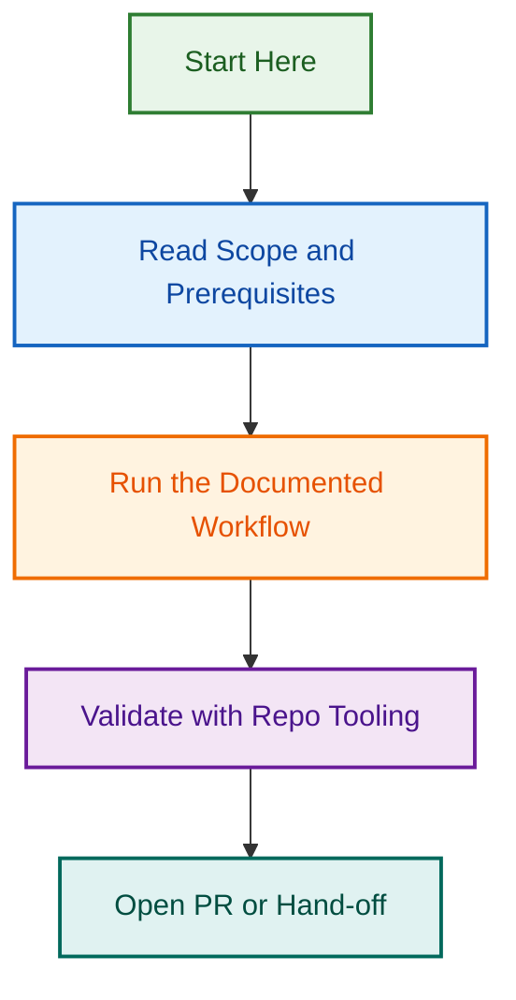

# Reviewer Agent v2 Implementation — Multi-Tool Orchestration & Feedback Processing

## Related Issues

| Issue | Type | Purpose | Status |
|-------|------|---------|--------|
| [#1798](../../../../../issues/1798) | epic | Reviewer Agent v2 — Planning Phase & Implementation Roadmap | 🟢 Open |

## Project Overview

Enhance the existing Reviewer Agent from a basic CI/PR monitoring tool into an intelligent, multi-tool orchestrator that:

- **Triggers multiple code review tools** (CodeRabbit, GitHub Code Quality, GitHub Copilot) simultaneously
- **Collects and normalizes feedback** from all tools into a unified structure
- **Processes findings intelligently** with auto-resolution, false-positive suppression, and escalation logic
- **Tracks resolution progress** across multiple PR commits until all critical/major issues are addressed
- **Respects organizational boundaries** — serves `.github` control-plane, WordPress plugins, and WordPress themes with unified configuration

## Goals

✅ Reduce manual code review burden by 40%  
✅ Provide instant, actionable feedback on every PR  
✅ Ensure critical security/architectural issues are never merged unresolved  
✅ Enable reuse across LightSpeedWP organization repos  
✅ Maintain high signal-to-noise ratio (< 5% false positive rate)  

## Timeline

- **Phase 1: Planning & Specification** (Current) — 1 week
- **Phase 2: Core Implementation** — 2 weeks
- **Phase 3: Testing & Validation** — 1 week
- **Phase 4: Documentation & Rollout** — 1 week
- **Phase 5: Monitoring & Iteration** — Ongoing

**Target merge:** 2026-08-26

## Related Issues

This project is tracked through GitHub issues for each phase and task breakdown.

| Issue | Type | Purpose | Status |
|-------|------|---------|--------|
| TBD | epic | Phase 1: Planning & Specification | 🟡 In Progress |
| TBD | epic | Phase 2: Core Implementation | 🔵 Planned |
| TBD | epic | Phase 3: Testing & Validation | 🔵 Planned |
| TBD | epic | Phase 4: Documentation & Rollout | 🔵 Planned |
| TBD | epic | Phase 5: Monitoring & Iteration | 🔵 Future |

**Note:** GitHub issues will be created as phases progress. See [[OPENSPEC_PLAN.md](./OPENSPEC_PLAN.md)] for detailed task breakdown.

## Architecture

```
┌─────────────────────────────────────────────────────────────┐
│                  Reviewer Agent v2                          │
├─────────────────────────────────────────────────────────────┤
│                                                             │
│  [1] Tool Selection Logic                                  │
│      ↓                                                      │
│  [2] Parallel Tool Orchestration                           │
│      ├─→ CodeRabbit (architecture, security, perf)        │
│      ├─→ GitHub Code Quality (metrics, complexity)        │
│      └─→ GitHub Copilot (style, quick wins)               │
│      ↓                                                      │
│  [3] Feedback Polling & Collection                         │
│      ↓                                                      │
│  [4] Feedback Normalization & Structuring                 │
│      ↓                                                      │
│  [5] Intelligent Decision Engine                           │
│      ├─→ Auto-resolve (code matches finding)              │
│      ├─→ Suppress (false positive, pre-existing)          │
│      ├─→ Escalate (conflicting, architectural)            │
│      └─→ Block (critical unresolved)                      │
│      ↓                                                      │
│  [6] State Persistence & PR Comments                       │
│      ↓                                                      │
│  [7] Resolution Tracking (across PR commits)               │
│      ↓                                                      │
│  Merge Gate: Block if critical issues unresolved           │
│                                                             │
└─────────────────────────────────────────────────────────────┘
```

## Key Design Decisions

### 1. Agent Scope & Reusability

**Decision:** ONE unified agent with configuration overlays for different repo types

- `.github` control-plane (strict governance, all tools enabled)
- WordPress plugins (optional WordPress-specific linting)
- WordPress themes (optional WordPress-specific linting)
- Configuration-driven specialization (no separate agents)

### 2. Tool Authorization & Fallback Strategy

**Decision:** Hybrid authorization with graceful fallback

- Primary: Organization-wide tokens (ORG_CODERABBIT_API_TOKEN)
- Override: Per-repository secrets
- Fallback: GitHub Code Quality (always available, built-in)
- Missing tools: Skip gracefully, continue with available tools

### 3. WordPress-Specific Review Categories

**Decision:** Opt-in WordPress categories for plugin/theme repos

- Optional categories: PHP linting, block registration, theme.json validation
- For `.github`: JavaScript/YAML/Markdown focused
- For plugins/themes: Full stack (JS + PHP + WordPress specifics)

### 4. Test Coverage Strategy

**Decision:** Three-tier testing approach

- **Unit Tests:** 90% coverage (decision logic, parsing, state)
- **Integration Tests:** Happy-path scenarios with mocked APIs
- **E2E Tests:** Full PR review lifecycle in test repository

### 5. Documentation & Diagrams

**Decision:** Comprehensive documentation with 8+ Mermaid diagrams

- Architecture diagrams (component interactions, tool orchestration)
- Sequence diagrams (tool orchestration flow, decision engine)
- State machines (finding lifecycle)
- Setup and user guides with examples

### 6. Artifact Location

**Decision:** Split location

- Planning/decisions: `.github/projects/active/reviewer-agent-v2-2026-08/`
- Code/implementation: `scripts/agents/reviewer-agent-v2/` (portable)
- Tests: `scripts/agents/__tests__/reviewer-agent-v2.test.js`

## Project Artifacts

### Planning & Decisions

- 📋 [OPENSPEC_PLAN.md](./OPENSPEC_PLAN.md) — Comprehensive implementation roadmap (generated by OpenSpec)
- 📋 [DECISIONS.md](./decisions/DECISIONS.md) — Formal decision log
- 📋 [ANSWERS.md](./ANSWERS.md) — Best-practice answers to clarifying questions

### Specifications (Phase 2)

- 📋 AGENT_SPECIFICATION.md — Agent definition & behavior [TBD]
- 📋 API_INTEGRATION_SPEC.md — Tool API integration details [TBD]
- 📋 STATE_SCHEMA.md — Feedback tracking data model [TBD]
- 📋 TEST_SPECIFICATION.md — Test plan & coverage targets [TBD]

### Configuration Examples (Phase 2)

- 📋 config.github.yml — `.github` control-plane config [TBD]
- 📋 config.wordpress-plugin.yml — WordPress plugin config [TBD]
- 📋 config.wordpress-theme.yml — WordPress theme config [TBD]

### Documentation (Phase 2)

- 📋 ARCHITECTURE.md — System design with diagrams [TBD]
- 📋 SETUP_GUIDE.md — Implementation & deployment steps [TBD]
- 📋 USER_GUIDE.md — How to use the agent in a PR workflow [TBD]

## File Structure

```
.github/projects/active/reviewer-agent-v2-2026-08/
├── README.md                                    (This file)
├── OPENSPEC_PLAN.md                            (Generated by OpenSpec)
├── ANSWERS.md                                   (Best-practice answers)
├── decisions/
│   └── DECISIONS.md                            (Decision log)
├── specifications/
│   ├── AGENT_SPECIFICATION.md
│   ├── API_INTEGRATION_SPEC.md
│   ├── STATE_SCHEMA.md
│   └── TEST_SPECIFICATION.md
├── configuration-examples/
│   ├── config.github.yml
│   ├── config.wordpress-plugin.yml
│   └── config.wordpress-theme.yml
└── .archive-status.md                          (Created when complete)
```

## Related Issues

| Issue | Type | Purpose | Status |
|-------|------|---------|--------|
| [#1799](https://github.com/lightspeedwp/.github/issues/1799) | epic | Reviewer Agent v2 — Multi-Tool Orchestration & Feedback Processing | 🟡 In Progress |

## Next Steps

1. ✅ Project structure created
2. 📋 **Run OpenSpec** — Generate comprehensive implementation roadmap
3. 📋 Create GitHub issues from task breakdown
4. 🔨 Phase 2 begins — Core implementation
5. ✅ PR created with planning documentation

## References

- **Current Agent:** `.github/agents/reviewer.agent.md`
- **Branching Strategy:** `docs/BRANCHING_STRATEGY.md`
- **Branch:** `feat/reviewer-agent-v2-orchestrator`

---

*Built by 🧱 LightSpeedWP with ☕, 🚀, and multi-tool orchestration!*

## Visual Workflow


