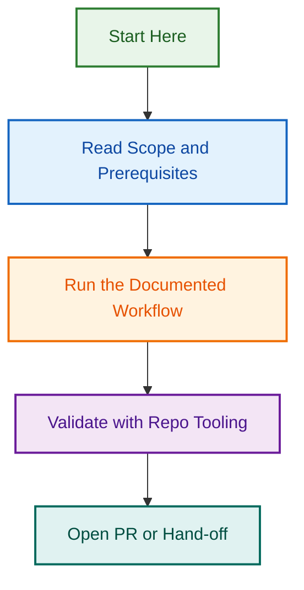

# Reviewer Agent v2 Implementation — Multi-Tool Orchestration & Feedback Processing

## Project Overview

Enhance the existing [Reviewer Agent](./.github/agents/reviewer.agent.md) from a basic CI/PR monitoring tool into an intelligent, multi-tool orchestrator that:

- **Triggers multiple code review tools** (CodeRabbit, GitHub Code Quality, GitHub Copilot) simultaneously
- **Collects and normalizes feedback** from all tools into a unified structure
- **Processes findings intelligently** with auto-resolution, false-positive suppression, and escalation logic
- **Tracks resolution progress** across multiple PR commits until all critical/major issues are addressed
- **Respects organizational boundaries** — serves both `.github` control-plane and WordPress block plugin/theme repos

## Goals

✅ Reduce manual code review burden by 40%  
✅ Provide instant, actionable feedback on every PR  
✅ Ensure critical security/architectural issues are never merged unresolved  
✅ Enable reuse across LightSpeedWP organization repos  
✅ Maintain high signal-to-noise ratio (< 5% false positive rate)  

## Timeline

- **Phase 1: Planning & Specification** (Current) — 1 week
- **Phase 2: Core Implementation** — 2 weeks
- **Phase 3: Testing & Validation** — 1 week
- **Phase 4: Documentation & Rollout** — 1 week
- **Phase 5: Monitoring & Iteration** — Ongoing

**Target merge:** 2026-08-26

## Related Issues

| Issue | Type | Purpose | Status |
|-------|------|---------|--------|
| [#1802](https://github.com/lightspeedwp/.github/issues/1802) | epic | Master Epic: Reviewer Agent v2 Implementation | 🟢 Open |
| [#1798](https://github.com/lightspeedwp/.github/pull/1798) | PR | Planning: Implementation Roadmap & Specification | 🟡 In Review |

## Architecture

```
┌─────────────────────────────────────────────────────────────┐
│                  Reviewer Agent v2                          │
├─────────────────────────────────────────────────────────────┤
│                                                             │
│  [1] Tool Selection Logic                                  │
│      ↓                                                      │
│  [2] Parallel Tool Orchestration                           │
│      ├─→ CodeRabbit (architecture, security, perf)        │
│      ├─→ GitHub Code Quality (metrics, complexity)        │
│      └─→ GitHub Copilot (style, quick wins)               │
│      ↓                                                      │
│  [3] Feedback Polling & Collection                         │
│      ↓                                                      │
│  [4] Feedback Normalization & Structuring                 │
│      ↓                                                      │
│  [5] Intelligent Decision Engine                           │
│      ├─→ Auto-resolve (code matches finding)              │
│      ├─→ Suppress (false positive, pre-existing)          │
│      ├─→ Escalate (conflicting, architectural)            │
│      └─→ Block (critical unresolved)                      │
│      ↓                                                      │
│  [6] State Persistence & PR Comments                       │
│      ↓                                                      │
│  [7] Resolution Tracking (across PR commits)               │
│      ↓                                                      │
│  Merge Gate: Block if critical issues unresolved           │
│                                                             │
└─────────────────────────────────────────────────────────────┘
```

## Key Decisions Required

### 1. Agent Scope & Reusability

**Question:** Should this be one unified agent or separate agents for different repo types?

**Recommendation:** See [ANSWERS.md](./ANSWERS.md) — Recommendation 1

---

### 2. Tool Authorization & Fallback Strategy

**Question:** How should API tokens be managed and what's the fallback strategy?

**Recommendation:** See [ANSWERS.md](./ANSWERS.md) — Recommendation 2

---

### 3. WordPress-Specific Review Categories

**Question:** What additional review dimensions are needed for WordPress block plugins/themes?

**Recommendation:** See [ANSWERS.md](./ANSWERS.md) — Recommendation 3

---

### 4. Test Coverage Strategy

**Question:** What test types and coverage targets?

**Recommendation:** See [ANSWERS.md](./ANSWERS.md) — Recommendation 4

---

### 5. Documentation & Diagrams

**Question:** Which diagrams should be included in documentation?

**Recommendation:** See [ANSWERS.md](./ANSWERS.md) — Recommendation 5

---

### 6. Active Project Location

**Question:** Where should project artifacts live?

**Recommendation:** See [ANSWERS.md](./ANSWERS.md) — Recommendation 6

---

## Project Artifacts

### Planning & Decisions

- 📋 [DECISIONS.md](./decisions/DECISIONS.md) — Decision log with rationale
- 📋 [ANSWERS.md](./ANSWERS.md) — Best-practice answers to clarifying questions
- 📋 [IMPLEMENTATION_PLAN.md](./IMPLEMENTATION_PLAN.md) — Detailed phased plan

### Specifications

- 📋 [AGENT_SPECIFICATION.md](./specifications/AGENT_SPECIFICATION.md) — Agent definition & behavior
- 📋 [API_INTEGRATION_SPEC.md](./specifications/API_INTEGRATION_SPEC.md) — Tool API integration details
- 📋 [STATE_SCHEMA.md](./specifications/STATE_SCHEMA.md) — Feedback tracking data model

### Configuration Examples

- 📋 [config.github.yml](./configuration-examples/config.github.yml) — `.github` control-plane config
- 📋 [config.wordpress-plugin.yml](./configuration-examples/config.wordpress-plugin.yml) — WordPress plugin config
- 📋 [config.wordpress-theme.yml](./configuration-examples/config.wordpress-theme.yml) — WordPress theme config

### Documentation

- 📋 [ARCHITECTURE.md](./ARCHITECTURE.md) — System design & component interactions
- 📋 [SETUP_GUIDE.md](./SETUP_GUIDE.md) — Implementation & deployment steps
- 📋 [USER_GUIDE.md](./USER_GUIDE.md) — How to use the agent in a PR workflow

## File Structure (This Project)

```
.github/projects/active/reviewer-agent-v2-implementation-2026-08/
├── README.md                                    (This file)
├── ANSWERS.md                                   (Best-practice answers)
├── IMPLEMENTATION_PLAN.md                       (Detailed phased plan)
├── decisions/
│   ├── DECISIONS.md                            (Decision log)
│   ├── agent-scope-decision.md                 (Scope analysis)
│   └── authorization-strategy-decision.md      (Token management)
├── specifications/
│   ├── AGENT_SPECIFICATION.md                  (Agent definition)
│   ├── API_INTEGRATION_SPEC.md                 (Tool API requirements)
│   ├── STATE_SCHEMA.md                         (Feedback data model)
│   └── TEST_SPECIFICATION.md                   (Test plan)
├── configuration-examples/
│   ├── config.github.yml                       (Control-plane config)
│   ├── config.wordpress-plugin.yml             (Plugin config)
│   └── config.wordpress-theme.yml              (Theme config)
└── .archive-status.md                          (Created when project completes)
```

## Next Steps

1. ✅ **Review [ANSWERS.md](./ANSWERS.md)** — Confirm best-practice recommendations
2. 📋 **Log decisions in [decisions/DECISIONS.md](./decisions/DECISIONS.md)**
3. 📋 **Run OpenSpec** — Create detailed implementation plan
4. 🔨 **Phase 2 begins** — Core implementation

---

*Built by 🧱 LightSpeedWP with ☕, 🚀, and collaborative planning!*
## Visual Workflow


