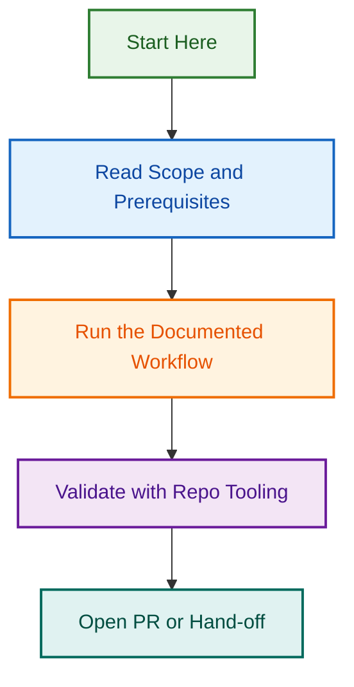

# Status: Needs-Review Audit — 2026-08-04

## Project Overview

Comprehensive audit and cleanup of all issues with `status:needs-review` label to ensure proper assignment, labeling, and governance compliance.

## Objectives

- ✅ Review all open issues with `status:needs-review` label
- ✅ Ensure all open issues are assigned (target: ashleyshaw)
- ✅ Remove stale `status:needs-review` label from closed issues
- ✅ Verify all issues have appropriate governance labels
- ✅ Generate audit report documenting findings

## Results

### Open Issues — 11 Total

- ✅ All 11 issues assigned to ashleyshaw
- ✅ 2 issues assigned this session (#935, #934)
- ✅ All properly labeled with type, priority, and area labels
- ✅ Includes Phase 1-6 quality audit series (7 issues)
- ✅ Includes cleanup/maintenance tasks (4 issues)

### Closed Issues — Cleanup Complete

- ✅ Removed `status:needs-review` label from 9 closed issues
- ✅ Assigned 7 previously-unassigned closed issues to ashleyshaw
- ✅ All closed issues properly archived with no stale labels

## Deliverables

### Audit Report

- **File:** `.github/reports/2026-08-04-status-needs-review-audit.md`
- **Format:** Markdown documentation
- **Coverage:** All 11 open + 9 recent closed issues
- **Status:** ✅ Complete

### Pull Request

- **PR:** #1506
- **Branch:** chore/status-needs-review-audit
- **Template:** PR Chore (pr_chore.md)
- **Labels:** type:audit, type:chore, type:documentation, status:ready, area:automation, priority:normal, meta:needs-changelog
- **Auto-merge:** ✅ Enabled (squash merge)
- **Status:** ✅ Ready for merge

## Implementation Details

### Audit Scope

- All issues with label: `status:needs-review`
- State: Both OPEN and CLOSED
- Query method: GitHub CLI (`gh issue list`)
- Verification: All results validated via CLI

### Governance Standards Applied

- ✅ Branch naming: `{type}/{scope}-{short-title}` format
- ✅ PR template: Chore template (pr_chore.md)
- ✅ Changelog entries: Added via PR body
- ✅ Label compliance: All issues have type, priority, area labels
- ✅ Assignment compliance: All issues assigned to accountable owner

## Related Issues / Epics

- **Issue Triage Automation (#1376):** Completed epic for comprehensive issue compliance system
- **Quality Audit Series (#933-#938):** 7-phase quality validation and testing audit
- **Cleanup Tasks (#771-#774):** Maintenance and governance cleanup work

## Workflow Status

| Check | Status | Details |
|-------|--------|---------|
| PR Template | ✅ Complete | Using chore template (pr_chore.md) |
| Branch Naming | ✅ Compliant | `chore/status-needs-review-audit` |
| Labels | ✅ Applied | type:audit, status:ready, area:automation, etc. |
| Changelog | ✅ Added | Entries added to PR description |
| Assignment | ✅ Complete | All issues assigned to ashleyshaw |
| CI Checks | ⏳ In Progress | 5 checks pending out of 38 total |
| Auto-merge | ✅ Enabled | Squash merge to develop |

## Timeline

| Phase | Date | Status |
|-------|------|--------|
| Audit Execution | 2026-08-04 16:52 | ✅ Complete |
| Report Generation | 2026-08-04 17:10 | ✅ Complete |
| PR Creation | 2026-08-04 17:33 | ✅ Complete |
| PR Updates | 2026-08-04 17:51 | ✅ Complete |
| Merge Pending | 2026-08-04 17:51 | ⏳ In Progress |

## Next Steps

1. Wait for CI checks to complete (5 pending checks)
2. Mergify will auto-merge once all checks pass
3. Post-merge: All governance labels and assignments will be live
4. Archive this project when PR merges

## Sign-Off

- **Auditor:** Claude Code (AI Assistant)
- **Review Date:** 2026-08-04
- **Completion Status:** Ready for merge
- **Project Status:** ✅ COMPLETE (pending CI)

---

**Related Documentation:**

- [PR #1506](https://github.com/lightspeedwp/.github/pull/1506)
- [Audit Report](https://github.com/lightspeedwp/.github/blob/develop/.github/reports/2026-08-04-status-needs-review-audit.md)
- [CLAUDE.md](https://github.com/lightspeedwp/.github/blob/develop/CLAUDE.md) — Repository governance
- [BRANCHING_STRATEGY.md](https://github.com/lightspeedwp/.github/blob/develop/docs/BRANCHING_STRATEGY.md) — Branch standards
## Visual Workflow

