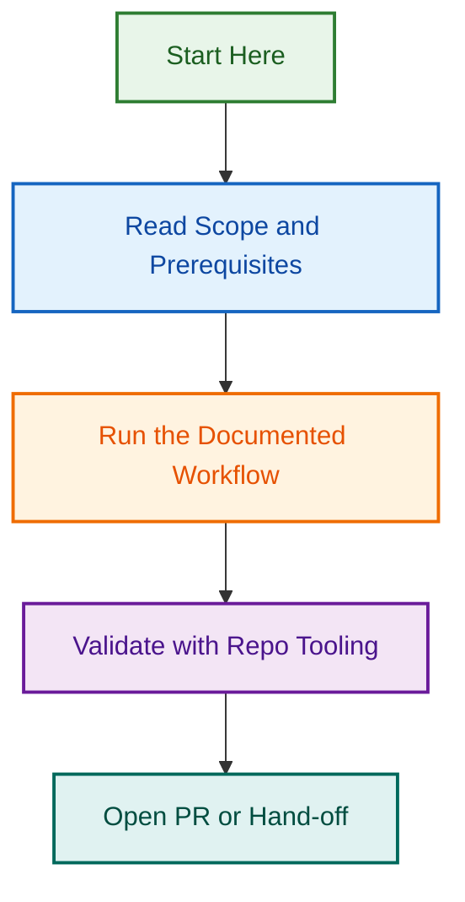

# Template Enforcement Governance Closeout

## Summary

The local implementation scope for template enforcement governance is complete.
The remaining work is limited to remote/admin checks that cannot be verified
from this workspace, so they have been split into a smaller follow-up task.

## Implemented Scope

- `.github/PULL_REQUEST_TEMPLATE/config.yml` provides the canonical routing map.
- `.github/pull_request_template.md` acts as the root PR router.
- `instructions/pr-templates.instructions.md` and `instructions/issue-templates.instructions.md` provide portable guidance.
- `.github/workflows/template-enforcement.yml` covers issue and PR template validation.
- `scripts/validation/__fixtures__/pr-templates/` provides validation fixtures.
- `AGENTS.md`, `CLAUDE.md`, and `docs/BRANCHING_STRATEGY.md` include template-routing guidance.
- **Frontmatter standardization** completed across all 34 PR and issue templates with unified schema validation (September 2, 2026).
- The project audit and action documents now describe the implemented scope rather than the original planning-only backlog.

## Remaining Follow-Up

The following checks still require remote GitHub admin access or repository settings verification:

1. Confirm the two missing org issue types are visible in the GitHub organisation settings.
2. Confirm branch protection uses the expected status check name for template validation.

See [REMOTE_ADMIN_CHECKS.md](./REMOTE_ADMIN_CHECKS.md) for the smaller follow-up task.

## Closeout Position

- The repository-side implementation is ready for closeout.
- The remaining checks are administrative and should not block the documented implementation scope.

## Related Issues

### Completed Work
- [#2693](https://github.com/lightspeedwp/.github/issues/2693) — Template Content Review & Refinement (**BLOCKER** — awaiting user approval)
- [#2694](https://github.com/lightspeedwp/.github/issues/2694) — Template Testing Framework (enhancement)
- [#2695](https://github.com/lightspeedwp/.github/issues/2695) — Contributor Guide for Template Maintenance (critical)

### Related Work
- [#1733](https://github.com/lightspeedwp/.github/issues/1733) — Phase 2: Folder Structure & Linking
- [#1012](https://github.com/lightspeedwp/.github/issues/1012) — Standardise front matter field usage
- [#1230](https://github.com/lightspeedwp/.github/issues/1230) — Phase 2 Frontmatter Standardization for Portable Assets
- [#1592](https://github.com/lightspeedwp/.github/issues/1592) — Label Prefix Governance Enforcement

See [Linking Standard](https://github.com/lightspeedwp/.github/blob/develop/.github/projects/active/reports-projects-restructuring-2026-08-11/LINKING_STANDARD.md) for linking patterns.

## Visual Workflow

