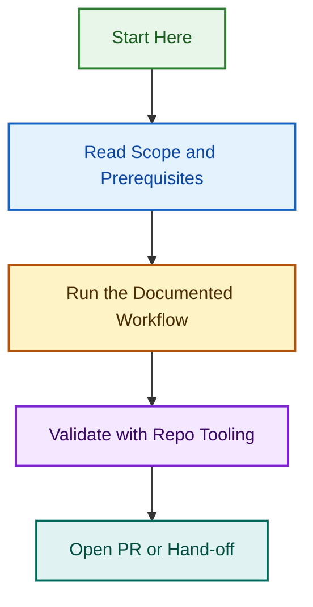

# OpenSpec Strict Variant

This variant is prepared for strict `/opsx:propose` parsing for the template enforcement governance project.

Required frontmatter keys for each input:

- `name`
- `about`
- `labels`

## Run Order

1. `children/01-issue-template-governance-enforcement.md`
2. `children/02-pr-template-governance-enforcement.md`

## Notes

- Inputs are derived from `ISSUES.md` in this project folder.
- Each proposal is intentionally scoped to one track to avoid cross-contamination.
- Update `RUN_LOG.md` after each `/opsx:propose` attempt.

## Visual Workflow

