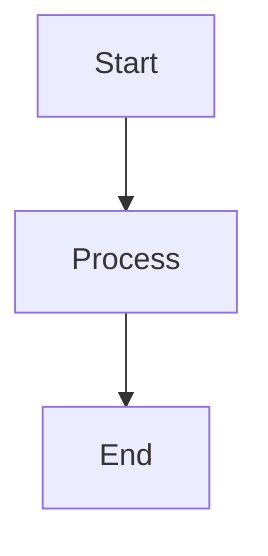

# Phase 1 Testing Strategy & Implementation Guide

**Phase:** 1 (Critical Validation Scripts)  
**Duration:** Week 1 (3-5 days)  
**Expected Test Cases:** 40-60  
**Target Coverage:** 85%+ per script

---

## Scripts in Scope

### 1. `validate-mermaid-syntax.js` (200+ lines)
**Purpose:** Validates Mermaid diagram syntax across markdown files  
**Complexity:** Medium

#### Functions to Test
- `extractMermaidDiagrams(content)` — Extract code blocks
- `validateDiagramSyntax(diagram, type)` — Validate specific diagram types
- `checkDiagramStructure(content)` — Full file validation
- `reportErrors(errors)` — Error reporting

#### Test Cases (12 total)
```javascript
describe('validate-mermaid-syntax', () => {
  describe('extractMermaidDiagrams', () => {
    it('should extract all mermaid code blocks from markdown')
    it('should handle empty diagrams')
    it('should preserve diagram content exactly')
    it('should ignore non-mermaid code blocks')
    it('should handle multiple diagrams in one file')
  })

  describe('validateDiagramSyntax', () => {
    it('should validate graph diagrams')
    it('should validate flowchart diagrams')
    it('should validate sequenceDiagram')
    it('should validate stateDiagram')
    it('should reject invalid syntax')
    it('should report syntax errors with line numbers')
  })

  describe('file traversal', () => {
    it('should process all markdown files')
    it('should ignore node_modules')
  })
})
```

#### Fixtures Needed
```
tests/fixtures/mermaid/
├── valid-graph.md
├── valid-flowchart.md
├── valid-sequence.md
├── invalid-syntax.md
├── multiple-diagrams.md
└── edge-cases.md
```

---

### 2. `validate-mermaid-accessibility.js` (16KB)
**Purpose:** Validates WCAG compliance for Mermaid diagrams  
**Complexity:** High

#### Functions to Test
- `checkColorContrast(color1, color2)` — Color contrast calculation
- `validateSemanticStructure(diagram)` — Semantic validation
- `checkAccessibilityRules(diagram)` — Full accessibility check
- `generateAccessibilityReport(results)` — Report generation

#### Test Cases (15 total)
```javascript
describe('validate-mermaid-accessibility', () => {
  describe('colorContrast', () => {
    it('should calculate WCAG AA compliant contrast')
    it('should detect WCAG AAA compliance')
    it('should fail low contrast colors')
    it('should handle special cases (black/white)')
  })

  describe('semanticValidation', () => {
    it('should validate node labels are present')
    it('should validate edge labels when required')
    it('should detect missing alt text')
  })

  describe('accessibilityRules', () => {
    it('should apply all accessibility rules')
    it('should detect accessibility violations')
    it('should report violations by type')
    it('should generate accessibility score')
  })

  describe('reporting', () => {
    it('should generate JSON report')
    it('should generate markdown report')
    it('should summarize violations')
  })
})
```

#### Fixtures Needed
```
tests/fixtures/accessibility/
├── compliant-diagram.md
├── low-contrast.md
├── missing-labels.md
├── multiple-violations.md
└── edge-cases.md
```

---

### 3. `validate-frontmatter-freshness.js` (150+ lines)
**Purpose:** Enforces `last_updated` and `version` changes when content changes  
**Complexity:** Medium

#### Functions to Test
- `parseArgs(argv)` — Command line argument parsing
- `changedMarkdownFiles(options)` — Git diff detection
- `validateFrontmatterFreshness(file, content)` — Freshness validation
- `checkVersionIncrement(oldVersion, newVersion)` — Version comparison

#### Test Cases (12 total)
```javascript
describe('validate-frontmatter-freshness', () => {
  describe('Git integration', () => {
    it('should detect changed files with --base --head')
    it('should detect staged changes with --staged')
    it('should use HEAD~1 HEAD as default')
  })

  describe('frontmatterValidation', () => {
    it('should detect when content changed')
    it('should require last_updated to match today')
    it('should require version to increment')
    it('should skip new files')
    it('should handle missing frontmatter')
  })

  describe('versionComparison', () => {
    it('should validate semantic version bumps')
    it('should reject version decrements')
    it('should allow patch/minor/major bumps')
  })

  describe('reporting', () => {
    it('should list files with stale dates')
    it('should report version mismatches')
    it('should exit with error code on failures')
  })
})
```

#### Fixtures Needed
```
tests/fixtures/frontmatter/
├── valid-frontmatter.md
├── missing-last-updated.md
├── stale-date.md
├── version-not-bumped.md
└── new-file.md
```

---

### 4. `validate-links.js` (71 lines)
**Purpose:** Validates internal markdown links don't break  
**Complexity:** Low

#### Functions to Test
- `walk(dir)` — Recursive directory traversal
- `resolveLinkTarget(file, href)` — Link path resolution
- `validateLink(file, href)` — Link existence check
- `reportErrors(errors)` — Error reporting

#### Test Cases (10 total)
```javascript
describe('validate-links', () => {
  describe('linkResolution', () => {
    it('should resolve relative paths')
    it('should handle ../.. traversal')
    it('should resolve anchor links (#section)')
    it('should ignore external URLs')
    it('should ignore mailto: links')
  })

  describe('linkValidation', () => {
    it('should detect broken links')
    it('should validate relative links exist')
    it('should skip external links')
    it('should report errors with file paths')
  })

  describe('directoryCoverage', () => {
    it('should check agents/ directory')
    it('should check skills/ directory')
    it('should check explicit file list')
  })

  describe('errorReporting', () => {
    it('should format errors clearly')
    it('should exit 1 on broken links')
  })
})
```

#### Fixtures Needed
```
tests/fixtures/links/
├── agents/README.md (with valid internal links)
├── skills/README.md (with broken links)
├── valid-structure/
│   ├── index.md
│   └── target.md
└── broken-structure/
    └── broken-link-reference.md
```

---

### 5. `validate-structure.js` (200+ lines)
**Purpose:** Validates repo folder organization (portable vs. control-plane)  
**Complexity:** Medium

#### Functions to Test
- `validateFolderStructure(root)` — Full structure validation
- `checkPortableAssets()` — Root-level asset checks
- `checkControlPlaneAssets()` — .github folder checks
- `reportStructureViolations(violations)` — Error reporting

#### Test Cases (10 total)
```javascript
describe('validate-structure', () => {
  describe('portableAssets', () => {
    it('should require agents/ at root')
    it('should require instructions/ at root')
    it('should require workflows/ at root')
    it('should require .schemas/ at root')
  })

  describe('controlPlaneAssets', () => {
    it('should require .github/scripts')
    it('should require .github/workflows')
    it('should require .github/projects')
  })

  describe('violations', () => {
    it('should detect misplaced agents')
    it('should detect misplaced instructions')
    it('should detect misplaced workflows')
  })

  describe('errorReporting', () => {
    it('should report violations with paths')
    it('should suggest corrections')
  })
})
```

#### Fixtures Needed
```
tests/fixtures/structure/
├── valid-structure/ (mimics real repo structure)
├── invalid-placement/ (agents in .github/)
├── missing-folders/ (required folders absent)
└── edge-cases/ (symlinks, empty folders)
```

---

## Fixture Creation Strategy

### Directory Structure
```
tests/
├── fixtures/
│   ├── mermaid/
│   │   ├── valid-graph.md
│   │   ├── valid-flowchart.md
│   │   └── ...
│   ├── accessibility/
│   │   ├── compliant-diagram.md
│   │   └── ...
│   ├── frontmatter/
│   │   ├── valid-frontmatter.md
│   │   └── ...
│   ├── links/
│   │   ├── agents/
│   │   │   └── README.md
│   │   └── ...
│   └── structure/
│       ├── valid-structure/
│       │   ├── agents/
│       │   ├── instructions/
│       │   └── .github/
│       └── ...
└── jest.setup.globals.js
```

### Fixture File Examples

**tests/fixtures/mermaid/valid-graph.md**
```markdown
# Valid Graph Diagram


```

**tests/fixtures/mermaid/invalid-syntax.md**
```markdown
# Invalid Syntax

```mermaid
graph TD
    A[Start] --> B
    B --> [Missing Node Name]
```
```

---

## Mocking Strategy

### File System Mocking
```javascript
jest.mock('fs', () => ({
  readFileSync: jest.fn(),
  existsSync: jest.fn(),
  readdirSync: jest.fn(),
}))
```

### Git Command Mocking
```javascript
jest.mock('child_process', () => ({
  execSync: jest.fn((cmd) => {
    if (cmd.includes('git diff')) {
      return 'file1.md\nfile2.md'
    }
  })
}))
```

### Real vs. Mock Fixtures
- **Use real files for:** Markdown parsing, YAML parsing, file traversal
- **Use mocks for:** Git commands, network calls, expensive operations

---

## Test Execution Plan

### Day 1: Setup & Mermaid Syntax
```bash
# Create test files and fixtures
touch scripts/validation/__tests__/validate-mermaid-syntax.test.js
mkdir -p tests/fixtures/mermaid

# Create basic test structure
npm run test -- scripts/validation/__tests__/validate-mermaid-syntax.test.js

# Run incrementally as you add tests
npm run test -- --watch scripts/validation/__tests__/validate-mermaid-syntax.test.js
```

### Day 2: Accessibility & Frontmatter
```bash
touch scripts/validation/__tests__/validate-mermaid-accessibility.test.js
touch scripts/validation/__tests__/validate-frontmatter-freshness.test.js

# Run both test files
npm run test -- scripts/validation/__tests__/validate-mermaid-*.test.js
npm run test -- scripts/validation/__tests__/validate-frontmatter-freshness.test.js
```

### Day 3: Links & Structure
```bash
touch scripts/validation/__tests__/validate-links.test.js
touch scripts/validation/__tests__/validate-structure.test.js

# Full Phase 1 test run
npm run test -- scripts/validation/__tests__/validate-*.test.js
```

### Day 4-5: Coverage & Refinement
```bash
# Check coverage
npm run test -- scripts/validation/__tests__/validate-*.test.js --coverage

# Refine tests to reach 85%+ coverage
npm run test -- --watch scripts/validation/__tests__/
```

---

## Coverage Targets by Script

| Script | Target | Coverage Approach |
|--------|--------|-------------------|
| `validate-mermaid-syntax.js` | 85% | Extract + validate functions fully |
| `validate-mermaid-accessibility.js` | 85% | Color math + rule validation |
| `validate-frontmatter-freshness.js` | 85% | Git integration + validation |
| `validate-links.js` | 90% | Path resolution + file checks |
| `validate-structure.js` | 85% | Folder structure validation |

---

## Common Test Patterns

### Positive Test
```javascript
it('should validate valid diagram', () => {
  const content = fs.readFileSync(
    path.join(FIXTURE_DIR, 'valid-graph.md'),
    'utf8'
  )
  const result = validateDiagramSyntax(content)
  expect(result.errors).toHaveLength(0)
})
```

### Negative Test
```javascript
it('should reject invalid syntax', () => {
  const content = fs.readFileSync(
    path.join(FIXTURE_DIR, 'invalid-syntax.md'),
    'utf8'
  )
  const result = validateDiagramSyntax(content)
  expect(result.errors).toHaveLength(1)
  expect(result.errors[0]).toMatch(/missing node/i)
})
```

### Edge Case Test
```javascript
it('should handle empty diagrams', () => {
  const content = '```mermaid\n\n```'
  const result = validateDiagramSyntax(content)
  expect(result.errors).toContain('Empty diagram')
})
```

---

## Debugging Tips

### Run Single Test
```bash
npm run test -- --testNamePattern="should validate graph diagrams"
```

### Watch Mode
```bash
npm run test -- --watch scripts/validation/__tests__/validate-mermaid-syntax.test.js
```

### Debug Output
```javascript
console.log('Result:', JSON.stringify(result, null, 2))
expect(result).toEqual(expectedValue) // Will show diff
```

### Coverage Report
```bash
npm run test -- --coverage --collectCoverageFrom="scripts/validation/validate-mermaid-syntax.js"
```

---

## Success Checklist

- [ ] All 5 test files created
- [ ] All 40+ test cases written
- [ ] All fixtures created
- [ ] All tests passing
- [ ] 85%+ coverage per script
- [ ] PR created and reviewed
- [ ] CI/CD all green
- [ ] Merged to develop

---

**Created:** 2026-08-19  
**Phase:** 1 (Critical Validation)  
**Status:** Ready for Implementation
