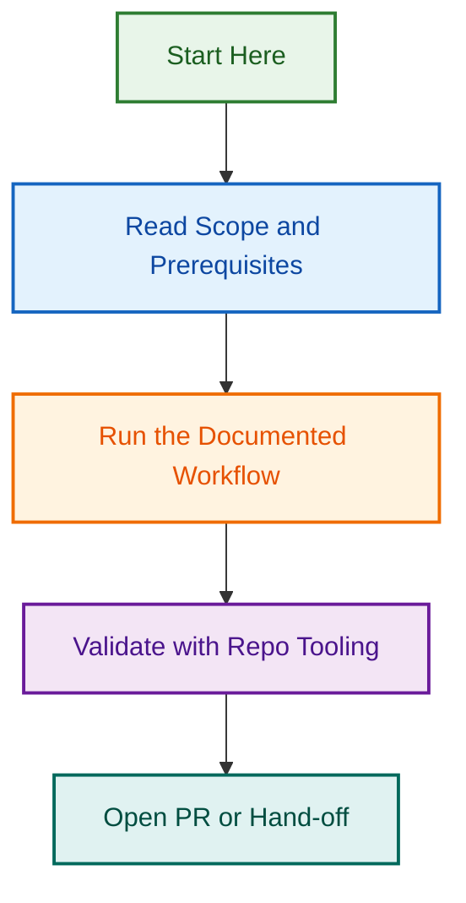

# Test Coverage Implementation Tasks - v1.0.1

**Status**: 🔴 Critical - Blocks Release
**Priority**: Highest
**Target**: ≥80% coverage
**Current**: Unknown (needs baseline)
**Estimated Effort**: 12-16 hours
**Target Completion**: Within 2-3 days

---

## Progress Notes (updated 2026-05-28)

- `project-meta-sync.agent.js`: `require.main === module` guard added; test no longer calls `run()` at module load time. See [PR [#455](https://github.com/lightspeedwp/.github/issues/455)](<https://github.com/lightspeedwp/.github/pull/455>).
- `reviewer.agent.test.js`: already uses `fs.existsSync` pattern (no `require()` of ESM module). Test passes.
- Remaining phases below are unchanged and still pending.

---

## Quick Status

| Phase                            | Status         | Progress | Time Remaining |
| -------------------------------- | -------------- | -------- | -------------- |
| **Phase 1: Baseline**            | ⏳ Not Started | 0/4      | 30 min         |
| **Phase 2: Metrics Agent**       | ⏳ Not Started | 0/15     | 3-4 hrs        |
| **Phase 3: Linting Agent**       | ⏳ Not Started | 0/15     | 3-4 hrs        |
| **Phase 4: Release Enhancement** | ⏳ Not Started | 0/10     | 2-3 hrs        |
| **Phase 5: Utility Edge Cases**  | ⏳ Not Started | 0/12     | 2-3 hrs        |
| **Phase 6: Validation**          | ⏳ Not Started | 0/6      | 1 hr           |

**Overall Progress**: 0/62 tasks (0%)

---

## Phase 1: Baseline Measurement ⏳

**Status**: ⏳ Not Started
**Priority**: 🔴 Critical (Blocks all other phases)
**Duration**: 30 minutes
**Owner**: TBD

### Task 1.1: Run Initial Coverage Report

**Status**: ⏳ Not Started
**Time**: 5 minutes

**Steps**:

- [ ] Navigate to project root:

  ```bash
  cd /Users/ash/.codex/worktrees/epic-449-label-governance
  ```

- [ ] Run coverage with source file collection:

  ```bash
  npm test -- --coverage --collectCoverageFrom='scripts/**/*.js' --collectCoverageFrom='!scripts/**/__tests__/**'
  ```

- [ ] Review console output for any test failures
- [ ] Note overall coverage percentage

**Acceptance Criteria**:

- ✅ Coverage report runs successfully
- ✅ No critical test failures
- ✅ Console output captured

**Blockers**: None

---

### Task 1.2: Generate HTML Coverage Report

**Status**: ⏳ Not Started
**Time**: 5 minutes

**Steps**:

- [ ] Open HTML coverage report:

  ```bash
  open coverage/lcov-report/index.html
  ```

- [ ] Review coverage by file
- [ ] Identify files with 0% coverage
- [ ] Note files below 50% coverage
- [ ] Screenshot summary page

**Acceptance Criteria**:

- ✅ HTML report opened successfully
- ✅ All files reviewed
- ✅ Low coverage files identified

**Blockers**: Task 1.1

---

### Task 1.3: Document Baseline Metrics

**Status**: ⏳ Not Started
**Time**: 15 minutes

**Steps**:

- [ ] Create baseline report file
- [ ] Document overall coverage %:
  - Statements
  - Branches
  - Functions
  - Lines
- [ ] List files with 0% coverage
- [ ] List files below 50% coverage
- [ ] Document critical uncovered functions
- [ ] Calculate gap to 80% target

**Output File**: `.github/reports/coverage/baseline-v1.0.0.md`

**Template**:

```markdown
# Test Coverage Baseline - v1.0.0

**Date**: 2025-12-10
**Overall Coverage**: X%

## Summary

- Statements: X%
- Branches: X%
- Functions: X%
- Lines: X%

## Files with 0% Coverage

- scripts/agents/metrics.agent.js
- scripts/agents/linting.agent.js

## Critical Gaps

[List uncovered critical functions]

## Gap to Target

- Current: X%
- Target: 80%
- Gap: X%
- Estimated tests needed: X
```

**Acceptance Criteria**:

- ✅ Baseline report created
- ✅ All metrics documented
- ✅ Gaps identified

**Blockers**: Task 1.2

---

### Task 1.4: Create Test Implementation Checklist

**Status**: ⏳ Not Started
**Time**: 5 minutes

**Steps**:

- [ ] Prioritize files by coverage gap
- [ ] List required test files to create
- [ ] Estimate test count per file
- [ ] Assign difficulty ratings
- [ ] Set implementation order

**Acceptance Criteria**:

- ✅ Implementation checklist created
- ✅ Priorities set
- ✅ Order determined

**Blockers**: Task 1.3

---

## Phase 2: Metrics Agent Tests ⏳

**Status**: ⏳ Not Started
**Priority**: 🔴 Critical
**Duration**: 3-4 hours
**Owner**: TBD
**Target Coverage**: 80%+ for metrics.agent.js

### Task 2.1: Create Test File Structure

**Status**: ⏳ Not Started
**Time**: 15 minutes

**Steps**:

- [ ] Create test file:

  ```bash
  touch scripts/agents/__tests__/metrics.agent.test.js
  ```

- [ ] Add file header with JSDoc
- [ ] Set up describe blocks:
  - Metric Collection
  - Data Aggregation
  - Report Generation
  - Error Handling
- [ ] Add beforeEach/afterEach hooks
- [ ] Import necessary dependencies

**File Template**:

```javascript
/**
 * @fileoverview Tests for metrics.agent.js
 * @description Comprehensive tests for repository metrics collection and reporting
 *
 * Coverage target: 80%+
 *
 * Test categories:
 * - Metric collection from GitHub API
 * - Data aggregation and calculations
 * - Report generation (markdown/CSV)
 * - Error handling and edge cases
 */

const metricsAgent = require("../metrics.agent");

describe("Metrics Agent", () => {
  beforeEach(() => {
    jest.clearAllMocks();
  });

  describe("Metric Collection", () => {
    // Tests here
  });

  describe("Data Aggregation", () => {
    // Tests here
  });

  describe("Report Generation", () => {
    // Tests here
  });

  describe("Error Handling", () => {
    // Tests here
  });
});
```

**Acceptance Criteria**:

- ✅ Test file created
- ✅ Structure in place
- ✅ Imports configured

**Blockers**: Phase 1 complete

---

### Task 2.2: Mock GitHub API Dependencies

**Status**: ⏳ Not Started
**Time**: 30 minutes

**Steps**:

- [ ] Create mock Octokit instance
- [ ] Mock issues.listForRepo
- [ ] Mock pulls.list
- [ ] Mock reactions.listForIssue
- [ ] Mock paginate responses
- [ ] Create fixture data files
- [ ] Test mocks work correctly

**Mock Example**:

```javascript
const mockOctokit = {
  rest: {
    issues: {
      listForRepo: jest.fn().mockResolvedValue({
        data: [
          { number: 1, state: "open", created_at: "2025-01-01" },
          { number: 2, state: "closed", created_at: "2025-01-02" },
        ],
      }),
    },
    pulls: {
      list: jest.fn().mockResolvedValue({
        data: [
          /* PR data */
        ],
      }),
    },
  },
  paginate: jest.fn(),
};
```

**Acceptance Criteria**:

- ✅ All API methods mocked
- ✅ Fixture data created
- ✅ Mocks tested

**Blockers**: Task 2.1

---

### Task 2.3: Test Issue Metric Collection

**Status**: ⏳ Not Started
**Time**: 30 minutes

**Tests to Implement**:

- [ ] Should collect total issue count
- [ ] Should filter issues by state (open/closed)
- [ ] Should calculate issue age
- [ ] Should count issues by label
- [ ] Should handle empty issue list
- [ ] Should handle API errors

**Example Test**:

```javascript
it("should collect total issue count", async () => {
  mockOctokit.rest.issues.listForRepo.mockResolvedValue({
    data: [{ number: 1 }, { number: 2 }, { number: 3 }],
  });

  const metrics = await collectIssueMetrics(mockOctokit, "owner", "repo");

  expect(metrics.total).toBe(3);
  expect(mockOctokit.rest.issues.listForRepo).toHaveBeenCalledWith({
    owner: "owner",
    repo: "repo",
    state: "all",
    per_page: 100,
  });
});
```

**Acceptance Criteria**:

- ✅ All issue tests passing
- ✅ Edge cases covered
- ✅ Error handling tested

**Blockers**: Task 2.2

---

### Task 2.4: Test PR Metric Collection

**Status**: ⏳ Not Started
**Time**: 30 minutes

**Tests to Implement**:

- [ ] Should collect total PR count
- [ ] Should calculate PR merge rate
- [ ] Should calculate average review time
- [ ] Should filter PRs by state
- [ ] Should handle empty PR list
- [ ] Should handle API errors

**Acceptance Criteria**:

- ✅ All PR tests passing
- ✅ Calculations verified
- ✅ Edge cases covered

**Blockers**: Task 2.2

---

### Task 2.5: Test Response Time Calculations

**Status**: ⏳ Not Started
**Time**: 30 minutes

**Tests to Implement**:

- [ ] Should calculate average first response time
- [ ] Should calculate average close time
- [ ] Should handle issues with no responses
- [ ] Should handle timezone differences
- [ ] Should exclude bot responses
- [ ] Should handle invalid dates

**Acceptance Criteria**:

- ✅ Time calculations accurate
- ✅ Edge cases handled
- ✅ All tests passing

**Blockers**: Task 2.2

---

### Task 2.6: Test Data Aggregation

**Status**: ⏳ Not Started
**Time**: 30 minutes

**Tests to Implement**:

- [ ] Should aggregate metrics across repos
- [ ] Should calculate totals correctly
- [ ] Should compute averages accurately
- [ ] Should handle missing data
- [ ] Should handle null values
- [ ] Should validate aggregation logic

**Acceptance Criteria**:

- ✅ Aggregation logic tested
- ✅ Math operations verified
- ✅ Null handling confirmed

**Blockers**: Tasks 2.3-2.5

---

### Task 2.7: Test Markdown Report Generation

**Status**: ⏳ Not Started
**Time**: 30 minutes

**Tests to Implement**:

- [ ] Should generate valid markdown
- [ ] Should include all metrics
- [ ] Should format tables correctly
- [ ] Should handle empty metrics
- [ ] Should include summary section
- [ ] Should include date range

**Acceptance Criteria**:

- ✅ Markdown format valid
- ✅ All sections present
- ✅ Formatting correct

**Blockers**: Task 2.6

---

### Task 2.8: Test CSV Export Generation

**Status**: ⏳ Not Started
**Time**: 20 minutes

**Tests to Implement**:

- [ ] Should generate valid CSV
- [ ] Should include headers
- [ ] Should escape special characters
- [ ] Should handle empty data
- [ ] Should format dates consistently

**Acceptance Criteria**:

- ✅ CSV format valid
- ✅ Data correctly escaped
- ✅ All tests passing

**Blockers**: Task 2.6

---

### Task 2.9: Test Error Handling

**Status**: ⏳ Not Started
**Time**: 30 minutes

**Tests to Implement**:

- [ ] Should handle API rate limiting
- [ ] Should retry on transient failures
- [ ] Should handle network errors
- [ ] Should handle invalid responses
- [ ] Should log errors appropriately
- [ ] Should return partial data on errors

**Acceptance Criteria**:

- ✅ All error scenarios tested
- ✅ Retry logic validated
- ✅ Graceful degradation verified

**Blockers**: Task 2.2

---

### Task 2.10: Test Date Range Filtering

**Status**: ⏳ Not Started
**Time**: 20 minutes

**Tests to Implement**:

- [ ] Should filter by start date
- [ ] Should filter by end date
- [ ] Should filter by date range
- [ ] Should handle invalid dates
- [ ] Should handle timezone issues

**Acceptance Criteria**:

- ✅ Date filtering works
- ✅ Edge cases handled
- ✅ All tests passing

**Blockers**: Task 2.2

---

### Task 2.11: Test Multi-Repository Support

**Status**: ⏳ Not Started
**Time**: 30 minutes

**Tests to Implement**:

- [ ] Should collect metrics for multiple repos
- [ ] Should aggregate cross-repo data
- [ ] Should handle repo access errors
- [ ] Should report per-repo breakdowns
- [ ] Should handle empty repo list

**Acceptance Criteria**:

- ✅ Multi-repo logic tested
- ✅ Aggregation verified
- ✅ Error handling confirmed

**Blockers**: Task 2.6

---

### Task 2.12: Run Coverage for Metrics Agent

**Status**: ⏳ Not Started
**Time**: 10 minutes

**Steps**:

- [ ] Run coverage for metrics agent only:

  ```bash
  npm test -- scripts/agents/__tests__/metrics.agent.test.js --coverage
  ```

- [ ] Review coverage report
- [ ] Identify uncovered lines
- [ ] Check if target (80%) met

**Acceptance Criteria**:

- ✅ Coverage ≥80%
- ✅ Critical paths covered
- ✅ Report documented

**Blockers**: Tasks 2.1-2.11

---

### Task 2.13: Add Missing Tests (if needed)

**Status**: ⏳ Not Started
**Time**: 0-60 minutes (as needed)

**Steps**:

- [ ] Review uncovered lines from Task 2.12
- [ ] Write tests for uncovered paths
- [ ] Re-run coverage
- [ ] Repeat until ≥80%

**Acceptance Criteria**:

- ✅ Target coverage achieved
- ✅ All critical paths tested

**Blockers**: Task 2.12

---

### Task 2.14: Validate All Tests Pass

**Status**: ⏳ Not Started
**Time**: 5 minutes

**Steps**:

- [ ] Run all metrics agent tests:

  ```bash
  npm test -- scripts/agents/__tests__/metrics.agent.test.js
  ```

- [ ] Verify 100% pass rate
- [ ] Check for flaky tests
- [ ] Fix any failures

**Acceptance Criteria**:

- ✅ All tests pass
- ✅ No flaky tests
- ✅ No warnings

**Blockers**: Task 2.13

---

### Task 2.15: Document Metrics Agent Tests

**Status**: ⏳ Not Started
**Time**: 15 minutes

**Steps**:

- [ ] Add comprehensive JSDoc to test file
- [ ] Document test coverage areas
- [ ] Document mock patterns used
- [ ] Add usage examples
- [ ] Update test README if needed

**Acceptance Criteria**:

- ✅ Documentation complete
- ✅ Examples provided
- ✅ Patterns documented

**Blockers**: Task 2.14

---

## Phase 3: Linting Agent Tests ⏳

**Status**: ⏳ Not Started
**Priority**: 🔴 Critical
**Duration**: 3-4 hours
**Owner**: TBD
**Target Coverage**: 80%+ for linting.agent.js

### Task 3.1: Create Test File Structure

**Status**: ⏳ Not Started
**Time**: 15 minutes

**Steps**:

- [ ] Create test file:

  ```bash
  touch scripts/agents/__tests__/linting.agent.test.js
  ```

- [ ] Add file header with JSDoc
- [ ] Set up describe blocks:
  - Linter Execution
  - Error Reporting
  - Configuration Loading
  - Auto-fix Support
- [ ] Add beforeEach/afterEach hooks
- [ ] Import dependencies

**Acceptance Criteria**:

- ✅ Test file created
- ✅ Structure in place
- ✅ Imports configured

**Blockers**: Phase 2 complete (recommended) or Phase 1 complete (minimum)

---

### Task 3.2: Mock Linter Dependencies

**Status**: ⏳ Not Started
**Time**: 30 minutes

**Steps**:

- [ ] Mock child_process.execSync
- [ ] Mock fs.readFileSync (for configs)
- [ ] Mock fs.existsSync (for config files)
- [ ] Create ESLint output fixtures
- [ ] Create Prettier output fixtures
- [ ] Create markdownlint output fixtures
- [ ] Create yamllint output fixtures
- [ ] Test mocks work

**Mock Example**:

```javascript
jest.mock("child_process", () => ({
  execSync: jest.fn(),
}));

jest.mock("fs", () => ({
  readFileSync: jest.fn(),
  existsSync: jest.fn().mockReturnValue(true),
}));
```

**Acceptance Criteria**:

- ✅ All dependencies mocked
- ✅ Fixtures created
- ✅ Mocks tested

**Blockers**: Task 3.1

---

### Task 3.3: Test ESLint Execution

**Status**: ⏳ Not Started
**Time**: 30 minutes

**Tests to Implement**:

- [ ] Should run ESLint on JS files
- [ ] Should load ESLint config
- [ ] Should respect .eslintignore
- [ ] Should handle ESLint errors
- [ ] Should parse ESLint output
- [ ] Should handle missing ESLint

**Acceptance Criteria**:

- ✅ ESLint integration tested
- ✅ Config loading verified
- ✅ Error handling confirmed

**Blockers**: Task 3.2

---

### Task 3.4: Test Prettier Execution

**Status**: ⏳ Not Started
**Time**: 20 minutes

**Tests to Implement**:

- [ ] Should run Prettier on all files
- [ ] Should load Prettier config
- [ ] Should handle Prettier errors
- [ ] Should identify format issues
- [ ] Should handle missing Prettier

**Acceptance Criteria**:

- ✅ Prettier integration tested
- ✅ All scenarios covered

**Blockers**: Task 3.2

---

### Task 3.5: Test Markdownlint Execution

**Status**: ⏳ Not Started
**Time**: 20 minutes

**Tests to Implement**:

- [ ] Should run markdownlint on MD files
- [ ] Should load markdownlint config
- [ ] Should handle MD errors
- [ ] Should parse MD lint output

**Acceptance Criteria**:

- ✅ Markdownlint tested
- ✅ Integration verified

**Blockers**: Task 3.2

---

### Task 3.6: Test YAML Linting

**Status**: ⏳ Not Started
**Time**: 20 minutes

**Tests to Implement**:

- [ ] Should run yamllint/Spectral
- [ ] Should validate YAML syntax
- [ ] Should handle YAML errors
- [ ] Should parse YAML output

**Acceptance Criteria**:

- ✅ YAML linting tested
- ✅ Integration verified

**Blockers**: Task 3.2

---

### Task 3.7: Test Error Reporting

**Status**: ⏳ Not Started
**Time**: 30 minutes

**Tests to Implement**:

- [ ] Should format errors as markdown
- [ ] Should group errors by file
- [ ] Should prioritise by severity
- [ ] Should include error codes
- [ ] Should include fix suggestions
- [ ] Should generate summary

**Acceptance Criteria**:

- ✅ Error formatting tested
- ✅ Grouping verified
- ✅ All features covered

**Blockers**: Tasks 3.3-3.6

---

### Task 3.8: Test Configuration Loading

**Status**: ⏳ Not Started
**Time**: 30 minutes

**Tests to Implement**:

- [ ] Should load .eslintrc.json
- [ ] Should load .prettierrc
- [ ] Should load .markdownlint.json
- [ ] Should handle missing configs
- [ ] Should validate config files
- [ ] Should fall back to defaults

**Acceptance Criteria**:

- ✅ Config loading tested
- ✅ Fallbacks verified
- ✅ Validation confirmed

**Blockers**: Task 3.2

---

### Task 3.9: Test Auto-Fix Support

**Status**: ⏳ Not Started
**Time**: 20 minutes

**Tests to Implement**:

- [ ] Should identify auto-fixable issues
- [ ] Should run ESLint --fix
- [ ] Should run Prettier --write
- [ ] Should report fixed issues
- [ ] Should handle fix failures

**Acceptance Criteria**:

- ✅ Auto-fix tested
- ✅ All linters covered

**Blockers**: Tasks 3.3-3.4

---

### Task 3.10: Test Error Handling

**Status**: ⏳ Not Started
**Time**: 20 minutes

**Tests to Implement**:

- [ ] Should handle linter not installed
- [ ] Should handle invalid files
- [ ] Should handle permission errors
- [ ] Should handle syntax errors
- [ ] Should log errors appropriately

**Acceptance Criteria**:

- ✅ Error scenarios tested
- ✅ Graceful handling verified

**Blockers**: Task 3.2

---

### Task 3.11: Run Coverage for Linting Agent

**Status**: ⏳ Not Started
**Time**: 10 minutes

**Steps**:

- [ ] Run coverage:

  ```bash
  npm test -- scripts/agents/__tests__/linting.agent.test.js --coverage
  ```

- [ ] Review coverage report
- [ ] Identify gaps
- [ ] Check if ≥80%

**Acceptance Criteria**:

- ✅ Coverage ≥80%
- ✅ Critical paths covered

**Blockers**: Tasks 3.1-3.10

---

### Task 3.12: Add Missing Tests (if needed)

**Status**: ⏳ Not Started
**Time**: 0-60 minutes

**Steps**:

- [ ] Review uncovered lines
- [ ] Write missing tests
- [ ] Re-run coverage
- [ ] Repeat until ≥80%

**Acceptance Criteria**:

- ✅ Target coverage achieved

**Blockers**: Task 3.11

---

### Task 3.13: Validate All Tests Pass

**Status**: ⏳ Not Started
**Time**: 5 minutes

**Steps**:

- [ ] Run all linting tests
- [ ] Verify 100% pass
- [ ] Fix any failures

**Acceptance Criteria**:

- ✅ All tests pass
- ✅ No flaky tests

**Blockers**: Task 3.12

---

### Task 3.14: Document Linting Agent Tests

**Status**: ⏳ Not Started
**Time**: 15 minutes

**Steps**:

- [ ] Add JSDoc to test file
- [ ] Document coverage areas
- [ ] Document mock patterns
- [ ] Add examples

**Acceptance Criteria**:

- ✅ Documentation complete

**Blockers**: Task 3.13

---

### Task 3.15: Integration Test with Real Files

**Status**: ⏳ Not Started
**Time**: 20 minutes

**Steps**:

- [ ] Create test fixture files
- [ ] Run linting agent on fixtures
- [ ] Verify correct errors detected
- [ ] Test auto-fix on fixtures
- [ ] Clean up fixtures

**Acceptance Criteria**:

- ✅ Integration tests pass
- ✅ Real-world scenarios verified

**Blockers**: Task 3.13

---

## Phase 4: Release Agent Enhancement ⏳

**Status**: ⏳ Not Started
**Priority**: 🟡 High
**Duration**: 2-3 hours
**Owner**: TBD
**Target Coverage**: 85%+ for release.agent.js

### Task 4.1: Review Existing Tests

**Status**: ⏳ Not Started
**Time**: 15 minutes

**Steps**:

- [ ] Open existing release.agent.test.js
- [ ] Review current test coverage
- [ ] Identify missing test areas
- [ ] List uncovered functions
- [ ] Plan new tests

**Acceptance Criteria**:

- ✅ Existing tests reviewed
- ✅ Gaps identified
- ✅ Plan created

**Blockers**: Phase 3 complete (recommended)

---

### Task 4.2: Test Changelog Extraction

**Status**: ⏳ Not Started
**Time**: 30 minutes

**Tests to Add**:

- [ ] Should extract unreleased content
- [ ] Should handle empty unreleased
- [ ] Should preserve formatting
- [ ] Should extract links
- [ ] Should handle malformed changelog
- [ ] Should validate section headers

**Acceptance Criteria**:

- ✅ Extraction tested
- ✅ Edge cases covered

**Blockers**: Task 4.1

---

### Task 4.3: Test Version Bumping Logic

**Status**: ⏳ Not Started
**Time**: 30 minutes

**Tests to Add**:

- [ ] Should bump major version
- [ ] Should bump minor version
- [ ] Should bump patch version
- [ ] Should handle pre-release versions
- [ ] Should validate version format
- [ ] Should handle invalid versions

**Acceptance Criteria**:

- ✅ All version scenarios tested
- ✅ Validation confirmed

**Blockers**: Task 4.1

---

### Task 4.4: Test Git Operations

**Status**: ⏳ Not Started
**Time**: 45 minutes

**Tests to Add**:

- [ ] Should create release branch
- [ ] Should create git tag
- [ ] Should commit changes
- [ ] Should handle git conflicts
- [ ] Should handle push failures
- [ ] Should validate branch names

**Mock Git**:

```javascript
jest.mock("child_process", () => ({
  execSync: jest.fn(),
}));
```

**Acceptance Criteria**:

- ✅ All git operations tested
- ✅ Error handling verified

**Blockers**: Task 4.1

---

### Task 4.5: Test GitHub Release Creation

**Status**: ⏳ Not Started
**Time**: 30 minutes

**Tests to Add**:

- [ ] Should create GitHub Release
- [ ] Should attach release notes
- [ ] Should handle API errors
- [ ] Should retry on failures
- [ ] Should validate release data

**Acceptance Criteria**:

- ✅ Release creation tested
- ✅ API integration verified

**Blockers**: Task 4.1

---

### Task 4.6: Test Dry-Run Mode

**Status**: ⏳ Not Started
**Time**: 20 minutes

**Tests to Add**:

- [ ] Should not modify files in dry-run
- [ ] Should not create tags in dry-run
- [ ] Should not push in dry-run
- [ ] Should output preview
- [ ] Should validate all operations

**Acceptance Criteria**:

- ✅ Dry-run mode tested
- ✅ No side effects confirmed

**Blockers**: Task 4.1

---

### Task 4.7: Test Rollback Scenarios

**Status**: ⏳ Not Started
**Time**: 30 minutes

**Tests to Add**:

- [ ] Should rollback on error
- [ ] Should restore original state
- [ ] Should clean up artifacts
- [ ] Should log rollback actions
- [ ] Should handle partial rollback

**Acceptance Criteria**:

- ✅ Rollback tested
- ✅ Recovery verified

**Blockers**: Task 4.1

---

### Task 4.8: Run Coverage for Release Agent

**Status**: ⏳ Not Started
**Time**: 10 minutes

**Steps**:

- [ ] Run coverage
- [ ] Review report
- [ ] Check if ≥85%

**Acceptance Criteria**:

- ✅ Coverage ≥85%

**Blockers**: Tasks 4.2-4.7

---

### Task 4.9: Add Missing Tests

**Status**: ⏳ Not Started
**Time**: 0-60 minutes

**Steps**:

- [ ] Review gaps
- [ ] Write tests
- [ ] Re-run coverage

**Acceptance Criteria**:

- ✅ Target achieved

**Blockers**: Task 4.8

---

### Task 4.10: Validate and Document

**Status**: ⏳ Not Started
**Time**: 15 minutes

**Steps**:

- [ ] Run all release tests
- [ ] Verify 100% pass
- [ ] Update documentation

**Acceptance Criteria**:

- ✅ All tests pass
- ✅ Documentation updated

**Blockers**: Task 4.9

---

## Phase 5: Utility Edge Cases ⏳

**Status**: ⏳ Not Started
**Priority**: 🟡 Medium
**Duration**: 2-3 hours
**Owner**: TBD
**Target Coverage**: 80%+ for all utilities

### Task 5.1: Review Utility Coverage

**Status**: ⏳ Not Started
**Time**: 20 minutes

**Steps**:

- [ ] Run coverage for utilities:

  ```bash
  npm test -- scripts/agents/includes/__tests__/ --coverage
  ```

- [ ] Review coverage per utility
- [ ] Identify utilities below 80%
- [ ] List missing edge cases
- [ ] Prioritise by importance

**Acceptance Criteria**:

- ✅ Current coverage known
- ✅ Gaps identified
- ✅ Priorities set

**Blockers**: Phases 2-3 complete (recommended)

---

### Task 5.2: Label-Lookup Edge Cases

**Status**: ⏳ Not Started
**Time**: 30 minutes

**Tests to Add**:

- [ ] Should handle circular alias references
- [ ] Should handle missing canonical labels
- [ ] Should handle special characters
- [ ] Should handle case-sensitive matching
- [ ] Should handle null/undefined inputs
- [ ] Should handle empty arrays

**Acceptance Criteria**:

- ✅ All edge cases tested
- ✅ Coverage improved

**Blockers**: Task 5.1

---

### Task 5.3: Status-Enforcer Edge Cases

**Status**: ⏳ Not Started
**Time**: 30 minutes

**Tests to Add**:

- [ ] Should handle missing status labels
- [ ] Should handle multiple conflicts
- [ ] Should handle invalid status values
- [ ] Should preserve non-status labels
- [ ] Should handle empty label arrays
- [ ] Should validate priority ordering

**Acceptance Criteria**:

- ✅ All edge cases tested
- ✅ Coverage improved

**Blockers**: Task 5.1

---

### Task 5.4: Labeler-Utils Edge Cases

**Status**: ⏳ Not Started
**Time**: 30 minutes

**Tests to Add**:

- [ ] Should handle invalid glob patterns
- [ ] Should handle empty file lists
- [ ] Should handle null branch names
- [ ] Should handle special characters in paths
- [ ] Should handle large file lists

**Acceptance Criteria**:

- ✅ All edge cases tested
- ✅ Coverage improved

**Blockers**: Task 5.1

---

### Task 5.5: Label-Sync Error Handling

**Status**: ⏳ Not Started
**Time**: 45 minutes

**Tests to Add**:

- [ ] Should handle API rate limiting
- [ ] Should retry on transient failures
- [ ] Should handle concurrent operations
- [ ] Should validate before sync
- [ ] Should handle partial failures
- [ ] Should log all operations

**Acceptance Criteria**:

- ✅ Error handling tested
- ✅ Retry logic verified

**Blockers**: Task 5.1

---

### Task 5.6: Label-Reporting Edge Cases

**Status**: ⏳ Not Started
**Time**: 20 minutes

**Tests to Add**:

- [ ] Should handle empty reports
- [ ] Should handle large datasets
- [ ] Should handle special characters
- [ ] Should format tables correctly
- [ ] Should handle null values

**Acceptance Criteria**:

- ✅ Edge cases tested
- ✅ Coverage improved

**Blockers**: Task 5.1

---

### Task 5.7: BadgeUtils Edge Cases

**Status**: ⏳ Not Started
**Time**: 15 minutes

**Tests to Add**:

- [ ] Should handle missing workflows
- [ ] Should handle invalid badge data
- [ ] Should format markdown correctly
- [ ] Should handle special characters

**Acceptance Criteria**:

- ✅ Edge cases covered

**Blockers**: Task 5.1

---

### Task 5.8: FooterUtils Edge Cases

**Status**: ⏳ Not Started
**Time**: 15 minutes

**Tests to Add**:

- [ ] Should handle missing footers
- [ ] Should handle malformed footers
- [ ] Should preserve content
- [ ] Should handle empty files

**Acceptance Criteria**:

- ✅ Edge cases covered

**Blockers**: Task 5.1

---

### Task 5.9: ReadmeUtils Edge Cases

**Status**: ⏳ Not Started
**Time**: 15 minutes

**Tests to Add**:

- [ ] Should handle missing READMEs
- [ ] Should handle nested directories
- [ ] Should handle large files
- [ ] Should handle read errors

**Acceptance Criteria**:

- ✅ Edge cases covered

**Blockers**: Task 5.1

---

### Task 5.10: Run Utility Coverage

**Status**: ⏳ Not Started
**Time**: 10 minutes

**Steps**:

- [ ] Run coverage for utilities
- [ ] Review per-file coverage
- [ ] Check if all ≥80%

**Acceptance Criteria**:

- ✅ All utilities ≥80%

**Blockers**: Tasks 5.2-5.9

---

### Task 5.11: Add Missing Tests

**Status**: ⏳ Not Started
**Time**: 0-60 minutes

**Steps**:

- [ ] Review gaps
- [ ] Write tests
- [ ] Re-run coverage

**Acceptance Criteria**:

- ✅ Targets achieved

**Blockers**: Task 5.10

---

### Task 5.12: Validate Utility Tests

**Status**: ⏳ Not Started
**Time**: 10 minutes

**Steps**:

- [ ] Run all utility tests
- [ ] Verify 100% pass
- [ ] Check for flaky tests

**Acceptance Criteria**:

- ✅ All tests pass

**Blockers**: Task 5.11

---

## Phase 6: Validation & Reporting ⏳

**Status**: ⏳ Not Started
**Priority**: 🔴 Critical
**Duration**: 1 hour
**Owner**: TBD

### Task 6.1: Run Final Coverage Report

**Status**: ⏳ Not Started
**Time**: 10 minutes

**Steps**:

- [ ] Run full coverage:

  ```bash
  npm test -- --coverage --collectCoverageFrom='scripts/**/*.js' --collectCoverageFrom='!scripts/**/__tests__/**'
  ```

- [ ] Open HTML report
- [ ] Screenshot summary
- [ ] Note overall percentages

**Acceptance Criteria**:

- ✅ Final coverage captured
- ✅ Report generated

**Blockers**: All previous phases complete

---

### Task 6.2: Validate Coverage Targets

**Status**: ⏳ Not Started
**Time**: 15 minutes

**Steps**:

- [ ] Check overall coverage ≥80%
- [ ] Check agent coverage ≥85%
- [ ] Check utility coverage ≥80%
- [ ] List any files below target
- [ ] Document exceptions

**Acceptance Criteria**:

- ✅ Targets validated
- ✅ Exceptions documented

**Blockers**: Task 6.1

---

### Task 6.3: Create Comparison Report

**Status**: ⏳ Not Started
**Time**: 20 minutes

**Steps**:

- [ ] Compare baseline to final
- [ ] Calculate improvement
- [ ] List tests added
- [ ] Document coverage gains
- [ ] Create summary table

**Template**:

```markdown
# Coverage Comparison - v1.0.0

## Summary

- Baseline: X%
- Final: Y%
- Improvement: +Z%

## Tests Added

- Total: N tests
- Metrics Agent: X tests
- Linting Agent: Y tests
- Release Agent: Z tests
- Utilities: W tests

## Coverage by Category

| Category  | Baseline | Final | Δ   |
| --------- | -------- | ----- | --- |
| Agents    | X%       | Y%    | +Z% |
| Utilities | X%       | Y%    | +Z% |
| Overall   | X%       | Y%    | +Z% |
```

**Acceptance Criteria**:

- ✅ Comparison complete
- ✅ Report created

**Blockers**: Task 6.2

---

### Task 6.4: Document Remaining Gaps

**Status**: ⏳ Not Started
**Time**: 15 minutes

**Steps**:

- [ ] List areas below target
- [ ] Provide justification for each
- [ ] Create technical debt issues
- [ ] Add to v1.1.0 milestone
- [ ] Document in final report

**Acceptance Criteria**:

- ✅ All gaps documented
- ✅ Issues created
- ✅ Justifications provided

**Blockers**: Task 6.2

---

### Task 6.5: Generate Final Report

**Status**: ⏳ Not Started
**Time**: 15 minutes

**Steps**:

- [ ] Create final report file
- [ ] Include all metrics
- [ ] Add comparison data
- [ ] Document exceptions
- [ ] Add recommendations
- [ ] Save to `.github/reports/coverage/final-v1.0.0.md`

**Acceptance Criteria**:

- ✅ Final report created
- ✅ All data included
- ✅ Recommendations provided

**Blockers**: Tasks 6.1-6.4

---

### Task 6.6: Update Release Readiness

**Status**: ⏳ Not Started
**Time**: 5 minutes

**Steps**:

- [ ] Update release readiness task file
- [ ] Mark test coverage task complete
- [ ] Update overall progress
- [ ] Unblock dependent tasks
- [ ] Notify team

**Acceptance Criteria**:

- ✅ Task file updated
- ✅ Team notified
- ✅ Release unblocked

**Blockers**: Task 6.5

---

## Success Criteria Summary

### Must Have (Blocks Release) ✅

- [ ] Overall coverage ≥75% (target: 80%)
- [ ] Metrics agent coverage ≥70%
- [ ] Linting agent coverage ≥70%
- [ ] Release agent coverage ≥80%
- [ ] All critical paths tested
- [ ] All tests passing (100%)
- [ ] No flaky tests
- [ ] Baseline and final reports created

### Should Have (Highly Desirable) 🎯

- [ ] Overall coverage ≥80%
- [ ] Agent coverage ≥85%
- [ ] Utility coverage ≥80%
- [ ] All edge cases covered
- [ ] All error paths tested
- [ ] Integration tests included

### Nice to Have (Future Work) 📋

- [ ] Overall coverage ≥90%
- [ ] 100% coverage for critical modules
- [ ] Performance benchmarks
- [ ] Load testing
- [ ] Fuzz testing

---

## Risk Management

### High Risks 🔴

**Time Constraints**

- **Mitigation**: Prioritise critical path tests
- **Fallback**: Document gaps, create issues

**Complex Mocking**

- **Mitigation**: Use test helpers
- **Fallback**: Start simple, add complexity

**Flaky Tests**

- **Mitigation**: Avoid time-dependent tests
- **Fallback**: Isolate and fix

### Acceptance Thresholds

**Minimum to Proceed**:

- Overall ≥75%
- Agents ≥70%
- Critical paths covered
- All tests passing

**If Below Minimum**:

- Document all gaps
- Create priority issues
- Escalate to team
- Reassess release readiness

---

## Timeline

### Recommended Schedule

**Day 1** (4-5 hours):

- Morning: Phase 1 + Phase 2 (Baseline + Metrics Agent)
- Afternoon: Phase 3 (Linting Agent)

**Day 2** (3-4 hours):

- Morning: Phase 4 (Release Enhancement)
- Afternoon: Phase 5 (Utility Edge Cases)

**Day 3** (1-2 hours):

- Morning: Phase 6 (Validation & Reporting)
- Final review and sign-off

### Critical Path

**Minimum viable timeline** (8 hours):

- Phase 1: 30 min
- Phase 2: 3 hrs (focus on core tests)
- Phase 3: 3 hrs (focus on core tests)
- Phase 6: 1 hr
- Skip: Phase 4, Phase 5 (document as tech debt)

---

## Next Steps

### Immediate (Now)

1. ✅ Assign ownership for each phase
2. ✅ Set target completion date
3. ✅ Run Phase 1: Baseline measurement
4. ✅ Begin Phase 2: Metrics Agent tests

### Follow-Up (After Completion)

1. Move task file to completed/
2. Archive coverage reports
3. Update release readiness
4. Proceed with release

---

## See Also

- [Test Coverage Expansion Plan](https://github.com/lightspeedwp/.github/blob/develop/.github/reports/analysis/test-coverage-expansion-plan.md)
- [Release Readiness Tasks](ISSUE_EXECUTION_PLAN.md)
- [Testing Standards](https://github.com/lightspeedwp/.github/blob/develop/docs/TESTING.md)

---

*Task List Version: 1.0.0*
*Created: 2025-12-10*
*Target: v1.0.0 Release*
*Status: ⏳ READY TO START*

---

## Issue Tracking

- [Issue execution plan](ISSUE_EXECUTION_PLAN.md)
- [Issue register](ISSUE_REGISTER.md)
- [Run log](RUN_LOG.md)
- [OpenSpec strict inputs](openspec-strict/README.md)
- [OpenSpec change stub](../../../openspec/changes/test-coverage-implementation/)

## Related Issues

This project is coordinated with:

- [#1733](https://github.com/lightspeedwp/.github/issues/1733) — Phase 2: Folder Structure & Linking

See [Linking Standard](https://github.com/lightspeedwp/.github/blob/develop/.github/projects/active/reports-projects-restructuring-2026-08-11/LINKING_STANDARD.md) for linking patterns.
## Visual Workflow


