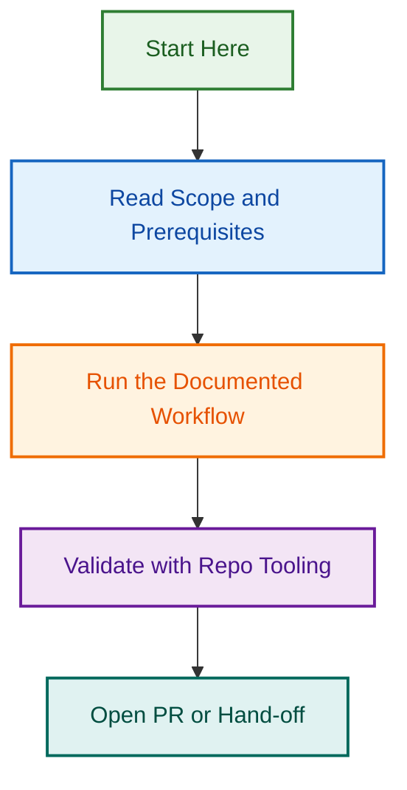

# OpenSpec Strict Variant

This variant is tailored for strict `/opsx:propose` parsing and uses frontmatter keys:

- `name`
- `about`
- `labels`

## Run Order

1. `parents/01-parent-test-coverage-hardening.md`
2. `children/01-phase-1-baseline-measurement.md`
3. `children/02-phase-2-metrics-agent-tests.md`
4. `children/03-phase-3-linting-agent-tests.md`
5. `children/04-phase-4-release-agent-enhancement.md`
6. `children/05-phase-5-utility-edge-cases.md`
7. `children/06-phase-6-validation-and-reporting.md`

## Notes

- Use the 62-task README as the source of truth for task content and acceptance criteria.
- Keep the parent issue focused on programme governance and the six phase issues focused on execution.
- Update the issue register and run log once the GitHub issues exist.
## Visual Workflow

