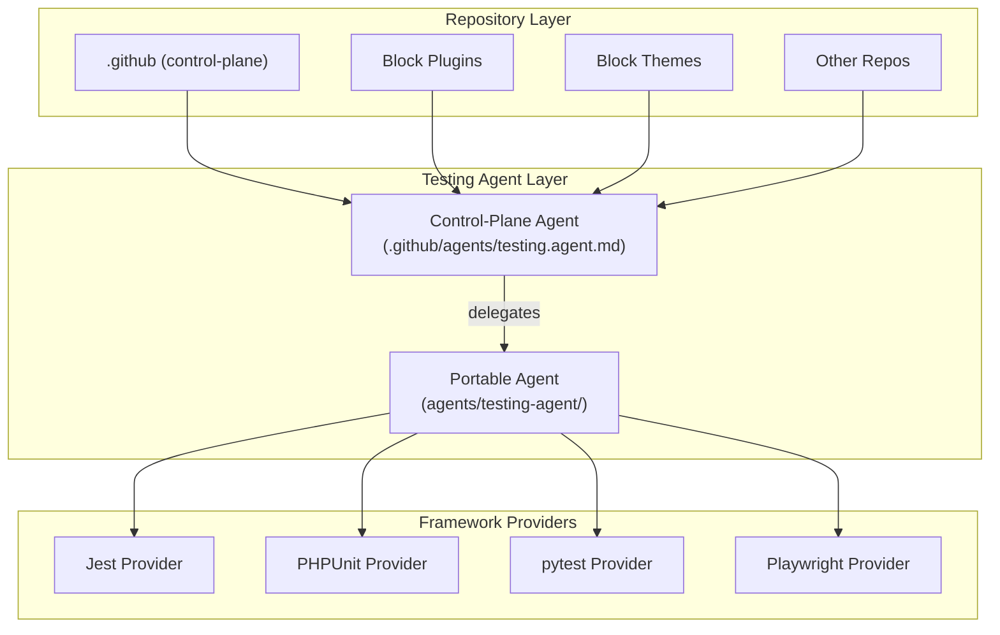
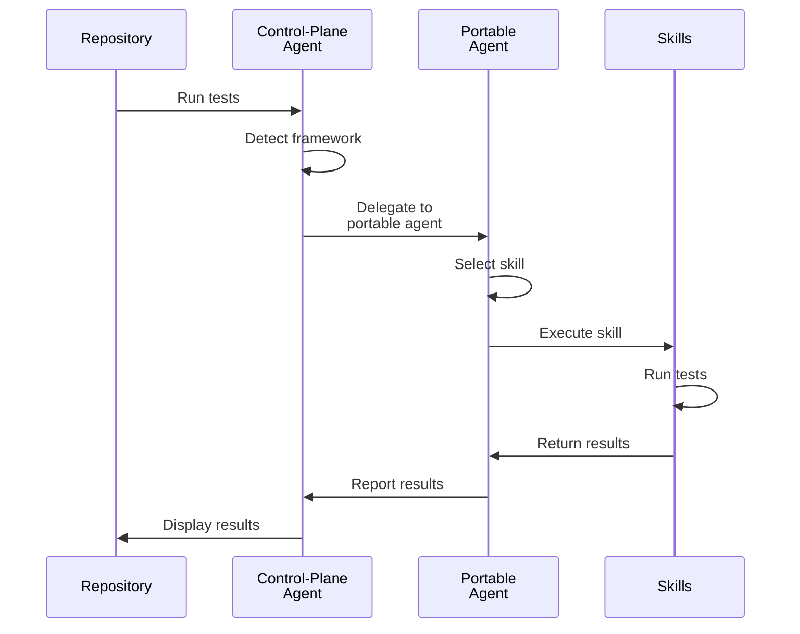
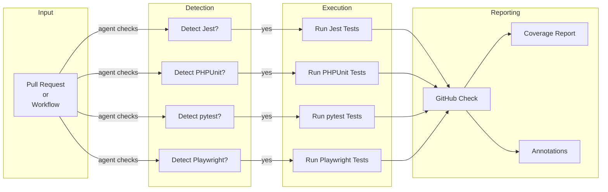
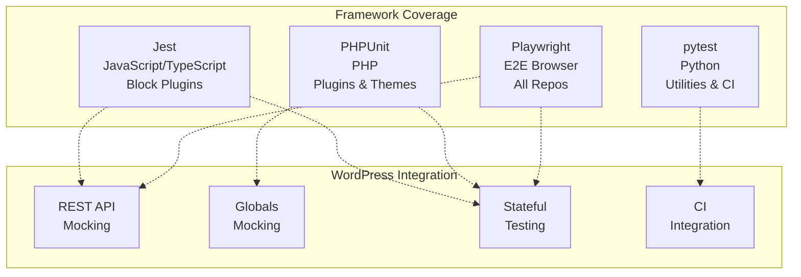
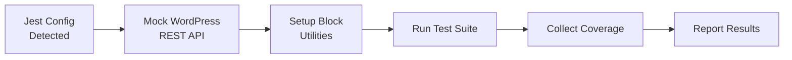
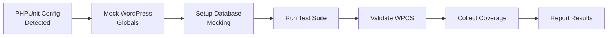
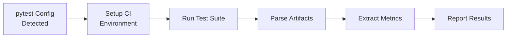
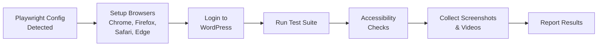

# Documentation Plan — Testing Agent Architecture

## Overview

This document defines comprehensive documentation for the multi-framework testing agent, including framework guides, skill documentation, provider configurations, and architecture diagrams.

**Total Documentation:** 3,000+ words + 8+ Mermaid diagrams  
**Target Completion:** Phase 2.5-2.7 (Est. 1 week)

---

## Documentation Structure

```
agents/testing-agent/
├── README.md (overview, 500+ words)
├── ARCHITECTURE.md (design, 800+ words)
├── GUIDES/
│   ├── jest-testing.md (900+ words)
│   ├── phpunit-testing.md (900+ words)
│   ├── pytest-ci-testing.md (700+ words)
│   └── playwright-testing.md (800+ words + updates)
├── SKILLS/
│   ├── jest-wordpress-testing/SKILL.md
│   ├── phpunit-wordpress-testing/SKILL.md
│   ├── pytest-ci-testing/SKILL.md
│   └── playwright-testing/SKILL.md
├── PROVIDERS/
│   ├── claude/agent.md (500+ words)
│   ├── copilot/agent.md (500+ words)
│   └── openai/agent.md (500+ words)
└── DIAGRAMS/
    ├── architecture.mermaid
    ├── delegation-flow.mermaid
    ├── test-pipeline.mermaid
    ├── framework-matrix.mermaid
    ├── jest-flow.mermaid
    ├── phpunit-flow.mermaid
    ├── pytest-flow.mermaid
    └── playwright-flow.mermaid
```

---

## Framework Guides (Phase 2.5)

### Jest Testing Guide (2.5 hours, 900+ words)

**File:** `agents/testing-agent/guides/jest-wordpress-testing.md`  
**Status:** Planned

#### Section 1: Overview (150 words)

- What Jest is and why use it
- WordPress block plugin testing with Jest
- Setup requirements
- Key testing patterns

#### Section 2: WordPress REST API Mocking (250 words)

- Mock @wordpress/api-fetch
- Common patterns and examples
- Error handling
- Async/await patterns
- Real-world example

#### Section 3: Block Utilities Testing (200 words)

- Test block registration
- Test block attributes
- Test block save/render
- Test block deprecations
- Real-world example

#### Section 4: Action/Filter Testing (150 words)

- Test WordPress action hooks
- Test WordPress filter hooks
- Test hook execution order
- Test hook removal
- Real-world example

#### Section 5: Common Patterns & Gotchas (100 words)

- Race conditions
- Timeout issues
- State management
- Debugging tips

#### Section 6: Real-World Examples (50 words)

- Complete test suite example
- Integration with block plugins
- CI/CD integration

**Content Requirements:**

- ✓ 900+ words
- ✓ 5+ code examples
- ✓ Before/after comparisons
- ✓ Common mistakes section
- ✓ Performance tips

---

### PHPUnit Testing Guide (2.5 hours, 900+ words)

**File:** `agents/testing-agent/guides/phpunit-wordpress-testing.md`  
**Status:** Planned

#### Section 1: Overview (150 words)

- What PHPUnit is and why use it
- WordPress plugin/theme testing with PHPUnit
- Setup requirements
- Key testing patterns

#### Section 2: WordPress Globals Mocking (250 words)

- Mock get_option()
- Mock apply_filters()
- Mock do_action()
- Mock WordPress functions
- Reset state between tests
- Real-world example

#### Section 3: Database Mocking (200 words)

- Mock wpdb operations
- Mock database queries
- Mock inserts/updates/deletes
- Handle transactions
- Real-world example

#### Section 4: WordPress Coding Standards Validation (150 words)

- WPCS integration
- Naming conventions
- Security standards
- Performance standards
- Real-world example

#### Section 5: Multi-Version Testing (100 words)

- Test against multiple WordPress versions
- Test against multiple PHP versions
- Conditional test logic
- Version skipping

#### Section 6: Real-World Examples (50 words)

- Complete test suite example
- Integration with block themes
- CI/CD integration

**Content Requirements:**

- ✓ 900+ words
- ✓ 5+ code examples
- ✓ Before/after comparisons
- ✓ Common mistakes section
- ✓ Performance tips

---

### pytest CI Testing Guide (2 hours, 700+ words)

**File:** `agents/testing-agent/guides/pytest-ci-testing.md`  
**Status:** Planned

#### Section 1: Overview (100 words)

- What pytest is and why use it
- GitHub Actions integration
- Artifact handling
- Key testing patterns

#### Section 2: GitHub Actions Integration (200 words)

- GitHub Actions environment detection
- Running pytest in CI
- Artifact collection
- Output parsing
- Real-world example

#### Section 3: CI Artifact Handling (150 words)

- Read test outputs
- Extract coverage reports
- Handle missing artifacts
- Parse XML/JSON reports
- Real-world example

#### Section 4: Log Parsing & Analysis (150 words)

- Parse pytest output
- Extract test results
- Find failure causes
- Generate summaries
- Real-world example

#### Section 5: Metrics Generation (50 words)

- Calculate pass/fail rates
- Coverage metrics
- Trend tracking

#### Section 6: Real-World Examples (50 words)

- Complete CI workflow example
- Integration with GitHub Actions

**Content Requirements:**

- ✓ 700+ words
- ✓ 4+ code examples
- ✓ GitHub Actions workflow examples
- ✓ Common mistakes section

---

### Playwright Testing Guide Update (1.5 hours, 500+ new words)

**File:** `agents/testing-agent/guides/playwright-testing.md` (update existing)  
**Status:** Existing guide v2.1.0 being enhanced

#### Section 1: WordPress Stateful Testing (200 words)

- Login/logout patterns
- Create/edit/delete posts
- Manage post metadata
- Handle draft states
- Real-world example

#### Section 2: WooCommerce Patterns (150 words)

- Test product pages
- Test shopping cart
- Test checkout flow
- Test order confirmation
- Real-world example

#### Section 3: Multi-Browser Testing (100 words)

- Configure browsers
- Run tests across browsers
- Handle browser-specific issues
- Report results

#### Section 4: Accessibility Testing (50 words)

- axe integration
- WCAG 2.2 AA validation
- Report accessibility issues

**Content Requirements:**

- ✓ 500+ new words (existing guide kept)
- ✓ 3+ new code examples
- ✓ WordPress-specific patterns
- ✓ WooCommerce examples

**Total Updated:** 800+ words (original ~300 + 500 new)

---

## Skill Documentation (Phase 2.4)

### Jest Skill Documentation

**File:** `agents/testing-agent/skills/jest-wordpress-testing/SKILL.md`  
**Status:** Planned

**Required Sections:**

1. **Overview** — What the skill does
2. **When to Use** — Common scenarios
3. **How It Works** — Technical explanation
4. **Examples** — 5+ working examples
5. **Configuration** — Setup required
6. **Limitations** — Known issues
7. **Related Skills** — Links to other skills

**Example Content:**

```markdown
# Jest WordPress Testing Skill

## Overview
Tests WordPress blocks and JavaScript/TypeScript code with Jest, with built-in WordPress REST API mocking and block utilities.

## When to Use
- Testing WordPress block plugins
- Testing JavaScript utilities in plugins
- Testing async WordPress API calls
- Testing WordPress filters and actions

## How It Works
1. Detects Jest configuration
2. Mocks @wordpress/api-fetch
3. Sets up WordPress globals
4. Runs Jest test suite
5. Collects coverage reports

## Examples
[5+ working code examples here]

## Configuration
[Setup instructions]

## Limitations
[Known issues and workarounds]

## Related Skills
- [[phpunit-wordpress-testing]]
- [[playwright-testing]]
```

---

### PHPUnit Skill Documentation

**File:** `agents/testing-agent/skills/phpunit-wordpress-testing/SKILL.md`  
**Status:** Planned

**Required Sections:**

1. **Overview** — What the skill does
2. **When to Use** — Common scenarios
3. **How It Works** — Technical explanation
4. **Examples** — 5+ working examples
5. **Configuration** — Setup required
6. **WPCS Integration** — Coding standards validation
7. **Limitations** — Known issues
8. **Related Skills** — Links to other skills

---

### pytest Skill Documentation

**File:** `agents/testing-agent/skills/pytest-ci-testing/SKILL.md`  
**Status:** Planned

**Required Sections:**

1. **Overview** — What the skill does
2. **When to Use** — Common scenarios
3. **How It Works** — Technical explanation
4. **Examples** — 4+ working examples
5. **GitHub Actions Integration** — CI setup
6. **Configuration** — Setup required
7. **Limitations** — Known issues
8. **Related Skills** — Links to other skills

---

### Playwright Skill Documentation

**File:** `agents/testing-agent/skills/playwright-testing/SKILL.md`  
**Status:** Existing skill being updated

**Updated Sections:**

1. **Overview** — Enhanced with all 4 browsers + WordPress
2. **When to Use** — Add WordPress + WooCommerce scenarios
3. **Examples** — Add WordPress/WooCommerce examples
4. **WordPress Stateful Testing** — New section
5. **WooCommerce Testing** — New section
6. **Accessibility Testing** — New section

---

## Provider Configurations (Phase 2.6)

### Claude Provider Configuration

**File:** `agents/testing-agent/claude/agent.md`  
**Status:** Planned (500+ words)

#### Section 1: Overview (100 words)

- Claude's testing capabilities
- WordPress block integration
- Best practices for Claude

#### Section 2: Jest Testing (150 words)

- Jest-specific prompts
- REST API mocking guidance
- Block testing patterns
- Common issues and solutions

#### Section 3: PHPUnit Testing (150 words)

- PHPUnit-specific prompts
- Globals mocking guidance
- WPCS validation
- Multi-version testing

#### Section 4: pytest Testing (75 words)

- pytest-specific prompts
- CI artifact handling
- Metrics generation

#### Section 5: Framework Selection (50 words)

- How Claude detects frameworks
- Selection logic
- Fallback behavior

**Example:**

```markdown
# Testing Agent — Claude Provider

## Jest Testing with Claude

Claude excels at:
1. Detecting WordPress REST API patterns
2. Creating realistic mock data
3. Explaining complex async patterns
4. Debugging test failures

### Best Practices
[Claude-specific best practices]

### Examples
[Claude-specific examples]
```

---

### Copilot Provider Configuration

**File:** `agents/testing-agent/copilot/agent.md`  
**Status:** Planned (500+ words)

**Sections:** Same as Claude but Copilot-specific

**Key Differences:**

- Copilot's code completion strengths
- Copilot's context window limitations
- Copilot-specific examples
- Copilot-specific best practices

---

### OpenAI Provider Configuration

**File:** `agents/testing-agent/openai/agent.md`  
**Status:** Planned (500+ words)

**Sections:** Same as Claude but OpenAI-specific

**Key Differences:**

- OpenAI's function calling patterns
- OpenAI's token limitations
- OpenAI-specific examples
- OpenAI-specific best practices

---

## Architecture Documentation

### Architecture Overview

**File:** `agents/testing-agent/ARCHITECTURE.md`  
**Status:** Planned (800+ words)

#### Section 1: 2-Tier Design (200 words)

- Control-plane agent role
- Portable agent role
- Delegation protocol
- Communication flow

#### Section 2: Framework Support (200 words)

- Jest architecture
- PHPUnit architecture
- pytest architecture
- Playwright architecture
- Framework selection logic

#### Section 3: WordPress Integration (200 words)

- WordPress REST API handling
- WordPress globals handling
- WPCS integration
- Multi-version compatibility

#### Section 4: Provider Architecture (100 words)

- Claude provider
- Copilot provider
- OpenAI provider
- Provider switching

#### Section 5: Deployment (100 words)

- Installation instructions
- Configuration required
- Quick start guide

---

## Mermaid Diagrams

### 1. 2-Tier Architecture Diagram



### 2. Delegation Flow Diagram



### 3. Test Execution Pipeline



### 4. Framework Coverage Matrix



### 5. Jest Testing Flow



### 6. PHPUnit Testing Flow



### 7. pytest Testing Flow



### 8. Playwright Testing Flow



---

## Documentation Checklist

Before marking documentation complete:

- ✓ README.md: 500+ words, architecture overview
- ✓ ARCHITECTURE.md: 800+ words, 2-tier design, provider info
- ✓ Jest Guide: 900+ words, 5+ examples
- ✓ PHPUnit Guide: 900+ words, 5+ examples
- ✓ pytest Guide: 700+ words, 4+ examples
- ✓ Playwright Guide: 500+ new words, 3+ examples
- ✓ All Skill.md files: Complete with examples
- ✓ Claude provider: 500+ words, framework-specific guidance
- ✓ Copilot provider: 500+ words, framework-specific guidance
- ✓ OpenAI provider: 500+ words, framework-specific guidance
- ✓ 8+ Mermaid diagrams: Clear, accurate, well-formatted
- ✓ No broken links or references
- ✓ Examples tested and working
- ✓ No TBD or placeholder text
- ✓ Frontmatter complete on all files

---

## Documentation Effort Summary

| Component | Effort | Word Count | Examples | Status |
|-----------|--------|-----------|----------|--------|
| Jest Guide | 2.5h | 900 | 5 | Planned |
| PHPUnit Guide | 2.5h | 900 | 5 | Planned |
| pytest Guide | 2h | 700 | 4 | Planned |
| Playwright Update | 1.5h | 500+ | 3 | Planned |
| Jest Skill | 1h | - | 5 | Planned |
| PHPUnit Skill | 1h | - | 5 | Planned |
| pytest Skill | 0.75h | - | 4 | Planned |
| Playwright Skill | 0.75h | - | 6 | Planned |
| Claude Provider | 1h | 500+ | 5 | Planned |
| Copilot Provider | 1h | 500+ | 5 | Planned |
| OpenAI Provider | 1h | 500+ | 5 | Planned |
| Architecture | 1.5h | 800+ | 5 | Planned |
| Diagrams (8x) | 1.5h | - | 8 | Planned |
| **Total** | **20h** | **4,700+** | **60+** | **Planned** |

**Phase 2.5-2.7 Target:** 10-13 hours (20 hours total with skills + providers)

---

## Related Documentation

- [PROJECT_PLAN.md](./PROJECT_PLAN.md) — Phase 2.5-2.7 timeline
- [TEST_STRATEGY.md](./TEST_STRATEGY.md) — Test documentation
- [README.md](./README.md) — Framework support matrix

---

*Built by 🧱 LightSpeedWP with ☕, 🚀, and open-source spirit!*
