# Mermaid Diagrams — Testing Agent Architecture

## 1. 2-Tier Agent Architecture

This diagram shows the overall architecture with control-plane and portable agents.

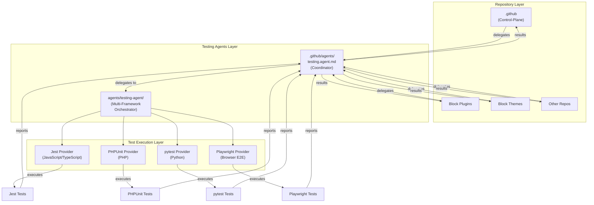

---

## 2. Delegation Flow (Sequence Diagram)

This diagram shows how requests flow through the 2-tier system.

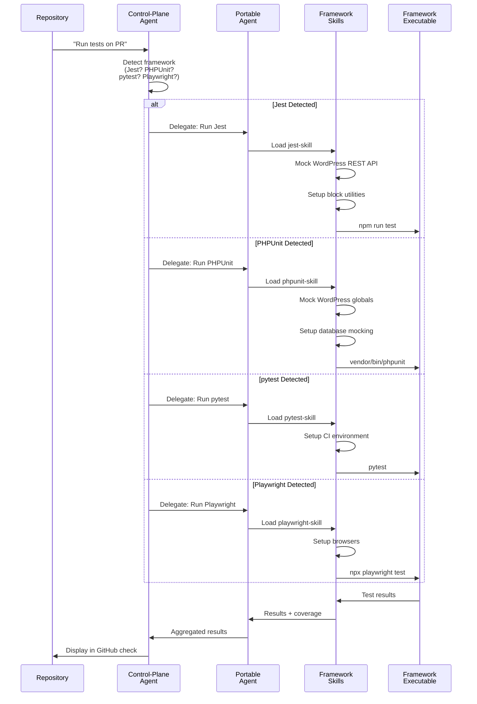

---

## 3. Test Execution Pipeline

This diagram shows the complete test execution flow.

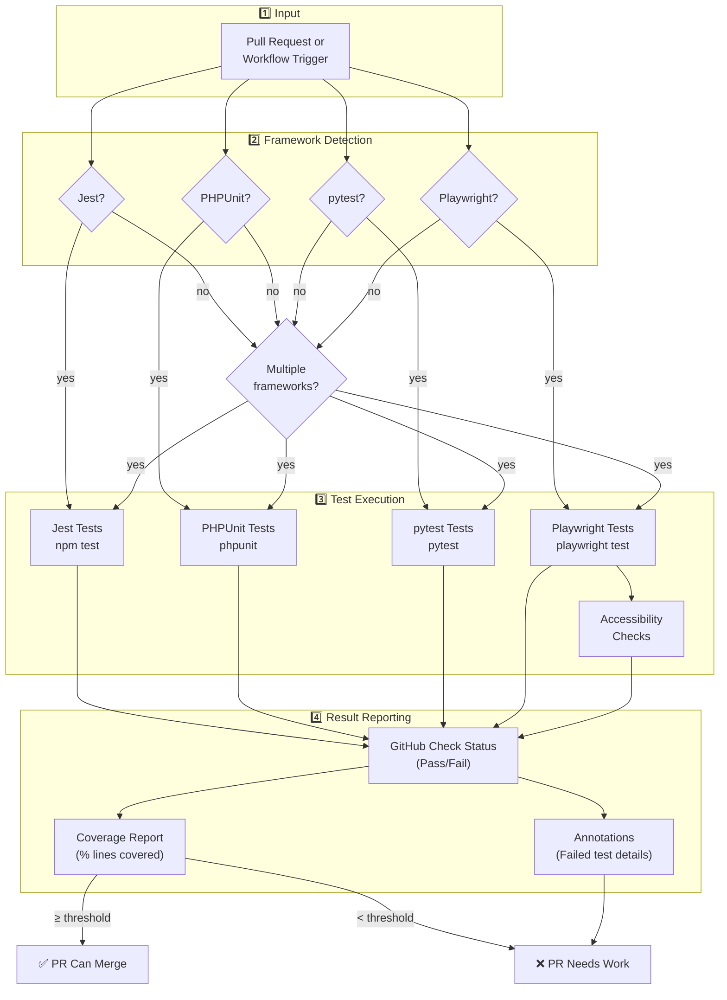

---

## 4. Framework Coverage Matrix

This diagram shows which frameworks are supported for different project types.

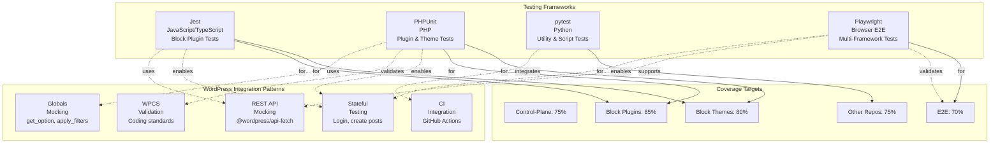

---

## 5. Jest + WordPress Testing Flow

This diagram shows how Jest tests execute with WordPress mocking.

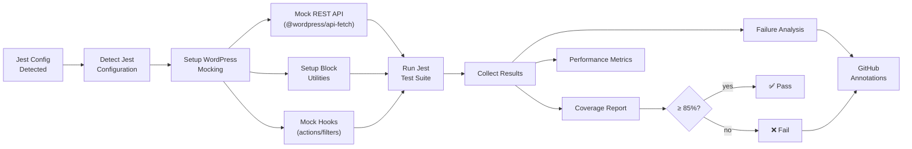

---

## 6. PHPUnit + WordPress Testing Flow

This diagram shows how PHPUnit tests execute with WordPress and database mocking.

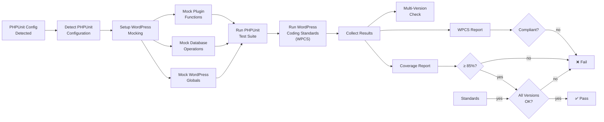

---

## 7. pytest + CI Integration Flow

This diagram shows how pytest integrates with GitHub Actions.

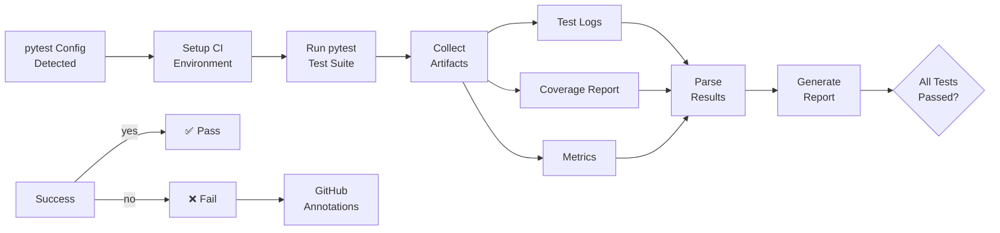

---

## 8. Playwright + WordPress E2E Testing Flow

This diagram shows how Playwright executes end-to-end tests with WordPress.

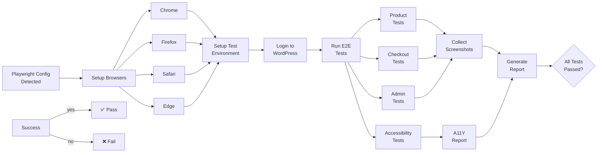

---

## 9. Multi-Framework Project Support

This diagram shows how projects with multiple frameworks are handled.

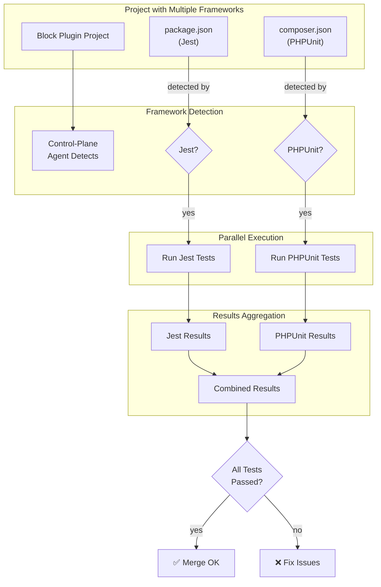

---

## 10. Provider-Specific Coordination

This diagram shows how the agent works with different AI providers.

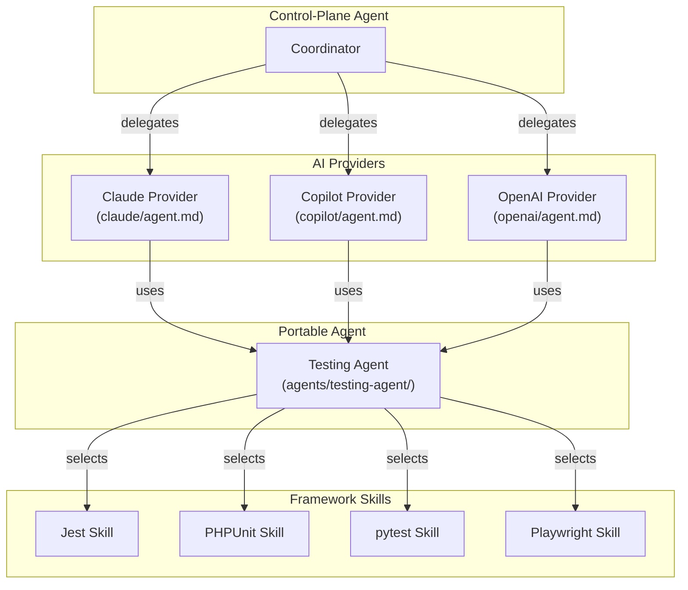

---

## 11. Coverage Threshold Enforcement

This diagram shows how coverage targets are enforced.

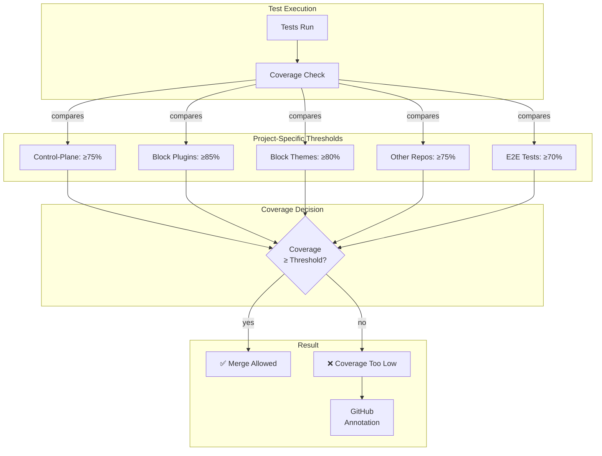

---

## Diagram Usage Guide

### When to Use Each Diagram

| Diagram | Use Case |
|---------|----------|
| **1. 2-Tier Architecture** | Explaining overall system structure |
| **2. Delegation Flow** | Showing how requests flow through the system |
| **3. Test Pipeline** | Explaining complete test execution |
| **4. Coverage Matrix** | Showing framework support matrix |
| **5. Jest Flow** | Deep-dive into Jest testing process |
| **6. PHPUnit Flow** | Deep-dive into PHPUnit testing process |
| **7. pytest Flow** | Deep-dive into pytest testing process |
| **8. Playwright Flow** | Deep-dive into Playwright testing process |
| **9. Multi-Framework** | Explaining multi-framework project support |
| **10. Provider Coordination** | Showing provider-specific workflows |
| **11. Coverage Thresholds** | Explaining coverage enforcement |

---

## Diagram Rendering Notes

All Mermaid diagrams use:

- **Color scheme:** Dark theme friendly with high contrast
- **Layout:** Top-to-bottom or left-to-right for clarity
- **Labels:** Clear, concise descriptions
- **Symbols:** Standard flowchart notation

For best rendering:

- Use in Markdown viewers that support Mermaid (GitHub, GitLab, etc.)
- Zoom in if text is too small
- Copy individual diagrams if needed

---

## Related Documentation

- [README.md](./README.md) — Architecture overview
- [ARCHITECTURE.md](./ARCHITECTURE.md) — Detailed design
- [PROJECT_PLAN.md](./PROJECT_PLAN.md) — Implementation phases

---

*Built by 🧱 LightSpeedWP with ☕, 🚀, and open-source spirit!*
