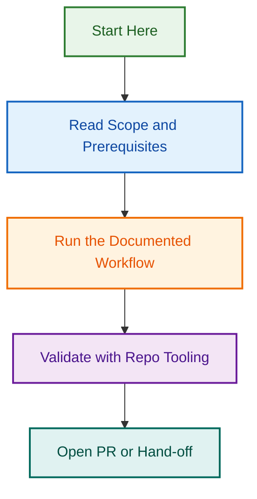

# Testing Agent Architecture — Multi-Framework Consolidation

## Project Overview

This project consolidates LightSpeed's fragmented testing infrastructure into a **unified, multi-framework testing agent** that:

- Supports Jest, PHPUnit, pytest, and Playwright frameworks
- Provides clear delegation between .github control-plane and org-wide repositories
- Includes comprehensive WordPress-specific integration patterns
- Features full test coverage and documentation

**Status:** 🟡 Planning Phase  
**Created:** 2026-08-12  
**Branch:** `design/testing-agent-spec`

## Key Decisions

| Aspect | Decision | Rationale |
|--------|----------|-----------|
| **Architecture** | 2-tier with delegation | Control-plane coordination + portable agent execution |
| **Agent Consolidation** | Rename `agents/playwright-testing-agent/` → `agents/testing-agent/` | Reuse excellent scaffolding for all frameworks |
| **Repository Scope** | All LightSpeed repositories | Org-wide consistency + justifiable investment |
| **Frameworks** | Jest, PHPUnit, pytest, Playwright | All 4 with WordPress integration patterns |
| **Coverage Thresholds** | 85% (plugins), 80% (themes), 75% (control-plane), 70% (E2E) | Differentiated by risk and project type |
| **Documentation** | Comprehensive | Guides + skills + provider configs for all frameworks |

## Project Structure

```
.github/projects/active/testing-agent-architecture-2026-08-12/
├── README.md (this file)
├── PROJECT_PLAN.md (phases, timeline, tasks)
├── TEST_STRATEGY.md (unit, integration, E2E testing)
├── DOCUMENTATION_PLAN.md (guides, skills, diagrams)
└── MERMAID_DIAGRAMS.md (architecture visuals)
```

## 2-Tier Architecture

```
┌─────────────────────────────────────────────────────────┐
│  Repository Layer                                       │
│  ├─ .github (control-plane)                            │
│  ├─ Block Themes                                       │
│  ├─ Block Plugins                                      │
│  └─ Other Org Repos                                    │
└──────────────────────┬──────────────────────────────────┘
                       │
                ┌──────▼──────────────────────┐
                │  Testing Agents Layer       │
                ├─────────────────────────────┤
                │ .github/agents/testing.     │
                │ agent.md (Coordinator)      │
                │       ↓ delegates to       │
                │ agents/testing-agent/      │
                │ (Multi-Framework           │
                │  Orchestrator)             │
                └──────┬───────────────────┬──┘
                       │                   │
      ┌────────────────┴──────────────────┴─────────┐
      │  Test Execution Providers                   │
      ├─ Jest (JavaScript/TypeScript)              │
      ├─ PHPUnit (PHP)                            │
      ├─ pytest (Python)                          │
      └─ Playwright (Browser E2E)                 │
```

## Framework Support Matrix

| Framework | Control-Plane | Block Plugins | Block Themes | Other |
|-----------|---|---|---|---|
| **Jest** | 80% | 85% | 80% | 80% |
| **PHPUnit** | N/A | 85% | 80% | 80% |
| **pytest** | 75% | N/A | N/A | 75% |
| **Playwright** | N/A | 70% | 70% | 70% |

## WordPress Integration

### Jest + WordPress

- REST API mocking (`@wordpress/api-fetch`)
- Block utilities testing
- Action/filter testing patterns
- Async WordPress data handling

### PHPUnit + WordPress

- WordPress global function mocking (`get_option`, `apply_filters`, etc.)
- Database operation mocking
- WordPress Coding Standards (WPCS) validation
- Multi-version compatibility testing (WP, PHP versions)

### pytest + WordPress

- GitHub Actions integration
- CI artifact handling and log parsing
- Metrics generation
- WordPress config integration

### Playwright + WordPress

- Multi-browser testing (Chrome, Firefox, Safari, Edge)
- Accessibility validation (axe, WCAG 2.2 AA)
- WordPress stateful testing (login, post creation, etc.)
- WooCommerce testing (storefront, checkout flows)

## Implementation Phases

### Phase 1: Planning & Design (In Progress)

- ✅ Define key decisions (scope, frameworks, architecture)
- ✅ Create 2-tier architecture design
- 🔄 Develop comprehensive implementation plan
- 🔄 Design test strategy with full coverage

### Phase 2: Portable Agent Expansion (27-35 hours)

- Rename directory: `agents/playwright-testing-agent/` → `agents/testing-agent/`
- Create Jest, PHPUnit, pytest skills
- Enhance core prompt with multi-framework support
- Update provider configs (Claude, Copilot, OpenAI)
- Create framework-specific documentation

### Phase 3: Control-Plane Agent Rewrite (5-7 hours)

- Rewrite `.github/agents/testing.agent.md` as coordinator
- Implement delegation protocol
- Create workflow examples

### Phase 4: Testing & Validation (16-23 hours)

- Unit tests for all new scripts (Jest, PHPUnit, pytest)
- Integration tests for agent coordination
- E2E tests for GitHub Actions workflows
- Documentation validation and knowledge transfer

**Total Estimated Effort:** 54-79 hours (~2 weeks)

## Test Coverage Requirements

### Unit Tests

- **Jest:** Test WordPress API mocking, block utilities, action/filter patterns
  - Coverage target: 85% (plugins), 80% (themes/other)
  - Location: `{component}.test.ts` alongside source

- **PHPUnit:** Test global function mocking, WPCS validation
  - Coverage target: 85% (plugins), 80% (themes/other)
  - Location: `tests/Unit/` directory structure

- **pytest:** Test CI integration, log parsing, metrics
  - Coverage target: 75%
  - Location: `tests/` or `test_` prefixed files

- **Playwright:** No unit test equivalent (already E2E focused)

### Integration Tests

- Control-plane agent ↔ portable agent coordination
- Multi-framework execution in same project
- Provider switching (Claude → Copilot)
- Coverage target: 50%+ of workflows

### E2E Tests

- Jest workflow on real block plugin project
- PHPUnit workflow on real block theme
- pytest workflow on real utility repo
- Playwright workflow on test WordPress site
- .github workflows using control-plane agent
- Critical path coverage only (70%+)

## Documentation Requirements

**Total:** 3,000+ words across guides, diagrams, and examples

- **Jest Guide:** 900+ words (API mocking, block utilities, patterns, examples)
- **PHPUnit Guide:** 900+ words (globals, WPCS, multi-version, examples)
- **pytest Guide:** 700+ words (GitHub Actions, artifact handling, metrics)
- **Playwright Guide:** Enhanced 800+ words (WordPress state, WooCommerce, accessibility)
- **Architecture Diagrams:** 8+ Mermaid visuals (2-tier, delegation, pipeline, matrix, themes, integration)

## Acceptance Criteria

- ✅ All 4 frameworks have dedicated skills with WordPress patterns
- ✅ All 4 frameworks have comprehensive guides (700-900 words each)
- ✅ All 3 providers (Claude, Copilot, OpenAI) configured for multi-framework
- ✅ Unit tests for all new scripts with 80%+ coverage
- ✅ Integration tests for coordination and multi-framework scenarios
- ✅ E2E tests for GitHub Actions workflows passing
- ✅ Documentation 100% complete with Mermaid diagrams
- ✅ .github agent rewritten as thin coordinator
- ✅ All provider tests passing
- ✅ Ready for org-wide rollout

## Related Issues

| Issue | Type | Purpose | Status |
|-------|------|---------|--------|
| [#1799](https://github.com/lightspeedwp/.github/issues/1799) | epic | Master planning coordination | 🟡 In Progress |
| [#1825](https://github.com/lightspeedwp/.github/issues/1825) | spec | OpenSpec specification tracking | 🟡 In Progress |
| [#1797](https://github.com/lightspeedwp/.github/pull/1797) | pr | Planning documentation | ✅ Merged |
| [#1829](https://github.com/lightspeedwp/.github/pull/1829) | pr | Architecture planning PR | 🟡 In Review |

## Next Steps

1. ✅ Define architecture and scope decisions
2. 🔄 Develop detailed implementation plan (PROJECT_PLAN.md)
3. 🔄 Design test strategy with coverage requirements (TEST_STRATEGY.md)
4. 🔄 Plan documentation with Mermaid diagrams (DOCUMENTATION_PLAN.md)
5. ⏳ Create GitHub issues for Phase 2-4 tasks
6. ⏳ Begin Phase 2 implementation

---

*Built by 🧱 LightSpeedWP with ☕, 🚀, and open-source spirit!*
## Visual Workflow


