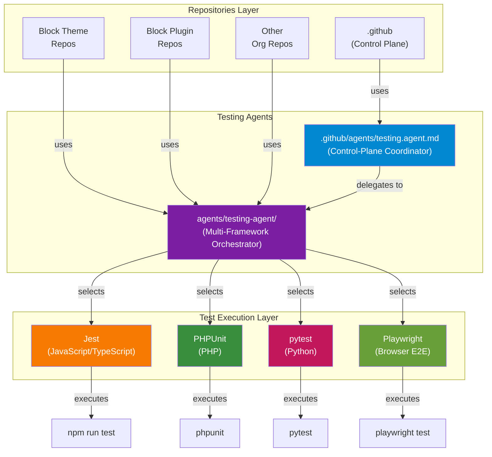
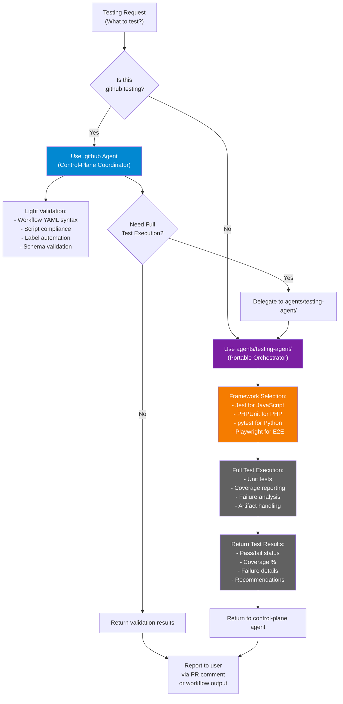
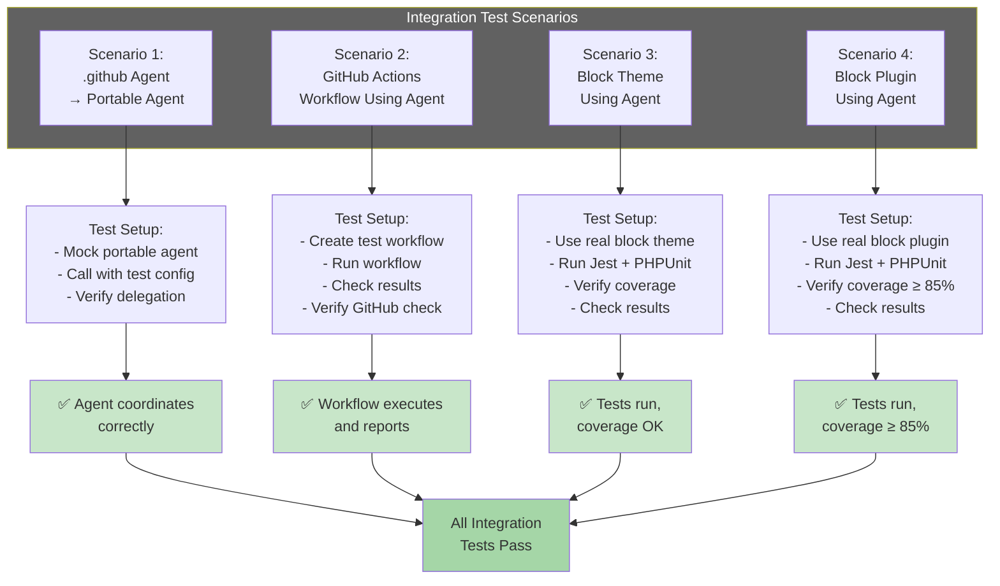
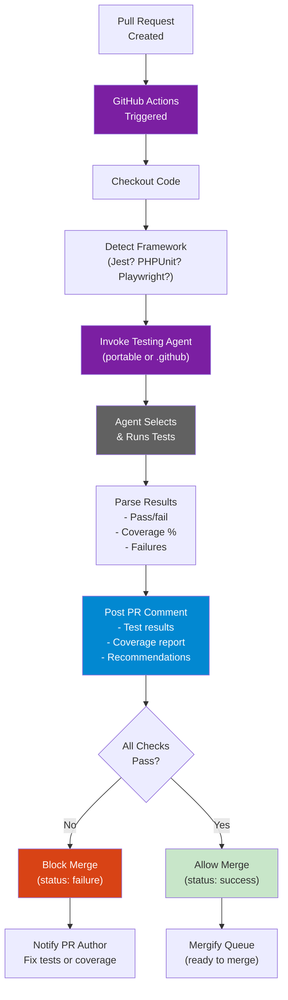

# Architecture Diagrams: Multi-Framework Testing Agent

**Document:** Visual architecture and data flow diagrams  
**Format:** Mermaid (render-friendly, Git-compatible)  
**Status:** Complete

---

## Diagram 1: 2-Tier Testing Architecture



**Key Points:**

- **Control-Plane Coordinator** (.github agent) handles .github-specific testing
- **Portable Orchestrator** (root agents/ agent) handles org-wide testing
- All repos can use the portable agent directly (except .github, which coordinates)
- Framework selection is automatic based on project type

---

## Diagram 2: Delegation Flow (What Each Agent Handles)



**Key Points:**

- `.github` agent handles light validation
- Delegates full test execution to portable agent when needed
- Portable agent handles framework selection and execution
- Results flow back to calling agent then to user

---

## Diagram 3: Test Execution Pipeline

```mermaid
graph LR
    A["Repo<br/>(source code)"]
    
    A --> B["Trigger<br/>(PR, commit,<br/>manual)"]
    
    B --> C["Select Framework<br/>Jest/PHPUnit/pytest<br/>Playwright"]
    
    C --> D{Framework<br/>Selected}
    
    D -->|Jest| E1["Load Jest Config<br/>jest.config.cjs"]
    D -->|PHPUnit| E2["Load PHPUnit Config<br/>phpunit.xml"]
    D -->|pytest| E3["Load pytest Config<br/>pytest.ini"]
    D -->|Playwright| E4["Load Playwright Config<br/>playwright.config.ts"]
    
    E1 --> F["Execute Tests"]
    E2 --> F
    E3 --> F
    E4 --> F
    
    F --> G{All Tests<br/>Passed?}
    
    G -->|No| H["Failure Analysis<br/>- Identify failed tests<br/>- Get error messages<br/>- Suggest fixes"]
    
    G -->|Yes| I["Generate Coverage<br/>- Line coverage %<br/>- Branch coverage %<br/>- Function coverage %"]
    
    I --> J{Coverage<br/>≥ Threshold?}
    
    J -->|No| K["Coverage Failure<br/>- Report gaps<br/>- Suggest files to test"]
    
    J -->|Yes| L["✅ All Checks Passed"]
    
    H --> M["Report Results<br/>- Test failures<br/>- Failure diagnostics<br/>- Recommendations"]
    
    K --> M
    
    L --> M
    
    M --> N["Return to Agent<br/>(pass/fail status<br/>+ coverage %<br/>+ diagnostics)"]
    
    N --> O["Report to User<br/>(PR comment,<br/>GitHub Check,<br/>workflow output)"]
    
    style C fill:#f57c00,color:#fff
    style F fill:#616161,color:#fff
    style G fill:#d84315,color:#fff
    style I fill:#00897b,color:#fff
    style J fill:#d84315,color:#fff
    style L fill:#c8e6c9
    style M fill:#616161,color:#fff
    style O fill:#0288d1,color:#fff
```



**Key Points:**

- Framework selection is automatic
- Tests execute with appropriate configuration
- Coverage is validated against threshold
- Results include diagnostics and recommendations
- All results feed back to user

---

## Diagram 4: Framework Coverage & Selection Matrix

```mermaid
graph TB
    subgraph JS["JavaScript/TypeScript Projects"]
        J1["Block Theme JavaScript"]
        J2["Block Plugin JavaScript"]
        J3["Utility JavaScript"]
    end
    
    subgraph PHP["PHP Projects"]
        P1["Block Theme PHP"]
        P2["Block Plugin PHP"]
        P3["WordPress Config PHP"]
    end
    
    subgraph PY["Python Projects"]
        PY1["CI Scripts (Python)"]
        PY2["Data Processing (Python)"]
    end
    
    subgraph E2E["E2E Testing"]
        E1["WordPress Frontend"]
        E2["WooCommerce Storefront"]
        E3["Accessibility Testing"]
    end
    
    J1 --> JEST["Jest<br/>(JavaScript Unit Tests)<br/>Coverage: 80%"]
    J2 --> JEST
    J3 --> JEST
    
    P1 --> PHPUNIT["PHPUnit<br/>(PHP Unit Tests)<br/>Coverage: 85%"]
    P2 --> PHPUNIT
    P3 --> PHPUNIT
    
    PY1 --> PYTEST["pytest<br/>(Python Testing)<br/>Coverage: 75%"]
    PY2 --> PYTEST
    
    E1 --> PLAYWRIGHT["Playwright<br/>(Browser E2E)<br/>Coverage: 70%"]
    E2 --> PLAYWRIGHT
    E3 --> PLAYWRIGHT
    
    style JEST fill:#f57c00,color:#fff
    style PHPUNIT fill:#388e3c,color:#fff
    style PYTEST fill:#c2185b,color:#fff
    style PLAYWRIGHT fill:#689f38,color:#fff
```



**Key Points:**

- Each framework is selected based on project type
- Coverage thresholds differ by framework
- All frameworks are equally supported
- Clear mapping of when to use which framework

---

## Diagram 5: Skill & Documentation Structure

```mermaid
graph TD
    ROOT["agents/testing-agent/"]
    
    ROOT --> DOCS["Documentation"]
    ROOT --> SHARED["Shared Config"]
    ROOT --> PROVIDERS["Provider-Specific"]
    ROOT --> SKILLS["Skills"]
    ROOT --> FRAMEWORKS["Framework Guides"]
    
    DOCS --> README["README.md<br/>(quick start)"]
    DOCS --> AGENT["AGENT.md<br/>(agent definition)"]
    
    SHARED --> CORE["core-prompt.md<br/>(framework guidance)"]
    SHARED --> SELECTION["framework-selection.md<br/>(decision logic)"]
    
    PROVIDERS --> CLAUDE["claude/agent.md"]
    PROVIDERS --> COPILOT["copilot/agent.md"]
    PROVIDERS --> OPENAI["openai/agent.md"]
    
    SKILLS --> JEST_SKILL["jest-wordpress-mocking/<br/>SKILL.md"]
    SKILLS --> PHPUNIT_SKILL["phpunit-wordpress-globals/<br/>SKILL.md"]
    SKILLS --> PYTEST_SKILL["pytest-github-api/<br/>SKILL.md"]
    SKILLS --> PLAYWRIGHT_SKILL["playwright-wordpress-e2e/<br/>SKILL.md"]
    
    FRAMEWORKS --> JEST_GUIDE["JEST.md"]
    FRAMEWORKS --> PHPUNIT_GUIDE["PHPUNIT.md"]
    FRAMEWORKS --> PYTEST_GUIDE["PYTEST.md"]
    FRAMEWORKS --> PLAYWRIGHT_GUIDE["PLAYWRIGHT.md"]
    
    style README fill:#0288d1,color:#fff
    style AGENT fill:#0288d1,color:#fff
    style CORE fill:#7b1fa2,color:#fff
    style SELECTION fill:#7b1fa2,color:#fff
    style JEST_SKILL fill:#f57c00,color:#fff
    style PHPUNIT_SKILL fill:#388e3c,color:#fff
    style PYTEST_SKILL fill:#c2185b,color:#fff
    style PLAYWRIGHT_SKILL fill:#689f38,color:#fff
    style JEST_GUIDE fill:#f57c00,color:#fff
    style PHPUNIT_GUIDE fill:#388e3c,color:#fff
    style PYTEST_GUIDE fill:#c2185b,color:#fff
    style PLAYWRIGHT_GUIDE fill:#689f38,color:#fff
```



**Key Points:**

- All resources are self-contained in agents/testing-agent/
- Each framework has a skill (implementation) and guide (documentation)
- Shared config provides common guidance
- Provider-specific configs enable multi-model support
- Clear hierarchy and organization

---

## Diagram 6: Integration Test Scenarios



**Key Points:**

- 4 critical integration test scenarios
- Each tests a different coordination pattern
- Results verify the agents work together
- All must pass before release

---

## Diagram 7: Test Coverage Thresholds by Context

```mermaid
xychart-beta
    title Test Coverage Thresholds by Repository & Framework
    x-axis [Control-Plane, Block Theme, Block Plugin, Other Repos]
    y-axis "Coverage Threshold (%)" 60 --> 90
    line [80, 80, 85, 80] name "Jest (JavaScript)"
    line [-, 80, 85, 80] name "PHPUnit (PHP)"
    line [75, -, -, 75] name "pytest (Python)"
    line [-, 70, 70, 70] name "Playwright (E2E)"
```

**Key Points:**

- Block plugins have highest threshold (85%) — customer-facing
- Block themes slightly lower (80%) — customer-facing
- Control-plane balanced (75-80%) — internal use
- E2E lowest (70%) — harder to achieve

---

## Diagram 8: CI/CD Integration Flow



**Key Points:**

- Tests are triggered automatically on PR
- Agent is invoked with test config
- Results are posted as PR comment
- PR is blocked if tests fail or coverage is low
- Clear feedback to PR author

---

## Summary: Architecture Highlights

| Aspect | Design | Benefit |
|--------|--------|---------|
| **2-Tier Model** | Separate control-plane and org-wide agents | Clear responsibilities, easy to maintain |
| **Delegation** | .github delegates to portable agent | Single source of truth for testing logic |
| **Multi-Framework** | Jest, PHPUnit, pytest, Playwright | Supports all LightSpeed project types |
| **WordPress-Centric** | Mocking, standards, patterns for WordPress | Easy to test WordPress code correctly |
| **Provider Support** | Claude, Copilot, OpenAI configs | Works across all AI providers |
| **Skills System** | Separate skills for each framework | Reusable, teachable implementations |
| **Documentation** | Comprehensive guides for each framework | Users don't need to learn testing from scratch |

---

*Built by 🧱 LightSpeedWP with ☕, 🚀, and open-source spirit!*
