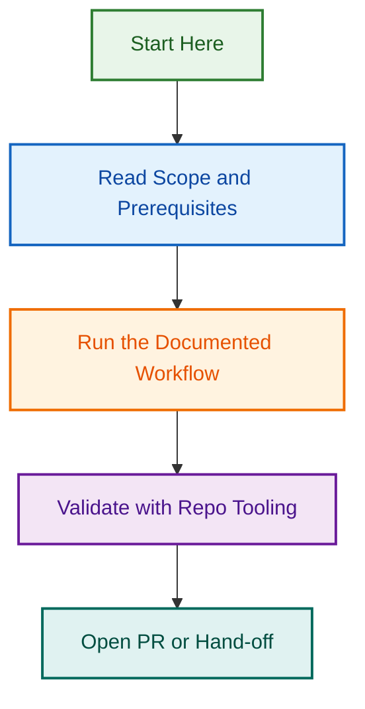

# Testing Agent Multi-Framework Architecture — Phase Planning

**Project:** Multi-framework testing agent consolidation  
**Status:** 🟡 Planning Phase  
**Created:** 2026-08-12  
**Branch:** `design/testing-agent-multi-framework-architecture`  
**Maintainer:** Ash Shaw

---

## Overview

This project consolidates LightSpeed's testing infrastructure into a unified, multi-framework testing agent (`agents/testing-agent/`) while maintaining a lightweight control-plane coordinator (`.github/agents/testing.agent.md`).

**Goal:** Create a single org-wide testing agent supporting Jest, PHPUnit, pytest, and Playwright — with clear delegation between the .github control plane and org-wide repositories.

---

## Key Questions to Resolve

### Scope & Target Repositories

**Q1: Which repositories should use the org-wide testing agent?**

- [ ] Only WordPress block theme repos
- [ ] Only WordPress block plugin repos  
- [ ] Both block theme and block plugin repos
- [ ] All LightSpeed repos (monorepo + satellite projects)
- [ ] All of the above (recommended)

**Current understanding:**

- Portable `agents/testing-agent/` should support all org-wide testing
- `.github/agents/testing.agent.md` handles control-plane only
- **Recommended answer:** All LightSpeed repos; portable agent is reusable

---

### Framework Coverage & WordPress Integration

**Q2: For each framework, what WordPress-specific integrations are needed?**

#### Jest (JavaScript/TypeScript)

- [ ] WordPress REST API mocking
- [ ] Block utilities testing
- [ ] Async WordPress data fetching
- [ ] WordPress action/filter testing
- [ ] All of the above (recommended)

#### PHPUnit (PHP)

- [ ] WordPress global function mocking (`get_option`, `apply_filters`, etc.)
- [ ] Database operation mocking
- [ ] WordPress Coding Standards (WPCS) compliance
- [ ] Multi-version compatibility testing (WP versions)
- [ ] Multi-version compatibility testing (PHP versions)
- [ ] All of the above (recommended)

#### pytest (Python)

- [ ] GitHub API integration testing
- [ ] Log parsing/analysis
- [ ] CI artifact handling
- [ ] Metrics generation
- [ ] All of the above (recommended)

#### Playwright (Browser Testing)

- [ ] Multi-browser testing (Chrome, Firefox, Safari, Edge)
- [ ] Mobile/responsive testing
- [ ] Accessibility testing (axe, WCAG)
- [ ] WordPress stateful testing (login, create posts, etc.)
- [ ] WooCommerce testing (storefront, checkout, etc.)
- [ ] All of the above (keep existing scope from v2.1.0)

---

### Test Coverage & Quality Standards

**Q3: What test coverage requirements should apply?**

| Framework | Control-Plane | Block Themes | Block Plugins | Other Repos |
|-----------|---|---|---|---|
| **Jest** | 80% | 85% | 85% | 80% |
| **PHPUnit** | N/A | 80% | 85% | 80% |
| **pytest** | 75% | N/A | N/A | 75% |
| **Playwright** | N/A | 70% | 70% | 70% |

**Decision needed:**

- Should coverage thresholds vary by framework and context?
- Should coverage gates block merge or just warn?
- How to handle legacy code with low coverage?

**Current recommendation:** Differentiated thresholds per context; gates block merge

---

### Documentation & Skill Development

**Q4: What documentation and skills should the agent include?**

#### For `agents/testing-agent/` (portable)

- [ ] AGENT.md with multi-framework overview
- [ ] Framework-specific guides (Jest guide, PHPUnit guide, etc.)
- [ ] WordPress integration patterns
- [ ] Skills for each framework (jest-skill, phpunit-skill, etc.)
- [ ] Provider-specific configs (Claude, Copilot, OpenAI)
- [ ] All of the above (recommended)

#### For `.github/agents/testing.agent.md`

- [ ] Control-plane testing guide
- [ ] Delegation patterns to portable agent
- [ ] GitHub Actions workflow testing
- [ ] Label automation testing
- [ ] Schema validation testing
- [ ] All of the above (recommended)

---

### Deployment & Testing Strategy

**Q5: How should the agents be tested before release?**

#### Unit Tests for New Scripts

- [ ] Jest tests for any new JavaScript utilities
- [ ] PHPUnit tests for any PHP validators
- [ ] pytest tests for any Python scripts
- [ ] All frameworks covered (recommended)

#### Integration Tests

- [ ] Test agent can invoke portable testing agent
- [ ] Test control-plane workflows with agent
- [ ] Test block theme repos can use portable agent
- [ ] Test block plugin repos can use portable agent
- [ ] Test cross-repo testing scenarios
- [ ] All integration scenarios (recommended)

#### E2E Tests (Playwright)

- [ ] Validate GitHub Actions workflows execute correctly
- [ ] Validate test reporting to GitHub
- [ ] Validate label sync workflows
- [ ] Validate release workflows

---

## Implementation Timeline

### Phase 1: Planning & Design (This Sprint)

- ✅ Create rewrite prompt
- ⏳ Answer key questions (this document)
- ⏳ Create detailed implementation plan
- ⏳ Create Mermaid architecture diagrams
- ⏳ Define acceptance criteria

### Phase 2: Agent Implementation (Proposed)

- Rename & expand `agents/playwright-testing-agent/` → `agents/testing-agent/`
- Add Jest, PHPUnit, pytest support
- Create framework-specific skills
- Update provider configs

### Phase 3: Control-Plane Agent (Proposed)

- Rewrite `.github/agents/testing.agent.md`
- Add coordination logic
- Create GitHub Actions workflows using new agent

### Phase 4: Testing & Validation (Proposed)

- Unit test new scripts
- Integration test agent coordination
- E2E test with real block theme/plugin repos
- Documentation review

---

## Related Issues & PRs

| Item | Status | Purpose |
|------|--------|---------|
| [Rewrite Prompt](./TESTING_AGENT_REWRITE_PROMPT.md) | ✅ Complete | Architecture & rewrite guidance |
| [Questions Doc](./QUESTIONS_AND_ANSWERS.md) | ⏳ In Progress | Answers to Q1-Q5 above |
| [Implementation Plan](./IMPLEMENTATION_PLAN.md) | ⏳ Pending | Detailed step-by-step plan |
| [Architecture Diagrams](./ARCHITECTURE_DIAGRAMS.md) | ⏳ Pending | Mermaid visuals (2-tier model, delegation flow) |

---

## Architecture Overview (High-Level)

```
┌─────────────────────────────────────────────┐
│         Repository Layer                    │
├─────────────────────────────────────────────┤
│  .github/            Block Themes    Block Plugins   Other Repos
│  (Control Plane)     
│                                             
└─────────────────────────────────────────────┘
         ↓                    ↓                  ↓              ↓
  ┌──────────────────────────────────────────────────────────────┐
  │  Testing Agents Tier                                         │
  ├──────────────────────────────────────────────────────────────┤
  │  .github/agents/testing.agent.md (Control-Plane Coordinator) │
  │         ↓ delegates to ↓                                     │
  │  agents/testing-agent/ (Multi-Framework Orchestrator)        │
  │  ├─ Jest Provider                                            │
  │  ├─ PHPUnit Provider                                         │
  │  ├─ pytest Provider                                          │
  │  └─ Playwright Provider                                      │
  └──────────────────────────────────────────────────────────────┘
         ↓                    ↓                  ↓              ↓
  ┌──────────────────────────────────────────────────────────────┐
  │  Test Execution Layer                                        │
  ├──────────────────────────────────────────────────────────────┤
  │  Jest | PHPUnit | pytest | Playwright (Browser)              │
  └──────────────────────────────────────────────────────────────┘
```

---

## Documentation Plan

The project will include:

1. **README.md** (this file) — Overview and key questions
2. **QUESTIONS_AND_ANSWERS.md** — Answers to scope questions with rationale
3. **IMPLEMENTATION_PLAN.md** — Detailed step-by-step implementation
4. **ARCHITECTURE_DIAGRAMS.md** — Mermaid diagrams showing:
   - 2-tier agent architecture
   - Delegation flow (which agent handles what)
   - Test execution pipeline
   - Framework coverage matrix
5. **TESTING_STRATEGY.md** — Unit, integration, and E2E testing plan
6. **ROLLOUT_PLAN.md** — Phased rollout to org repos

---

## Next Steps

1. **Answer all questions** in "Key Questions to Resolve" (see [QUESTIONS_AND_ANSWERS.md](./QUESTIONS_AND_ANSWERS.md))
2. **Create implementation plan** with detailed tasks and acceptance criteria
3. **Generate Mermaid diagrams** for architecture visualization
4. **Define test strategy** for new scripts and agent coordination
5. **Create GitHub issues** linked to this project for tracking

---

## Files in This Project

```
.github/projects/active/testing-agent-multi-framework-2026-08-12/
├── README.md                          (this file)
├── QUESTIONS_AND_ANSWERS.md           (answers + rationale)
├── IMPLEMENTATION_PLAN.md             (step-by-step plan)
├── ARCHITECTURE_DIAGRAMS.md           (Mermaid visuals)
├── TESTING_STRATEGY.md                (unit/integration/E2E tests)
├── ROLLOUT_PLAN.md                    (phased rollout to repos)
└── .archive-status.md                 (populated when complete)
```

---

*Built by 🧱 LightSpeedWP with ☕, 🚀, and open-source spirit!*
## Visual Workflow


