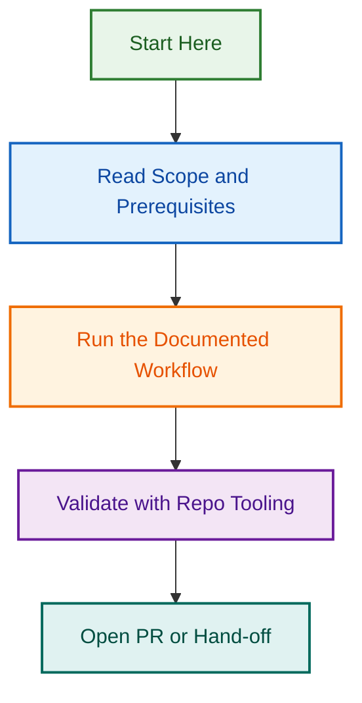

# Testing Agent Phase 2.4–2.7 — Framework Skills & Guides

**Status:** 🚀 Ready to Start  
**Scope:** Framework skills, implementation guides, provider configs, documentation  
**Timeline:** Following Phase 2 completion (2026-08-17)  
**Owner:** Testing Agent multi-framework initiative  

---

## Project Overview

Continuation of Testing Agent Phase 2 multi-framework architecture. Phase 2.1–2.3 established the foundation with agent rename, v2.2.0 metadata, and core prompt enhancement (Jest, PHPUnit, pytest, Playwright). Phase 2.4–2.7 builds implementation details, provider integrations, and comprehensive documentation.

### What Was Shipped (Phase 2.1–2.3)
- ✅ Agent rename: `agents/testing-agent/` (450+ files)
- ✅ Metadata v2.2.0 with multi-framework tags
- ✅ Core prompt: 500+ lines (Framework Selection + Rules)

### What's Next (Phase 2.4–2.7)
Implement framework-specific skills, guides, configurations, and complete documentation across all 4 frameworks.

---

## Phase Breakdown

### Phase 2.4: Framework Skills Implementation
**Objective:** Create reusable skills for each framework

**Deliverables:**
- Jest Skill module (`agents/testing-agent/skills/jest-spec-generation.md`)
- PHPUnit Skill module (`agents/testing-agent/skills/phpunit-spec-generation.md`)
- pytest Skill module (`agents/testing-agent/skills/pytest-spec-generation.md`)
- Playwright Skill module (`agents/testing-agent/skills/playwright-spec-generation.md`)

**Success Criteria:**
- 4 skill modules created with SKILL.md structure
- Each includes: Overview, Setup, Usage, Examples, Validation
- Integration tested with core agent
- Coverage: Unit tests for each skill

**Related Issue:** [#1972](../../../issues/1972)

---

### Phase 2.5: Framework-Specific Implementation Guides
**Objective:** Comprehensive guides for implementing tests in each framework

**Deliverables:**
- Jest Implementation Guide (`agents/testing-agent/guides/jest-implementation-guide.md`)
- PHPUnit Implementation Guide (`agents/testing-agent/guides/phpunit-implementation-guide.md`)
- pytest Implementation Guide (`agents/testing-agent/guides/pytest-implementation-guide.md`)
- Playwright Implementation Guide (`agents/testing-agent/guides/playwright-implementation-guide.md`)
- Framework Comparison & Selection Guide

**Success Criteria:**
- 4 detailed guides (500+ lines each minimum)
- Real-world examples for each framework
- Best practices and gotchas documented
- Integration patterns with the agent
- Accessibility guidelines for each framework

**Related Issue:** [#1973](../../../issues/1973)

---

### Phase 2.6: Provider Configuration Updates
**Objective:** Update provider configurations to include framework-specific support

**Deliverables:**
- Claude provider config updates
- Copilot provider config updates
- OpenAI provider config updates
- Multi-provider framework configuration schema

**Success Criteria:**
- All 3 providers support framework selection
- Prompt injection prevention across frameworks
- Configuration validation
- Provider-specific quirks documented
- Testing across all provider/framework combinations

**Related Issue:** [#1974](../../../issues/1974)

---

### Phase 2.7: Documentation & Release Prep
**Objective:** Complete documentation and prepare for v2.2.0 release

**Deliverables:**
- Updated AGENT.md with Phase 2.4–2.7 work
- Updated core-prompt.md with final enhancements
- USAGE_GUIDE.md covering all 4 frameworks
- TESTING_GUIDE.md for framework-specific testing
- Migration guide (from v2.1 → v2.2)
- CHANGELOG.md entry
- Release checklist

**Success Criteria:**
- All documentation complete and reviewed
- 100+ KB of comprehensive guides
- Code examples for every major feature
- Validation scripts updated
- Ready for v2.2.0 release tag

**Related Issue:** [#1975](../../../issues/1975)

---

## Related Issues

| Issue | Type | Phase | Purpose | Status |
|-------|------|-------|---------|--------|
| [#1972](../../../issues/1972) | task | 2.4 | Framework Skills Implementation | 🔴 Pending |
| [#1973](../../../issues/1973) | task | 2.5 | Framework Implementation Guides | 🔴 Pending |
| [#1974](../../../issues/1974) | task | 2.6 | Provider Configuration Updates | 🔴 Pending |
| [#1975](../../../issues/1975) | task | 2.7 | Documentation & Release Prep | 🔴 Pending |

---

## Success Criteria — ALL PHASES

- [x] Phase 2.1–2.3 complete & merged to develop
- [ ] 4 framework skills implemented & tested
- [ ] 5 comprehensive implementation guides written
- [ ] Provider configs updated & validated
- [ ] 100+ KB documentation complete
- [ ] All code reviewed & merged to develop
- [ ] v2.2.0 release ready

---

## File Structure

```
agents/testing-agent/
├── AGENT.md (updated)
├── shared/
│   └── core-prompt.md (updated)
├── skills/
│   ├── jest-spec-generation.md (NEW)
│   ├── phpunit-spec-generation.md (NEW)
│   ├── pytest-spec-generation.md (NEW)
│   └── playwright-spec-generation.md (NEW)
├── guides/
│   ├── jest-implementation-guide.md (NEW)
│   ├── phpunit-implementation-guide.md (NEW)
│   ├── pytest-implementation-guide.md (NEW)
│   ├── playwright-implementation-guide.md (NEW)
│   └── framework-selection-guide.md (NEW)
├── configs/
│   ├── claude-config.yml (updated)
│   ├── copilot-config.yml (updated)
│   └── openai-config.yml (updated)
└── docs/
    ├── USAGE_GUIDE.md (NEW)
    ├── TESTING_GUIDE.md (NEW)
    ├── MIGRATION_GUIDE.md (NEW)
    └── README.md (updated)
```

---

## Timeline

- **Phase 2.4:** 3–4 days (skill module development)
- **Phase 2.5:** 4–5 days (guide writing & examples)
- **Phase 2.6:** 2–3 days (provider config updates & testing)
- **Phase 2.7:** 2–3 days (documentation & release prep)

**Total:** ~11–15 days estimated

---

## Key References

- **Previous Work:** PR #1945 (Phase 2.1–2.3 merged to develop)
- **Agent Location:** `agents/testing-agent/AGENT.md`
- **Core Prompt:** `agents/testing-agent/shared/core-prompt.md`
- **Standards:** [Documentation Standards](../../../../docs/documentation-standards.md)
- **Skill Template:** [SKILL.md Format](../../../../skills/SKILL_TEMPLATE.md)

---

## Notes

- Framework Selection matrix from Phase 2.3 core-prompt provides decision criteria for all phases
- All skills should reference the core-prompt framework rules
- Provider configs should extend existing configurations (not replace)
- Documentation should include real-world examples from LightSpeedWP WordPress ecosystem

---

*Last Updated: 2026-08-17*  
*Project Initiated: Testing Agent Phase 2 (PR #1945)*
## Visual Workflow


