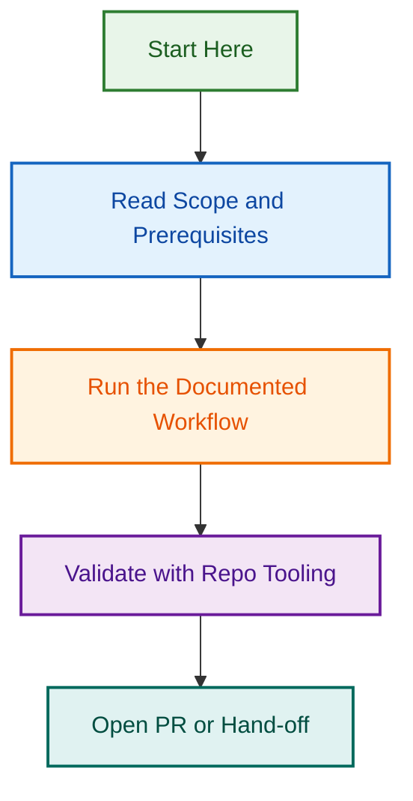

# Wave 5 Documentation Audit

## Project Status

🟡 **ACTIVE** — Phase 3 execution and GitHub issues rewrite in progress.

## Overview

Comprehensive documentation audit and improvement initiative (Wave 5). Focuses on assessing documentation quality, identifying gaps, and planning strategic improvements for Phase 3 implementation.

## Key Phases

### Phase 1: Audit & Assessment

- Initial documentation audit
- Gap identification
- Quality assessment

### Phase 2: Planning & Strategy

- Documentation update strategy
- GitHub issues rewrite plan
- Implementation roadmap

### Phase 3: Execution (Current)

- GitHub issues rewrite implementation
- Documentation updates
- Quality validation

## Related Documents

- See `AUDIT_REPORT_2026-07-31.md` for comprehensive audit findings
- See `DOCUMENTATION_UPDATE_STRATEGY.md` for improvement strategy
- See `GITHUB_ISSUES_REWRITE_PLAN.md` for issues update plan
- See `PHASE-3-EXECUTION-STATUS.md` for current execution status
- See `INDEX.md` for document organization

## Current Status

Phase 3 execution ongoing. See PHASE-3-EXECUTION-STATUS.md for latest progress.

---

**Project Lead:** TBD  
**Started:** 2026-07-31  
**Status:** Active  
**Last Updated:** 2026-08-06

## Related Issues

This project is coordinated with:

- [#1733](https://github.com/lightspeedwp/.github/issues/1733) — Phase 2: Folder Structure & Linking

See [Linking Standard](https://github.com/lightspeedwp/.github/blob/develop/.github/projects/active/reports-projects-restructuring-2026-08-11/LINKING_STANDARD.md) for linking patterns.

## Visual Workflow

