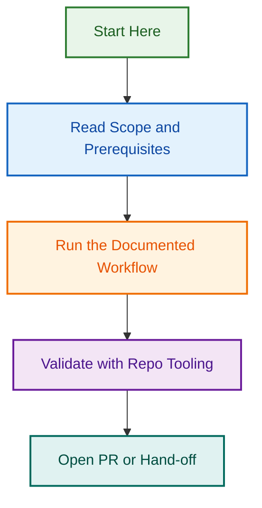

# Prompts Directory

This directory contains reusable AI prompts, system instructions, and context builders for LightSpeed automation workflows and agents.

## Repository Scope

This directory is now for `.github` repository control-plane prompts only.

- Keep prompts here when they depend on GitHub issue/PR/workflow automation or repo-local governance files.
- Use root `prompts/` for organisation-wide reusable prompts.

## Migration Notice

- Prompt migration and classification is tracked in:
  - `.github/projects/active/refactor-migrate-prompts/artifacts/migration-matrix.md`
- Moved or merged prompts in this directory include per-file deprecation notices with successor paths.
- Canonical org-wide prompt library:
  - `../prompts/README.md`

## Purpose

- **Agent Prompts**: System prompts and behavior guidance for LightSpeed agents
- **Context Builders**: Prompt templates for generating contextual information
- **Instruction Templates**: Reusable instruction sets for automation
- **AI Governance**: Standardized prompting patterns aligned with LightSpeed values

## Contents

This folder contains scripts and templates for automation, including:

- AI agent system prompts
- Context and instruction generation templates
- Governance-aligned prompting patterns
- Automation workflow helpers

## Related Resources

- [Agents Directory](../agents/README.md) — Agent specifications and implementations
- [Instructions Directory](../instructions/README.md) — Comprehensive instruction sets
- [Automation Governance](../../docs/AUTOMATION.md) — Governance policies for automation

---

*Prompts are a critical component of LightSpeed's AI automation strategy. See [AGENTS.md](../../AGENTS.md) for complete AI governance guidance.*
## Visual Workflow

