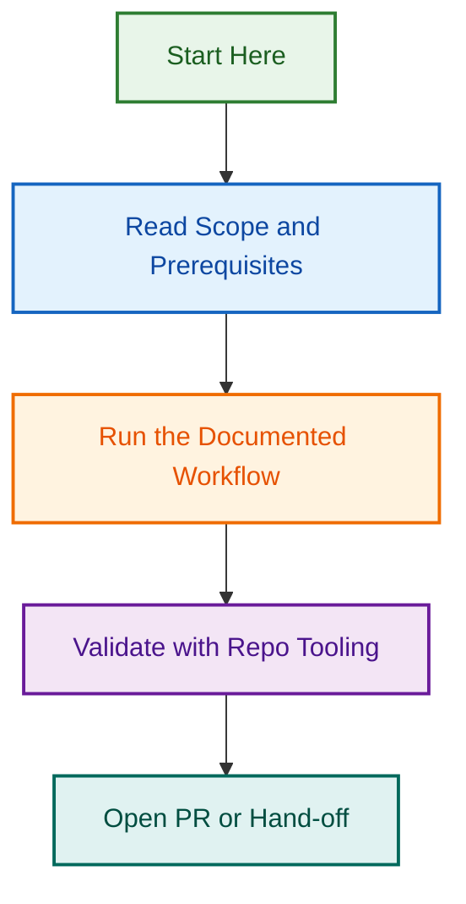

# Reports Directory

This directory contains all generated reports, analysis outputs, audit files, and agent execution summaries.

## Purpose

- Store all Copilot/agent-generated reports
- Centralize analysis and audit outputs
- Maintain organized report archives
- Provide single source of truth for all reporting artifacts

## Directory Structure

```
.githu./.github/reports/
├── analysis/        # Code analysis, technical audits, and investigation reports
├── audits/          # One-time audit outputs (compliance, schema validation, system audits)
├── implementation/  # Implementation tracking, completion summaries, and rollout reports
├── migration/       # Migration reports, data transfer logs, and transition documentation
├── validation/      # Schema validation, config validation, and compliance reports
├── agents/          # Agent execution reports, completion summaries, and performance logs
├── coverage/        # Test coverage reports and quality metrics
├── frontmatter/     # Frontmatter schema validation and compliance reports
├── issue-metrics/   # GitHub issue analytics, metrics, and trends
├── labeling/        # Label automation reports, sync logs, and refactoring analysis
├── linting/         # ESLint baselines, code quality reports, and wave plans
├── meta/            # Documentation metadata (badges, references, footer updates)
├── metrics/         # General metrics collection, weekly summaries, and trend reports
├── optimisation/    # Performance optimisation reports, token reduction, context analysis
└── progress/        # Daily updates and weekly summaries for long-running work
```

## Subdirectory Descriptions

### analysis/

**Purpose:** General code and system analysis reports that don't fit into more specific categories.

**Examples:**

- Technical debt analysis
- Architecture reviews
- Dependency audits
- Security scans

### audits/

**Purpose:** Formal audit reports for compliance, standards verification, and system-wide checks.

**Examples:**

- `frontmatter-compliance-audit-2025-12-09.csv`
- `workflow-security-audit-2025-12-09.md`
- `accessibility-audit-report.md`

### implementation/

**Purpose:** Track implementation progress, feature rollouts, and completion summaries.

**Examples:**

- `phase-5-implementation-summary-2025-12-09.md`
- `feature-rollout-status.md`
- `deployment-completion-report.md`

### migration/

**Purpose:** Document file migrations, data transfers, and system transitions.

**Examples:**

- `file-organization-migration-2025-12-09.md`
- `database-migration-log-2025-12-10.md`
- `api-version-transition-report.md`

### validation/

**Purpose:** Validation results for schemas, configurations, and standards compliance.

**Examples:**

- `schema-validation-errors-2025-12-09.json`
- `config-compliance-report.md`
- `frontmatter-validation-summary.md`

### agents/

**Purpose:** Reports generated by automated agents, including completion summaries and performance metrics.

**Examples:**

- `labeling-agent-completion-2025-12-09.md`
- `release-agent-summary.md`
- `automation-performance-metrics.json`

### coverage/

**Purpose:** Test coverage reports and quality assurance metrics.

**Examples:**

- `test-coverage-summary-2025-w50.md`
- `unit-test-coverage-report.html`
- `integration-coverage-metrics.json`

### frontmatter/

**Purpose:** Frontmatter-specific validation, compliance checks, and schema reports.

**Examples:**

- `frontmatter-schema-errors-2025-12-09.json`
- `missing-frontmatter-report.md`
- `frontmatter-compliance-summary.csv`

### issue-metrics/

**Purpose:** GitHub issue analytics, metrics collection, and trend analysis.

**Examples:**

- `weekly-issue-metrics-2025-w50.json`
- `issue-resolution-trends.md`
- `label-distribution-analysis.csv`

### labeling/

**Purpose:** Label automation reports, synchronization logs, and label refactoring analysis.

**Examples:**

- `label-sync-log-2025-12-09.md`
- `labeling-refactor-analysis.md`
- `label-coverage-report-run-12345.json`

### linting/

**Purpose:** Code quality reports, ESLint baselines, and linting wave plans.

**Examples:**

- `eslint-baseline-2025-12-09.json`
- `linting-wave-1-plan.md`
- `code-quality-improvements-summary.md`

### meta/

**Purpose:** Documentation metadata reports including badge updates, reference tracking, and footer management.

**Examples:**

- `badge-application-metrics-2025-12-09.json`
- `footer-update-summary.md`
- `reference-link-validation.csv`

### metrics/

**Purpose:** General metrics collection, weekly summaries, and organizational health tracking.

**Examples:**

- `weekly-summary-2025-12-08.md`
- `repository-health-metrics.json`
- `contributor-activity-trends.csv`

### optimisation/

**Purpose:** Performance optimisation analysis, token reduction reports, and efficiency improvements.

**Examples:**

- `priority1-analysis-2025-12-09.txt`
- `token-reduction-summary.md`
- `context-optimisation-report.json`

### progress/

**Purpose:** Chronological updates for multi-day or multi-week projects, including daily updates and weekly summaries.

**Examples:**

- `daily-update-2025-12-11.md`
- `weekly-summary-2025-w50.md`
- `week-of-2025-12-15-platform-refresh.md`

## File Naming Convention

Use descriptive names with timestamps for time-specific reports:

```
{type}-{subject}-{timestamp}.{ext}

Examples:
optimisation/priority1-analysis-2025-12-09.txt
audits/frontmatter-compliance-2025-12-09.csv
labeling/summary-run-12345.md
metrics/weekly-summary-2025-w50.json
migration/file-organization-migration-2025-12-09.md
progress/daily-update-2025-12-11.md
progress/weekly-summary-2025-w50.md
```

**Naming Guidelines:**

- Use lowercase with hyphens (kebab-case)
- Include ISO date format `YYYY-MM-DD` for time-specific reports
- Use descriptive names that indicate content
- Avoid generic names like `report.md` or `output.txt`

## Guidelines

✅ **DO:**

- Create all reports in this directory or appropriate subdirectory
- Use descriptive filenames with timestamps
- Include frontmatter in markdown reports for metadata
- Commit reports that provide value for future reference

❌ **DON'T:**

- Create report files in repository root
- Create report files in `docs/` folder
- Create report files in `/tmp/` or other temporary locations
- Use generic names like `report.txt` or `output.md`

## Related Documentation

- [File Organisation Instructions](../instructions/file-organisation.instructions.md)
- [Community Standards](../instructions/community-standards.instructions.md)
- [Agent Development Standards](../instructions/automation.instructions.md)

---

*For questions about report organisation, see [file-organisation.instructions.md](../instructions/file-organisation.instructions.md)*
## Visual Workflow


