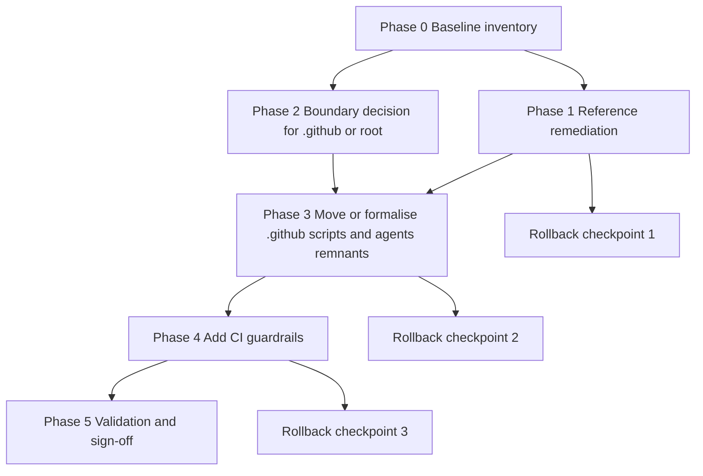
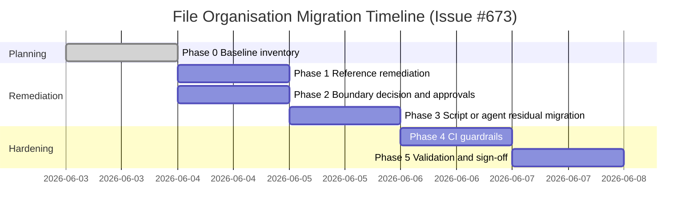

# #673 Plan - File Organisation Refactoring Migration and Validation

## Inputs

This plan is based on:

- `#671` file organisation boundary audit
- `#672` agent/script migration-status audit

## Goals

1. Remove boundary ambiguity between root portable assets and `.github` control-plane assets.
2. Eliminate references to deprecated docs and non-canonical paths.
3. Introduce validation checks to prevent recurrence.

## Planned Scope

### In scope

- Documentation reference remediation for retired docs and naming drift.
- Resolution of `.github/agents/README.md` status.
- Migration or exception formalisation for `.github/scripts/validate-footers.js`.
- CI guardrails for boundary and reference compliance.

### Out of scope

- Broad refactor of unrelated scripts, workflows, or project assets.
- Structural changes to root portable folders already aligned with CLAUDE.md.

## Dependency Graph

## Timeline

## Detailed Implementation Plan

### Phase 0 - Baseline inventory

- Capture current file tree and reference map.
- Preserve baseline report artefacts.

Exit criteria:

- Baseline inventory committed and reviewed.

### Phase 1 - Reference remediation

- Replace links to:
  - `docs/ISSUE_LABELS.md` -> `docs/LABELING.md`
  - `docs/PR_LABELS.md` -> `docs/LABELING.md`
  - `docs/AUTOMATION_GOVERNANCE.md` -> `docs/AUTOMATION.md`
- Standardise `ISSUE_FIELDS.md` naming in docs and templates.

Exit criteria:

- No references to retired docs in active docs/templates/instructions.

### Phase 2 - Boundary decision

- Decide governance treatment of `.github/agents/README.md`.
- Decide migrate-vs-exception policy for `.github/scripts/validate-footers.js`.

Exit criteria:

- Decision recorded in docs and enforced by file placement policy.

### Phase 3 - Residual migration

- Execute approved move or retention strategy.
- Update dependent paths if file moves occur.

Exit criteria:

- No ambiguous duplicate path patterns for active scripts/agent specs.

### Phase 4 - CI guardrails

- Add checks for retired-doc references.
- Add checks for boundary drift (`.github/agents`, `.github/scripts` net-new files).

Exit criteria:

- Guardrail checks fail correctly on intentional negative tests.

### Phase 5 - Validation and sign-off

- Run lint and validation suite.
- Publish completion summary with before/after impact.

Exit criteria:

- All checks pass and issue acceptance criteria met.

## Validation Checklist

- [ ] `npm run lint:md` passes
- [ ] no active references to retired docs
- [ ] boundary decisions documented in CLAUDE-aligned docs
- [ ] moved files still referenced correctly
- [ ] CI guardrails active and tested
- [ ] migration report updated with final status

## Rollback Procedures

### Trigger conditions

- Critical workflow breakage after path changes
- Validation failures that cannot be resolved within change window
- Unexpected automation regression linked to migration edits

### Rollback steps

1. Revert migration commits in reverse order of application.
2. Restore previous known-good references and script paths.
3. Re-run lint and validation scripts.
4. Document rollback cause and corrective next action before reattempt.

## Risk Register

| Risk | Likelihood | Impact | Mitigation |
| --- | --- | --- | --- |
| Missed deprecated links | Medium | Medium | Add automated link-pattern checks in CI |
| Script path migration breaks workflow | Low | Medium | Use staged move with compatibility wrapper if needed |
| Contributors reintroduce boundary drift | Medium | Medium | Enforce via policy + CI checks |

## Success Metrics

- Zero references to retired docs in active contributor paths.
- Zero unresolved boundary overlaps for agents/scripts without explicit exceptions.
- CI guardrails prevent regression in subsequent PRs.
