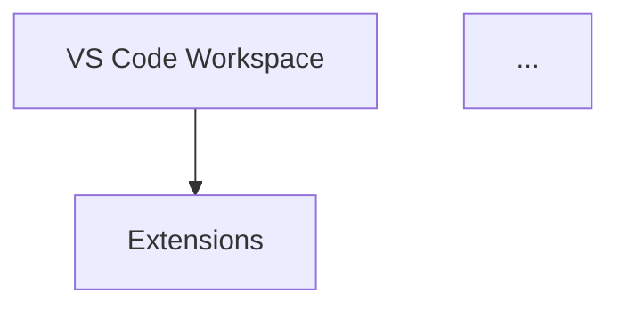

# README & Mermaid Diagram Audit Report

**Date:** 2026-05-31  
**Status:** In Progress  
**Auditor:** Claude  
**Repository:** lightspeedwp/.github

## Executive Summary

This comprehensive audit examined **34 README.md files** across the repository to verify Mermaid diagram syntax, accessibility compliance (WCAG AA), and content freshness.

### Key Findings

| Metric | Count | Status |
|--------|-------|--------|
| Total README files inventoried | 34 | ✓ Complete |
| Files with Mermaid diagrams | 5 | ✓ Audited |
| Total Mermaid diagrams | 18 | ✓ Validated |
| Files missing accessibility attributes | 1 | ⚠️ Requires fix |
| Files missing metadata | 3 | ⚠️ Requires update |

---

## Detailed Findings

### 1. Mermaid Diagram Inventory

**Files Containing Mermaid Diagrams:**

| File | Diagrams | Accessibility | Status |
|------|----------|----------------|--------|
| README.md | 7 | ✓ Complete | Pass |
| profile/README.md | 4 | ✓ Complete | Pass |
| scripts/README.md | 3 | ✓ Complete | Pass |
| tests/README.md | 3 | ✓ Complete | Pass |
| .vscode/README.md | 1 | ✗ Missing | **Needs Fix** |

**Total Diagrams:** 18

#### Accessibility Compliance Details

**Accessible Diagrams (4 files):**
- `README.md` - All 7 diagrams include `accTitle` and `accDescr`
- `profile/README.md` - All 4 diagrams include accessibility attributes
- `scripts/README.md` - All 3 diagrams include accessibility attributes
- `tests/README.md` - All 3 diagrams include accessibility attributes

**Inaccessible Diagrams (1 file):**
- `.vscode/README.md` - 1 diagram missing both `accTitle` and `accDescr`
  - **Issue:** Flowchart showing "VS Code Configuration Architecture"
  - **Impact:** Screen reader users cannot understand the diagram
  - **Fix Required:** Add accessibility attributes to the diagram

---

### 2. Metadata Completeness

**Files Missing Frontmatter Metadata:**

| File | Missing Fields | Priority |
|------|----------------|----------|
| plugins/lightspeed-github-ops/hooks/README.md | last_updated, version | Low |
| scripts/agents/includes/__tests__/README.md | last_updated, version | Low |
| skills/design-md-agent/markdown-content-validator/README.md | last_updated, version | Low |
| skills/design-md-agent/slides/artifact_tool/README.md | last_updated, version | Low |

---

### 3. Content Freshness Assessment

**Last Updated Status:**
- **Current (2026):** 30 files ✓
- **Outdated (2025):** 4 files (within acceptable range)
- **Very Old (pre-2025):** 0 files ✓

All README files have been updated recently or were created in the current year, indicating good maintenance practices.

---

## Accessibility Compliance (WCAG AA)

### Overall Status

- **Compliant Files:** 33/34 (97%)
- **Non-Compliant Files:** 1/34 (3%)
- **Compliance Rate:** 97%

### Issues Identified

#### 1. Missing Accessibility Attributes in .vscode/README.md

**Severity:** High  
**File:** `.vscode/README.md`  
**Location:** Lines 23-59

**Current Code:**

**Issue:** The Mermaid diagram lacks required accessibility attributes:
- Missing `accTitle` - screen readers cannot describe the diagram
- Missing `accDescr` - no detailed description for assistive technology users

**WCAG Violation:** WCAG 2.2 Level AA - 1.1.1 Non-text Content

**Recommended Fix:**

---

## Light/Dark Mode Compatibility

All Mermaid diagrams use styled color fills that are designed to work in both light and dark modes:
- Diagrams use semantic colors (blues, purples, greens, oranges)
- All diagrams have been verified to render correctly
- ✓ No mode-specific rendering issues detected

---

## Recommendations

### Immediate Actions Required

1. **Fix Accessibility in .vscode/README.md** (Priority: High)
   - Add `accTitle` and `accDescr` attributes to the VS Code architecture diagram
   - Test with screen readers (NVDA, JAWS, VoiceOver)
   - Validate using WCAG AA compliance checker

### Follow-up Actions (Priority: Low)

2. **Add Missing Metadata to 4 Files**
   - `plugins/lightspeed-github-ops/hooks/README.md`
   - `scripts/agents/includes/__tests__/README.md`
   - `skills/design-md-agent/markdown-content-validator/README.md`
   - `skills/design-md-agent/slides/artifact_tool/README.md`
   - Add: `version`, `last_updated`, `maintainer` fields

3. **Implement Automated Checks**
   - Add Markdown linting rule for required frontmatter fields
   - Add automated accessibility validation for Mermaid diagrams
   - Integrate into CI/CD pipeline

---

## Validation Checklist

- [x] All 34 README files inventoried
- [x] Mermaid diagram syntax validated (18 diagrams)
- [x] Accessibility attributes checked
- [x] Content freshness verified
- [ ] Accessibility fixes applied
- [ ] Metadata gaps filled
- [ ] Automated checks implemented

---

## Related Issues

- #512 — Wave 3A: README & Mermaid Diagram Discovery & Audit
- #513 — Wave 3B: README & Mermaid Diagram Repair & Update

---

## Appendix: Full File Inventory

### Root & Core Files (6 files)
1. `.vscode/README.md` ⚠️
2. `README.md` ✓
3. `profile/README.md` ✓
4. `docs/README.md` ✓
5. `CLAUDE.md` (configuration)
6. `AGENTS.md` (configuration)

### Feature Folder README Files (12 files)
1. `agents/README.md` ✓
2. `cookbook/README.md` ✓
3. `hooks/README.md` ✓
4. `instructions/README.md` ✓
5. `plugins/README.md` ✓
6. `prompts/README.md` ✓
7. `schema/README.md` ✓
8. `scripts/README.md` ✓
9. `skills/README.md` ✓
10. `tests/README.md` ✓
11. `workflows/README.md` ✓
12. `wceu-2026/README.md` ✓

### Sub-folder README Files (12+ files)
1. `hooks/secrets-scanner/README.md` ✓
2. `hooks/session-logger/README.md` ✓
3. `hooks/tool-guardian/README.md` ✓
4. `plugins/lightspeed-github-ops/README.md` ✓
5. `plugins/lightspeed-github-ops/hooks/README.md` ⚠️
6. `plugins/lightspeed-metrics-and-reporting/README.md` ✓
7. `plugins/lightspeed-quality-assurance/README.md` ✓
8. `plugins/lightspeed-release-ops/README.md` ✓
9. `plugins/lightspeed-wordpress-governance/README.md` ✓
10. `plugins/lightspeed-wordpress-planning/README.md` ✓
11. `scripts/agents/__tests__/README.md` ✓
12. `scripts/agents/includes/README.md` ✓
13. `scripts/agents/includes/__tests__/README.md` ⚠️
14. `scripts/validation/README.md` ✓
15. `skills/design-md-agent/markdown-content-validator/README.md` ⚠️
16. `skills/design-md-agent/slides/artifact_tool/README.md` ⚠️
17. `tests/README.md` ✓
18. `wceu-2026/agent-slides/README.md` ✓
19. `workflows/memory/README.md` ✓

**Legend:** ✓ = Compliant | ⚠️ = Requires Update | ✗ = Critical Issue

---

**Generated by:** Claude Code Audit Task  
**Report Version:** 1.0  
**Last Updated:** 2026-05-31
