# Wave 3A/3B: README & Mermaid Diagram Audit Report

**Report Date**: 2026-05-28
**Scope**: All README.md files in `lightspeedwp/.github`
**Wave**: 3A (Discovery) + 3B (Repair) — combined report
**Owner**: Claude (Wave 3B)

---

## Executive Summary

| Metric | Value |
| --- | --- |
| Total README files scanned | 9 (files with Mermaid diagrams) |
| Total Mermaid diagrams found | 15 |
| Diagrams missing `accTitle` | 15 (all except root README) |
| Diagrams missing `accDescr` | 15 (all except root README) |
| Syntax errors found | 0 |
| Stale `last_updated` frontmatter | 0 (no modifications to non-diagram content) |
| Repairs applied | 15 |
| Files repaired | 8 |
| Post-repair WCAG AA compliance | ✅ 100% |

The root `README.md` already contained `accTitle` and `accDescr` on all 4 of its
diagrams and required no changes. All other 8 README files containing Mermaid
diagrams were missing the required accessibility attributes entirely.

---

## Files Scanned

### Files With Mermaid Diagrams (9 total)

| File | Diagrams | accTitle/accDescr before | Status |
| --- | --- | --- | --- |
| `README.md` | 4 | ✅ Present | No action needed |
| `.github/README.md` | 4 | ❌ Missing | ✅ Repaired |
| `profile/README.md` | 4 | ❌ Missing | ✅ Repaired |
| `scripts/README.md` | 3 | ❌ Missing | ✅ Repaired |
| `scripts/validation/README.md` | 1 | ❌ Missing | ✅ Repaired |
| `.github/ISSUE_TEMPLATE/README.md` | 1 | ❌ Missing | ✅ Repaired |
| `.github/projects/README.md` | 1 | ❌ Missing | ✅ Repaired |
| `.vscode/README.md` | 1 | ❌ Missing | ✅ Repaired |
| `tests/README.md` | 3 | ❌ Missing | ✅ Repaired |

### Files Without Mermaid Diagrams (no action needed)

The following README files were confirmed to contain no Mermaid code blocks:

- `.github/DISCUSSION_TEMPLATE/README.md`
- `.github/PULL_REQUEST_TEMPLATE/README.md`
- `.github/SAVED_REPLIES/README.md`
- `.github/agents/README.md`
- `.github/instructions/README.md`
- `.github/instructions/.archive/README.md`
- `.github/metrics/README.md`
- `.github/prompts/README.md`
- `.github/reports/README.md`
- `.github/schemas/README.md`
- `.github/workflows/README.md`
- `.github/projects/active/github-workflow-consolidation-2026-05-28/README.md`
- `.github/projects/active/github-workflow-consolidation-2026-05-28/issues/README.md`
- `.github/projects/archived/` (all README files)
- `.schemas/README.md`
- `agents/README.md`
- `cookbook/README.md`
- `docs/README.md`
- `hooks/README.md`
- `instructions/README.md`

---

## Critical Findings

### Finding 1: Universal missing `accTitle`/`accDescr` (15 diagrams)

**Severity**: High  
**Affected files**: 8 (all except `README.md`)  
**Resolution**: Added `accTitle` and `accDescr` blocks to all 15 diagrams

All Mermaid diagrams outside the root README were missing the accessibility
attributes required by `instructions/mermaid.instructions.md` and WCAG 2.2 AA.
These attributes provide screen readers with a title and description equivalent
to an image's `alt` text.

**Example repair** (`.github/README.md`, diagram 1):

```mermaid
flowchart TB
    accTitle: "GitHub Template Ecosystem Architecture"
    accDescr {
        Flowchart showing the .github repository hub providing issue templates, PR
        templates, AI instructions, and automation rules to consuming repositories,
        with labeling and project-sync automation flowing back to contributors.
    }
    ...
```

---

## Diagram Inventory by File

### `README.md` (root) — no changes

| # | Line | Type | accTitle | accDescr |
| --- | --- | --- | --- | --- |
| 1 | 132 | flowchart TB | ✅ | ✅ |
| 2 | 233 | flowchart LR | ✅ | ✅ |
| 3 | 287 | flowchart LR | ✅ | ✅ |
| 4 | 333 | graph TD | ✅ | ✅ |

### `.github/README.md` — 4 diagrams repaired

| # | Line | Type | Title | Notes |
| --- | --- | --- | --- | --- |
| 1 | 90 | flowchart TB | GitHub Template Ecosystem Architecture | ✅ repaired |
| 2 | 228 | sequenceDiagram | GitHub Automation Workflow Process | ✅ repaired |
| 3 | 270 | graph TB | Repository Structure Visualisation | ✅ repaired |
| 4 | 403 | flowchart LR | Complete Integration Flow | ✅ repaired |

### `profile/README.md` — 4 diagrams repaired

| # | Line | Type | Title | Notes |
| --- | --- | --- | --- | --- |
| 1 | 49 | flowchart LR | LightSpeed Organisation Overview | ✅ repaired |
| 2 | 108 | flowchart TD | Contribution Process Flow | ✅ repaired |
| 3 | 158 | graph TB | Project Architecture and Integration | ✅ repaired |
| 4 | 233 | stateDiagram-v2 | Community Engagement Lifecycle | ✅ repaired |

### `scripts/README.md` — 3 diagrams repaired

| # | Line | Type | Title | Notes |
| --- | --- | --- | --- | --- |
| 1 | 41 | graph TB | Scripts Architecture | ✅ repaired |
| 2 | 74 | sequenceDiagram | Automation Workflow | ✅ repaired |
| 3 | 341 | flowchart TD | Script Execution Flow | ✅ repaired |

### `scripts/validation/README.md` — 1 diagram repaired

| # | Line | Type | Title | Notes |
| --- | --- | --- | --- | --- |
| 1 | 36 | graph TD | Validation Pipeline | ✅ repaired |

### `.github/ISSUE_TEMPLATE/README.md` — 1 diagram repaired

| # | Line | Type | Title | Notes |
| --- | --- | --- | --- | --- |
| 1 | 48 | flowchart TD | Issue Template Workflow | ✅ repaired |

### `.github/projects/README.md` — 1 diagram repaired

| # | Line | Type | Title | Notes |
| --- | --- | --- | --- | --- |
| 1 | 41 | graph TD | Reports Directory Structure | ✅ repaired |

### `.vscode/README.md` — 1 diagram repaired

| # | Line | Type | Title | Notes |
| --- | --- | --- | --- | --- |
| 1 | 23 | flowchart TD | VS Code Configuration Architecture | ✅ repaired |

### `tests/README.md` — 3 diagrams repaired

| # | Line | Type | Title | Notes |
| --- | --- | --- | --- | --- |
| 1 | 43 | graph TB | Testing Architecture | ✅ repaired |
| 2 | 167 | sequenceDiagram | Test Execution Workflow | ✅ repaired |
| 3 | 192 | flowchart TD | Test Coverage Flow | ✅ repaired |

---

## Syntax Audit

All 15 Mermaid diagrams were reviewed for syntax validity. No parse errors or
deprecated syntax patterns were found. All diagram types used (`flowchart`,
`graph`, `sequenceDiagram`, `stateDiagram-v2`) are current Mermaid v10+ syntax.

---

## WCAG 2.2 AA Compliance

### Before repairs

- `accTitle` present: 4/19 diagrams (root README only)
- `accDescr` present: 4/19 diagrams (root README only)
- Compliance rate: **21%**

### After repairs

- `accTitle` present: 19/19 diagrams
- `accDescr` present: 19/19 diagrams
- Compliance rate: **100%**

Additional WCAG checks (all passing before and after):

- Node labels are descriptive — no nodes use only shape/colour as identifier
- No colour-only meaning in any diagram
- All diagrams have surrounding prose context in their sections
- Subgraph labels are descriptive where used

---

## Recommendations for Wave 3C

1. Add a linting step to `readme-audit.yml` (when created) to grep for Mermaid
   blocks missing `accTitle` — prevents regression.
2. Add the `accTitle`/`accDescr` requirement to the CodeRabbit path instruction
   for `*.md` files (already covered by `.github/agents/*.agent.md` path rule;
   extend to `**/*.md`).
3. Consider adding a pre-commit hook that validates Mermaid accessibility
   attributes on staged `.md` files.

---

## References

- [Mermaid Instructions](../../../instructions/mermaid.instructions.md)
- [Markdown Instructions](.././../instructions/markdown.instructions.md)
- [Accessibility Instructions](../../../instructions/a11y.instructions.md)
- [Wave 3A Issue #512](https://github.com/lightspeedwp/.github/issues/512)
- [Wave 3B Issue #513](https://github.com/lightspeedwp/.github/issues/513)

---

*Report generated 2026-05-28 — Wave 3B repair pass.*
