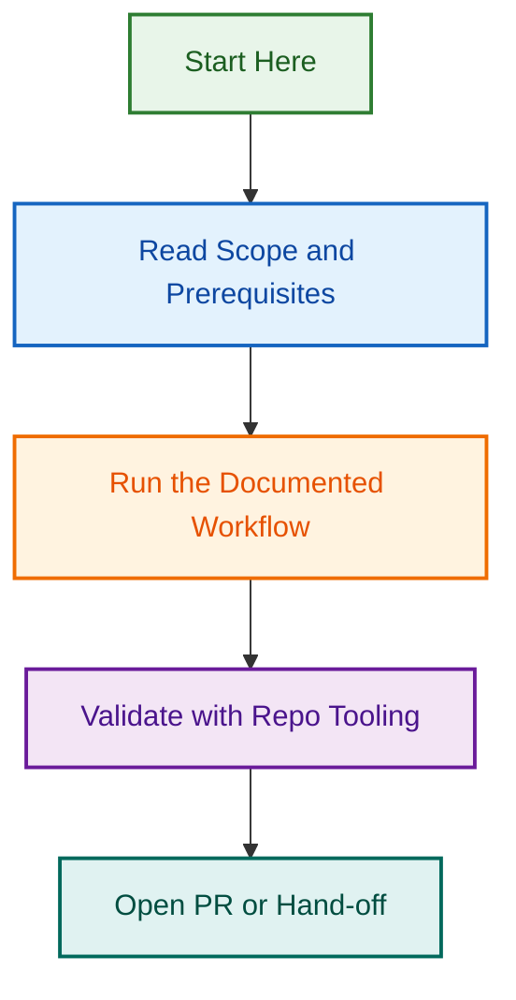

# GitHub Branch Rulesets Configuration

This directory contains version-controlled JSON definitions of the GitHub repository rulesets applied to the main protected branches: `main` and `develop`.

## Rulesets Overview

### 1. `develop` Branch Ruleset ([develop.ruleset.json](./develop.ruleset.json))

- **Target Ref:** `refs/heads/develop`
- **Enforcement:** Active
- **Key Rules:**
  - Deletion blocked
  - Non-fast-forward merges (force pushes) blocked
  - Pull request required before merging (1 approval, dismiss stale approvals, resolve conversations, respect Code Owners)
  - Required status checks:
    - `Validate PR Template / validate-pr-template`
    - `CI • Unified Checks (Lint, Test, Validate) / All Checks Passed`

### 2. `main` Branch Ruleset ([main.ruleset.json](./main.ruleset.json))

- **Target Ref:** `refs/heads/main`
- **Enforcement:** Active
- **Key Rules:**
  - Deletion blocked
  - Non-fast-forward merges (force pushes) blocked
  - Pull request required before merging (1 approval, dismiss stale approvals, resolve conversations, respect Code Owners)
  - Required status check: `validate-release-branch` (enforcing only release/hotfix merges)

## Importing and Applying Rulesets

Since GitHub rulesets are configured via the GitHub platform settings, these JSON files serve as version-controlled declarations.

To apply or update rulesets:

1. Navigating to the repository settings page on GitHub.
2. Select **Rules** -> **Rulesets** from the sidebar.
3. Import the ruleset definition using these JSON files, or configure them to match.

## Visual Workflow

