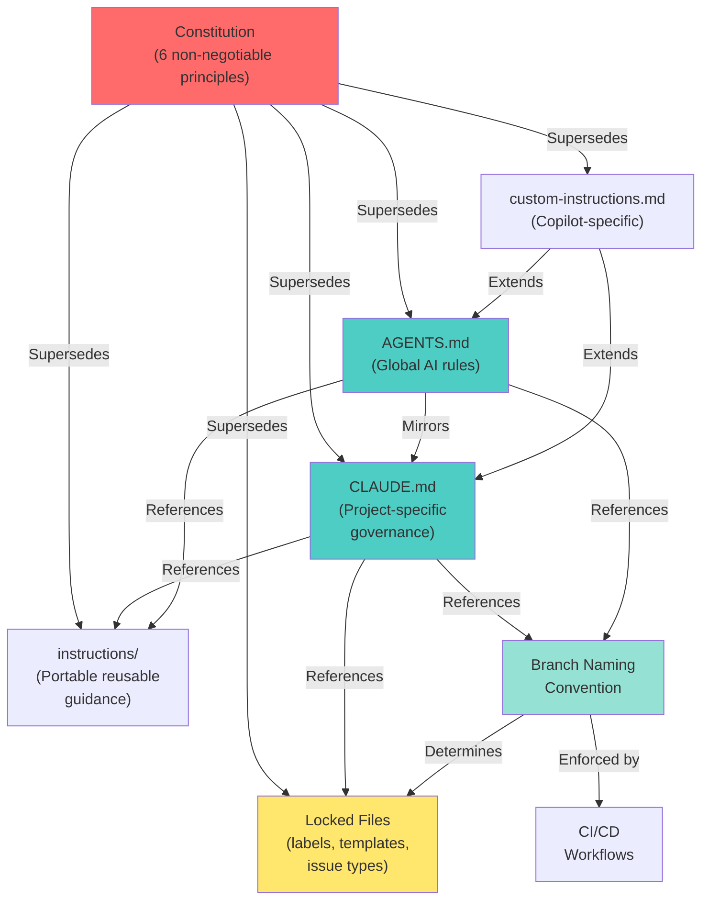

# Phase 1: Governance Data Model & Concepts

**Date**: 2026-09-14
**Status**: Phase 1 output
**Output**: Governance concepts, entities, and relationships

---

## Governance Concepts & Entities

### Core Governance Entities

#### 1. **Governance File**

**Definition**: Authoritative documentation of standards, conventions, and guidance for LightSpeed projects.

**Attributes**:

- **Name**: `CLAUDE.md` (project-specific) or `AGENTS.md` (global AI rules)
- **Authority Level**: Non-negotiable (cannot be overridden by downstream repos)
- **Maintenance**: Manual curation by @ashley (organization owner)
- **Audience**: AI agents, human contributors, GitHub Actions, CI/CD systems
- **Update Frequency**: Evolves with project needs; constitution changes require separate approval

**Relationships**:

- **Supersedes**: All downstream instruction files and local repository practices
- **References**: Constitution (`.specify/memory/constitution.md`), instruction files, external standards
- **Consumed By**: All 50+ downstream LightSpeed repositories

**Validation Rules**:

- No duplicate sections (single source of truth for each concept)
- No contradictory guidance (if two sections address same topic, they must align)
- All references to files/sections must point to valid locations
- UK English spelling throughout
- No hardcoded secrets or sensitive data
- WCAG 2.2 AA accessibility compliance (semantic markdown)

---

#### 2. **Governance Principle**

**Definition**: Non-negotiable, constitution-level rule that governs how governance files are created and maintained.

**Attributes**:

- **Name**: e.g., "Branch Naming Strategy is Non-Negotiable"
- **Type**: MUST (non-negotiable) or SHOULD (recommended but flexible)
- **Authority**: Constitution (supersedes all other documents)
- **Scope**: Organization-wide or repository-local
- **Impact**: How violations cascade through downstream systems

**Examples from Constitution**:

1. Organisation-Wide Governance Authority (MUST)
2. Curated Assets with Locked Governance (MUST)
3. Clear Asset Boundaries (No Duplication) (MUST)
4. Technology-Agnostic Guidance (MUST)
5. Branch Naming Strategy is Non-Negotiable (MUST)
6. UK English, Accessibility, Security Standards (MUST)

**Validation Rules**:

- Each principle identified by Roman numeral (I–VI)
- Rationale documented for each principle
- Violations identified clearly in audit findings

---

#### 3. **Locked Configuration File**

**Definition**: Critical governance configuration that requires explicit approval (@ashley) before changes.

**Attributes**:

- **File**: `.github/labels.yml`, `.github/issue-types.yml`, templates, or routing files
- **Purpose**: Define labels, issue types, PR templates, issue templates
- **Approval Authority**: @ashley (organization owner)
- **Change Request Process**: Open issue with specific tag (`[LABEL-UPDATE-REQUEST]`, etc.)
- **Last Updated**: 2026-09-09
- **Count**: 4 locked files (158 labels, 24 issue types, 26 issue templates, 19 PR templates)

**Validation Rules**:

- No unilateral changes to locked files
- All changes must go through approval process
- Impact analysis required (dependent systems affected)
- Testing plan required before deployment

---

#### 4. **Branch Naming Rule**

**Definition**: Convention that determines how Git branches must be named and how branch prefix maps to PR template assignment, GitHub Actions routing, and labeling.

**Attributes**:

- **Pattern**: `{type}/{scope}-{title}` (required format)
- **Type**: Enumerated set of 38 approved values, exported by `scripts/validation/validate-branch-name.cjs` (the single source of truth)
- **Forbidden Prefixes**: `claude/`, `copilot/`, `openai/` (MUST NOT be used)
- **Rationale**: Branch name determines PR template, automation routing, labeling consistency
- **Enforcement**: Pre-commit hook + branch validation workflow
- **Impact**: Incorrect names break PR routing, workflow assignment, and metrics

**Valid Types** (38 total):

- Basic: feat, fix, hotfix, release, refactor, chore, task
- Documentation: doc, docs, test, proto
- Performance/Quality: perf, ci, build, deps, security
- Specialized: design, a11y, ux, i18n, ops, ds, api, schema
- Content/Operations: telemetry, content, seo, config, migrate, qa, uat
- Governance: audit, codex, revert, research
- Planning/Automation: aiops, automation, epic

**Validation Rules**:

- Every branch must match `{type}/{scope}-{title}` pattern
- Type must be from approved enumerated set
- Forbidden prefixes never used (even for internal/test branches)
- Scope and title use hyphens (never underscores or spaces)

---

#### 5. **Portable Instruction File**

**Definition**: Reusable, technology-agnostic guidance stored in the repository's top-level `instructions/` directory and suitable for use by other repositories.

**Consolidated files (exactly 5)**:

- `instructions/languages.instructions.md`
- `instructions/documentation-formats.instructions.md`
- `instructions/quality-assurance.instructions.md`
- `instructions/automation.instructions.md`
- `instructions/community-standards.instructions.md`

**Supporting files (not part of the consolidated-file count)**:

- `instructions/coding-standards.instructions.md`
- `instructions/file-organisation.instructions.md`
- `instructions/branch-naming.instructions.md`
- `instructions/linting.instructions.md`
- `instructions/instructions.instructions.md`

**Validation Rules**:

- Validate a portable reference against the exact top-level `instructions/` path.
- Never count supporting files among the five consolidated files.
- Keep the guidance technology-agnostic and do not duplicate it in CLAUDE.md or AGENTS.md.
- Follow the frontmatter contract in `instructions/instructions.instructions.md`.

#### 6. **Repository-Local Instruction File**

**Definition**: Guidance whose contract is specific to this repository and whose canonical location is `.github/instructions/`.

**Audited reference inventory**:

- `.github/instructions/branch-naming.instructions.md`
- `.github/instructions/coding-standards.instructions.md`
- `.github/instructions/file-organisation.instructions.md`
- `.github/instructions/plugin-structure.instructions.md`

**Validation Rules**:

- Resolve each reference within `.github/instructions/`; a same-named top-level portable file does not satisfy the repository-local reference.
- Record an explicit migration destination when a repository-local reference is intentionally replaced by a portable file.
- Keep repository-specific assumptions out of the top-level portable contract.

---

#### 7. **Governance Conflict**

**Definition**: Contradiction, ambiguity, or inconsistency between governance files that causes confusion or automation failures.

**Attributes**:

- **Type**: Duplication, contradiction, broken reference, ambiguous guidance, scope confusion
- **Severity**: CRITICAL (blocks automation), HIGH (confuses readers), MEDIUM (technical debt), LOW (style issue)
- **Affected Components**: CLAUDE.md, AGENTS.md, instruction files, or cross-file

**Examples**:

- Duplicate section (Label Creation Governance appears twice)
- Contradictory guidance (branch naming guidance in both CLAUDE.md and AGENTS.md with different emphasis)
- Broken reference (documentation links to non-existent files)
- Scope confusion (repository structure rules in AGENTS.md instead of governance files)
- Ambiguous wording (vague adjectives without measurable criteria)

**Validation Rules**:

- Each conflict identified with unique ID (e.g., DUP-001, REF-001)
- Severity assigned based on impact
- Resolution approach documented
- Success criteria defined for fix

---

#### 7. **AI Agent Governance Context**

**Definition**: Specific guidance that applies to AI agents (Claude Code, Copilot, or other AI tools) operating in this repository.

**Attributes**:

- **Location**: AGENTS.md (primary), CLAUDE.md (Claude-specific)
- **Scope**: Rules about how AI agents should behave when contributing code, reviewing PRs, creating issues
- **Constraints**: Must not contradict governance principles; must be achievable by AI agents
- **Examples**: Branch naming enforcement, label validation, reference checking, accessibility standards

**Content**:

- Coding standards (UK English, WordPress standards, ESLint/Prettier)
- Documentation standards (WCAG 2.2 AA, semantic HTML)
- Automation rules (agent behavior, when to create issues/PRs)
- Governance enforcement (branch naming, label application, template routing)

**Validation Rules**:

- All AI rules must align with constitution principles
- Rules must be technology-agnostic (apply to all AI tools)
- Rules must be objective and verifiable (not subjective)

---

### Governance Relationships

---

## Validation Scenarios

### Scenario 1: Reference Validation

**Goal**: Ensure all references in governance files point to valid locations.

**Test Steps**:

1. Extract all file path references from CLAUDE.md and AGENTS.md
2. Verify each path exists in repository or is documented as migrated
3. For each documented reference (e.g., "See X for details"), verify referenced section exists and is relevant
4. Check for broken links or outdated paths

**Acceptance Criteria**:

- ✅ 100% of file path references validated
- ✅ Broken links identified and documented
- ✅ Migration debt documented with status
- ✅ All references use consistent anchor format

---

### Scenario 2: Duplication Detection

**Goal**: Ensure no duplicate or near-duplicate sections exist.

**Test Steps**:

1. Scan CLAUDE.md and AGENTS.md for content overlap
2. Identify sections that address the same topic with similar wording
3. For each duplicate, verify only one is authoritative
4. Verify consolidated sections retain all unique information

**Acceptance Criteria**:

- ✅ No duplicate sections remain
- ✅ Each topic has single source of truth
- ✅ AGENTS.md references CLAUDE.md where appropriate (vs. duplicating)
- ✅ No information loss in consolidation

---

### Scenario 3: Conflict Detection

**Goal**: Ensure guidance is consistent across files (no contradictions).

**Test Steps**:

1. Identify overlapping topics across CLAUDE.md, AGENTS.md, instruction files
2. Compare guidance for alignment
3. For conflicts, identify which file is authoritative
4. Verify technology-agnostic guidance remains universal

**Acceptance Criteria**:

- ✅ No contradictory guidance
- ✅ Clear authority hierarchy (constitution > governance files > instruction files)
- ✅ Consistent terminology across files
- ✅ No project-specific guidance in organization-wide files

---

### Scenario 4: Branch Naming Enforcement

**Goal**: Verify branch naming rules are clear, actionable, and enforced.

**Test Steps**:

1. Review CLAUDE.md branch naming section for clarity
2. Verify all 38 allowed types are documented with examples
3. Confirm forbidden prefixes are clearly marked and explained
4. Check that existing branches in repository comply or are documented as violations

**Acceptance Criteria**:

- ✅ 38 branch types clearly documented with examples
- ✅ Forbidden prefixes highlighted with explanation
- ✅ Validation command provided and working
- ✅ Violations (if found) documented with remediation plan

---

### Scenario 5: Specification-First Workflow

**Goal**: Verify governance files document the spec-first workflow (branch → spec → draft PR → review → merge).

**Test Steps**:

1. Review CLAUDE.md for workflow documentation
2. Verify branch creation, spec writing, PR creation phases are documented
3. Confirm success criteria for each phase are clear
4. Check that workflow aligns with constitutional principle

**Acceptance Criteria**:

- ✅ Workflow phases clearly documented
- ✅ Entry/exit criteria for each phase defined
- ✅ When to create specs vs. PRs explicitly stated
- ✅ Workflow aligned with constitution principle (Specification-First Process)

---

## Concepts Ready for Implementation

✅ Governance entities clearly defined (7 primary entities)
✅ Relationships documented (governance hierarchy established)
✅ Validation scenarios specified (5 concrete test scenarios)
✅ Success criteria measurable (100% reference validation, zero duplicates, etc.)
✅ Data model aligns with constitution principles

**Ready for Phase 2**: Task decomposition with `/speckit-tasks`
