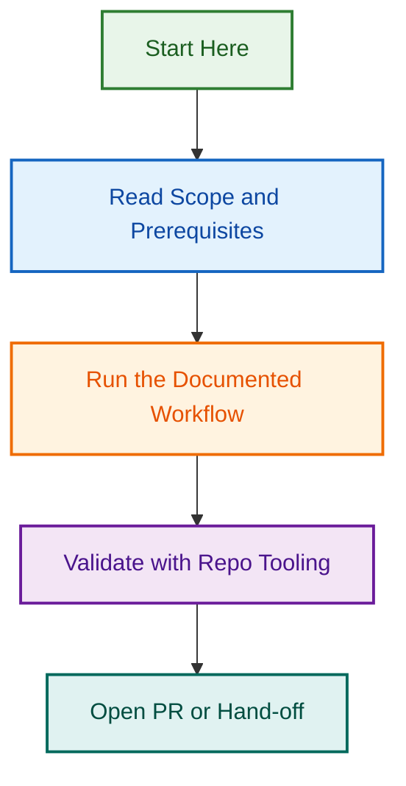

# Awesome GitHub Site

Public website for the `Awesome GitHub` project and its WCEU 2026 talk.

## Scope

- Home
- WCEU 2026 talk
- WCEU 2026 slides index
- WCEU 2026 slide subpages
- Why this exists
- References

## Behaviour

- Uses GitHub Pages-friendly static output.
- Includes a light and dark mode switcher in the shared shell.
- Keeps the header and footer reusable across all pages.
- Scans the full `wceu-2026` tree to build slide pages, accessibility notes, and references.

## Local development

```bash
cd website
npm install
npm run dev
```

## Build

```bash
cd website
npm run build
```

## Visual Workflow


