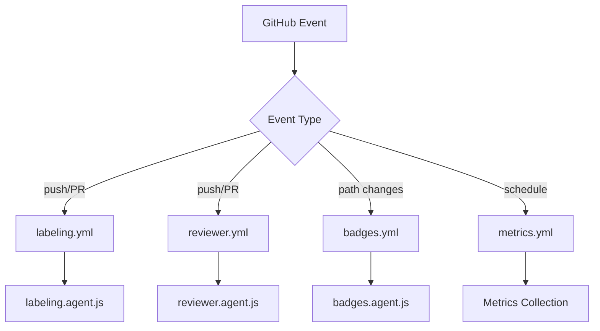

This directory contains all GitHub Actions workflows that power LightSpeed's repository automation, governance, and continuous integration/deployment processes.

This directory contains all GitHub Actions workflows that power LightSpeed's repository automation, governance, and continuous integration/deployment processes.

## 🔄 Active Workflows

### Core Agent-Driven Workflows

| Workflow | Triggers | Agent(s) Used | Description |
|----------|----------|---------------|-------------|
| **[labeling.yml](./labeling.yml)** | `push`, `pull_request`, `issues`, `opened`, `synchronize`, `labeled`, `unlabeled` | [`labeling.agent.js`](../agents/labeling.agent.js) | Unified labeling system for issues and PRs with automated status enforcement |
| **[reviewer.yml](./reviewer.yml)** | `pull_request` on `develop`, `opened`, `synchronize` | [`reviewer.agent.js`](../agents/reviewer.agent.js) | Automated code review, feedback, and quality checks |
| **[planner.yml](./planner.yml)** | `push`, `pull_request` on `develop` | [`planner.agent.js`](../agents/planner.agent.js) | Project planning automation and issue organization |
| **[badges.yml](./badges.yml)** | Path changes to badges, `workflow_dispatch` | [`badges.agent.js`](../agents/badges.agent.js) | Repository badge status updates and maintenance |
| **[manage-readmes.yml](./manage-readmes.yml)** | Path changes to README files, `workflow_dispatch` | [`manage-readmes.agent.js`](../agents/manage-readmes.agent.js) | Automated README generation and consistency |
| **[header-footer.yml](./header-footer.yml)** | File changes to documentation | [`header-footer.agent.js`](../agents/header-footer.agent.js) | Documentation header/footer consistency |
| **[release.yml](./release.yml)** | Tags, `workflow_dispatch` | [`release.agent.js`](../agents/release.agent.js) | Automated release processes and changelog generation |
| **[project-meta-sync.yml](./project-meta-sync.yml)** | `schedule`, `workflow_dispatch` | Internal sync logic | Cross-repository metadata synchronization |

### Quality & Testing Workflows

| Workflow | Triggers | Purpose | Agent Integration |
|----------|----------|---------|-------------------|
| **[lint.yml](./lint.yml)** | `push`, `pull_request` | Code quality enforcement and linting | Supports [`linting.agent.js`](../agents/linting.agent.js) |
| **[jest-test-audit.yml](./jest-test-audit.yml)** | `push`, `pull_request` | Execute Jest tests for agents and utilities | Runs all agent test suites in [`../agents/__tests__/`](../agents/__tests__/) |
| **[changelog.yml](./changelog.yml)** | `push` to `main`, PR merges | Automated changelog generation | Works with release automation |

### Repository Management

| Workflow | Triggers | Purpose |
|----------|----------|---------|
| **[metrics.yml](./metrics.yml)** | `schedule`, `workflow_dispatch` | Repository health and performance metrics |
| **[all-contributors-update.yml](./all-contributors-update.yml)** | Contributor changes | Maintain contributor recognition |

## 📋 Workflow Categories

### 🤖 Agent-Driven Automation

These workflows directly execute agents from the [`../agents/`](../agents/) directory:

- `labeling.yml` → `labeling.agent.js`
- `reviewer.yml` → `reviewer.agent.js`
- `planner.yml` → `planner.agent.js`
- `badges.yml` → `badges.agent.js`
- `manage-readmes.yml` → `manage-readmes.agent.js`
- `header-footer.yml` → `header-footer.agent.js`
- `release.yml` → `release.agent.js`

### 🔍 Quality Assurance

- `lint.yml` - Code quality and standards enforcement
- `jest-test-audit.yml` - Agent and utility testing
- `changelog.yml` - Release documentation

### 📊 Operations & Metrics

- `metrics.yml` - Repository analytics
- `project-meta-sync.yml` - Cross-repository consistency
- `all-contributors-update.yml` - Community recognition

## 🎯 Trigger Events

### Common Trigger Patterns

| Event | Workflows Triggered | Purpose |
|-------|-------------------|---------|
| **`push` to `develop`** | `reviewer.yml`, `planner.yml`, `lint.yml` | Quality checks and automation |
| **`pull_request`** | `labeling.yml`, `reviewer.yml`, `lint.yml`, `jest-test-audit.yml` | PR validation and automation |
| **`issues` events** | `labeling.yml` | Issue management and labeling |
| **File path changes** | `badges.yml`, `manage-readmes.yml`, `header-footer.yml` | Content consistency |
| **`workflow_dispatch`** | Most workflows | Manual execution |
| **`schedule`** | `metrics.yml`, `project-meta-sync.yml` | Periodic maintenance |

### Event-Agent Mapping

## 📝 Workflow Documentation

### Instructions & Guidelines

Workflow development follows standards defined in:

| Instruction File | Purpose |
|------------------|---------|
| [workflows.instructions.md](../instructions/workflows.instructions.md) | General workflow authoring standards |
| [agents.instructions.md](../instructions/agents.instructions.md) | Agent integration guidelines |
| [automation-testing.instructions.md](../instructions/automation-testing.instructions.md) | Testing workflow components |
| [ci-cd.instructions.md](../instructions/ci-cd.instructions.md) | CI/CD best practices |

### Agent-Specific Documentation

| Agent | Workflow | Instructions |
|-------|----------|-------------|
| `labeling.agent.js` | `labeling.yml` | [labeling.instructions.md](../instructions/agents/labeling.instructions.md) |
| `reviewer.agent.js` | `reviewer.yml` | [reviewer.instructions.md](../instructions/agents/reviewer.instructions.md) |
| `planner.agent.js` | `planner.yml` | [planner.instructions.md](../instructions/agents/planner.instructions.md) |
| `release.agent.js` | `release.yml` | [release.instructions.md](../instructions/agents/release.instructions.md) |

## 🧪 Testing & Validation

### Workflow Testing

- **Syntax validation**: All workflows are validated with `actionlint`
- **Integration testing**: Workflows are tested in staging environments
- **Agent testing**: Agent logic is tested via [`jest-test-audit.yml`](./jest-test-audit.yml)

### Test Coverage

- Agent unit tests: [`../agents/__tests__/`](../agents/__tests__/)
- Workflow integration tests: Automated on PR creation
- End-to-end testing: Manual validation for complex workflows

## 📚 Related Resources

### Configuration Files

| File | Purpose | Usage |
|------|---------|-------|
| [../labels.yml](../labels.yml) | Canonical label definitions | Used by `labeling.yml` |
| [../issue-types.yml](../issue-types.yml) | Issue type mappings | Used by labeling automation |
| [../labeler.yml](../labeler.yml) | PR labeling rules | Used by `labeling.yml` |
| [../project-pr-labeler.yml](../project-pr-labeler.yml) | Project-specific PR labels | Additional labeling context |

### Documentation References

- **[Automation Governance](../AUTOMATION_GOVERNANCE.md)** - Workflow policies and standards
- **[Branching Strategy](../BRANCHING_STRATEGY.md)** - Git workflow integration
- **[Custom Instructions](../custom-instructions.md)** - AI and automation guidelines

### Archived Workflows

Historical and deprecated workflows are stored in [`archived/`](./archived/) with documentation:

- [archived/README.md](./archived/README.md) - Archive index and migration notes

## 🚀 Getting Started

### Creating a New Workflow

1. Follow the [workflows.instructions.md](../instructions/workflows.instructions.md) guidelines
2. Reference existing workflows for patterns and structure
3. Include proper permissions, caching, and error handling
4. Document the workflow purpose and triggers
5. Add appropriate tests and validation

### Workflow Development Standards

- **Security**: Use minimal permissions and secure secrets handling
- **Efficiency**: Include caching and concurrency controls
- **Reliability**: Add error handling and retry logic
- **Documentation**: Clear naming and comprehensive comments
- **Testing**: Validate syntax and integration behavior

### Integration with Agents

For agent-driven workflows:

1. Place agent code in [`../agents/`](../agents/)
2. Create corresponding `.agent.md` documentation
3. Add tests in [`../agents/__tests__/`](../agents/__tests__/)
4. Reference agent in workflow YAML
5. Update this documentation

---

> **Note**: This directory is actively maintained and automatically updated by our automation systems. For questions or issues, reference the [workflows.instructions.md](../instructions/workflows.instructions.md) or open an issue with the `area:ci` label.