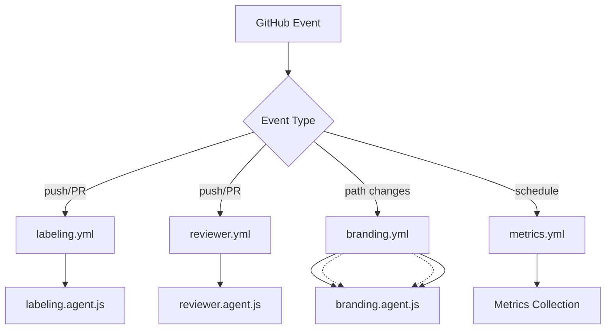

This directory contains all GitHub Actions workflows that power LightSpeed's repository automation, governance, and continuous integration/deployment processes.

This directory contains all GitHub Actions workflows that power LightSpeed's repository automation, governance, and continuous integration/deployment processes.

## 🔄 Active Workflows

> **Status**: All workflows validated and standardized as of 2025-10-24
>
> - ✅ All workflows use standardized action versions (checkout@v4, setup-node@v4)
> - ✅ All workflows have explicit permissions declarations
> - ✅ Branch strategy aligned with develop → main model
> - ✅ Deprecated workflows archived
> - ✅ New modular scripts CI/CD pipeline added (2025-11-18)

### Core Agent-Driven Workflows (8)

| Workflow | Triggers | Agent(s) Used | Description | Status |
|----------|----------|---------------|-------------|--------|
| **[labeling.yml](./labeling.yml)** | `push`, `pull_request`, `issues`, multiple event types | [`labeling.agent.js`](../agents/labeling.agent.js) | Unified labeling system for issues and PRs with automated status enforcement | ✅ Active |
| **[reviewer.yml](./reviewer.yml)** | `pull_request` on `develop`, `opened`, `synchronize` | [`reviewer.agent.js`](../agents/reviewer.agent.js) | Automated code review, feedback, and quality checks | ✅ Active |
| **[planner.yml](./planner.yml)** | `push`, `pull_request` on `develop` | [`planner.agent.js`](../agents/planner.agent.js) | Project planning automation and issue organization | ✅ Active |
| **[branding.yml](./branding.yml)** | File changes to docs, badges, headers/footers, weekly schedule | [`branding.agent.js`](../agents/branding.agent.js) | Unified header, footer, badge automation | ✅ Active |
| **[badges.yml](./badges.yml)** | Path changes to badges, `workflow_dispatch` | [`badges.agent.js`](../agents/badges.agent.js) | Repository badge status updates | ⚠️ Deprecated (use branding.yml) |
| **[manage-readmes.yml](./manage-readmes.yml)** | Path changes to README files, `workflow_dispatch` | [`manage-readmes.agent.js`](../agents/manage-readmes.agent.js) | Automated README generation and consistency | ✅ Active |
| **[header-footer.yml](./header-footer.yml)** | File changes to documentation | [`header-footer.agent.js`](../agents/header-footer.agent.js) | Documentation header/footer consistency | ⚠️ Deprecated (use branding.yml) |
| **[release.yml](./release.yml)** | Tags, `workflow_dispatch` | [`release.agent.js`](../agents/release.agent.js) | Automated release processes and changelog generation | ✅ Active |

### Quality & Validation Workflows (8)

| Workflow | Triggers | Purpose | Status |
|----------|----------|---------|--------|
| **[quality-gates.yml](./quality-gates.yml)** | `pull_request` to `develop`, `workflow_dispatch` | Comprehensive quality validation before merge | ✅ Active |
| **[modular-scripts-pipeline.yml](./modular-scripts-pipeline.yml)** | `push`, `pull_request`, script changes, `workflow_dispatch` | Multi-stage CI/CD pipeline for modular shell scripts with quality gates, security scanning, and deployment automation | ✅ Active |
| **[lint.yml](./lint.yml)** | `push`, `pull_request` to `develop` | Code quality enforcement and linting | ✅ Active |
| **[ci.yml](./ci.yml)** | `push`, `pull_request` to `develop` | Continuous integration checks | ✅ Active |
| **[jest-test-audit.yml](./jest-test-audit.yml)** | `push`, `pull_request`, `workflow_dispatch` | Jest test coverage audit | ✅ Active |
| **[changelog.yml](./changelog.yml)** | `push`, `pull_request` to `develop` | Changelog validation and generation | ✅ Active |
| **[frontmatter-validation.yml](./frontmatter-validation.yml)** | `push` to `develop`/`claude/**`, `pull_request`, `workflow_dispatch` | Frontmatter schema validation | ✅ Active |
| **[collections-indexer.yml](./collections-indexer.yml)** | `pull_request` to `develop` | Collections index building and validation | ✅ Active |

### AIOps & Automation Workflows (5)

| Workflow | Triggers | Purpose | Status |
|----------|----------|---------|--------|
| **[aiops-frontmatter.yml](./aiops-frontmatter.yml)** | `pull_request` to prompts/chatmodes/instructions | Validate frontmatter presence in AI files | ✅ Active |
| **[aiops-index-drift.yml](./aiops-index-drift.yml)** | `pull_request` to collections/prompts/chatmodes | Check index files include all leaves | ✅ Active |
| **[aiops-link-check.yml](./aiops-link-check.yml)** | `pull_request` to docs | Check for broken links | ✅ Active |
| **[aiops-secrets-scan.yml](./aiops-secrets-scan.yml)** | `pull_request` to `.github`/docs | Scan for secrets and PII | ✅ Active |
| **[label-sync.yml](./label-sync.yml)** | `push`, `schedule`, `workflow_dispatch` | Organization-wide label synchronization | ✅ Active |

### Label & Project Management (2)

| Workflow | Triggers | Purpose | Status |
|----------|----------|---------|--------|
| **[project-meta-sync.yml](./project-meta-sync.yml)** | `push`, `issues`, `pull_request` events | Project board metadata synchronization | ✅ Active |
| **[all-contributors-update.yml](./all-contributors-update.yml)** | PR merge events | Update contributors recognition table | ✅ Active |

### Metrics & Reporting (4)

| Workflow | Triggers | Purpose | Status |
|----------|----------|---------|--------|
| **[metrics.yml](./metrics.yml)** | Weekly schedule, `workflow_dispatch` | Repository health and performance metrics | ✅ Active |
| **[frontmatter-metrics.yml](./frontmatter-metrics.yml)** | Weekly schedule, `workflow_dispatch` | Frontmatter usage and compliance metrics | ✅ Active |
| **[weekly-metrics.yml](./weekly-metrics.yml)** | Weekly schedule, `workflow_dispatch` | Comprehensive weekly health reporting | ✅ Active |
| **[ci-metrics.yml](./ci-metrics.yml)** | On checkout | CI/CD performance metrics | ✅ Active |
| **[release-prep.yml](./release-prep.yml)** | Weekly schedule, `workflow_dispatch` | Release preparation and readiness checks | ✅ Active |

## 📋 Workflow Categories

### 🤖 Agent-Driven Automation

These workflows directly execute agents from the [`../agents/`](../agents/) directory:

- `labeling.yml` → `labeling.agent.js`
- `reviewer.yml` → `reviewer.agent.js`
- `planner.yml` → `planner.agent.js`
- `branding.yml` → `branding.agent.js`
- `manage-readmes.yml` → `manage-readmes.agent.js`
- `release.yml` → `release.agent.js`

### 🔍 Quality Assurance

- `lint.yml` - Code quality and standards enforcement
- `jest-test-audit.yml` - Agent and utility testing
- `changelog.yml` - Release documentation

### 📊 Operations & Metrics

- `metrics.yml` - Repository analytics
- `project-meta-sync.yml` - Cross-repository consistency
- `all-contributors-update.yml` - Community recognition

### 🚀 Modular Scripts CI/CD Pipeline

The **[modular-scripts-pipeline.yml](./modular-scripts-pipeline.yml)** workflow provides comprehensive continuous integration and deployment for shell scripts and modular components.

#### Pipeline Stages

1. **Static Analysis** - ShellCheck validation, markdown linting, quality score calculation
2. **Testing** - Automated test execution and coverage reporting
3. **Quality Gates** - Threshold-based quality and security validation
4. **Documentation** - Automatic documentation updates
5. **Pipeline Summary** - Comprehensive reporting and metrics

#### Key Features

- **Multi-stage validation**: Progressive quality checks with fail-fast behaviour
- **Quality scoring**: Automated calculation of code quality metrics
- **Security scanning**: Detection of common security issues in shell scripts
- **PR commenting**: Automatic quality reports on pull requests
- **Deployment readiness**: Validation before deployment to staging/production
- **Configurable thresholds**: Quality gates with environment-specific thresholds

#### Supporting Scripts

- **[calculate-quality-score.sh](../../scripts/maintenance/calculate-quality-score.sh)** - Quality metrics calculation
- **[deploy-to-staging.sh](../../scripts/deployment/deploy-to-staging.sh)** - Staging deployment automation
- **[automated-rollback.sh](../../scripts/deployment/automated-rollback.sh)** - Rollback for failed deployments

#### Environment Variables

- `QUALITY_THRESHOLD`: Minimum quality score required (default: 80)
- `SECURITY_THRESHOLD`: Security severity threshold (default: high)
- `NODE_VERSION`: Node.js version for CI (default: 20)
- `SHELLCHECK_VERSION`: ShellCheck version (default: 0.9.0)

#### Quality Metrics

The pipeline calculates composite quality scores based on:

- **Code quality** (25%): ShellCheck compliance
- **Test coverage** (30%): Unit and integration test coverage
- **Documentation** (20%): Documentation completeness
- **Security** (15%): Security scan results
- **Performance** (10%): Performance benchmarks

## 🎯 Trigger Events

### Common Trigger Patterns

| Event | Workflows Triggered | Purpose |
|-------|-------------------|---------|
| **`push` to `develop`** | `reviewer.yml`, `planner.yml`, `lint.yml` | Quality checks and automation |
| **`pull_request`** | `labeling.yml`, `reviewer.yml`, `lint.yml`, `jest-test-audit.yml` | PR validation and automation |
| **`issues` events** | `labeling.yml` | Issue management and labeling |
| **File path changes** | `badges.yml`, `manage-readmes.yml`, `header-footer.yml` | Content consistency |
| **`workflow_dispatch`** | Most workflows | Manual execution |
| **`schedule`** | `metrics.yml`, `project-meta-sync.yml` | Periodic maintenance |

### Event-Agent Mapping

## 📝 Workflow Documentation

### Instructions & Guidelines

Workflow development follows standards defined in:

| Instruction File | Purpose |
|------------------|---------|
| [workflows.instructions.md](../instructions/workflows.instructions.md) | General workflow authoring standards |
| [agents.instructions.md](../instructions/agents.instructions.md) | Agent integration guidelines |
| [automation-testing.instructions.md](../instructions/automation-testing.instructions.md) | Testing workflow components |
| [ci-cd.instructions.md](../instructions/ci-cd.instructions.md) | CI/CD best practices |

### Agent-Specific Documentation

| Agent | Workflow | Instructions |
|-------|----------|-------------|
| `labeling.agent.js` | `labeling.yml` | [labeling.instructions.md](../instructions/agents/labeling.instructions.md) |
| `reviewer.agent.js` | `reviewer.yml` | [reviewer.instructions.md](../instructions/agents/reviewer.instructions.md) |
| `planner.agent.js` | `planner.yml` | [planner.instructions.md](../instructions/agents/planner.instructions.md) |
| `release.agent.js` | `release.yml` | [release.instructions.md](../instructions/agents/release.instructions.md) |

## 🧪 Testing & Validation

### Workflow Testing

- **Syntax validation**: All workflows are validated with `actionlint`
- **Integration testing**: Workflows are tested in staging environments
- **Agent testing**: Agent logic is tested via [`jest-test-audit.yml`](./jest-test-audit.yml)

### Test Coverage

- Agent unit tests: [`../agents/__tests__/`](../agents/__tests__/)
- Workflow integration tests: Automated on PR creation
- End-to-end testing: Manual validation for complex workflows

## 📚 Related Resources

### Configuration Files

| File | Purpose | Usage |
|------|---------|-------|
| [../labels.yml](../labels.yml) | Canonical label definitions | Used by `labeling.yml` |
| [../issue-types.yml](../issue-types.yml) | Issue type mappings | Used by labeling automation |
| [../labeler.yml](../labeler.yml) | PR labeling rules | Used by `labeling.yml` |
| [../project-pr-labeler.yml](../project-pr-labeler.yml) | Project-specific PR labels | Additional labeling context |

### Documentation References

- **[Automation Governance](../AUTOMATION_GOVERNANCE.md)** - Workflow policies and standards
- **[Branching Strategy](../BRANCHING_STRATEGY.md)** - Git workflow integration
- **[Custom Instructions](../custom-instructions.md)** - AI and automation guidelines

### Archived Workflows

Historical and deprecated workflows are stored in [`archived/`](./archived/) with documentation:

- [archived/README.md](./archived/README.md) - Archive index and migration notes

**Recently Archived (2025-10-24):**

- `labeler.yml` - Replaced by unified `labeling.yml` workflow
- `labeling.yml.old` - Removed backup file

---

## ✅ Workflow Validation & Standards

All workflows have been validated and standardized to ensure:

### Action Version Standards

- **`actions/checkout`**: v4
- **`actions/setup-node`**: v4
- **`actions/github-script`**: v7
- **`actions/labeler`**: v5
- **`actions/upload-artifact`**: v4

### Security & Permissions

All workflows include explicit `permissions:` blocks following least-privilege principles:

- `contents: read` - Default for most workflows
- `pull-requests: write` - For PR commenting/labeling
- `issues: write` - For issue management
- `discussions: write` - For discussion management (where needed)

### Branch Strategy Compliance

Workflows follow the **develop → main** branching model:

- **Validation/CI workflows**: Trigger on `develop` and PRs to `develop`
- **Release workflows**: Trigger on `main` and tags
- **Claude branches**: Some workflows include `claude/**` for automated agent work

### Error Handling

- Concurrency controls added where appropriate
- Proper error handling instead of `|| true` suppression
- Clear failure messages and reporting

### Recent Fixes (2025-10-24)

1. ✅ Standardized `actions/checkout` from v5 → v4 in `labeling.yml`
2. ✅ Added missing `permissions:` block to `reviewer.yml`
3. ✅ Added missing `permissions:` block to `planner.yml`
4. ✅ Added missing `permissions:` block to `frontmatter-validation.yml`
5. ✅ Removed `main` branch trigger from `frontmatter-validation.yml`
6. ✅ Archived deprecated `labeler.yml` (replaced by `labeling.yml`)
7. ✅ Removed `labeling.yml.old` backup file

## 🚀 Getting Started

### Creating a New Workflow

1. Follow the [workflows.instructions.md](../instructions/workflows.instructions.md) guidelines
2. Reference existing workflows for patterns and structure
3. Include proper permissions, caching, and error handling
4. Document the workflow purpose and triggers
5. Add appropriate tests and validation

### Workflow Development Standards

- **Security**: Use minimal permissions and secure secrets handling
- **Efficiency**: Include caching and concurrency controls
- **Reliability**: Add error handling and retry logic
- **Documentation**: Clear naming and comprehensive comments
- **Testing**: Validate syntax and integration behavior

### Integration with Agents

For agent-driven workflows:

1. Place agent code in [`../agents/`](../agents/)
2. Create corresponding `.agent.md` documentation
3. Add tests in [`../agents/__tests__/`](../agents/__tests__/)
4. Reference agent in workflow YAML
5. Update this documentation

---

> **Note**: This directory is actively maintained and automatically updated by our automation systems. For questions or issues, reference the [workflows.instructions.md](../instructions/workflows.instructions.md) or open an issue with the `area:ci` label.
