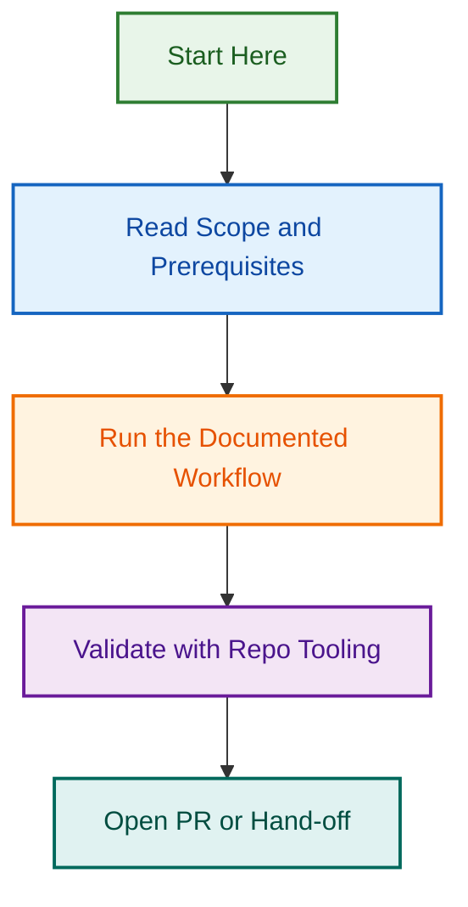

# .github Workflows Directory

This directory contains the GitHub Actions workflows that power CI/CD, automation, labeling, metrics collection, and community health for the LightSpeed organisation.

## Workflow Inventory

### CI & Quality

| Workflow | File | Trigger |
|---|---|---|
| Unified Checks (Lint, Test, Validate) | `checks.yml` | PR → develop, push → develop |
| Linting | `linting.yml` | PR → develop, push → develop |
| Testing | `testing.yml` | PR → develop, push → develop |
| Changelog Validation | `changelog-validate.yml` | PR → develop |
| Main Branch Guard | `main-branch-guard.yml` | PR → main |

### Template & PR Governance

| Workflow | File | Trigger |
|---|---|---|
| Validate PR Template | `validate-pr-template.yml` | pull_request_target (all) |
| Template Enforcement | `template-enforcement.yml` | push → develop, issues |

### Labeling & Triage

| Workflow | File | Trigger |
|---|---|---|
| Labeling Governance (Consolidated) | `labeling-governance.yml` | issues, pull_request (opened/edited/closed), discussion, push → develop, workflow_dispatch |
| Checklist Finalisation | `checklist-finalisation.yml` | issues, pull_request (closed/merged) |

### Automation & Agents

| Workflow | File | Trigger |
|---|---|---|
| Meta Agent (Frontmatter, Badges, Metrics) | `meta.yml` | PR/push → develop (md/yml paths), schedule (Mon 03:00) |
| Metadata Governance | `metadata-governance.yml` | issues, pull_request_target |
| Planner Agent | `planner.yml` | issues (opened), workflow_dispatch |
| Reviewer Agent | `reviewer.yml` | pull_request |
| Project Meta Sync | `project-meta-sync.yml` | issues, pull_request |
| Issue Create From Template | `issue-create-from-template.yml` | workflow_call, workflow_dispatch |
| Issues Workflow | `issues.yml` | issues |

### Metrics & Reporting

| Workflow | File | Trigger |
|---|---|---|
| Frontmatter Metrics | `metrics.yml` | schedule (Mon 06:00), workflow_dispatch |
| Weekly Metrics Summary | `metrics-summary.yml` | schedule (Mon 09:00), workflow_dispatch |
| Reporting | `reporting.yml` | schedule (weekly), workflow_dispatch |

### README & Documentation

| Workflow | File | Trigger |
|---|---|---|
| README Regeneration | `readme-regen.yml` | push → develop (md paths), pull_request |
| README Update | `readme-update.yml` | push → develop |
| README Audit | `readme-audit.yml` | schedule (weekly), workflow_dispatch |
| Awesome GitHub Site | `awesome-github-site.yml` | push → main, workflow_dispatch |

### Release & Lifecycle

| Workflow | File | Trigger |
|---|---|---|
| Release | `release.yml` | push → main (tags), workflow_dispatch |
| Changelog Auto Update | `changelog-auto-update.yml` | pull_request (merged) |
| Project Archival | `project-archival.yml` | schedule (weekly), workflow_dispatch |

## Trigger Summary

| Trigger type | Workflows |
|---|---|
| `pull_request` / `pull_request_target` | checks, linting, testing, validate-pr-template, labeling-governance, reviewer, readme-regen, changelog-validate, metadata-governance |
| `push → develop` | checks, linting, testing, meta, labeling-governance, readme-regen, readme-update, template-enforcement |
| `push → main` | main-branch-guard, release, awesome-github-site |
| `issues` | labeling-governance, planner, issues, template-enforcement, project-meta-sync, metadata-governance, checklist-finalisation |
| `schedule` | meta (Mon 03:00), metrics (Mon 06:00), metrics-summary (Mon 09:00), reporting, readme-audit, project-archival |
| `workflow_dispatch` | most workflows (manual trigger) |

## Configuration Files

Workflow behaviour is driven by:

- **`.github/labeler.yml`** — label matching rules for PR path-based labeling
- **`.github/labels.yml`** — canonical label definitions (160+ labels)
- **`.github/issue-types.yml`** — org-wide canonical issue type registry
- **`.github/metrics/metrics.config.json`** — frontmatter metrics thresholds and config
- **`.github/schemas/`** — JSON schemas for frontmatter and config validation
- **`.github/PULL_REQUEST_TEMPLATE/config.yml`** — branch-prefix → PR template routing

## Related Documentation

- [Automation Governance](../../docs/AUTOMATION.md)
- [Labeling System](../labels.yml)
- [Metrics Directory](../metrics/README.md)
- [AGENTS.md](../../AGENTS.md) — AI agent governance

---
## Visual Workflow

