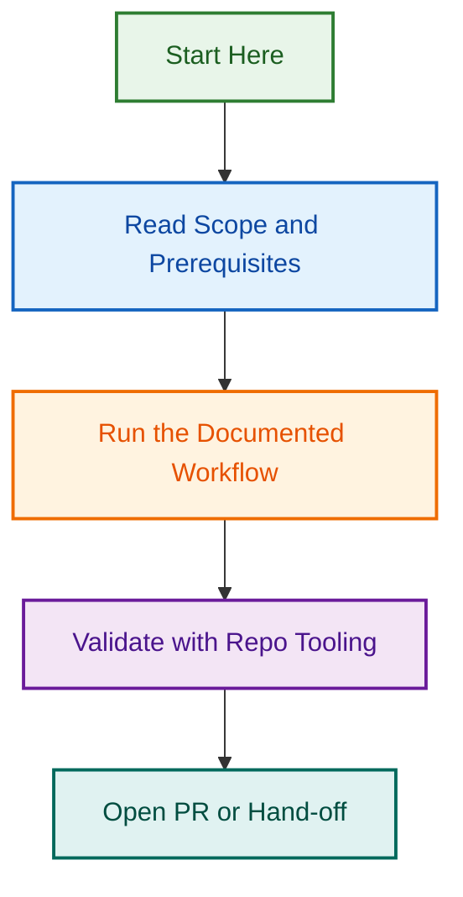

# Portable Schemas

This folder owns portable schema files for AI assets, plugin metadata, and shared validation contracts that should travel outside the `.github` control plane.

## Ownership

- Owns JSON Schema, YAML schema, and frontmatter schema contracts used by portable agents, instructions, skills, hooks, plugins, and workflows.
- Does not own GitHub-native schemas that only validate this repository's community-health files.
- Keeps schemas small, explicit, and tied to active validation commands.

## Structure

| Path | Purpose |
| --- | --- |
| `.schemas/*.schema.json` | Portable JSON Schema files. |
| `.schemas/*.schema.yaml` | Portable YAML schema files, when JSON is not practical. |
| `.schemas/README.md` | This ownership index. |

## Migration rules

- Move schemas here only when the migration map marks them as portable.
- Leave repo-only validation schemas under `.github/schemas/` until a specific migration issue moves them.
- Do not mix schema syntax fixes with path migration unless the assigned issue explicitly covers both.
- Keep schema references relative to the portable source tree, not hard-coded to `.github`.

## Governance links

- [Portable AI plugin restructure PRD](../.github/projects/archived/portable-ai-plugin-restructure/portable-ai-plugin-restructure-prd-2026-05-14.md)
- [Documentation format standards](../instructions/documentation-formats.instructions.md)

## References

- [Issue #290 draft](../.github/projects/archived/portable-ai-plugin-restructure/issues/children/batch-01-skeleton-boundary/01-02-document-folder-ownership-indexes.md)
- [Migration decision map](../.github/projects/archived/portable-ai-plugin-restructure/portable-ai-plugin-restructure-migration-map-2026-05-15.csv)
## Visual Workflow

