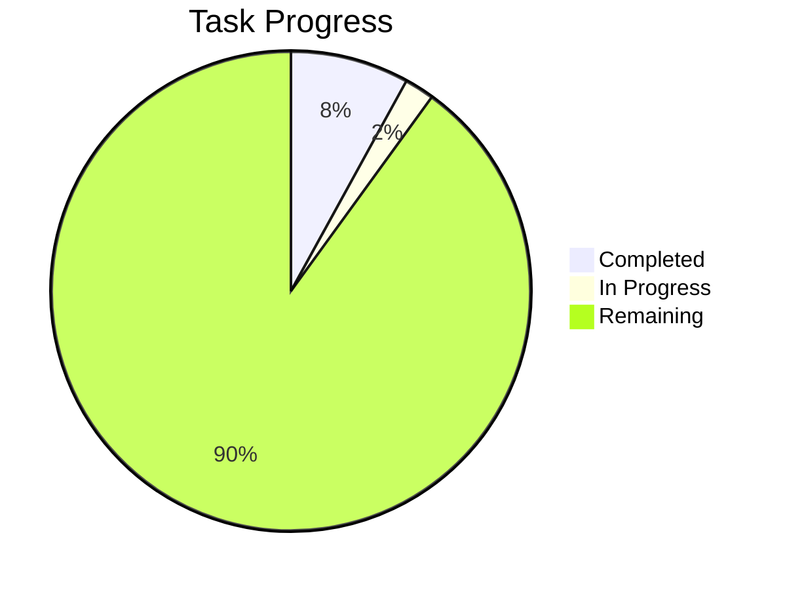
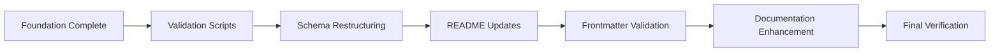

# Frontmatter Tasks

This document contains the comprehensive task list for frontmatter schema alignment, README updates, documentation standardization, and repository organization for the LightSpeedWP .github repository.

## Task Progress Overview

- **Total Tasks**: 50
- **Completed**: 4
- **In Progress**: 1
- **Remaining**: 45

## Task Categories

```mermaid
graph TD
    A[Frontmatter Tasks] --> B[Schema & Validation]
    A --> C[README Updates]
    A --> D[Documentation Alignment]
    A --> E[Testing & Coverage]
    A --> F[Scripts & Logging]
    
    B --> B1[Schema restructuring]
    B --> B2[Frontmatter validation]
    B --> B3[References system]
    
    C --> C1[Test folder READMEs]
    C --> C2[Schema folder READMEs]
    C --> C3[Scripts folder READMEs]
    
    D --> D1[YAML docs alignment]
    D --> D2[Mermaid diagrams]
    D --> D3[Cross-references]
    
    E --> E1[Test coverage updates]
    E --> E2[Validation scripts]
    E --> E3[Report structure]
    
    F --> F1[Logging standardization]
    F --> F2[Test stubs creation]
    F --> F3[Script organization]
```

## Detailed Task List

### ✅ Foundation Tasks (Completed)

- [x] **Task 1**: Review frontmatter schema alignment
  - Critically compare frontmatter.schema.json with FRONTMATTER-SCHEMA.md, YAML.md, and YAML-Frontmatter.md documentation to identify inconsistencies, missing fields, and alignment issues. Document gaps between awesome-copilot conventions and LightSpeed-specific requirements. Create comprehensive alignment plan that addresses all schema conflicts.

- [x] **Task 2**: Update tagging-frontmatter conventions
  - Update `/Users/ash/Studio/.github/.github/instructions/tagging-and-frontmatter-conventions.instructions.md` to include LightSpeed-specific frontmatter fields from frontmatter.schema.json and resolve conflicts with awesome-copilot conventions.

- [x] **Task 7**: Create Mermaid diagram instructions
  - Create comprehensive Mermaid diagram instructions file in `/Users/ash/Studio/.github/.github/instructions/mermaid-diagrams.instructions.md` with best practices, implementation guidelines, and examples for process flows, architecture, and documentation.

- [x] **Task 8**: Implement frontmatter references system
  - Update frontmatter.schema.json and all related documentation to properly implement references field for AI-focused frontmatter references (using correct relative paths) separate from human-focused footer references sections.

### 🚧 In Progress Tasks

- [ ] **Task 26**: Restructure coderabbit schema
  - Create schemas/coderabbit/ folder, move coderabbit-overrides.v2.json there, update all references in scripts and tests. Remove duplicate test from scripts/json-validation/ and keep only in __tests__ folder.

### 📋 Documentation Alignment Tasks

- [ ] **Task 3**: Update YAML documentation alignment
  - Update `/Users/ash/Studio/.github/docs/YAML.md` and `/Users/ash/Studio/.github/docs/YAML-Frontmatter.md` to align with frontmatter.schema.json and LightSpeed-specific requirements. Ensure consistency across all YAML/frontmatter documentation.

- [ ] **Task 4**: Create/update chatmode documentation
  - Create or update chatmode frontmatter documentation and instructions. Ensure chatmode.md index exists in .github/chatmodes/ and follows proper frontmatter standards.

- [ ] **Task 5**: Align frontmatter schema with docs
  - Update frontmatter.schema.json to align with documented conventions in FRONTMATTER-SCHEMA.md, YAML.md, YAML-Frontmatter.md and tagging-and-frontmatter-conventions.instructions.md. Resolve any conflicts between schemas.

- [ ] **Task 6**: Update frontmatter instructions
  - Update `/Users/ash/Studio/.github/.github/instructions/frontmatter.instructions.md` to reflect final aligned schema and include all LightSpeed-specific requirements.

### 🔧 Validation & Scripts Tasks

- [ ] **Task 9**: Create frontmatter validation script
  - Create comprehensive validation script that checks frontmatter compliance across all .github files using the aligned frontmatter.schema.json and add it to the test suite.

- [ ] **Task 29**: Create test stubs for all scripts
  - Audit all shell scripts and JavaScript files in scripts/ folder and create basic test stubs in appropriate __tests__ folders for any missing tests.

- [ ] **Task 30**: Standardize logging in shell scripts
  - Review all .sh files and ensure they use consistent logging functions that output to `/Users/ash/Studio/.github/logs/` folder. Add TODO comments for full logging implementation.

- [ ] **Task 31**: Standardize logging in JavaScript scripts
  - Review all .js/.cjs files and ensure they use consistent logging that outputs to `/Users/ash/Studio/.github/logs/` folder. Add TODO comments for full logging implementation.

### 📁 README Update Tasks

#### Tests Folder READMEs

- [ ] **Task 10**: Verify existing README files
  - Check current content of all existing README.md files in subfolders to understand structure and identify what needs updating. Read files in awesome-copilot/, includes/, maintenance/, projects/, pytests/, and utility/ folders.

- [ ] **Task 11**: Update awesome-copilot README
  - Update `/Users/ash/Studio/.github/tests/awesome-copilot/README.md` to properly describe the Jest tests for awesome-copilot scripts (update-readme, validate-collections, yaml-parser tests). Add Mermaid diagram showing test flow and dependencies.

- [ ] **Task 12**: Update includes main README
  - Update `/Users/ash/Studio/.github/tests/includes/README.md` to reference all subfolders (cli/, core/, deployment/, filesystem/) and describe the test helpers and shared utilities. Add Mermaid diagram showing folder structure and relationships.

- [ ] **Task 13**: Update includes/cli README
  - Review and update `/Users/ash/Studio/.github/tests/includes/cli/README.md` to ensure it properly describes CLI utility tests.

- [ ] **Task 14**: Update includes/core README
  - Review and update `/Users/ash/Studio/.github/tests/includes/core/README.md` to ensure it properly describes core functionality tests (colors, logging, validation).

- [ ] **Task 15**: Update includes/deployment README
  - Review and update `/Users/ash/Studio/.github/tests/includes/deployment/README.md` to ensure it properly describes deployment tests.

- [ ] **Task 16**: Update includes/filesystem README
  - Review and update `/Users/ash/Studio/.github/tests/includes/filesystem/README.md` to ensure it properly describes file operation tests.

- [ ] **Task 17**: Update maintenance README
  - Update `/Users/ash/Studio/.github/tests/maintenance/README.md` to list all maintenance test files and describe their purposes (find-readmes, manage-issue-types, manage-labels, etc.). Add Mermaid diagram showing maintenance workflow.

- [ ] **Task 18**: Update projects README
  - Update `/Users/ash/Studio/.github/tests/projects/README.md` to describe project-related tests and reference the fixtures/ subfolder. Add Mermaid diagram showing project test architecture.

- [ ] **Task 19**: Update projects/fixtures README
  - Review and update `/Users/ash/Studio/.github/tests/projects/fixtures/README.md` to properly describe test fixtures and sample data.

- [ ] **Task 20**: Update pytests README
  - Update `/Users/ash/Studio/.github/tests/pytests/README.md` to describe Python test files and utilities (changelog, docs links, markdown structure, PR templates tests). Add Mermaid diagram showing Python test workflow.

- [ ] **Task 21**: Update utility README
  - Update `/Users/ash/Studio/.github/tests/utility/README.md` to comprehensively list all utility tests including label management, build tools, sync utilities, and agent tests. Add Mermaid diagram showing utility ecosystem.

#### Schema & Scripts Folder READMEs

- [ ] **Task 22**: Create schemas folder READMEs
  - Create README.md files for schemas/ folder and all subfolders including wordpress/, header-footer-agent/, and new coderabbit/, awesome-copilot/, header-footer/ subfolders. Add Mermaid diagram showing schema organization and relationships.

- [ ] **Task 23**: Create scripts folder READMEs
  - Create/update README.md files for all scripts/ subfolders: awesome-copilot/, includes/, json-validation/, maintenance/, projects/, utility/ and their __tests__ subfolders. Add Mermaid diagrams showing script workflows and dependencies.

- [ ] **Task 24**: Create coverage folder README
  - Update `/Users/ash/Studio/.github/coverage/README.md` to describe test coverage reports and create reports/ subfolder with its own README. Add Mermaid diagram showing coverage workflow and report generation.

- [ ] **Task 25**: Create agents folder README
  - Create comprehensive README.md for `/Users/ash/Studio/.github/.github/agents/` describing all agent files and their purposes. Include Agent Ecosystem Map mermaid diagram and individual agent workflows.

### 🏗️ Schema Restructuring Tasks

- [ ] **Task 27**: Restructure header-footer schema
  - Create schemas/header-footer/ folder, move header.schema.json, footer.schema.json, header-footer.schema.json there. Move header-footer-agent/ contents and update references.

- [ ] **Task 28**: Restructure awesome-copilot schema
  - Create schemas/awesome-copilot/ folder, move collection.schema.json there, update references to point to .github/collections/ folder usage.

- [ ] **Task 36**: Update schema references after restructure
  - Update all script files that reference schema files to use new paths after folder restructuring. Update package.json, validation scripts, and any imports.

### 📊 Coverage & Testing Tasks

- [ ] **Task 32**: Create test reports structure
  - Create coverage/reports/ and tests/reports/ folders with README files explaining their purposes and what types of reports go where.

- [ ] **Task 33**: Update TEST_COVERAGE_SUMMARY.md
  - Update `/Users/ash/Studio/.github/tests/TEST_COVERAGE_SUMMARY.md` to reflect current folder structure, include all subfolders, update test counts, add schema reorganization, and comprehensive coverage information. Add Mermaid diagram showing test coverage architecture.

- [ ] **Task 34**: Update main tests README
  - Update `/Users/ash/Studio/.github/tests/README.md` to reference all subfolders with their README files, update structure description, add usage instructions, and include references to important documentation. Add Mermaid diagram showing complete test ecosystem.

- [ ] **Task 35**: Update main scripts README
  - Update `/Users/ash/Studio/.github/scripts/README.md` to reference all subfolders, describe the complete structure, logging standards, test requirements, and link to related folders (tests/, schemas/, coverage/, logs/). Add Mermaid diagram showing scripts architecture and workflows.

### 📝 Documentation Enhancement Tasks

- [ ] **Task 37**: Create logs folder structure
  - Ensure `/Users/ash/Studio/.github/logs/` has proper structure with subfolders for different types of logs (tests/, scripts/, validation/) and create README explaining log organization. Add Mermaid diagram showing logging flow and organization.

- [ ] **Task 38**: Add Mermaid diagrams to existing docs
  - Add Mermaid diagrams to existing documentation where process flows, architecture, or relationships can be visualized. Review all major README files and documentation for diagram opportunities.

- [ ] **Task 39**: Create frontmatter validation workflow
  - Create frontmatter validation workflow documentation with Mermaid diagram showing validation process, error handling, and integration with CI/CD pipeline.

- [ ] **Task 40**: Add frontmatter references to all files
  - Audit all existing .github files and add proper frontmatter references field with correct relative paths to related documentation. Ensure AI-focused frontmatter references are separate from human-focused footer references.

- [ ] **Task 41**: Verify all README cross-references
  - Ensure all README files properly reference each other, the main documentation, schema locations, and that file paths and folder structures are accurately described throughout after all changes.

- [ ] **Task 42**: Create collections folder documentation
  - Create or update README for .github/collections/ folder to document awesome-copilot collections and reference the schema in schemas/awesome-copilot/. Add Mermaid diagram showing collection structure and relationships.

### ✅ Frontmatter Validation Tasks

- [ ] **Task 43**: Validate agent frontmatter
  - Validate all agent files in .github/agents/ and ensure they have proper frontmatter according to frontmatter.schema.json with required fields (file_type, name, description) and recommended fields (version, last_updated, owners, etc.).

- [ ] **Task 44**: Validate chatmode frontmatter
  - Validate all chatmode files in .github/chatmodes/ and ensure they have proper frontmatter according to frontmatter.schema.json with required fields (file_type, description) and recommended fields (tools, model, etc.).

- [ ] **Task 45**: Validate instruction frontmatter
  - Validate all instruction files in .github/instructions/ and ensure they have proper frontmatter according to frontmatter.schema.json with required fields (file_type, description, apply_to) and recommended fields (owners, tags, etc.).

- [ ] **Task 46**: Validate prompt frontmatter
  - Validate all prompt files in .github/prompts/ and ensure they have proper frontmatter according to frontmatter.schema.json with required fields (file_type, description) and recommended fields (mode, model, tools, tags, etc.).

- [ ] **Task 47**: Validate template frontmatter
  - Validate all template files in .github/ISSUE_TEMPLATE/, .github/PULL_REQUEST_TEMPLATE/, .github/DISCUSSION_TEMPLATE/ and ensure they have proper frontmatter according to frontmatter.schema.json.

- [ ] **Task 48**: Validate saved reply frontmatter
  - Validate all saved reply files in .github/SAVED_REPLIES/ and ensure they have proper frontmatter according to frontmatter.schema.json with required fields (file_type, title).

- [ ] **Task 49**: Validate main .github frontmatter
  - Review and update main .github files (custom-instructions.md, README.md, etc.) to ensure they have proper frontmatter according to frontmatter.schema.json.

- [ ] **Task 50**: Update collection file references
  - Update all collection files in .github/collections/ to ensure they reference the moved schema in schemas/awesome-copilot/ and have proper frontmatter.

## Priority Workflow

## Key Achievements

1. **Unified Frontmatter Schema**: Created comprehensive schema combining LightSpeed governance with awesome-copilot conventions
2. **Tagging Conventions**: Established LightSpeed v2.0 frontmatter standards with domain taxonomy and file-type specific examples
3. **Mermaid Standards**: Implemented comprehensive Mermaid diagram guidelines with LightSpeed-specific patterns
4. **References System**: Separated AI-focused frontmatter references from human-focused footer references

## Next Steps

With the foundation work complete, the next priority areas are:

1. **Validation Infrastructure**: Create frontmatter validation script (Task 9)
2. **Schema Organization**: Complete coderabbit schema restructuring (Task 26)
3. **Documentation Updates**: Begin systematic README updates across all folders
4. **Testing & Logging**: Implement standardized logging and test coverage

## Related Documentation

- [Frontmatter Schema](schemas/frontmatter.schema.json)
- [Tagging Conventions](.github/instructions/tagging-and-frontmatter-conventions.instructions.md)
- [Mermaid Diagrams](.github/instructions/mermaid-diagrams.instructions.md)
- [YAML Documentation](docs/YAML.md)
- [Frontmatter Schema Documentation](docs/FRONTMATTER-SCHEMA.md)
