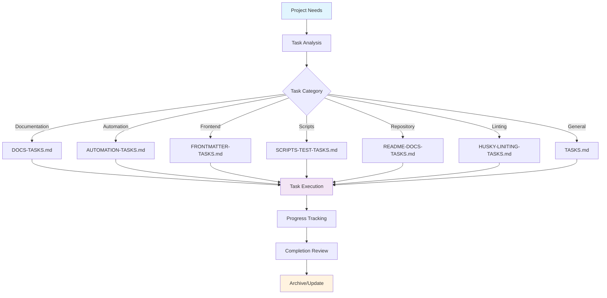
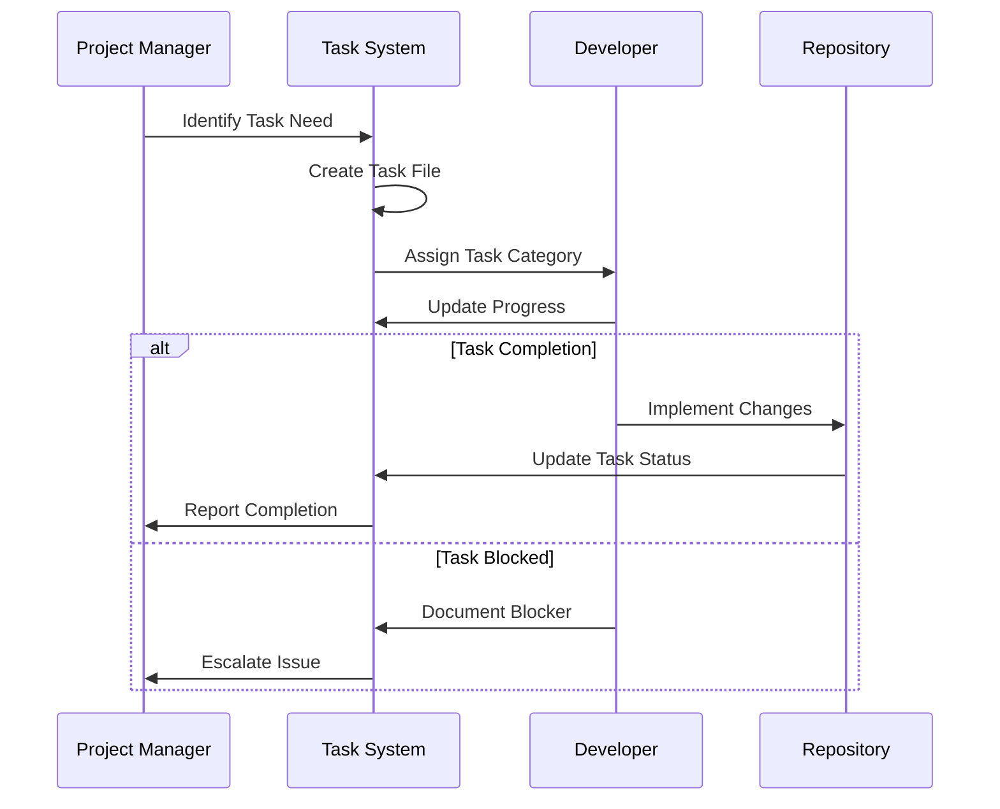

# Task Management Directory


Central repository for task management, project planning, and todo tracking for LightSpeedWP GitHub repository operations and maintenance.

## 🏗️ Task Management Architecture



## 📋 Current Task Files

| File                       | Purpose                             | Status    | Last Updated     |
| -------------------------- | ----------------------------------- | --------- | ---------------- |
| `AUTOMATION-TASKS.md`      | Automation workflow improvements    | Active    | Recently updated |
| `DOCS-TASKS.md`            | Documentation system enhancements   | Active    | Recently updated |
| `FRONTMATTER-TASKS.md`     | YAML frontmatter standardization    | Active    | Recently updated |
| `HUSKY-LINITING-TASKS.md`  | Linting and pre-commit improvements | Active    | Recently updated |
| `README-DOCS-TASKS.md`     | README documentation updates        | Active    | Recently updated |
| `README_AUDIT_REPORT.md`   | Comprehensive README audit results  | Completed | 2025-10-24       |
| `SCRIPTS-TEST-TASKS.md.md` | Scripts and testing enhancements    | Active    | Recently updated |
| `TASKS.md`                 | General repository tasks            | Active    | Recently updated |

## 🔄 Task Workflow Process



## 📊 Task Categories & Organization

### Documentation Tasks (`DOCS-TASKS.md`)

- README improvements and standardization
- Documentation structure optimization
- Cross-reference validation and updates
- Accessibility compliance for documentation

### Automation Tasks (`AUTOMATION-TASKS.md`)

- Workflow automation improvements
- CI/CD pipeline enhancements
- Script optimization and maintenance
- Integration testing automation

### Frontend/Metadata Tasks (`FRONTMATTER-TASKS.md`)

- YAML frontmatter standardization
- Metadata consistency across files
- Schema validation improvements
- Template system enhancements

### Repository Maintenance (`README-DOCS-TASKS.md`)

- Repository-wide documentation updates
- File organization and structure improvements
- Archive management and cleanup
- Version control optimization

### Code Quality (`HUSKY-LINITING-TASKS.md`)

- Linting rule improvements and enforcement
- Pre-commit hook optimization
- Code quality automation
- Style guide compliance

### Scripts & Testing (`SCRIPTS-TEST-TASKS.md`)

- Script functionality improvements
- Test coverage expansion
- Performance optimization
- Error handling enhancements

### General Tasks (`TASKS.md`)

- Cross-category improvements
- Strategic planning items
- Long-term maintenance goals
- Research and investigation tasks

## 🎯 Task Management Best Practices

### Task Creation Guidelines

1. **Clear Scope**: Define specific, measurable outcomes
2. **Category Assignment**: Place tasks in appropriate category files
3. **Priority Classification**: Mark tasks as High/Medium/Low priority
4. **Dependencies**: Document task dependencies and prerequisites
5. **Time Estimation**: Include rough time estimates for planning

### Progress Tracking

```markdown
## Task Template

### [Task Title]

- **Status**: [Not Started/In Progress/Blocked/Completed]
- **Priority**: [High/Medium/Low]
- **Assignee**: [Name or Auto]
- **Estimated Effort**: [Time estimate]
- **Dependencies**: [List prerequisite tasks]
- **Description**: [Detailed task description]
- **Acceptance Criteria**: [Definition of done]
- **Notes**: [Additional context or blockers]
```

### Completion Workflow

1. **Task Review**: Validate completion against acceptance criteria
2. **Testing**: Verify changes don't break existing functionality
3. **Documentation**: Update related documentation as needed
4. **Archive**: Move completed tasks to archive section
5. **Retrospective**: Document lessons learned and improvements

## 📈 Progress Monitoring

### Task Status Dashboard

Track progress across all task categories:

- **Total Active Tasks**: Count across all category files
- **Completion Rate**: Percentage of completed vs. total tasks
- **Blocked Tasks**: Tasks waiting on dependencies or decisions
- **Priority Distribution**: High/Medium/Low priority breakdown

### Reporting Metrics

- Weekly task completion summaries
- Category-specific progress reports
- Blocked task escalation tracking
- Resource allocation analysis

## 🔍 Task Management Tools

### Automated Task Tracking

- **GitHub Issues Integration**: Link tasks to GitHub issues for broader visibility
- **Project Boards**: Use GitHub Projects for visual task management
- **Milestone Tracking**: Associate tasks with release milestones
- **Label System**: Apply consistent labels for task categorization

### Manual Task Management

- **Weekly Reviews**: Regular task status and priority reviews
- **Sprint Planning**: Organize tasks into manageable work sprints
- **Dependency Mapping**: Track and manage task dependencies
- **Resource Planning**: Allocate team resources based on task priorities

## 🔗 Integration Points

| Component           | Integration       | Purpose                     |
| ------------------- | ----------------- | --------------------------- |
| **GitHub Issues**   | Task linking      | Broader project visibility  |
| **GitHub Projects** | Visual management | Kanban-style task tracking  |
| **Documentation**   | Cross-references  | Context and requirements    |
| **Scripts**         | Automation tasks  | Implementation automation   |
| **Tests**           | Quality assurance | Task validation and testing |

## 📋 Maintenance & Cleanup

### Regular Maintenance Tasks

1. **Weekly Task Review**: Update status and priorities
2. **Monthly Archive**: Move completed tasks to archive sections
3. **Quarterly Cleanup**: Remove obsolete or cancelled tasks
4. **Annual Review**: Assess task management effectiveness

### File Organization

- **Active Tasks**: Keep in main sections of task files
- **Completed Tasks**: Move to "Completed" sections with completion dates
- **Archived Tasks**: Historical tasks for reference and learning
- **Template Tasks**: Reusable task templates for common work types

---

## 🤝 Contributing

When working with task files:

1. **Follow Templates**: Use established task templates for consistency
2. **Update Status**: Keep task status current and accurate
3. **Document Blockers**: Clearly note any blockers or dependencies
4. **Cross-Reference**: Link related tasks and documentation
5. **Review Regularly**: Participate in task review cycles

## 🆘 Support

- **Task Questions**: [GitHub Discussions](../../discussions)
- **Process Issues**: [GitHub Issues](../../issues)
- **Documentation**: [Repository README](../README.md)
- **Development Guide**: [DEVELOPMENT.md](../DEVELOPMENT.md)

---

<!-- RANDOM FOOTER: 📋 Organized tasks lead to successful outcomes! -->
