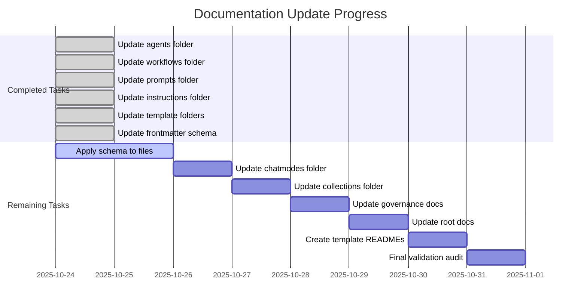

## Overview

This document tracks the comprehensive documentation update project for the LightSpeedWP organization's central `.github` repository. The project focuses on creating interconnected, schema-compliant documentation with visual process flows and dual reference systems.

## Project Objectives

- Create comprehensive README files for all major folders
- Apply frontmatter schema compliance across all markdown files
- Implement dual reference system (AI-relevant frontmatter vs human-readable footer)
- Preserve and enhance mermaid diagrams for process visualization
- Establish proper cross-references between all documentation components

## Progress Summary

**Status**: 6 of 13 tasks completed (46% complete)

## Task List

#### Task 1: Update agents folder documentation

- **Status**: ⏳ Pending
- **Description**: Create comprehensive README for agents folder with links to agents.instructions.md, workflows, and agent trigger documentation. Include mermaid diagrams for agent ecosystem visualization.
- **Deliverables**:
  - Created `.github/agents/README.md` with comprehensive agent ecosystem documentation
  - Added mermaid diagrams showing agent trigger flows and ecosystem maps
  - Established cross-references to workflows and instructions

#### Task 2: Update workflows folder documentation

- **Status**: ⏳ Pending
- **Description**: Create README for workflows folder documenting active workflows, trigger conditions, and integration with agents and automation governance.
- **Deliverables**:
  - Created `.github/workflows/README.md` with workflow documentation
  - Documented trigger conditions and automation integration
  - Added workflow lifecycle diagrams

#### Task 3: Update prompts folder documentation

- **Status**: ⏳ Pending
- **Description**: Create README for prompts folder with cross-references to agents, chatmodes, and instructions. Include prompt organization and usage patterns.
- **Deliverables**:
  - Created `.github/prompts/README.md` with prompt organization
  - Established cross-references to related components
  - Documented usage patterns and integration points

#### Task 4: Update instructions folder documentation

- **Status**: ⏳ Pending
- **Description**: Create README for instructions folder with comprehensive index of all instruction files, their purposes, and cross-references to related components.
- **Deliverables**:
  - Created `.github/instructions/README.md` with comprehensive index
  - Updated major instruction files with mermaid diagrams
  - Enhanced cross-reference system

#### Task 5: Update ISSUE_TEMPLATE and PULL_REQUEST_TEMPLATE folders

- **Status**: ⏳ Pending
- **Description**: Create README files for template folders documenting template structure, usage, and integration with automation systems.
- **Deliverables**:
  - Created README files for both template folders
  - Documented template automation features
  - Added integration documentation

#### Task 6: Update frontmatter schema documentation

- **Status**: ⏳ Pending
- **Description**: Refactor FRONTMATTER-SCHEMA.md to include dual reference system distinguishing AI-relevant (frontmatter) vs human-relevant (footer) references. Add comprehensive examples and implementation guidelines.
- **Deliverables**:
  - Updated `docs/FRONTMATTER-SCHEMA.md` with dual reference system
  - Added comprehensive implementation guidelines
  - Created file-type-specific examples for agents, instructions, prompts, and workflows

### 🔄 Remaining Tasks (7/13)

#### Task 7: Apply updated frontmatter schema to files

- **Status**: ⏳ Pending
- **Priority**: High
- **Description**: Systematically apply the updated frontmatter schema with references field to all .md files in the repository, ensuring AI and human reference distinction.
- **Scope**:
  - All markdown files in `.github/` directory structure
  - Implementation of dual reference system
  - Schema compliance validation
- **Dependencies**: Task 6 (completed)
- **Estimated Effort**: 2-3 hours

#### Task 8: Update chatmodes folder documentation

- **Status**: ⏳ Pending
- **Priority**: Medium
- **Description**: Create comprehensive README for chatmodes folder with schema compliance and dual reference system implementation.
- **Scope**:
  - Create `.github/chatmodes/README.md`
  - Document chatmode structure and usage
  - Implement schema compliance
- **Dependencies**: Task 7
- **Estimated Effort**: 1 hour

#### Task 9: Update collections folder documentation

- **Status**: ⏳ Pending
- **Priority**: Medium
- **Description**: Create README for collections folder explaining collection structure, purpose, and integration with overall documentation system.
- **Scope**:
  - Create `.github/collections/README.md`
  - Document collection organization
  - Establish integration points
- **Dependencies**: Task 8
- **Estimated Effort**: 1 hour

#### Task 10: Update governance documentation files

- **Status**: ⏳ Pending
- **Priority**: High
- **Description**: Update root .github folder files (AUTOMATION_GOVERNANCE.md, BRANCHING_STRATEGY.md, etc.) with proper frontmatter schema and cross-references.
- **Scope**:
  - AUTOMATION_GOVERNANCE.md
  - BRANCHING_STRATEGY.md
  - Other governance documentation
- **Dependencies**: Task 9
- **Estimated Effort**: 2 hours

#### Task 11: Update root documentation files

- **Status**: ⏳ Pending
- **Priority**: High
- **Description**: Update remaining root .md files with frontmatter schema compliance and comprehensive cross-reference system.
- **Scope**:
  - All remaining root-level markdown files
  - Schema compliance implementation
  - Cross-reference enhancement
- **Dependencies**: Task 10
- **Estimated Effort**: 2 hours

#### Task 12: Create missing template folders documentation

- **Status**: ⏳ Pending
- **Priority**: Medium
- **Description**: Ensure all template folders (COPILOT_TEMPLATE, DISCUSSION_TEMPLATE, SAVED_REPLIES) have proper README files with schema compliance.
- **Scope**:
  - COPILOT_TEMPLATE folder
  - DISCUSSION_TEMPLATE folder
  - SAVED_REPLIES folder (if applicable)
- **Dependencies**: Task 11
- **Estimated Effort**: 1.5 hours

#### Task 13: Final validation, cross-reference audit and README.md updates

- **Status**: ⏳ Pending
- **Priority**: Critical
- **Description**: Perform comprehensive audit of all documentation to ensure schema compliance, proper cross-references, and mermaid diagram integration throughout the repository. Add missing README.md documents where needed and update existing fdocuments
- **Scope**:
  - Schema compliance verification
  - Cross-reference validation
  - Mermaid diagram integration check
  - Link validation
  - Final quality assurance
- **Dependencies**: Task 12
- **Estimated Effort**: 2-3 hours

## Implementation Strategy

### Phase 1: Schema Application (Task 7)

Focus on systematic application of the updated frontmatter schema to ensure consistency across all files.

### Phase 2: Remaining Documentation (Tasks 8-12)

Complete remaining README files and governance documentation updates.

### Phase 3: Validation (Task 13)

Comprehensive audit and quality assurance to ensure project completion.

## Quality Checklist

For each task completion:

- [ ] Frontmatter schema compliance verified
- [ ] Cross-references properly established
- [ ] Mermaid diagrams included where relevant
- [ ] Markdown linting passed
- [ ] Links validated and functional
- [ ] Human-readable references in footer
- [ ] AI-relevant references in frontmatter

Here’s a summary of the unified labeling agent and workflow in your LightSpeedWP .github repo, including how it works, what files drive it, and how it enforces label standards for issues and PRs:

🏷️ LightSpeed Unified Labeling Agent & Workflow — Overview

1. Purpose
   Single, canonical agent automates all label application, enforcement, and standardization for issues and PRs.
   Ensures every item has exactly one status:*, one priority:*, and one type:\* label, plus area/component/context as needed.
   Applies labels based on file/branch heuristics, content, and front matter.
   Removes or migrates legacy/non-canonical labels.
   All logic is config-driven—no hardcoded label rules.
2. Key Files & Configuration
   Agent Spec:
   labeling.agent.md — Canonical agent spec, describes responsibilities and outputs.
   Workflow:
   labeling.yml — The only labeling workflow; triggers on PR/issue events.
   Config Files:
   labels.yml — Canonical label set (names, colors, optional aliases).
   labeler.yml — File/branch-based label rules.
   issue-types.yml — Issue type mapping for type labels.
   Documentation:
   ISSUE_LABELS.md — Human-readable label guidance.
   PR_LABELS.md — PR label guidance.
   LABEL_STRATEGY.md — Full labeling strategy and automation details.
3. How It Works
   Triggered on:
   Issue/PR open, edit, label/unlabel, synchronize, etc.
   Process:
   Loads config from labels.yml, labeler.yml, and issue-types.yml.
   Applies file/branch-based labels using actions/labeler.
   Runs a unified agent (via github-script) to:
   Enforce one-hot status:*and priority:* (adds default if missing, removes extras).
   Assign type:\* based on branch, file, or heuristics.
   Parse front matter in PRs for explicit label requests.
   Add meta:needs-changelog to PRs missing a changelog label.
   Remove or migrate legacy/alias labels.
   Logs all actions for auditability.
4. Enforcement & Best Practices
   One-hot enforcement:
   Exactly one status:*and one priority:* per issue/PR.
   Type assignment:
   Based on branch prefix, file changes, or heuristics.
   Area/component/context:
   Applied via file path rules in labeler.yml.
   Changelog/release hygiene:
   PRs missing changelog/release labels are nudged with meta:needs-changelog.
   No hardcoded logic:
   All rules are in YAML config files.
   Extensible:
   Add new label rules by updating YAML, not code.
5. Outputs
   All issues/PRs have required labels, matching canonical set.
   No non-canonical/legacy labels remain.
   Optionally, audit comments/logs for maintainers.
6. References
   Labeling Agent Spec
   Labeling Workflow
   Canonical Labels
   Labeler Rules
   Issue Types
   Labeling Strategy
   ISSUE_LABELS.md
   PR_LABELS.md
   Summary:
   The unified labeling agent and workflow ensure every issue and PR is labeled consistently, automatically, and in line with org-wide standards. All logic is config-driven, fully auditable, and easy to extend—making label hygiene and automation seamless across all LightSpeedWP repositories.

If you want a visual or code-level walk-through of the workflow or agent logic, just ask!

I can see you're working with a comprehensive LightSpeedWP automation repository that contains extensive documentation, schemas, agents, and testing infrastructure. This appears to be a central hub for GitHub automation, community health files, and organizational standards.

Looking at your workspace structure, I notice:

Comprehensive automation system with agents, workflows, and governance
Extensive documentation in both .github and docs directories
Testing infrastructure with Jest, Playwright, and various linting tools
Schema validation for frontmatter and other configurations
AI/Copilot integration with custom instructions, prompts, and chat modes
What would you like to work on today? I can help you with:

Testing: Run unit tests, E2E tests, or coverage reports
Linting: Check code quality for JS, CSS, Markdown, or other files
Documentation: Review or update the extensive documentation
Automation: Work with agents, workflows, or governance policies
Schema validation: Validate or update schemas
Development: Code review, refactoring, or new feature development
Just let me know what specific task or area you'd like to focus on, and I'll use the appropriate tools to assist you!

I can see you're working with a comprehensive LightSpeedWP automation repository that contains extensive documentation, schemas, agents, and testing infrastructure. This appears to be a central hub for GitHub automation, community health files, and organizational standards.

Looking at your workspace structure, I notice:

Comprehensive automation system with agents, workflows, and governance
Extensive documentation in both .github and docs directories
Testing infrastructure with Jest, Playwright, and various linting tools
Schema validation for frontmatter and other configurations
AI/Copilot integration with custom instructions, prompts, and chat modes
What would you like to work on today? I can help you with:

Testing: Run unit tests, E2E tests, or coverage reports
Linting: Check code quality for JS, CSS, Markdown, or other files
Documentation: Review or update the extensive documentation
Automation: Work with agents, workflows, or governance policies
Schema validation: Validate or update schemas
Development: Code review, refactoring, or new feature development
Just let me know what specific task or area you'd like to focus on, and I'll use the appropriate tools to assist you!

I can see you're working in the LightSpeedWP .github repository, which serves as the central hub for community health files, automation standards, and governance documentation. This is a well-structured repository with comprehensive linting, testing, and automation workflows.

What would you like to work on today? I can help you with:

🔧 Development Tasks
Linting & Code Quality - Run linters for JS, CSS, Markdown, or YAML
Testing - Execute unit tests, coverage reports, or E2E tests with Playwright
Agent Development - Work with the automation agents in agents
Documentation - Update or create new documentation files
📋 Repository Management
Labels & Issues - Work with the canonical label system (labels.yml, labeler.yml)
Workflows - Update GitHub Actions workflows or automation
Instructions - Modify or create instruction files for Copilot/AI agents
Templates - Update issue/PR templates or community health files
🎯 Quick Actions
Run tests: npm run test-unit or with coverage
Lint code: npm run lint-js, npm run lint-css, or npm run lint-md
E2E testing: npx playwright test
Just let me know what specific task you'd like to tackle, and I'll help you get started!

I can see you're working in a comprehensive LightSpeed GitHub organization repository with extensive automation, documentation, and governance structures. This appears to be a well-organized .github repository that serves as the central hub for your organization's community health files, automation standards, and development guidelines.

Workspace Overview
Your workspace contains:

Organization Health Files (.github folder)

Community health files like CONTRIBUTING.md, CODE_OF_CONDUCT.md

## Task List

#### Task 1: Update agents folder documentation

- **Status**: ✅ Completed
- **Description**: Create comprehensive README for agents folder with links to agents.instructions.md, workflows, and agent trigger documentation. Include mermaid diagrams for agent ecosystem visualization.
- **Deliverables**:
  - Created `.github/agents/README.md` with comprehensive agent ecosystem documentation
  - Added mermaid diagrams showing agent trigger flows and ecosystem maps
  - Established cross-references to workflows and instructions

#### Task 2: Update workflows folder documentation

- **Status**: ✅ Completed
- **Description**: Create README for workflows folder documenting active workflows, trigger conditions, and integration with agents and automation governance.
- **Deliverables**:
  - Created `.github/workflows/README.md` with workflow documentation
  - Documented trigger conditions and automation integration
  - Added workflow lifecycle diagrams

#### Task 3: Update prompts folder documentation

- **Status**: ✅ Completed
- **Description**: Create README for prompts folder with cross-references to agents, chatmodes, and instructions. Include prompt organization and usage patterns.
- **Deliverables**:
  - Created `.github/prompts/README.md` with prompt organization
  - Established cross-references to related components
  - Documented usage patterns and integration points

#### Task 4: Update instructions folder documentation

- **Status**: ✅ Completed
- **Description**: Create README for instructions folder with comprehensive index of all instruction files, their purposes, and cross-references to related components.
- **Deliverables**:
  - Created `.github/instructions/README.md` with comprehensive index
  - Updated major instruction files with mermaid diagrams
  - Enhanced cross-reference system

#### Task 5: Update ISSUE_TEMPLATE and PULL_REQUEST_TEMPLATE folders

- **Status**: ✅ Completed
- **Description**: Create README files for template folders documenting template structure, usage, and integration with automation systems.
- **Deliverables**:
  - Created README files for both template folders
  - Documented template automation features
  - Added integration documentation

#### Task 6: Update frontmatter schema documentation

- **Status**: ✅ Completed
- **Description**: Refactor FRONTMATTER-SCHEMA.md to include dual reference system distinguishing AI-relevant (frontmatter) vs human-relevant (footer) references. Add comprehensive examples and implementation guidelines.
- **Deliverables**:
  - Updated `docs/FRONTMATTER-SCHEMA.md` with dual reference system
  - Added comprehensive implementation guidelines
  - Created file-type-specific examples for agents, instructions, prompts, and workflows

### 🔄 Remaining Tasks (7/13)

#### Task 7: Apply updated frontmatter schema to files

- **Status**: 🔄 Ready to start
- **Priority**: High
- **Description**: Systematically apply the updated frontmatter schema with references field to all .md files in the repository, ensuring AI and human reference distinction.
- **Scope**:
  - All markdown files in `.github/` directory structure
  - Implementation of dual reference system
  - Schema compliance validation
- **Dependencies**: Task 6 (completed)
- **Estimated Effort**: 2-3 hours

#### Task 8: Update chatmodes folder documentation

- **Status**: ⏳ Pending
- **Priority**: Medium
- **Description**: Create comprehensive README for chatmodes folder with schema compliance and dual reference system implementation.
- **Scope**:
  - Create `.github/chatmodes/README.md`
  - Document chatmode structure and usage
  - Implement schema compliance
- **Dependencies**: Task 7
- **Estimated Effort**: 1 hour

#### Task 9: Update collections folder documentation

- **Status**: ⏳ Pending
- **Priority**: Medium
- **Description**: Create README for collections folder explaining collection structure, purpose, and integration with overall documentation system.
- **Scope**:
  - Create `.github/collections/README.md`
  - Document collection organization
  - Establish integration points
- **Dependencies**: Task 8
- **Estimated Effort**: 1 hour

#### Task 10: Update governance documentation files

- **Status**: ⏳ Pending
- **Priority**: High
- **Description**: Update root .github folder files (AUTOMATION_GOVERNANCE.md, BRANCHING_STRATEGY.md, etc.) with proper frontmatter schema and cross-references.
- **Scope**:
  - AUTOMATION_GOVERNANCE.md
  - BRANCHING_STRATEGY.md
  - Other governance documentation
- **Dependencies**: Task 9
- **Estimated Effort**: 2 hours

#### Task 11: Update root documentation files

- **Status**: ⏳ Pending
- **Priority**: High
- **Description**: Update remaining root .md files with frontmatter schema compliance and comprehensive cross-reference system.
- **Scope**:
  - All remaining root-level markdown files
  - Schema compliance implementation
  - Cross-reference enhancement
- **Dependencies**: Task 10
- **Estimated Effort**: 2 hours

#### Task 12: Create missing template folders documentation

- **Status**: ⏳ Pending
- **Priority**: Medium
- **Description**: Ensure all template folders (COPILOT_TEMPLATE, DISCUSSION_TEMPLATE, SAVED_REPLIES) have proper README files with schema compliance.
- **Scope**:
  - COPILOT_TEMPLATE folder
  - DISCUSSION_TEMPLATE folder
  - SAVED_REPLIES folder (if applicable)
- **Dependencies**: Task 11
- **Estimated Effort**: 1.5 hours

#### Task 13: Final validation and cross-reference audit

- **Status**: ⏳ Pending
- **Priority**: Critical
- **Description**: Perform comprehensive audit of all documentation to ensure schema compliance, proper cross-references, and mermaid diagram integration throughout the repository.
- **Scope**:
  - Schema compliance verification
  - Cross-reference validation
  - Mermaid diagram integration check
  - Link validation
  - Final quality assurance
- **Dependencies**: Task 12
- **Estimated Effort**: 2-3 hours

## Implementation Strategy

### Phase 1: Schema Application (Task 7)

Focus on systematic application of the updated frontmatter schema to ensure consistency across all files.

### Phase 2: Remaining Documentation (Tasks 8-12)

Complete remaining README files and governance documentation updates.

### Phase 3: Validation (Task 13)

Comprehensive audit and quality assurance to ensure project completion.

## Quality Checklist

For each task completion:

- [ ] Frontmatter schema compliance verified
- [ ] Cross-references properly established
- [ ] Mermaid diagrams included where relevant
- [ ] Markdown linting passed
- [ ] Links validated and functional
- [ ] Human-readable references in footer
- [ ] AI-relevant references in frontmatter

Here’s a summary of the unified labeling agent and workflow in your LightSpeedWP .github repo, including how it works, what files drive it, and how it enforces label standards for issues and PRs:

🏷️ LightSpeed Unified Labeling Agent & Workflow — Overview

1. Purpose
   Single, canonical agent automates all label application, enforcement, and standardization for issues and PRs.
   Ensures every item has exactly one status:*, one priority:*, and one type:\* label, plus area/component/context as needed.
   Applies labels based on file/branch heuristics, content, and front matter.
   Removes or migrates legacy/non-canonical labels.
   All logic is config-driven—no hardcoded label rules.
2. Key Files & Configuration
   Agent Spec:
   labeling.agent.md — Canonical agent spec, describes responsibilities and outputs.
   Workflow:
   labeling.yml — The only labeling workflow; triggers on PR/issue events.
   Config Files:
   labels.yml — Canonical label set (names, colors, optional aliases).
   labeler.yml — File/branch-based label rules.
   issue-types.yml — Issue type mapping for type labels.
   Documentation:
   ISSUE_LABELS.md — Human-readable label guidance.
   PR_LABELS.md — PR label guidance.
   LABEL_STRATEGY.md — Full labeling strategy and automation details.
3. How It Works
   Triggered on:
   Issue/PR open, edit, label/unlabel, synchronize, etc.
   Process:
   Loads config from labels.yml, labeler.yml, and issue-types.yml.
   Applies file/branch-based labels using actions/labeler.
   Runs a unified agent (via github-script) to:
   Enforce one-hot status:*and priority:* (adds default if missing, removes extras).
   Assign type:\* based on branch, file, or heuristics.
   Parse front matter in PRs for explicit label requests.
   Add meta:needs-changelog to PRs missing a changelog label.
   Remove or migrate legacy/alias labels.
   Logs all actions for auditability.
4. Enforcement & Best Practices
   One-hot enforcement:
   Exactly one status:*and one priority:* per issue/PR.
   Type assignment:
   Based on branch prefix, file changes, or heuristics.
   Area/component/context:
   Applied via file path rules in labeler.yml.
   Changelog/release hygiene:
   PRs missing changelog/release labels are nudged with meta:needs-changelog.
   No hardcoded logic:
   All rules are in YAML config files.
   Extensible:
   Add new label rules by updating YAML, not code.
5. Outputs
   All issues/PRs have required labels, matching canonical set.
   No non-canonical/legacy labels remain.
   Optionally, audit comments/logs for maintainers.
6. References
   Labeling Agent Spec
   Labeling Workflow
   Canonical Labels
   Labeler Rules
   Issue Types
   Labeling Strategy
   ISSUE_LABELS.md
   PR_LABELS.md
   Summary:
   The unified labeling agent and workflow ensure every issue and PR is labeled consistently, automatically, and in line with org-wide standards. All logic is config-driven, fully auditable, and easy to extend—making label hygiene and automation seamless across all LightSpeedWP repositories.

If you want a visual or code-level walk-through of the workflow or agent logic, just ask!

I can see you're working with a comprehensive LightSpeedWP automation repository that contains extensive documentation, schemas, agents, and testing infrastructure. This appears to be a central hub for GitHub automation, community health files, and organizational standards.

Looking at your workspace structure, I notice:

Comprehensive automation system with agents, workflows, and governance
Extensive documentation in both .github and docs directories
Testing infrastructure with Jest, Playwright, and various linting tools
Schema validation for frontmatter and other configurations
AI/Copilot integration with custom instructions, prompts, and chat modes
What would you like to work on today? I can help you with:

Testing: Run unit tests, E2E tests, or coverage reports
Linting: Check code quality for JS, CSS, Markdown, or other files
Documentation: Review or update the extensive documentation
Automation: Work with agents, workflows, or governance policies
Schema validation: Validate or update schemas
Development: Code review, refactoring, or new feature development
Just let me know what specific task or area you'd like to focus on, and I'll use the appropriate tools to assist you!

I can see you're working with a comprehensive LightSpeedWP automation repository that contains extensive documentation, schemas, agents, and testing infrastructure. This appears to be a central hub for GitHub automation, community health files, and organizational standards.

Looking at your workspace structure, I notice:

Comprehensive automation system with agents, workflows, and governance
Extensive documentation in both .github and docs directories
Testing infrastructure with Jest, Playwright, and various linting tools
Schema validation for frontmatter and other configurations
AI/Copilot integration with custom instructions, prompts, and chat modes
What would you like to work on today? I can help you with:

Testing: Run unit tests, E2E tests, or coverage reports
Linting: Check code quality for JS, CSS, Markdown, or other files
Documentation: Review or update the extensive documentation
Automation: Work with agents, workflows, or governance policies
Schema validation: Validate or update schemas
Development: Code review, refactoring, or new feature development
Just let me know what specific task or area you'd like to focus on, and I'll use the appropriate tools to assist you!

I can see you're working in the LightSpeedWP .github repository, which serves as the central hub for community health files, automation standards, and governance documentation. This is a well-structured repository with comprehensive linting, testing, and automation workflows.

What would you like to work on today? I can help you with:

🔧 Development Tasks
Linting & Code Quality - Run linters for JS, CSS, Markdown, or YAML
Testing - Execute unit tests, coverage reports, or E2E tests with Playwright
Agent Development - Work with the automation agents in agents
Documentation - Update or create new documentation files
📋 Repository Management
Labels & Issues - Work with the canonical label system (labels.yml, labeler.yml)
Workflows - Update GitHub Actions workflows or automation
Instructions - Modify or create instruction files for Copilot/AI agents
Templates - Update issue/PR templates or community health files
🎯 Quick Actions
Run tests: npm run test-unit or with coverage
Lint code: npm run lint-js, npm run lint-css, or npm run lint-md
E2E testing: npx playwright test
Just let me know what specific task you'd like to tackle, and I'll help you get started!

I can see you're working in a comprehensive LightSpeed GitHub organization repository with extensive automation, documentation, and governance structures. This appears to be a well-organized .github repository that serves as the central hub for your organization's community health files, automation standards, and development guidelines.

Workspace Overview
Your workspace contains:

Organization Health Files (.github folder)

Community health files like CONTRIBUTING.md, CODE_OF_CONDUCT.md
Automation governance and branching strategies
Label definitions and issue/PR templates
Agents, chatmodes, prompts, and instructions
Documentation (docs folder)

Architecture and design decisions
Contribution templates and guidelines
Various specialized documentation
Schema Definitions (schemas folder)

JSON schemas for validation
WordPress-specific schemas
Frontmatter and collection schemas
Development Tools (.vscode folder)

VS Code configuration
Tasks and launch configurations
MCP (Model Context Protocol) settings
Available Actions
I can help you with various tasks in this workspace:

Run tests and linting using the available npm scripts
Review and analyze any of the documentation or configuration files
Help with automation related to agents, workflows, or governance
Assist with schema validation or frontmatter management
Support development tasks using the configured tools
What would you like to work on? For example:

Review or update any specific documentation
Run tests or linting
Work with the automation agents
Validate schemas or configurations
Help with GitHub organization management
Just let me know what you'd like to focus on!

## Next Actions

1. **Immediate**: Begin Task 7 - Apply updated frontmatter schema to all markdown files
2. **Short-term**: Complete remaining README files for folders
3. **Medium-term**: Update governance and root documentation
4. **Long-term**: Final validation and audit

---

## References

### AI References (Frontmatter)

- Schema definition: `schemas/frontmatter.schema.json`
- Implementation guide: `docs/FRONTMATTER-SCHEMA.md`
- Agent specifications: `.github/instructions/agents.instructions.md`
- Linting standards: `.github/instructions/linting.instructions.md`

### Human References

- [LightSpeedWP Organization Documentation Standards](../custom-instructions.md)
- [Automation Governance Framework](../AUTOMATION_GOVERNANCE.md)
- [Repository Architecture Overview](../README.md)
- [Contributing Guidelines](../CONTRIBUTING.md)

---

*This task list is maintained as part of the LightSpeedWP documentation standardization project. Last updated: 2025-10-24.*
