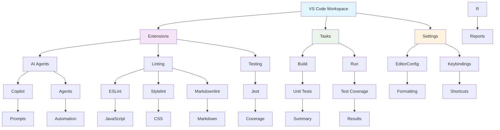

## VS Code Workspace Configuration (`.vscode`)

This folder contains all Visual Studio Code workspace settings, tasks, and recommended extensions for the LightSpeedWP project.
It ensures a consistent, automated, and standards-driven development experience for all contributors.

## 📊 VS Code Configuration Architecture

---

## Folder Contents

- **extensions.json**
  - AI coding assistants (Copilot, Claude, Gemini, CodeRabbit, etc.)
  - GitHub workflow tools (PRs, Codespaces, Actions, GitLens)
  - Linting and formatting (Prettier, ESLint, Stylelint, Markdownlint)
  - WordPress/PHP development (Intelephense, PHPCS, WP Toolbox)
  - Testing (Jest)
  - JSON, Docker, and other core dev tools

- **settings.json**
  Workspace-wide editor and tool settings:
  - Enforces formatting on save, trailing whitespace trimming, and newline rules
  - Language-specific formatting and linting (PHP, JS, CSS, JSON, Markdown)
  - Copilot and AI agent configuration
  - File associations for custom doc types
  - Excludes build and dependency folders from search and file watching
  - YAML schema mapping for documentation and automation

- **tasks.json**
  Predefined tasks for common workflows:
  - Run unit tests (`npm: test-unit`)
  - Lint JavaScript, CSS, and Markdown
  - Collect test coverage

- **launch.json**
  Debugger configurations:
  - PHP (Xdebug on port 9003)
  - Node.js debugging for Jest tests and scripts

- **mcp.json**
  Model Context Protocol (MCP) server configuration:
  - Integrates GitHub MCP server for advanced automation and Copilot Spaces.

---

## Usage

- Open the project in VS Code to automatically apply these settings and see extension recommendations.
- Use the Task Runner (`Cmd+Shift+P` → "Run Task") for linting, testing, and E2E workflows.
- The workspace is pre-configured for collaborative, standards-compliant WordPress and automation development.

---

## 🔗 Related Configuration

### 📚 Development Standards

- [Coding Standards](../.github/instructions/coding-standards.instructions.md) - Unified development guidelines
- [Linting Instructions](../.github/instructions/linting.instructions.md) - Code quality standards
- [Contributing Guidelines](../CONTRIBUTING.md) - How to contribute to LightSpeed projects

### 🤖 AI & Automation

- [Custom Instructions](../.github/custom-instructions.md) - Organization-wide Copilot settings
- [Agents Documentation](../.github/agents/agent.md) - Automation agents and workflows
- [Scripts Directory](../scripts/README.md) - Utility scripts and automation tools

### 🧪 Testing & Quality

- [Testing Framework](../tests/README.md) - Test suites and coverage documentation
- [JSON Schemas](../schemas/README.md) - Schema validation and IDE integration
- [Main Repository](../README.md) - LightSpeed community health repository

---

*Maintained by the LightSpeedWP team for a seamless contributor experience.*
