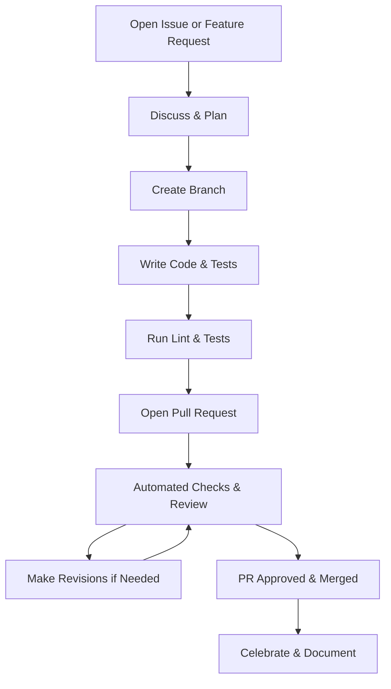

# Contributing

## 🚀 Quick Start (TL;DR)

1. **Fork & Clone:** Fork this repo and clone it locally.
2. **Install dependencies:** `npm ci`
3. **Create a branch:** Use the correct prefix (e.g. `feat/`, `fix/`, `docs/`).
4. **Write code & tests:** Follow [Coding Standards](instructions/coding-standards.instructions.md) and add/expand tests.
5. **Lint & test:** Run `npm run lint:all` and `npm test` before committing. If you need to update or add new linting rules, or troubleshoot lint failures, see the [Updating Linting Rules & Troubleshooting](./docs/LINTING.md) section in the README for step-by-step guidance.
6. **Commit & push:** Use clear commit messages and push your branch.
7. **Open a PR:** Use the correct PR template and link to the related issue.
8. **Respond to feedback:** Make changes as requested by reviewers or Copilot.

For details, see the full guidelines below and the [Documentation Index](./docs/README.md).

---

---

**Last Updated:** 2026-05-27 • **Version:** v0.2.0

Thank you for your interest in contributing to LightSpeed!
To maintain a consistent, high-quality codebase and community, please follow these guidelines.

---

## Getting Started

### 1. Start with a GitHub Issue

- **Select the correct [Issue template](https://github.com/lightspeedwp/.github/issues/new/choose)** for your contribution type:
  - Bug report, feature/enhancement, documentation, integration, performance, UX feedback, task, code refactor, instructions, prompts, saved replies, or support question.
  - Templates are designed to collect all required information, labels, and metadata for automation and efficient triage.
- **Provide thorough details:**
  - For bugs: include reproduction steps, expected vs actual behavior, screenshots, logs, and environment info.
  - For features/enhancements: describe the problem/opportunity, proposed solution, mockups/designs, and acceptance criteria.
  - For other types: explain context, goals, action items, and impact.
- **Reference relevant docs or standards:**
  See [Coding Standards](instructions/coding-standards.instructions.md), [Documentation Formats](instructions/documentation-formats.instructions.md), [Languages & Linting](instructions/languages.instructions.md), and [Community Standards](instructions/community-standards.instructions.md).
- **Outline your planned approach for complex issues** and request feedback before implementation.
- **Automation:** Well-formed issues using the right template are automatically labelled, routed, and prioritised.

### 2. Branching & Development

- **Branch naming:**
  Use `{type}/{scope}-{short-title}` format (e.g., `feat/cart-coupon-flow`, `fix/wp6-6-compat`, `docs/readme-install-steps`, `chore/deps-2025-09`).
- **Allowed prefixes:**
  `feat/`, `fix/`, `docs/`, `chore/`, `build/`, `refactor/`, `test/`, `perf/`, `ci/`, `release/`, `hotfix/`, `design/`, `research/`.
- See [Org-wide Branching Strategy](./docs/BRANCHING_STRATEGY.md) for full rules and automation mapping.
- Ensure your branch maps to the correct issue type and PR template for automated labelling and changelog governance.

### 3. Coding Standards

- Follow [LightSpeed coding standards](instructions/coding-standards.instructions.md) for PHP, JS, CSS, and other languages.
- Use configured linters/formatters (e.g. ESLint, Prettier, PHPCS) and ensure all code passes checks.
- Write clear, concise commit messages and document significant changes inline.

---

## Pull Requests

### 4. Create a Pull Request (PR)

- **Select the correct PR template:**
  Bugfix, Feature, Chore, Docs, Build/CI, Dependencies/Maintenance, Hotfix, Release, Refactor, or General PR template.
  - Your branch prefix should match the PR template (e.g., `fix/` → Bugfix PR, `feat/` → Feature PR).
  - See [PR_LABELS.md](./docs/PR_LABELS.md) for template-to-label mapping and automation.
- **Required PR details:**
  - Accurate, up-to-date description.
  - Link to the related GitHub Issue.
  - Testing instructions or demo (video/screenshots preferred for UI changes).
  - Changelog entry following [CHANGELOG.md](./CHANGELOG.md) guidelines, grouped under the correct section.
  - Document any skipped tests and provide justification.
  - For version bumps, include release notes and summary.
- **Draft PRs:** If not ready for review, open as Draft. Convert to ready once complete.

### 5. Review & Merge

- PRs are reviewed by maintainers, Copilot, or designated reviewers.
- Respond to feedback and make requested changes.
- Only maintainers can approve and merge PRs.
- PRs must pass all CI checks/tests before merging.

---

## Additional Guidelines

## VS Code Setup

To ensure a consistent development experience and code quality, all contributors should:

- Install all recommended extensions from `.vscode/extensions.json` (includes ESLint, Prettier, YAML, WordPress, PHP, AI, and GitHub workflow tools).
- Use the workspace settings in `.vscode/settings.json` for code style, linting, and workflow automation. These settings align with `.editorconfig` and enforce 2-space indentation for YAML, JS, CSS, and JSON, and 4-space tabs for PHP.
- Enable format-on-save and linting in your editor for best results.
- Periodically review and update your extensions to match evolving project standards.

Refer to `.vscode/extensions.json` and `.vscode/settings.json` for the authoritative list and configuration.

- **Saved Replies:** Use [SAVED_REPLIES/README.md](.github/SAVED_REPLIES/README.md) for common responses and efficient communication.
- **Documentation:** Update relevant docs (README, instructions) for any user-facing change.
- **Automation & Labels:** Ensure your issue/PR complies with [AUTOMATION_GOVERNANCE.md](./docs/AUTOMATION_GOVERNANCE.md), [ISSUE_LABELS.md](docs/ISSUE_LABELS.md), and [ISSUE_TYPES.md](./docs/ISSUE_TYPES.md).
- **Governance process updates:** If your change modifies governance policy or contributor workflow expectations, add an entry to [GOVERNANCE_REVISION_LOG.md](./docs/GOVERNANCE_REVISION_LOG.md).
- **Downstream overrides:** If you are adopting org defaults in another repository, follow [Downstream Override Policy](./docs/override-policy.md) and link any approved exception.
- **Changelog:** All user-facing changes, fixes, and features must be entered in [CHANGELOG.md](./CHANGELOG.md) in Keep a Changelog format. See example sections in the changelog for proper grouping and linking.

---

## References

- [BRANCHING_STRATEGY.md](./docs/BRANCHING_STRATEGY.md): Org-wide branch naming, merge discipline, and automation mapping.
- [CHANGELOG.md](./CHANGELOG.md): Changelog format, release notes, and versioning.
- [AUTOMATION_GOVERNANCE.md](./docs/AUTOMATION_GOVERNANCE.md): Org-wide automation, branching, label, and release strategy.
- [GOVERNANCE_REVISION_LOG.md](./docs/GOVERNANCE_REVISION_LOG.md): Lightweight audit trail for governance/process changes.
- [override-policy.md](./docs/override-policy.md): Mandatory versus optional org defaults, exception handling, and promotion model.
- [ISSUE_TYPES.md](./docs/ISSUE_TYPES.md): Issue type mapping and usage.
- [ISSUE_LABELS.md](./docs/ISSUE_LABELS.md): Label families, triage, and workflow.
- [PR_LABELS.md](./docs/PR_LABELS.md): PR labelling, templates, and automation.
- [Coding Standards](instructions/coding-standards.instructions.md)
- [Documentation Formats](instructions/documentation-formats.instructions.md)
- [Community Standards](instructions/community-standards.instructions.md)
- [Languages & Linting](instructions/languages.instructions.md)

---

## Licence

By contributing to this project, you agree that your contributions will be licensed under the GNU General Public License v3.0. See the [LICENSE](LICENSE) file for details.

Thank you for helping us make LightSpeed better!

*Maintained with ❤️ by the 🚀 LightSpeedWP Automation Team*
[Org Profile](https://github.com/lightspeedwp/.github/tree/main/profile)
