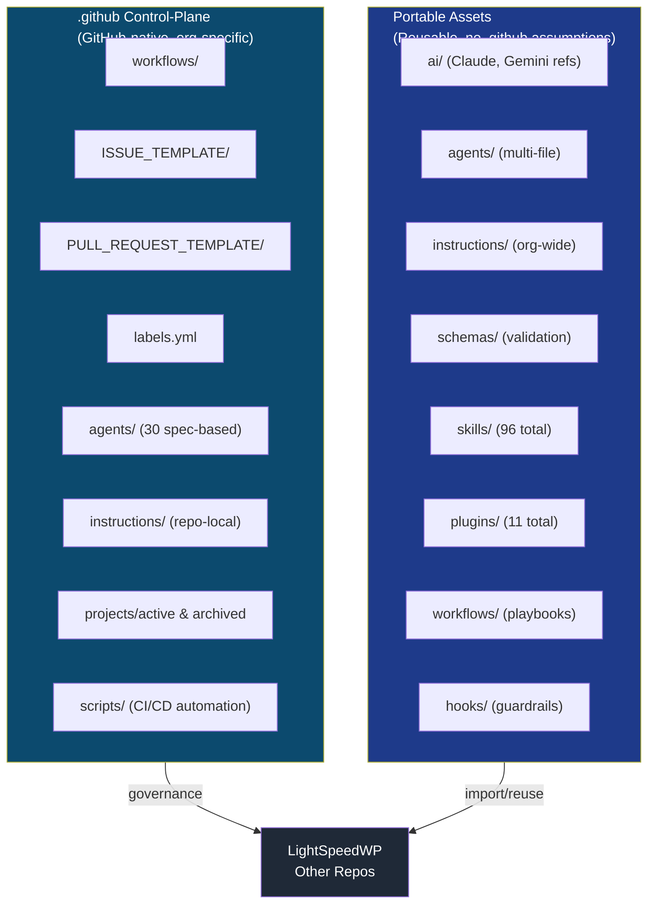

# LightSpeed Community Health and Automation Repository

The **LightSpeed `.github` organisation control plane** — central governance, automation, and portable AI operations assets for the entire LightSpeedWP ecosystem.

This repository is the canonical source for:

- ✅ **Community health files** — issue templates, PR templates, discussion templates, saved replies, code of conduct, security policy
- ✅ **Organization-wide governance** — labels, labeling rules, issue types, branch policies
- ✅ **GitHub Actions workflows** — labeling, validation, metrics, releases, CI/CD automation
- ✅ **Portable AI operations assets** — reusable agents, instructions, skills, schemas, plugins, workflows
- ✅ **Instructions and standards** — coding standards, accessibility (WCAG 2.2 AA), PR/issue conventions, documentation formats
- ✅ **Automation playbooks** — recipes, cookbook patterns, implementation guides

---

## Repository Status

| Component | Status | Details |
|-----------|--------|---------|
| **Architecture** | ✅ Stable | Two-tier agent model active; 30 GitHub-native agents |
| **Documentation** | ✅ Current | Phase 1 audits complete; all assets mapped and catalogued |
| **Schema Registry** | ✅ Canonical | `schemas/` is the authoritative source for all JSON schemas |
| **Release Workflow** | ✅ v5.0 Active | Develop-first stacked PR flow with agentic gates |
| **Tests** | ✅ Passing | 227+ comprehensive test coverage (Phase 3B & 4A) |
| **CI/CD** | ✅ Automated | Branch protection, automatic labeling, validation gates |

---

## Repository Structure

### Control-Plane Assets (`.github/`)

GitHub-native governance, workflows, and repository configuration:

```
.github/
├── workflows/                    # GitHub Actions automation
│   ├── labeler.yml              # Auto-labeling for PRs and issues
│   ├── validation.yml           # Linting, testing, security checks
│   ├── release.yml              # Release automation with agentic gates
│   ├── changelog-sync.yml       # Changelog validation and formatting
│   ├── main-branch-guard.yml    # Enforce release-only merges to main
│   └── ai-feedback-validation.yml # Track AI feedback in PRs
├── ISSUE_TEMPLATE/              # Issue template routing and variants
│   ├── config.yml              # Route map for 19 issue types
│   ├── 01-bug.md
│   ├── 03-feature.md
│   └── ...
├── PULL_REQUEST_TEMPLATE/       # PR template routing
│   ├── config.yml              # Route map for branch-type templates
│   ├── pr_feature.md
│   ├── pr_bug.md
│   └── ...
├── labels.yml                   # Canonical 158+ label definitions
├── agents/                      # 30 GitHub-native spec-based agents
│   └── *.agent.md              # Single-file agent specifications
├── instructions/               # Repository-local instructions
├── scripts/                    # Workflow and utility scripts
├── projects/                   # Active and archived project artefacts
│   ├── active/
│   └── archived/
├── reports/                    # Audit reports, metrics, analysis
├── tests/                      # GitHub-specific test fixtures
└── custom-instructions.md      # Copilot-specific control-plane rules
```

### Portable AI Operations Assets (root level)

Reusable across the LightSpeedWP ecosystem; located at repository root:

```
ai/                             # Canonical AI references
├── Claude.md                   # Claude usage standards
├── Gemini.md                   # Google Gemini standards
└── RUNNERS.md                  # CI/CD runner configurations

agents/                         # Multi-file agent implementations
├── PRD-Agent/
├── Playwright-Testing-Agent/
└── ... (16 portable agents)

instructions/                   # Organization-wide portable standards
├── README.md                   # Instruction index
├── a11y.instructions.md        # WCAG 2.2 AA standards
├── coding-standards.instructions.md
├── documentation-formats.instructions.md
├── pull-requests.instructions.md
└── community-standards.instructions.md

schemas/                        # Canonical JSON schema registry
├── README.md                   # Schema inventory
├── frontmatter.schema.json     # Markdown frontmatter validation
├── agent.schema.json           # Agent specification validation
├── skill.schema.json
├── plugin.schema.json
└── ... (25+ core schemas)

skills/                         # Self-contained skills (96 total)
├── lightspeed-prd-generator/
├── wordpress-custom-template-generator/
└── ... (94 more skills)

plugins/                        # Installable plugin bundles (11 total)
├── plugin-name/
└── ...

workflows/                      # Portable agentic workflow playbooks
├── README.md
└── *.workflow.md

hooks/                          # Portable guardrail hooks and utilities
├── README.md
└── ...

cookbook/                       # Recipes and implementation playbooks
├── README.md
├── patterns/
└── guides/

prompts/                        # Reusable prompt templates
├── agent-prompts/
├── instruction-prompts/
└── skill-prompts/

docs/                           # Human-facing governance documentation (100+ pages)
├── ARCHITECTURE.md
├── BRANCHING_STRATEGY.md
├── RELEASE_PROCESS.md
├── AGENT_CREATION.md
├── AI_FEEDBACK_SYSTEM_SUMMARY.md
├── LABELING.md
├── LABEL_STRATEGY.md
├── ISSUE_MAINTENANCE_SCRIPTS.md
└── ... (100+ reference documents)

tests/                          # Portable test utilities and fixtures
├── README.md
├── helpers/
└── fixtures/
```

---

## Key Capabilities

### 🏗️ Community Health Governance

- **19 issue templates** with DoR/DoD sections (bug, feature, epic, story, task, design, accessibility, security, performance, compatibility, etc.)
- **15 PR templates** routed by branch type (feature, fix, hotfix, docs, chore, release, etc.)
- **Discussion templates** for announcements, Q&A, polls
- **158+ organization-wide labels** with family prefixes (type:, status:, priority:, area:, meta:)
- **Saved replies** for common scenarios

### 🤖 Automation & Workflows

- **Labeler workflow** — Auto-apply labels based on content patterns
- **Validation workflow** — Linting, testing, security scanning, changelog validation
- **Release workflow** — Automated version bumping, changelog generation, tagging
- **Branch protection** — Enforce naming conventions, validation gates on main/develop
- **Metrics collection** — Daily organization-wide activity and health metrics
- **PR auto-rebase** — Mergify sequential queue with automatic base-branch rebase

### 🧠 AI Operations

| Asset Type | Count | Status | Location |
|------------|-------|--------|----------|
| **Agents** | 30 | ✅ Active | `.github/agents/` (spec-based) |
| **Skills** | 96 | ✅ Active | `skills/` (self-contained) |
| **Plugins** | 11 | ✅ Active | `plugins/` (bundled) |
| **Schemas** | 25+ | ✅ Canonical | `schemas/` (JSON validation) |
| **Instructions** | 6+ portable | ✅ Portable | `instructions/` (reusable) |
| **Workflows** | 10+ | ✅ Playbooks | `workflows/` (agentic patterns) |

### 📋 Governance & Standards

- **Branch naming discipline** — Format: `{type}/{scope}-{short-title}` with 21+ prefixes (feat/, fix/, docs/, chore/, ci/, security/, etc.)
- **PR merge protocol** — Squash merge to `develop`, strict main-branch protection
- **Label taxonomy** — Hierarchical family-prefix system (type, status, priority, area, meta)
- **Instruction standards** — Frontmatter + role + overview + rules + guidance + examples + validation
- **Documentation standards** — Markdown with consistent formatting, YAML validation, Mermaid diagrams
- **Accessibility baseline** — WCAG 2.2 AA minimum for all public-facing content

### 📊 Release Workflow (v5.0)

Develop-first stacked PR flow with agentic gates:

```
Feature Complete (develop)
  → PR #1: develop (code review)
  → Merge to develop
  → Trigger release workflow
  → Release Agent: version + changelog bump
  → PR #2: release/vX.Y.Z → develop (review)
  → Merge changelog update to develop
  → PR #3: release/vX.Y.Z → main (stacked)
  → Merge to main, tag published
  → Post-release sync: main → develop (automatic)
```

See **[RELEASE_PROCESS.md](./docs/RELEASE_PROCESS.md)** for complete details.

---

## System Architecture

### Data Flow: GitHub Event → Automation → Policy Enforcement

```mermaid
graph LR
    A["GitHub Event<br/>(issue, PR, push)"]
    B["GitHub Actions<br/>Workflow"]
    C["Validation Layer<br/>(lint, test, security)"]
    D["Policy Enforcement<br/>(labels, branch checks)"]
    E["Automated Actions<br/>(comments, status, sync)"]
    F["Organization-wide<br/>Consistency"]

    A -->|triggers| B
    B -->|executes| C
    C -->|enforces| D
    D -->|executes| E
    E -->|maintains| F

    style A fill:#1e3a8a,color:#fff
    style B fill:#1e40af,color:#fff
    style C fill:#2563eb,color:#fff
    style D fill:#3b82f6,color:#fff
    style E fill:#60a5fa,color:#fff
    style F fill:#93c5fd,color:#fff
```



### Issue Lifecycle: Creation → Triage → Resolution → Tracking

```mermaid
graph TD
    A["Issue Created"]
    B["Template Validation"]
    C["Auto-Labeling"]
    D["Team Routing"]
    E["Status Tracking"]
    F["Resolution & Docs"]
    G["Changelog Entry"]

    A -->|template check| B
    B -->|DoR/DoD validated| C
    C -->|labels applied| D
    D -->|routed by type| E
    E -->|status:in-progress| F
    F -->|completed| G

    style A fill:#7c2d12,color:#fff
    style B fill:#92400e,color:#fff
    style C fill:#b45309,color:#fff
    style D fill:#d97706,color:#fff
    style E fill:#f59e0b,color:#fff
    style F fill:#fbbf24,color:#fff
    style G fill:#fcd34d,color:#333

    linkStyle 0,1,2,3,4,5,6 stroke:#ea580c,stroke-width:2px
```

### Release Workflow: Develop-First Stacked PR Model

```mermaid
graph LR
    A["develop<br/>Feature Branch<br/>Merged"]
    B["Trigger<br/>Release Workflow"]
    C["PR #1<br/>release/vX.Y.Z<br/>→ develop"]
    D["PR #2<br/>release/vX.Y.Z<br/>→ main"]
    E["main<br/>Tagged & Released"]
    F["Post-Release Sync<br/>main → develop"]

    A -->|manual trigger| B
    B -->|version bump| C
    C -->|merge changelog| D
    D -->|merge tag| E
    E -->|sync complete| F

    style A fill:#065f46,color:#fff
    style B fill:#047857,color:#fff
    style C fill:#059669,color:#fff
    style D fill:#10b981,color:#fff
    style E fill:#34d399,color:#fff
    style F fill:#6ee7b7,color:#fff

    linkStyle 0,1,2,3,4,5 stroke:#10b981,stroke-width:2px
```

### Repository Boundaries: Control-Plane vs Portable Assets



---

## Canonical Reference Paths

| Asset Type | Location | Purpose |
|------------|----------|---------|
| **GitHub workflows** | `.github/workflows/` | GitHub Actions automation |
| **Issue templates** | `.github/ISSUE_TEMPLATE/` | 19 categorized issue types |
| **PR templates** | `.github/PULL_REQUEST_TEMPLATE/` | Branch-type routed templates |
| **Labels** | `.github/labels.yml` | 158+ canonical label definitions |
| **GitHub-native agents** | `.github/agents/` | 30 spec-based automation agents |
| **Control-plane instructions** | `.github/instructions/` | Repository-local copilot rules |
| **Portable instructions** | `instructions/` | Organization-wide standards |
| **Schema registry** | `schemas/` | JSON validation (frontmatter, agents, plugins, skills) |
| **Reusable skills** | `skills/` | 96 self-contained skills |
| **Installable plugins** | `plugins/` | 11 bundled plugins |
| **AI references** | `ai/` | Claude, Gemini, runner configs |
| **Agentic workflows** | `workflows/` | Reusable workflow patterns |
| **Documentation** | `docs/` | 100+ governance and process guides |

---

## Quick Start

### For Contributors

1. **Read the contributing guide** — [CONTRIBUTING.md](./CONTRIBUTING.md)
2. **Learn branch conventions** — [docs/BRANCHING_STRATEGY.md](./docs/BRANCHING_STRATEGY.md)
3. **Follow PR process** — [docs/PR_CREATION_PROCESS.md](./docs/PR_CREATION_PROCESS.md)
4. **Understand AI feedback tracking** — [docs/QUICK_REFERENCE_AI_FEEDBACK.md](./docs/QUICK_REFERENCE_AI_FEEDBACK.md)

### For Release Managers

1. **Read release process** — [docs/RELEASE_PROCESS.md](./docs/RELEASE_PROCESS.md)
2. **Review agentic gates** — [docs/AGENTIC_RELEASE_USER_GUIDE.md](./docs/AGENTIC_RELEASE_USER_GUIDE.md)
3. **Understand branch cleanup** — [docs/BRANCH_CLEANUP.md](./docs/BRANCH_CLEANUP.md)

### For Infrastructure Maintainers

1. **Review architecture** — [docs/ARCHITECTURE.md](./docs/ARCHITECTURE.md)
2. **Study labeling system** — [docs/LABEL_STRATEGY.md](./docs/LABEL_STRATEGY.md) + [docs/LABELING.md](./docs/LABELING.md)
3. **Learn issue automation** — [docs/ISSUE_MAINTENANCE_SCRIPTS.md](./docs/ISSUE_MAINTENANCE_SCRIPTS.md)
4. **Understand agent specs** — [docs/AGENT_STANDARDS.md](./docs/AGENT_STANDARDS.md)

### For AI Operations

1. **Read global governance** — [AGENTS.md](./AGENTS.md)
2. **Check instruction standards** — [docs/DOCUMENTATION_STANDARDS.md](./docs/DOCUMENTATION_STANDARDS.md)
3. **Review AI feedback system** — [docs/AI_FEEDBACK_SYSTEM_SUMMARY.md](./docs/AI_FEEDBACK_SYSTEM_SUMMARY.md)
4. **Create new agents** — [docs/AGENT_CREATION.md](./docs/AGENT_CREATION.md)

---

## Development Commands

```bash
# Install dependencies
npm ci

# Run all tests
npm test

# Lint Markdown and JavaScript
npm run lint:md && npm run lint:js

# Format code
npm run format

# Validate frontmatter
npm run validate:frontmatter

# Validate branch naming
npm run validate:branch-name -- --branch $(git branch --show-current)
```

---

## Key Governance Rules

### ✋ Critical: Branch Naming Discipline

**Format:** `{type}/{scope}-{short-title}` (lowercase, kebab-case)

**Valid prefixes:** `feat/`, `fix/`, `hotfix/`, `docs/`, `chore/`, `ci/`, `test/`, `refactor/`, `security/`, `design/`, `a11y/`, `ux/`, `perf/`, `deps/`, `build/`, `release/`

**Examples:**
- ✅ `feat/readme-rewrite-diagrams`
- ✅ `fix/branch-validation-regex`
- ✅ `docs/update-contributing-guide`
- ✅ `release/v1.2.0`

**Invalid:**
- ❌ `claude/readme-rewrite` (claude/ prefix forbidden)
- ❌ `fix-branch-validation` (missing type prefix)
- ❌ `hotfix/URGENT-FIX` (not kebab-case)

### 🔒 Branch Protection

- **`develop`** — Integration branch; all features merge here first
- **`main`** — Production-only; merges from `release/*` and `hotfix/*` branches only
- **Feature/fix branches** — Temporary; deleted after merge (strict cleanup protocol)

### 🏷️ Label Rules

**ALL labels MUST have family prefix from `.github/labels.yml`:**

- ✅ `type:bug`, `type:feature`, `type:task`
- ✅ `status:in-progress`, `status:needs-review`
- ✅ `priority:critical`, `priority:normal`
- ✅ `area:ci`, `area:docs`, `area:security`
- ✅ `meta:needs-changelog`, `meta:has-pr`

- ❌ `bug`, `feature`, `urgent` (bare labels forbidden)

---

## Documentation Index

### Essential Reading

| Document | Purpose | Audience |
|----------|---------|----------|
| [AGENTS.md](./AGENTS.md) | Global AI governance and standards | All AI operators |
| [CLAUDE.md](./CLAUDE.md) | Repository operating rules and release governance | All contributors |
| [docs/BRANCHING_STRATEGY.md](./docs/BRANCHING_STRATEGY.md) | Git discipline and branch naming | All developers |
| [docs/RELEASE_PROCESS.md](./docs/RELEASE_PROCESS.md) | Release workflow with agentic gates | Release managers |

### Process & Workflow

- [docs/ARCHITECTURE.md](./docs/ARCHITECTURE.md) — System design overview
- [docs/AUTOMATION.md](./docs/AUTOMATION.md) — Workflow automation patterns
- [docs/PR_CREATION_PROCESS.md](./docs/PR_CREATION_PROCESS.md) — PR guidelines
- [docs/BRANCH_CLEANUP.md](./docs/BRANCH_CLEANUP.md) — Branch deletion protocol
- [docs/CHANGELOG_AUTOMATION.md](./docs/CHANGELOG_AUTOMATION.md) — Changelog standards

### Governance & Standards

- [docs/LABELING.md](./docs/LABELING.md) — Labeling standards and conventions
- [docs/LABEL_STRATEGY.md](./docs/LABEL_STRATEGY.md) — Label taxonomy and family prefixes
- [docs/LABEL_MANAGEMENT_CLI.md](./docs/LABEL_MANAGEMENT_CLI.md) — Label orchestrator CLI reference
- [docs/ISSUE_MAINTENANCE_SCRIPTS.md](./docs/ISSUE_MAINTENANCE_SCRIPTS.md) — Issue automation
- [instructions/README.md](./instructions/README.md) — Portable standards index

### AI Operations

- [docs/AGENT_CREATION.md](./docs/AGENT_CREATION.md) — Creating new agents
- [docs/AGENT_STANDARDS.md](./docs/AGENT_STANDARDS.md) — Agent specification standards
- [docs/DOCUMENTATION_STANDARDS.md](./docs/DOCUMENTATION_STANDARDS.md) — Writing docs, instructions, skills
- [docs/AI_FEEDBACK_SYSTEM_SUMMARY.md](./docs/AI_FEEDBACK_SYSTEM_SUMMARY.md) — AI feedback tracking
- [ai/Claude.md](./ai/Claude.md) — Claude usage standards

### Advanced Topics

- [docs/AGENTIC_RELEASE_ADMIN_GUIDE.md](./docs/AGENTIC_RELEASE_ADMIN_GUIDE.md) — Release infrastructure
- [docs/AWESOME_GITHUB_MAPPING_STRATEGY.md](./docs/AWESOME_GITHUB_MAPPING_STRATEGY.md) — Schema alignment
- [.github/projects/active/repo-restructuring-2026-07-25/](./.github/projects/active/repo-restructuring-2026-07-25/) — Phase 1 audit reports

---

## What's Inside

### Workflows & Automation (14+ active)

- **labeler.yml** — Auto-apply labels to PRs and issues
- **validation.yml** — Lint, test, security scan, changelog validation
- **release.yml** — Automated release with version bumping and tagging
- **main-branch-guard.yml** — Enforce release-only branch policy on main
- **changelog-sync.yml** — Keep changelog in sync with merges
- **ai-feedback-validation.yml** — Track AI feedback in PR comments
- **template-enforcement.yml** — Validate issue DoR/DoD sections
- **metrics.yml** — Daily organization-wide activity collection
- **dependency-updates.yml** — Automated dependency management
- Plus 5+ utility and housekeeping workflows

### Agents & Automation (30+ GitHub-native)

All in `.github/agents/`:

- Release agent — Version bumping and changelog generation
- Labeling agents — Content-based label application (10+ variants)
- Validation agents — Linting, testing, security scanning
- Metrics agent — Organization health collection
- Review agents — Code quality and standards checking
- Plus 10+ utility and specialized agents

### Skills Library (96 total)

Includes:

- **WordPress-specific** — Template generators, block validators, theme auditors
- **AI & LLM** — PRD generator, requirements traceability, AI readiness assessor
- **Project management** — Task breakdown, scope change control, launch readiness
- **Design & UX** — Design system application, Figma sync, token generation
- **DevOps & Infrastructure** — CI/CD pipelines, deployment automation
- And 76+ more specialized and general-purpose skills

---

## Project Organization

### Active Projects

Active initiative tracking and deliverables at [`.github/projects/active/`](./.github/projects/active/):

| Project | Purpose | Status |
|---------|---------|--------|
| [repo-restructuring-2026-07-25](.//.github/projects/active/repo-restructuring-2026-07-25/) | Phase 1 audit & consolidation | ✅ Complete (Phase 1) |
| [issue-maintenance-scripts-2026-08-10](.//.github/projects/active/issue-maintenance-scripts-2026-08-10/) | Automation and triage workflows | 🔄 Phase 5 (integration) |
| [label-prefix-enforcement-2026-08-05](.//.github/projects/active/label-prefix-enforcement-2026-08-05/) | Family-prefix governance | ✅ Complete |

### Archived Projects

Completed initiatives at [`.github/projects/archived/`](./.github/projects/archived/) — see `.archive-status.md` in each project for completion summary.

---

## Contributing

1. **Clone and set up:**
   ```bash
   git clone https://github.com/lightspeedwp/.github.git
   cd .github
   npm ci
   ```

2. **Create a branch** following the naming convention:
   ```bash
   git checkout -b {type}/{scope}-{short-title}
   ```

3. **Make changes** and run validation:
   ```bash
   npm run lint:md
   npm run lint:js
   npm test
   ```

4. **Commit with clear messages:**
   ```bash
   git commit -m "type(scope): Short description of change"
   ```

5. **Push and create PR:**
   ```bash
   git push -u origin {branch-name}
   ```

6. **Follow PR guidelines** — Link to issues, use correct template, address review feedback

---

## Support & Resources

- **Issues** — [GitHub Issues](https://github.com/lightspeedwp/.github/issues)
- **Discussions** — [GitHub Discussions](https://github.com/lightspeedwp/.github/discussions)
- **Security** — [Security Policy](./SECURITY.md)
- **Code of Conduct** — [Community Guidelines](./CODE_OF_CONDUCT.md)
- **Sponsorship** — [Support LightSpeedWP](https://github.com/sponsors/lightspeedwp/)

---

## Repository Metadata

| Property | Value |
|----------|-------|
| **Organization** | LightSpeedWP |
| **Repository** | `.github` (organization control plane) |
| **Accessibility** | WCAG 2.2 AA compliant |
| **License** | GPL-3.0-or-later |
| **NPM Package** | [@lightspeedwp/github-community-health](https://www.npmjs.com/package/@lightspeedwp/github-community-health) |
| **Version** | 0.2.0 |
| **Status** | ✅ Production active |
| **Last Updated** | 2026-08-20 |

---

**Built by 🧱 LightSpeedWP with ☕, 🚀, and open-source spirit!**
