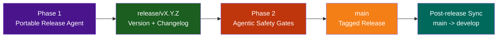

# LightSpeed Community Health and Automation Repository

This repository is the LightSpeed `.github` control plane and canonical source for shared governance, templates, labels, workflows, and reusable AI operations assets.

## Current Status

- Phase 1 instruction, schema, and agent audits are complete.
- Two-tier agent model is active:
  - Portable multi-file agents in `agents/`.
  - Spec-based GitHub-native agents in `.github/agents/`.
- Canonical schema path is `schemas/`.
- Release process is v4.0 with two-phase agentic gates. See `docs/RELEASE_PROCESS.md`.

## Canonical Paths

- `instructions/` — Portable instruction standards.
- `.github/instructions/` — Repo-local control-plane instructions.
- `agents/` — Portable multi-file agents.
- `.github/agents/` — Spec-based control-plane agents.
- `schemas/` — Canonical JSON schema definitions.
- `.github/reports/` — Audit and analysis reporting.

## Top-Level Documentation

- `AGENTS.md` — Global AI governance rules.
- `CLAUDE.md` — Repo-specific operating rules and release governance.
- `docs/README.md` — Documentation index.
- `instructions/README.md` — Portable instruction index.
- `schemas/README.md` — Schema inventory and validation guidance.

## Repository Structure

```text
.github/                       # GitHub-native control-plane assets
agents/                        # Portable multi-file agents
ai/                            # Canonical AI references
cookbook/                      # Implementation playbooks
docs/                          # Human-facing governance and process docs
hooks/                         # Portable guardrail hooks
instructions/                  # Portable standards
plugins/                       # Installable plugin bundles
prompts/                       # Reusable prompt templates
schemas/                       # Canonical JSON schemas
scripts/                       # Automation scripts
skills/                        # Reusable skills
tests/                         # Test suites
website/                       # Public site source
workflows/                     # Portable workflow playbooks
```

## Governance Flow


## Release Lifecycle



## Quick Start

1. Read `CONTRIBUTING.md` for contribution workflow.
2. Read `docs/BRANCHING_STRATEGY.md` for branch and PR policy.
3. Use `npm run lint-all` and `npm test` before opening a PR.
4. Follow `docs/RELEASE_PROCESS.md` for releases.
