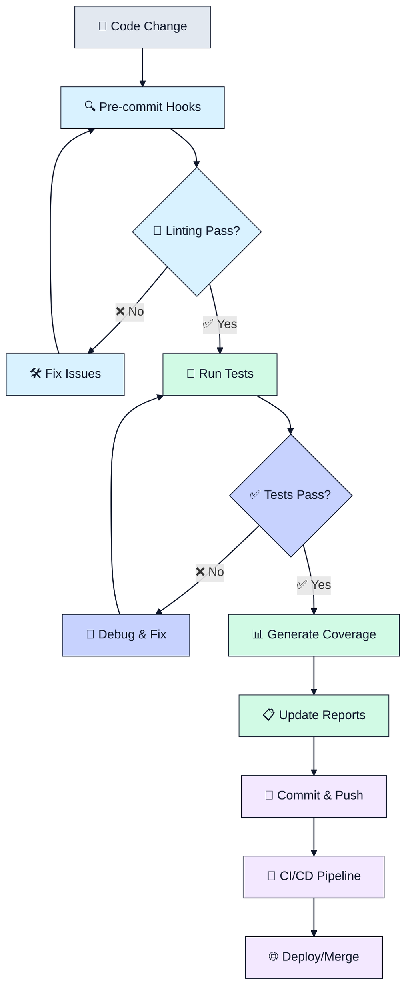
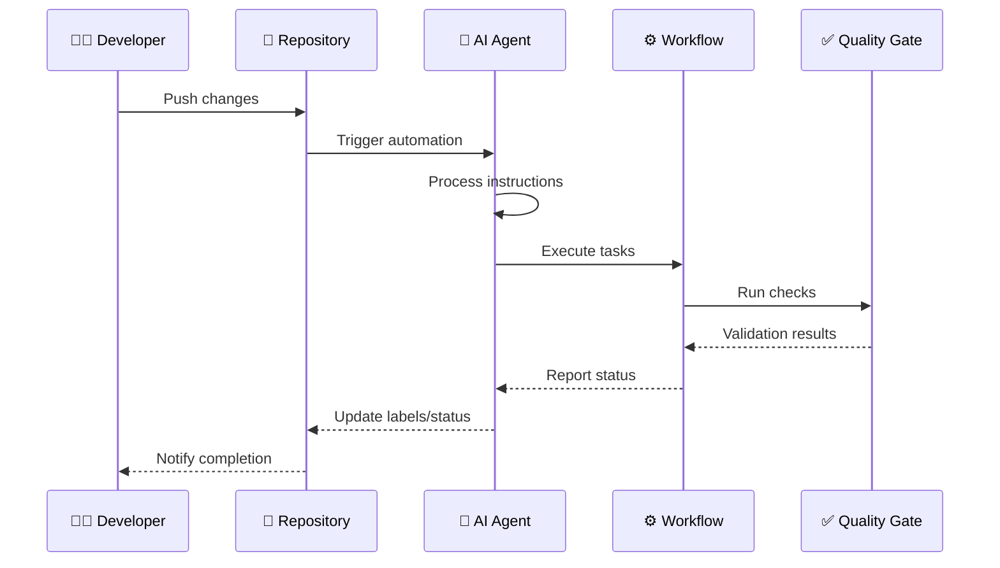
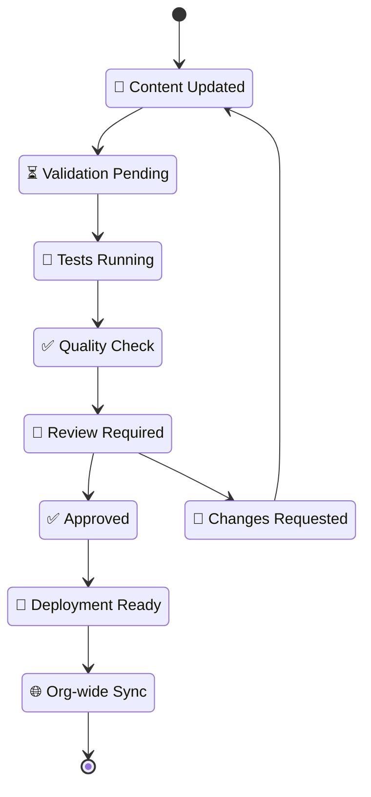
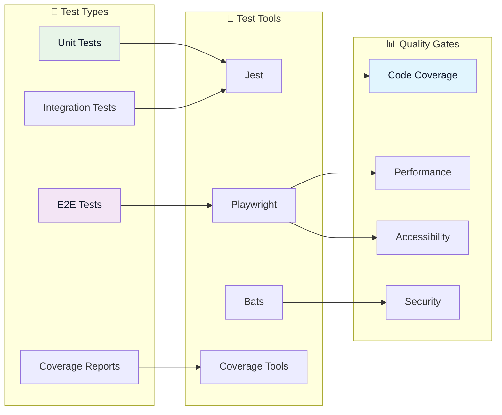

# 🏠 LightSpeed Community Health & Automation Repository

[](./tests/TEST_COVERAGE_SUMMARY.md)
[](https://www.gnu.org/licenses/gpl-3.0)
[](https://github.com/lightspeedwp/.github/actions)
[](./docs/README.md)
[](./AGENTS.md)
[](.github/workflows/)

This repository is the **central hub** for the LightSpeed organization's community health files, automation standards, label and issue type management, governance documentation, and org-wide resources on GitHub usage and contribution. All member repositories reference and inherit canonical files, workflows, and instructions from here—making it the backbone for consistency, quality, and automated project management across LightSpeed.

For comprehensive documentation, see the [docs/](./docs/) folder and [.github/README.md](./.github/README.md) for repository-specific guidance.

## 🔗 Related Documentation

### 📚 Quick Start

- [CONTRIBUTING.md](./CONTRIBUTING.md) - How to contribute
- [CODE_OF_CONDUCT.md](./CODE_OF_CONDUCT.md) - Community standards
- [SUPPORT.md](./SUPPORT.md) - Getting help

### 🤖 AI & Automation

- [AGENTS.md](./AGENTS.md) - Global AI rules and agent overview
- [.github/custom-instructions.md](./.github/custom-instructions.md) - Copilot configuration
- [agents/agent.md](agents/agent.md) - Agent specifications
- [.github/prompts/prompts.md](./.github/prompts/prompts.md) - Prompt library

### Portable AI Source Folders

- [.schemas/README.md](./.schemas/README.md) - Portable schema ownership
- [agents/README.md](./agents/README.md) - Portable agent specs
- [cookbook/README.md](./cookbook/README.md) - Recipes and examples
- [hooks/README.md](./hooks/README.md) - Hooks and guardrails
- [instructions/README.md](./instructions/README.md) - Portable instruction scope
- [plugins/README.md](./plugins/README.md) - Plugin family strategy
- [skills/README.md](./skills/README.md) - Skill folder rules
- [workflows/README.md](./workflows/README.md) - Agentic workflow boundary

### 📖 Standards & Guidelines

- [instructions/coding-standards.instructions.md](instructions/coding-standards.instructions.md) - Coding standards
- [instructions/languages.instructions.md](instructions/languages.instructions.md) - Language-specific standards
- [instructions/automation.instructions.md](instructions/automation.instructions.md) - Automation standards

### 🏷️ Labels & Issue Management

- [.github/labels.yml](./.github/labels.yml) - Canonical label definitions
- [.github/labeler.yml](./.github/labeler.yml) - Labeler automation rules
- [.github/issue-types.yml](./.github/issue-types.yml) - Issue type definitions
- [docs/AUTOMATION_GOVERNANCE.md](./docs/AUTOMATION_GOVERNANCE.md) - Automation governance

### 📋 Issue & PR Templates

- [.github/ISSUE_TEMPLATE/](./.github/ISSUE_TEMPLATE/) - Issue templates
- [.github/PULL_REQUEST_TEMPLATE/](./.github/PULL_REQUEST_TEMPLATE/) - PR templates
- [docs/ISSUE_CREATION_GUIDE.md](./docs/ISSUE_CREATION_GUIDE.md) - How to create issues
- [docs/PR_CREATION_PROCESS.md](./docs/PR_CREATION_PROCESS.md) - How to create PRs

### 🔧 Configuration & Setup

- [docs/CONFIGS.md](./docs/CONFIGS.md) - Configuration documentation
- [docs/BRANCHING_STRATEGY.md](./docs/BRANCHING_STRATEGY.md) - Git branching strategy
- [DEVELOPMENT.md](./DEVELOPMENT.md) - Development setup

---

## 📊 Repository Structure

[Keep existing structure, but simplify the overview]

.github/ # Community health files
├── custom-instructions.md # Copilot configuration
├── labels.yml # Canonical labels
├── labeler.yml # Labeler rules
├── issue-types.yml # Issue type definitions
├── instructions/ # Repo-local placement rules and migration archive
├── agents/ # Agent specifications
├── prompts/ # Reusable prompts
├── workflows/ # GitHub Actions workflows
└── PULL_REQUEST_TEMPLATE/ # PR templates

instructions/ # Portable reusable instruction files
docs/ # Governance and strategy documentation
scripts/ # Automation scripts and utilities
tests/ # Test suites

---

## 🚀 Getting Started

1. **New Contributor?** Start with [CONTRIBUTING.md](./CONTRIBUTING.md)
2. **Setting up development?** See [DEVELOPMENT.md](./DEVELOPMENT.md)
3. **Need coding standards?** Check [instructions/coding-standards.instructions.md](instructions/coding-standards.instructions.md)
4. **Automation questions?** Read [docs/AUTOMATION_GOVERNANCE.md](./docs/AUTOMATION_GOVERNANCE.md)

---

## 📊 Repository Architecture

The diagram below highlights how the key .github directories (community health, automation, labeling, AI, documentation, and testing) interconnect to uphold LightSpeed governance, automation, and quality practices.

```mermaid
graph TD
accTitle: "Repository architecture overview"
accDescr {
  High-level view of the .github repository structure, showing community health files, automation workflows, canonical labels, AI/collaboration resources, supporting documentation, and testing artefacts.
}
    A[🏠 LightSpeed .github Repository] --> B[📁 Community Health Files]
    A --> C[🤖 Automation & Workflows]
    A --> D[🏷️ Labels & Issue Types]
    A --> E[🧠 AI & Copilot Resources]
    A --> F[📚 Documentation]
    A --> G[🧪 Testing & Quality]

    B --> B1[CONTRIBUTING.md]
    B --> B2[CODE_OF_CONDUCT.md]
    B --> B3[SUPPORT.md]
    B --> B4[Issue Templates]
    B --> B5[PR Templates]

    C --> C1[GitHub Actions]
    C --> C2[Labeler Configuration]
    C --> C3[Project Automation]
    C --> C4[Quality Gates]

    D --> D1[labels.yml]
    D --> D2[issue-types.yml]
    D --> D3[Label Documentation]

    E --> E1[Custom Instructions]
    E --> E2[Agent Specifications]
    E --> E3[Prompt Library]

    F --> H[LINTING.md]
    F --> I[HUSKY_PRECOMMITS.md]
    F --> J[docs/config/]
    F --> K[AUTOMATION_GOVERNANCE.md]
    F --> L[LABEL_STRATEGY.md]
    F --> M[LABELING.md]
    F --> N[README Sections]

    G --> O[Unit Tests]
    G --> P[Integration Tests]
    G --> Q[E2E Tests]
    G --> R[Coverage Reports]

    classDef core fill:#e2e8f0,stroke:#0f172a,color:#0f172a,stroke-width:2px
    classDef docs fill:#d1fae5,stroke:#0f172a,color:#0f172a,stroke-width:2px
    classDef automation fill:#d9f2ff,stroke:#0f172a,color:#0f172a,stroke-width:2px
    classDef automation-sub fill:#c7d2fe,stroke:#0f172a,color:#0f172a,stroke-width:2px
    classDef label fill:#fee2e2,stroke:#0f172a,color:#0f172a,stroke-width:2px
    classDef label-sub fill:#ffe4e6,stroke:#0f172a,color:#0f172a,stroke-width:2px
    classDef ai fill:#f3e8ff,stroke:#0f172a,color:#0f172a,stroke-width:2px
    classDef ai-sub fill:#fef3c7,stroke:#0f172a,color:#0f172a,stroke-width:2px
    classDef docs-sub fill:#e0f2fe,stroke:#0f172a,color:#0f172a,stroke-width:2px
    classDef testing fill:#ecfccb,stroke:#0f172a,color:#0f172a,stroke-width:2px
    classDef testing-sub fill:#bae6fd,stroke:#0f172a,color:#0f172a,stroke-width:2px

    class A core
    class B core
    class B1 docs-sub
    class B2 docs-sub
    class B3 docs-sub
    class B4 docs-sub
    class B5 docs-sub
    class C automation
    class C1 automation-sub
    class C2 automation-sub
    class C3 automation-sub
    class C4 automation-sub
    class D label
    class D1 label-sub
    class D2 label-sub
    class D3 label-sub
    class E ai
    class E1 ai-sub
    class E2 ai-sub
    class E3 ai-sub
    class F docs
    class H docs-sub
    class I docs-sub
    class J docs-sub
    class K docs-sub
    class L docs-sub
    class M docs-sub
    class N docs-sub
    class G testing
    class O testing-sub
    class P testing-sub
    class Q testing-sub
    class R testing-sub

    linkStyle default stroke:#0f172a,stroke-width:1.4px

  ```

## 🔄 Comprehensive Workflow Overview

### Repository Inheritance & Automation Flow

The next diagram tracks how repository inheritance feeds automation and AI integration phases to uphold consistent governance across LightSpeed repositories.

```mermaid
flowchart LR
accTitle: "Inheritance and automation flow"
accDescr {
  Shows how canonical community health files propagate through automation workflows and AI integration to enforce labels, standards, and governance.
}
  subgraph "Repository Inheritance"
    A[LightSpeed Repo] --> B[Inherits Health Files]
    B --> C[Applies Labels & Types]
    C --> D[Uses Workflows]
    D --> E[Follows Standards]
  end

  subgraph "Automation Flow"
    F[Issue/PR Created] --> G[Auto-Label Applied]
    G --> H[Project Sync]
    H --> I[Quality Checks]
    I --> J[Governance Review]
  end

  subgraph "AI Integration"
    K[Copilot Instructions] --> L[Agent Processing]
    L --> M[Automated Tasks]
    M --> N[Quality Assurance]
  end

  classDef repo fill:#e2e8f0,stroke:#0f172a,color:#0f172a
  classDef automation fill:#d9f2ff,stroke:#0f172a,color:#0f172a
  classDef ai fill:#f3e8ff,stroke:#0f172a,color:#0f172a
  classDef development fill:#c7d2fe,stroke:#0f172a,color:#0f172a
  classDef review fill:#fef3c7,stroke:#0f172a,color:#0f172a

  class A repo
  class B repo
  class C repo
  class D repo
  class E repo
  class F automation
  class G automation
  class H development
  class I development
  class J review
  class K ai
  class L ai
  class M development
  class N review

  linkStyle default stroke:#0f172a,stroke-width:1.4px
```

### Development Workflow Process

This flowchart walks through the development workflow (lint, test, coverage, deployment) and shows how failures redirect engineers back to fix issues before progressing.



### AI & Automation Integration Pipeline

The sequence diagram below traces how a developer push triggers AI agents, workflows, and validation gates that close the loop with repository feedback.



## 🎯 Repository Overview

This comprehensive workflow diagram illustrates the complete ecosystem of the LightSpeed .github repository, showing how community health files, automation systems, AI integration, and quality gates work together to maintain consistent standards across all organization repositories.

### Complete Repository Ecosystem Flow

```mermaid
flowchart TB
  accTitle: Complete Repository Ecosystem Flow
  accDescr: Flowchart diagram showing complete repository ecosystem flow
    subgraph "📁 Core Repository Structure"
        A[🏠 .github Repository]
        B[📋 Community Health Files]
        C[🤖 Automation & Workflows]
        D[🏷️ Labels & Issue Types]
        E[🧠 AI & Copilot Resources]
        F[📚 Documentation]
        G[🧪 Testing & Quality]
    end

    subgraph "🔄 Automation Pipeline"
        H[Issue/PR Created]
        I[Auto-Label Applied]
        J[Quality Checks Run]
        K[AI Processing]
        L[Governance Review]
        M[Project Sync]
    end

    subgraph "🎯 Quality Gates"
        N[Linting]
        O[Testing]
        P[Coverage]
        Q[Security]
        R[Accessibility]
    end

    subgraph "🌐 Organization Impact"
        S[Member Repositories]
        T[Consistent Standards]
        U[Automated Workflows]
        V[Quality Assurance]
    end

    A --> B
    A --> C
    A --> D
    A --> E
    A --> F
    A --> G

    H --> I
    I --> J
    J --> K
    K --> L
    L --> M

    C --> N
    C --> O
    C --> P
    C --> Q
    C --> R

    B --> S
    C --> T
    D --> U
    G --> V

    style A fill:#e1f5fe,color:#0f172a
    style C fill:#e8f5e8,color:#0f172a
    style E fill:#fce4ec,color:#0f172a
    style S fill:#fff3e0,color:#0f172a
```



### Repository Maintenance & Update Cycle



## 🔧 Linting, Formatting, and Testing Workflow

All code quality, formatting, and automation standards are documented and enforced across the repository. See:

- [LINTING.md](./docs/LINTING.md) — Main linting strategy, tool configuration, and automation
- [HUSKY_PRECOMMITS.md](./docs/HUSKY_PRECOMMITS.md) — Pre-commit hook and automation details
- [docs/config/](./docs/config/) — All configuration file documentation (ESLint, Prettier, Stylelint, Playwright, Jest, npm scripts, etc.)

### Local Linting & Formatting

- `npm run lint` — Run all core linters (JS, CSS, YAML, package.json)
- `npm run lint:all` — Run all linters, including workflows and markdown
- `npm run lint:js` — Lint JavaScript/TypeScript
- `npm run lint:css` — Lint CSS/SCSS
- `npm run lint:yaml` — Lint YAML files
- `npm run lint:md` — Lint Markdown files
- `npm run lint:pkg-json` — Lint package.json
- `npm run format` — Format all supported files (Prettier, Stylelint, etc.)

### Testing Architecture & Flow



**Test Commands:**

- `npm test` — Run all JavaScript/TypeScript tests (Jest)
- `npm run test:js` — Run JS/TS tests with coverage
- `npm run test:e2e` — Run Playwright E2E tests

### VS Code Integration

- See `.vscode/settings.json`, `.vscode/tasks.json`, `.vscode/launch.json`, and `.vscode/extensions.json` for editor integration, tasks, debugging, and recommended extensions.
- All major linting, formatting, and test commands are available as VS Code tasks.

### Automation & Pre-commit

- Husky and lint-staged enforce linting and formatting before every commit. See [HUSKY_PRECOMMITS.md](./docs/HUSKY_PRECOMMITS.md).

### Troubleshooting & Updates

- For troubleshooting, see [docs/LINTING.md](./docs/LINTING.md) and [docs/config/](./docs/config/).
- To update rules, edit the relevant config in `docs/config/` and update npm scripts as needed.

---

GitHub supports [organization-wide community health files](https://github.blog/changelog/2019-02-21-organization-wide-community-health-files/) in a specially named `.github` repository to serve as organization-wide defaults for all repositories within their organization. Where sensible, custom community health files should be created for our repos, but that's not always necessary or practical.

The following are the default `CODE_OF_CONDUCT.md`, `CONTRIBUTING.md`, `ISSUE_TEMPLATES`, and `PULL_REQUEST_TEMPLATE.md` files for LightSpeed repositories that do not have custom ones themselves. Note that these default files won’t appear in the file browser or Git history for each repository, but they will be surfaced throughout developers’ workflows, such as when opening a new issue or when viewing the Community Profile, just as if it were committed to the repository directly.

## Purpose & Role

- **Canonical Source:** This repository contains the authoritative versions of all organizational health files, label definitions, issue/pr templates, saved replies, and automation workflows. All other LightSpeed repositories should reference and/or reuse resources from here.
- **Single Storage Area for Org Instructions:** Contribution, support, governance, and automation instructions are stored here and referenced across all projects.
- **Automation Strategy:** Key automation components like `labels.yml` and `issue-types.yml` are maintained here—these files are integral to our workflow automation, ensuring issues and PRs are triaged, labeled, and tracked consistently across the organization.
- **Org-wide Documentation:** We are building a comprehensive set of resources on GitHub usage and project standards, with all documentation centralized in this repository.
- **Agents & AI:** Agents for managing issue labels, types, and PR labels will be added to this repository. Org-wide defaults for these agents are defined here, together with governance and automation documentation.
- **Governance:** Policies on branching, automation, and contribution are maintained here to ensure consistent practices and oversight.

---

## Key Resources & Canonical Files

### Contributing & Support Guidelines

- [CONTRIBUTING.md (Canonical)](https://github.com/lightspeedwp/.github/blob/HEAD/CONTRIBUTING.md) – Referenced across all repos.
- [SUPPORT.md](https://github.com/lightspeedwp/.github/blob/HEAD/SUPPORT.md) – Org-wide support standards.

### Labels & Labeler Configuration

- [labels.yml](./.github/labels.yml) – **Canonical label definitions** for all issues and PRs.
- [labeler.yml](./.github/labeler.yml) – Automated file/branch-based label application.
- [ISSUE_LABELS.md](./.docs/ISSUE_LABELS.md) – Issue label documentation.
- [PR_LABELS.md](./.docs/PR_LABELS.md) – PR label documentation.

### Issue Types & Templates

- [issue-types.yml](./.github/issue-types.yml) – **Canonical issue types** for automation and triage.
- [ISSUE_TYPES.md](https://github.com/lightspeedwp/.github/blob/HEAD/docs/ISSUE_TYPES.md) – Issue type documentation.
- [Saved replies for issues](https://github.com/lightspeedwp/.github/blob/HEAD/.github/SAVED_REPLIES/README.md)
- [Bug report saved reply](https://github.com/lightspeedwp/.github/blob/HEAD/.github/SAVED_REPLIES/bug-reports.md)
- [Issue templates directory](https://github.com/lightspeedwp/.github/tree/develop/.github/ISSUE_TEMPLATES)

### Pull Request Templates

- [PR templates directory](https://github.com/lightspeedwp/.github/tree/develop/.github/PULL_REQUEST_TEMPLATES)
- [PR_LABELS.md](https://github.com/lightspeedwp/.github/blob/HEAD/docs/PR_LABELS.md)
- [Pull Request Template (main)](./.github/PULL_REQUEST_TEMPLATE.md)

### Workflows & Automation

- `.github/workflows/labeling.yml` – Automated labeling for issues/PRs.
- `.github/workflows/project-meta-sync.yml` – Syncs issues/PRs with Projects (Beta) and fields.
- [AUTOMATION_GOVERNANCE.md](https://github.com/lightspeedwp/.github/blob/HEAD/docs/AUTOMATION_GOVERNANCE.md) – Orchestrates how automation is governed org-wide.

### Governance Documentation

- [BRANCHING_STRATEGY.md](https://github.com/lightspeedwp/.github/blob/HEAD/docs/BRANCHING_STRATEGY.md) – Defines branch protection and workflow.
- [AUTOMATION_GOVERNANCE.md](https://github.com/lightspeedwp/.github/blob/HEAD/docs/AUTOMATION_GOVERNANCE.md) – Automation standards and governance.

### Org-wide Instructions & AI Files

- [General Instructions](https://github.com/lightspeedwp/.github/blob/HEAD/.github/custom-instructions.md)
- [Prompt templates](https://github.com/lightspeedwp/.github/blob/HEAD/.github/prompts/prompts.md)
- [Agent instructions](https://github.com/lightspeedwp/.github/blob/HEAD/agents/agent.md)
- [AGENTS.md](https://github.com/lightspeedwp/.github/blob/HEAD/AGENTS.md) - Global AI rules

### Coding & Contribution Guidelines

- [Coding Standards](instructions/coding-standards.instructions.md)

---

## Automation & Agents Strategy

This repository will include and orchestrate org-wide agents for managing issue labels, issue types, and PR labels. The **default rules and mappings** for these agents are defined here—ensuring that new repositories or projects instantly inherit standardized automation, labeling, and triage procedures.

- **Agents:** Configurations, prompts, and agent instructions live here.
- **Integration:** All project boards and workflows reference canonical files here for automated syncing and status tracking.
- **Governance:** [AUTOMATION_GOVERNANCE.md](https://github.com/lightspeedwp/.github/blob/develop/.github/AUTOMATION_GOVERNANCE.md) details how agents and workflows are managed, updated, and rolled out org-wide.

---

## Documentation & Knowledge Resources

All organizational documentation—including contribution guidelines, support procedures, governance, GitHub usage tips, and more—is **centralized in this repository**. As our documentation grows, this is the authoritative source for LightSpeed team members and contributors.

All organizational documentation—including contribution guidelines, support procedures, governance, GitHub usage tips, and more—is **centralized in this repository**. As our documentation grows, this is the authoritative source for LightSpeed team members and contributors.

- **GitHub Usage:** We are building up resources and best practices for effective use of GitHub and project automation.
- **Specialized Docs:** Even as we add specific documentation repositories, this remains the main storage and reference point for org-level docs.

---

## Referencing This Repository

All LightSpeed repositories should:

- Reference this repository for issue/PR templates, label and issue type configuration, and automation workflows.
- Link to contribution and support guidelines found here.
- Use the canonical `.github/labels.yml`, `.github/labeler.yml`, and `.github/issue-types.yml` for automation.
- Adopt governance and coding standards maintained here.

---

## Consumer Guide: Reusing Workflows and Syncing Labels

This section provides practical examples for consuming repositories to adopt LightSpeed organization standards.

### 1. Syncing Labels from Canonical Source

All LightSpeed repositories should sync labels from the canonical [labels.yml](./.github/labels.yml) to ensure consistency.

#### Option A: Call Reusable Label Sync Workflow

Create `.github/workflows/label-sync.yml` in your repository:

```yaml
name: Label Sync

on:
  schedule:
    - cron: "0 9 * * 1" # Weekly on Monday at 9 AM UTC
  workflow_dispatch:

jobs:
  sync:
    uses: lightspeedwp/.github/workflows/label-sync.yml@develop
    with:
      labels_source_repo: "lightspeedwp/.github"
      labels_source_path: ".github/labels.yml"
      dry_run: false
    secrets: inherit
```

**What this does:**

- Automatically syncs labels weekly
- Adds missing labels from canonical source
- Updates existing labels with new colors/descriptions
- Detects and reports orphan labels

#### Option B: Manual Label Sync (One-Time)

Use the GitHub CLI to sync labels manually:

```bash
# Install GitHub CLI: https://cli.github.com/

# Sync labels from canonical source
gh label clone lightspeedwp/.github --repo yourorg/yourrepo
```

### 2. Reusing Issue/PR Labeling Workflow

Adopt automated labeling based on file paths, branch names, and issue templates.

Create `.github/workflows/labeling.yml`:

```yaml
name: Auto-Labeling

on:
  pull_request:
    types: [opened, edited, synchronize, reopened]
  issues:
    types: [opened, edited, reopened]

jobs:
  labeling:
    uses: lightspeedwp/.github/workflows/labeling.yml@develop
    secrets: inherit
```

**What this does:**

- Applies labels based on PR branch names (e.g., `feat/` → `type:feature`)
- Applies labels based on modified file paths (e.g., `*.php` → `lang:php`)
- Enforces status workflow (e.g., new issues → `status:needs-triage`)
- Ensures exactly one status label per issue/PR

### 3. Using Canonical Issue Templates

Copy issue templates from this repository to ensure consistent triage and automation:

```bash
# Copy issue templates to your repository
cp -r .github/ISSUE_TEMPLATE /path/to/your/repo/.github/

# Or create a symlink (for local development)
ln -s ../../.github/ISSUE_TEMPLATE /path/to/your/repo/.github/ISSUE_TEMPLATE
```

**Available Templates:**

- Bug Report (`bug-report.yml`)
- Feature Request (`feature-request.yml`)
- Documentation (`documentation.yml`)
- Security Issue (`security.yml`)
- Task (`task.yml`)
- Chore (`chore.yml`)

### 4. Adopting Pull Request Templates

Use the canonical PR template with risk assessment and testing prompts:

```bash
# Copy PR template
cp .github/PULL_REQUEST_TEMPLATE.md /path/to/your/repo/.github/

# Or reference it directly in your repository's settings
# GitHub → Settings → Pull Requests → Template repository: lightspeedwp/.github
```

### 5. Implementing Branch Naming Conventions

Adopt LightSpeed branch naming for automatic label application:

**Format:** `{type}/{scope}-{description}`

**Examples:**

```bash
# Features
git checkout -b feat/user-authentication
git checkout -b feat/dashboard-redesign

# Bug Fixes
git checkout -b fix/header-alignment-mobile
git checkout -b fix/wp6-6-compatibility

# Documentation
git checkout -b docs/api-reference
git checkout -b docs/installation-guide

# Hotfixes
git checkout -b hotfix/critical-xss-patch
git checkout -b hotfix/payment-gateway-fix
```

**Auto-Applied Labels:**

- `feat/*` → `type:feature`, `status:in-progress`
- `fix/*` → `type:bug`, `status:in-progress`
- `docs/*` → `type:documentation`, `area:documentation`
- `hotfix/*` → `type:bug`, `priority:critical`

See [Branching Strategy](./docs/BRANCHING_STRATEGY.md) for complete conventions.

### 6. Configuring Labeler Rules

Create `.github/labeler.yml` to auto-apply labels based on file paths:

```yaml
# Copy canonical labeler configuration
cp .github/labeler.yml /path/to/your/repo/.github/

# Or customize for your repository:

# PHP files
lang:php:
  - '**/*.php'
  - 'includes/**/*'

# JavaScript files
lang:javascript:
  - '**/*.js'
  - '**/*.jsx'
  - '**/*.ts'
  - '**/*.tsx'

# CSS files
lang:css:
  - '**/*.css'
  - '**/*.scss'
  - 'styles/**/*'

# Documentation
area:documentation:
  - '**/*.md'
  - 'docs/**/*'

# Tests
area:tests:
  - 'tests/**/*'
  - '**/*.test.js'
  - '**/*.spec.js'

# GitHub workflows
area:ci:
  - '.github/workflows/**/*'
```

### 7. Enforcing Changelog Requirements

Ensure all PRs include changelog entries:

```yaml
# Add to your repository's workflow
name: Changelog Check

on:
  pull_request:
    types: [opened, edited, synchronize]

jobs:
  changelog:
    runs-on: ubuntu-latest
    steps:
      - uses: actions/checkout@v4
      - name: Check changelog
        run: |
          if ! git diff origin/develop...HEAD --name-only | grep -q "CHANGELOG.md"; then
            if ! gh pr view ${{ github.event.pull_request.number }} --json labels --jq '.labels[].name' | grep -q "meta:no-changelog"; then
              echo "::error::PR requires changelog entry or meta:no-changelog label"
              exit 1
            fi
          fi
        env:
          GH_TOKEN: ${{ secrets.GITHUB_TOKEN }}
```

### 8. Quick Setup Script

For new repositories, use this setup script to adopt all LightSpeed standards:

```bash
#!/bin/bash
# setup-lightspeed-standards.sh

REPO_PATH=${1:-.}
GITHUB_REPO="lightspeedwp/.github"

echo "Setting up LightSpeed standards in: $REPO_PATH"

# Create .github directory
mkdir -p "$REPO_PATH/.github/workflows"

# Copy issue templates
cp -r .github/ISSUE_TEMPLATE "$REPO_PATH/.github/"

# Copy PR template
cp .github/PULL_REQUEST_TEMPLATE.md "$REPO_PATH/.github/"

# Copy labeler configuration
cp .github/labeler.yml "$REPO_PATH/.github/"

# Create label sync workflow
cat > "$REPO_PATH/.github/workflows/label-sync.yml" <<EOF
name: Label Sync
on:
  schedule:
    - cron: '0 9 * * 1'
  workflow_dispatch:
jobs:
  sync:
    uses: lightspeedwp/.github/workflows/label-sync.yml@develop
    secrets: inherit
EOF

# Create labeling workflow
cat > "$REPO_PATH/.github/workflows/labeling.yml" <<EOF
name: Auto-Labeling
on:
  pull_request:
    types: [opened, edited, synchronize, reopened]
  issues:
    types: [opened, edited, reopened]
jobs:
  labeling:
    uses: lightspeedwp/.github/workflows/labeling.yml@develop
    secrets: inherit
EOF

echo "✅ LightSpeed standards setup complete!"
echo "Next steps:"
echo "1. Review and commit the new files"
echo "2. Enable GitHub Actions in repository settings"
echo "3. Run label sync workflow manually to sync labels"
echo "4. Update README.md to reference LightSpeed standards"
```

### 9. Validation and Testing

Before deploying to production, test your setup:

```bash
# Validate YAML files
yamllint .github/**/*.yml

# Test label sync in dry-run mode
gh workflow run label-sync.yml -f dry_run=true

# Verify labeler configuration
gh api repos/:owner/:repo/contents/.github/labeler.yml

# Test branch naming
git checkout -b feat/test-branch
git push origin feat/test-branch
# Check that PR auto-applies: type:feature, status:in-progress
```

### 10. Monitoring and Maintenance

Set up monitoring to ensure standards remain in sync:

- **Weekly Label Sync** – Automated workflow keeps labels current
- **Quarterly Reviews** – Review exceptions and custom configurations
- **Breaking Changes** – Subscribe to [GitHub Discussions](https://github.com/lightspeedwp/.github/discussions) for announcements

---

## Troubleshooting & Adoption

- **Labels/Types not applied:** Confirm your repo references `./.github/labels.yml` and `./.github/issue-types.yml` from this repository.
- **Templates missing:** Ensure your repo points to `.github` for templates, or copies them from this repo.
- **Automation issues:** Reference [AUTOMATION_GOVERNANCE.md](./docs/AUTOMATION_GOVERNANCE.md) for setup and troubleshooting.
- For any org-wide questions, open an issue or discussion in this repository.

---

## 📄 License

This project is licensed under the GNU General Public License v3.0 - see the [LICENSE](LICENSE) file for details.

## 🚀 Like what you see?

[](https://www.lsdev.biz/contact/)

---

**🏠 This repository is managed by the LightSpeed team. All organizational automation, policy, and documentation updates are maintained here.**

**📧 Questions?** [Open an issue](https://github.com/lightspeedwp/.github/issues/new) or [start a discussion](https://github.com/lightspeedwp/.github/discussions/new)

<!-- RANDOM FOOTER: 🚀 Built by LightSpeedWP with ☕, 🚀, and open-source spirit! -->

*This page brought to you by the 🦄 Magic Automation Unicorns of LightSpeedWP.*
[Automation Docs](https://github.com/lightspeedwp/.github/tree/main/instructions)

*Built by 🧱 LightSpeedWP with ☕, 🚀, and open-source spirit!*
[Contributors](https://github.com/lightspeedwp/lsx-demo-theme/graphs/contributors)
