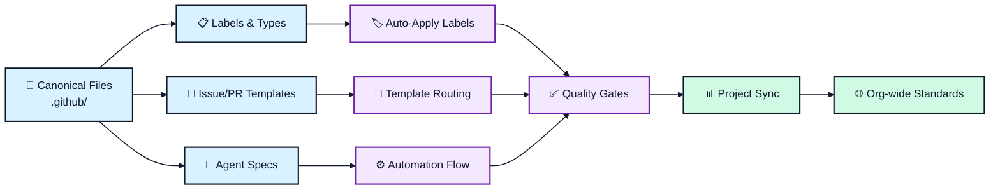
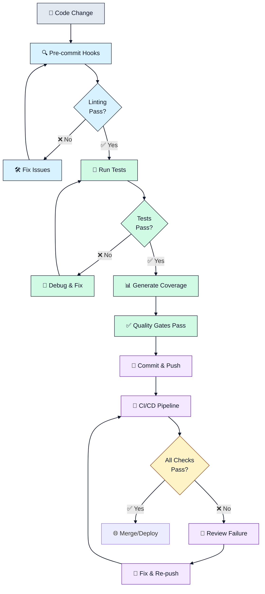
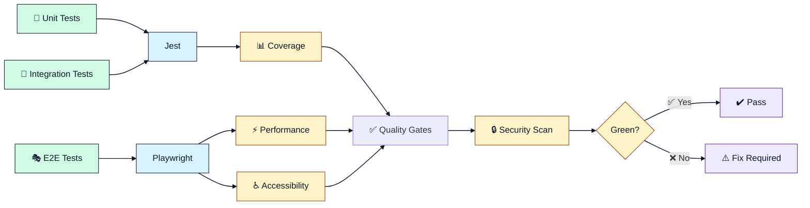

# 🏠 LightSpeed .github Repository

[](https://www.gnu.org/licenses/gpl-3.0)
[](https://github.com/lightspeedwp/.github/actions)
[](./docs/README.md)
[](./AGENTS.md)
[](.github/workflows/)

The **LightSpeed .github repository** serves as the centralised governance and automation hub for the LightSpeed organisation. It manages community health files, canonical label definitions, GitHub Actions workflows, issue/PR templates, contribution standards, and portable reusable resources for AI-driven automation.

All LightSpeed repositories reference and inherit from this repository, ensuring consistent governance, labeling, automation, and quality standards across the entire organisation.

## 🎯 Purpose & Scope

This repository contains:

- **Governance files:** Issue/PR templates, CONTRIBUTING.md, CODE_OF_CONDUCT.md, SUPPORT.md, security policies
- **Automation & labels:** Canonical `labels.yml`, `issue-types.yml`, labeling workflows, and project automation
- **GitHub Actions:** Reusable workflows for CI/CD, labeling, project sync, and quality gates
- **AI & Agents:** Specifications, instructions, and configurations for Claude agents and automation
- **Portable resources:** Reusable agents, skills, workflows, hooks, instructions, plugins, and schemas
- **Documentation:** Comprehensive guides on branching, contribution, automation governance, and standards

---

## 📊 Repository Structure

```mermaid
graph TB
  accTitle: "LightSpeed .github repository structure"
  accDescr {
    Top-down view of the main folders and their purposes:
    .github for community health and governance,
    agents for reusable specifications,
    skills for self-contained automation,
    workflows for agentic processes,
    docs for comprehensive guides,
    tests for quality validation.
  }

  A["🏠 LightSpeed .github"] --> B["📁 .github/"]
  A --> C["🤖 agents/"]
  A --> D["⚡ skills/"]
  A --> E["🔄 workflows/"]
  A --> F["📚 docs/"]
  A --> G["🧪 tests/"]
  A --> H["📋 instructions/"]
  A --> I["🔌 plugins/"]
  A --> J["📦 schemas/"]

  B --> B1["community-health files"]
  B --> B2["custom-instructions.md"]
  B --> B3["workflows/"]
  B --> B4["labels.yml, issue-types.yml"]
  B --> B5["ISSUE_TEMPLATE/, PULL_REQUEST_TEMPLATE/"]

  C --> C1["Reusable agent specs"]
  C --> C2["Agent documentation"]
  C --> C3["30+ portable agents"]

  D --> D1["SKILL.md entrypoints"]
  D --> D2["Automation & tooling skills"]
  D --> D3["99+ self-contained skills"]

  E --> E1["Agentic workflows"]
  E --> E2["Portable orchestration"]
  E --> E3["Multi-agent processes"]

  F --> F1["Branching strategy"]
  F --> F2["Automation governance"]
  F --> F3["Coding standards"]
  F --> F4["Contributing guides"]

  G --> G1["Unit tests"]
  G --> G2["Integration tests"]
  G --> G3["Coverage reports"]

  H --> H1["Portable instructions"]
  H --> H2["Coding standards"]
  H --> H3["Mermaid guidance"]
  H --> H4["File organisation"]

  I --> I1["Plugin families"]
  I --> I2["Bundled assets"]
  I --> I3["Plugin specs"]

  J --> J1["Frontmatter schema"]
  J --> J2["Collection schemas"]
  J --> J3["Validation rules"]

  classDef core fill:#e2e8f0,stroke:#0f172a,color:#0f172a,stroke-width:2px
  classDef gov fill:#d9f2ff,stroke:#0f172a,color:#0f172a,stroke-width:2px
  classDef ai fill:#f3e8ff,stroke:#6b21a8,color:#0f172a,stroke-width:2px
  classDef resource fill:#d1fae5,stroke:#0f172a,color:#0f172a,stroke-width:2px
  classDef sub fill:#fef3c7,stroke:#92400e,color:#0f172a,stroke-width:1px

  class A core
  class B,B1,B2,B3,B4,B5 gov
  class C,C1,C2,C3 ai
  class D,D1,D2,D3 resource
  class E,E1,E2,E3 ai
  class F,F1,F2,F3,F4 gov
  class G,G1,G2,G3 resource
  class H,H1,H2,H3,H4 resource
  class I,I1,I2,I3 resource
  class J,J1,J2,J3 resource

  linkStyle default stroke:#0f172a,stroke-width:1.4px
```



### Key Directories

| Directory | Purpose | Status |
|-----------|---------|--------|
| `.github/` | GitHub community health files, workflows, labels, issue/PR templates | 🔒 Locked (curated) |
| `agents/` | 30+ portable reusable agent specifications and documentation | Active |
| `skills/` | 99+ self-contained skills with SKILL.md entrypoints | Active |
| `workflows/` | Portable agentic workflows for multi-step automation | Active |
| `instructions/` | Reusable instruction files (coding standards, Mermaid, file org, etc.) | Active |
| `plugins/` | Plugin families, manifests, and bundled assets | Active |
| `schemas/` | Data schemas (frontmatter, collections, validation rules) | Active |
| `hooks/` | Portable hooks and guardrails for automation | Active |
| `docs/` | Comprehensive governance, strategy, and contribution guides | Active |
| `tests/` | Unit, integration, and E2E test suites | Active |
| `scripts/` | Automation scripts and utility tools | Active |
| `prompts/` | Prompt templates (legacy; moving to skills and cookbook) | Legacy |
| `cookbook/` | Recipes, playbooks, and implementation examples | Active |

---

## 🔄 Automation & Governance Flow

The diagram below illustrates how canonical governance files, automation workflows, and AI agents work together to maintain consistent standards across all LightSpeed repositories.



---

## 🚀 Getting Started

### For Contributors

1. **Read first:** [CONTRIBUTING.md](./CONTRIBUTING.md) – Contribution guidelines and workflow
2. **Branching strategy:** [docs/BRANCHING_STRATEGY.md](./docs/BRANCHING_STRATEGY.md) – Branch naming and workflow
3. **Coding standards:** [instructions/coding-standards.instructions.md](./instructions/coding-standards.instructions.md) – Language-specific standards
4. **Branch naming:** Review [CLAUDE.md](./CLAUDE.md) – Critical branch naming rules and patterns

### For Automation & AI

1. **Agent overview:** [AGENTS.md](./AGENTS.md) – Global AI rules and agent specifications
2. **Custom instructions:** [.github/custom-instructions.md](./.github/custom-instructions.md) – Copilot configuration
3. **Available agents:** [agents/README.md](./agents/README.md) – All 30+ reusable agents
4. **Skills catalogue:** [skills/README.md](./skills/README.md) – 99+ self-contained skills

### For Governance & Automation

1. **Automation governance:** [docs/AUTOMATION_GOVERNANCE.md](./docs/AUTOMATION_GOVERNANCE.md) – Workflow orchestration and governance
2. **Label management:** [docs/LABEL_STRATEGY.md](./docs/LABEL_STRATEGY.md) – Label taxonomy and usage
3. **Issue types:** [.github/issue-types.yml](./.github/issue-types.yml) – Canonical issue type definitions
4. **Labeler rules:** [.github/labeler.yml](./.github/labeler.yml) – File-path-based auto-labeling

---

## 📖 Key Resources & Canonical Files

### 🔒 Locked Files (Curated by @ashley)

The following files are **manually curated and locked**. Request changes via GitHub issues:

| File | Purpose | Change Request |
|------|---------|-----------------|
| `.github/labels.yml` | Canonical label definitions (158 labels) | Open: `[LABEL-UPDATE-REQUEST]` |
| `.github/issue-types.yml` | Org-wide issue type definitions (24 types) | Open: `[ISSUE-TYPE-UPDATE-REQUEST]` |
| `.github/ISSUE_TEMPLATE/*.md` | Issue templates (26 templates) | Open: `[TEMPLATE-UPDATE-REQUEST]` |
| `.github/PULL_REQUEST_TEMPLATE/*.md` | PR templates (19 templates) | Open: `[TEMPLATE-UPDATE-REQUEST]` |

### Community Health & Contribution

- [CONTRIBUTING.md](./CONTRIBUTING.md) – How to contribute to LightSpeed projects
- [CODE_OF_CONDUCT.md](./CODE_OF_CONDUCT.md) – Community standards and conduct
- [SUPPORT.md](./SUPPORT.md) – Getting help and support channels
- [SECURITY.md](./SECURITY.md) – Security policy and reporting

### Labels & Automation

- [.github/labels.yml](./.github/labels.yml) – **Canonical label definitions**
- [.github/issue-types.yml](./.github/issue-types.yml) – **Canonical issue types**
- [.github/labeler.yml](./.github/labeler.yml) – Automated labeling rules
- [docs/LABEL_STRATEGY.md](./docs/LABEL_STRATEGY.md) – Label taxonomy and strategy

### Templates & Workflows

- [.github/ISSUE_TEMPLATE/](./.github/ISSUE_TEMPLATE/) – Issue templates
- [.github/PULL_REQUEST_TEMPLATE/](./.github/PULL_REQUEST_TEMPLATE/) – PR templates
- [.github/workflows/](./.github/workflows/) – GitHub Actions workflows
- [docs/PR_CREATION_PROCESS.md](./docs/PR_CREATION_PROCESS.md) – PR workflow guide

### Portable Reusable Resources

- [agents/README.md](./agents/README.md) – 30+ portable agent specifications
- [skills/README.md](./skills/README.md) – 99+ self-contained skills with SKILL.md entrypoints
- [workflows/README.md](./workflows/README.md) – Portable agentic workflows
- [instructions/README.md](./instructions/README.md) – Reusable instruction files (no .github assumptions)
- [plugins/README.md](./plugins/README.md) – Plugin families and bundles
- [schemas/README.md](./schemas/README.md) – Portable data schemas
- [hooks/README.md](./hooks/README.md) – Portable hooks and guardrails
- [cookbook/README.md](./cookbook/README.md) – Recipes, playbooks, and examples

### Governance & Standards

- [AGENTS.md](./AGENTS.md) – Global AI rules and agent overview
- [CLAUDE.md](./CLAUDE.md) – Claude Code session rules (branch naming, conventions, locked files)
- [docs/BRANCHING_STRATEGY.md](./docs/BRANCHING_STRATEGY.md) – Git branching conventions
- [docs/AUTOMATION_GOVERNANCE.md](./docs/AUTOMATION_GOVERNANCE.md) – Automation standards and governance
- [instructions/coding-standards.instructions.md](./instructions/coding-standards.instructions.md) – Unified coding standards
- [instructions/file-organisation.instructions.md](./instructions/file-organisation.instructions.md) – File placement and organisation

---

## 🎯 Development Workflow

The following diagram shows the typical development workflow for changes to this repository: from code changes through pre-commit validation, testing, and CI/CD to deployment.



### Development Commands

```bash
# Install dependencies
npm ci

# Run linters
npm run lint           # Core linters (JS, CSS, YAML, package.json)
npm run lint:all      # All linters including workflows and markdown
npm run lint:js       # JavaScript/TypeScript
npm run lint:css      # CSS/SCSS
npm run lint:yaml     # YAML files
npm run lint:md       # Markdown files

# Format code
npm run format        # Format all supported files

# Run tests
npm test              # All JavaScript/TypeScript tests
npm run test:js       # JS/TS tests with coverage
npm run test:e2e      # Playwright E2E tests

# Validation
npm run validate:branch-name -- --branch <branch-name>
npm run validate:frontmatter
```

---

## 🧪 Testing & Quality Assurance

This repository maintains comprehensive test coverage across unit, integration, and E2E tests. The diagram below shows the testing architecture and quality gates.



See [docs/TESTING.md](./docs/TESTING.md) for comprehensive testing guidance, configuration, and best practices.

---

## 📋 Label & Issue Management

This repository maintains **158 canonical labels** organised by family (type, status, priority, area, meta, etc.). All labels follow the prefix pattern and are defined in `.github/labels.yml`.

### Label Families

- **type:** Bug, Feature, Documentation, Task, Chore, Security, Design, etc.
- **status:** Needs-triage, In-progress, Blocked, Done, etc.
- **priority:** Critical, High, Normal, Low
- **area:** CI, Docs, Labels, Security, Testing, Automation, etc.
- **meta:** Needs-changelog, Has-PR, Duplicate, Needs-audit, etc.
- **lang:** PHP, JavaScript, CSS, etc.

**Important:** Always use prefixed labels (e.g., `type:bug`, not `bug`). See [docs/LABEL_STRATEGY.md](./docs/LABEL_STRATEGY.md) for the full taxonomy.

---

## 🔧 Linting, Formatting & Pre-commit

All code quality and automation standards are enforced via pre-commit hooks and linting workflows.

**Key files:**

- [docs/LINTING.md](./docs/LINTING.md) – Linting strategy and configuration
- [docs/HUSKY_PRECOMMITS.md](./docs/HUSKY_PRECOMMITS.md) – Pre-commit hooks and automation
- [docs/config/](./docs/config/) – Configuration documentation (ESLint, Prettier, Stylelint, Jest, etc.)

**Local commands:**

```bash
npm run lint:all      # Run all linters
npm run format        # Format all files
npm test              # Run all tests
```

Pre-commit hooks (via Husky) automatically run linting and formatting checks before every commit.

---

## 🌐 Consuming This Repository

All LightSpeed repositories should inherit standards, labels, workflows, and templates from this repository.

### Quick Start for New Repos

1. **Copy issue/PR templates:**
   ```bash
   cp -r .github/ISSUE_TEMPLATE /path/to/your/repo/.github/
   cp .github/PULL_REQUEST_TEMPLATE/*.md /path/to/your/repo/.github/PULL_REQUEST_TEMPLATE/
   ```

2. **Sync labels workflow:**
   Create `.github/workflows/label-sync.yml` in your repo:
   ```yaml
   name: Label Sync
   on:
     schedule:
       - cron: "0 9 * * 1"
     workflow_dispatch:
   jobs:
     sync:
       uses: lightspeedwp/.github/workflows/label-sync.yml@develop
       secrets: inherit
   ```

3. **Auto-labeling workflow:**
   Create `.github/workflows/labeling.yml` in your repo:
   ```yaml
   name: Auto-Labeling
   on:
     pull_request:
       types: [opened, edited, synchronize, reopened]
     issues:
       types: [opened, edited, reopened]
   jobs:
     labeling:
       uses: lightspeedwp/.github/workflows/labeling.yml@develop
       secrets: inherit
   ```

4. **Follow branch naming:**
   Use the pattern `{type}/{scope}-{title}` (e.g., `feat/user-auth`, `fix/header-bug`, `docs/api-guide`)

See [docs/BRANCHING_STRATEGY.md](./docs/BRANCHING_STRATEGY.md) for complete branching conventions and [CONTRIBUTING.md](./CONTRIBUTING.md) for full onboarding.

---

## ✅ Validation Checklist

Before merging changes to this repository:

- [ ] Branch follows naming pattern: `{type}/{scope}-{title}`
- [ ] Frontmatter is complete (title, description, last_updated, file_type where applicable)
- [ ] No changes to locked files (`.github/labels.yml`, `.github/issue-types.yml`, templates) without approval
- [ ] All linting passes: `npm run lint:all`
- [ ] All tests pass: `npm test`
- [ ] Mermaid diagrams are valid and meet WCAG AA contrast
- [ ] README follows section order and includes diagrams where mandatory
- [ ] Links and references are verified
- [ ] UK English spelling throughout
- [ ] Commit message includes co-author attribution

---

## 🔗 Related Documentation

- **[AGENTS.md](./AGENTS.md)** – Global AI rules and agent specifications
- **[CLAUDE.md](./CLAUDE.md)** – Claude Code session rules (branch naming, conventions, locked files)
- **[CONTRIBUTING.md](./CONTRIBUTING.md)** – Contribution guidelines
- **[CODE_OF_CONDUCT.md](./CODE_OF_CONDUCT.md)** – Community standards
- **[SUPPORT.md](./SUPPORT.md)** – Support and help resources
- **[docs/](./docs/)** – Comprehensive governance, strategy, and guides
- **[instructions/](./instructions/)** – Reusable instruction files
- **[agents/README.md](./agents/README.md)** – Reusable agent specifications
- **[skills/README.md](./skills/README.md)** – Self-contained skills catalogue

---

## 📄 License

This project is licensed under the **GNU General Public License v3.0** – see the [LICENSE](LICENSE) file for details.

---

## 🤝 Contributing

We welcome contributions! Please:

1. Read [CONTRIBUTING.md](./CONTRIBUTING.md) for guidelines
2. Follow the [branch naming strategy](./docs/BRANCHING_STRATEGY.md)
3. Check [CLAUDE.md](./CLAUDE.md) for critical rules
4. Open an issue or discussion for questions

---

## 📧 Questions or Issues?

- **Found a bug?** [Open an issue](https://github.com/lightspeedwp/.github/issues/new)
- **Have a feature request?** [Start a discussion](https://github.com/lightspeedwp/.github/discussions/new)
- **Need support?** See [SUPPORT.md](./SUPPORT.md)

---

**🚀 Built by LightSpeedWP with ☕, open source, and automation spirit!**

*This repository is managed by the LightSpeed team. All organisational automation, governance, and documentation updates are maintained here.*
