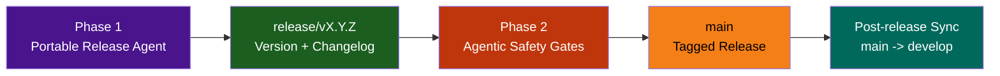

# LightSpeed Community Health and Automation Repository

This repository is the LightSpeed `.github` control plane and canonical source for shared governance, templates, labels, workflows, and reusable AI operations assets.

## Current Status

- Phase 1 instruction, schema, and agent audits are complete.
- Two-tier agent model is active:
  - Portable multi-file agents in `agents/`.
  - Spec-based GitHub-native agents in `.github/agents/`.
- Canonical schema path is `schemas/`.
- Release process is v4.0 with two-phase agentic gates. See `docs/RELEASE_PROCESS.md`.

## Canonical Paths

- `instructions/` — Portable instruction standards.
- `.github/instructions/` — Repo-local control-plane instructions.
- `agents/` — Portable multi-file agents.
- `.github/agents/` — Spec-based control-plane agents.
- `schemas/` — Canonical JSON schema definitions.
- `.github/reports/` — Audit and analysis reporting.

## Top-Level Documentation

- `AGENTS.md` — Global AI governance rules.
- `CLAUDE.md` — Repo-specific operating rules and release governance.
- `docs/README.md` — Documentation index.
- `instructions/README.md` — Portable instruction index.
- `schemas/README.md` — Schema inventory and validation guidance.

## Repository Structure

```text
.github/                       # GitHub-native control-plane assets
agents/                        # Portable multi-file agents
ai/                            # Canonical AI references
cookbook/                      # Implementation playbooks
docs/                          # Human-facing governance and process docs
hooks/                         # Portable guardrail hooks
instructions/                  # Portable standards
plugins/                       # Installable plugin bundles
prompts/                       # Reusable prompt templates
schemas/                       # Canonical JSON schemas
scripts/                       # Automation scripts
skills/                        # Reusable skills
tests/                         # Test suites
website/                       # Public site source
workflows/                     # Portable workflow playbooks
```

## Governance Flow


## Release Lifecycle



## Quick Start

1. Read `CONTRIBUTING.md` for contribution workflow.
2. Read `docs/BRANCHING_STRATEGY.md` for branch and PR policy.
3. Use `npm run lint-all` and `npm test` before opening a PR.
4. Follow `docs/RELEASE_PROCESS.md` for releases.

### 🔒 Branch Protection

- **`develop`** — Integration branch; all features merge here first
- **`main`** — Production-only; merges from `release/*` and `hotfix/*` branches only
- **Feature/fix branches** — Temporary; deleted after merge (strict cleanup protocol)

### 🏷️ Label Rules

**ALL labels MUST have family prefix from `.github/labels.yml`:**

- ✅ `type:bug`, `type:feature`, `type:task`
- ✅ `status:in-progress`, `status:needs-review`
- ✅ `priority:critical`, `priority:normal`
- ✅ `area:ci`, `area:docs`, `area:security`
- ✅ `meta:needs-changelog`, `meta:has-pr`

- ❌ `bug`, `feature`, `urgent` (bare labels forbidden)

---

## Documentation Index

### Essential Reading

| Document | Purpose | Audience |
|----------|---------|----------|
| [AGENTS.md](./AGENTS.md) | Global AI governance and standards | All AI operators |
| [CLAUDE.md](./CLAUDE.md) | Repository operating rules and release governance | All contributors |
| [docs/BRANCHING_STRATEGY.md](./docs/BRANCHING_STRATEGY.md) | Git discipline and branch naming | All developers |
| [docs/RELEASE_PROCESS.md](./docs/RELEASE_PROCESS.md) | Release workflow with agentic gates | Release managers |

### Process & Workflow

- [docs/ARCHITECTURE.md](./docs/ARCHITECTURE.md) — System design overview
- [docs/AUTOMATION.md](./docs/AUTOMATION.md) — Workflow automation patterns
- [docs/PR_CREATION_PROCESS.md](./docs/PR_CREATION_PROCESS.md) — PR guidelines
- [docs/BRANCH_CLEANUP.md](./docs/BRANCH_CLEANUP.md) — Branch deletion protocol
- [docs/CHANGELOG_AUTOMATION.md](./docs/CHANGELOG_AUTOMATION.md) — Changelog standards

### Governance & Standards

- [docs/LABELING.md](./docs/LABELING.md) — Labeling standards and conventions
- [docs/LABEL_STRATEGY.md](./docs/LABEL_STRATEGY.md) — Label taxonomy and family prefixes
- [docs/LABEL_MANAGEMENT_CLI.md](./docs/LABEL_MANAGEMENT_CLI.md) — Label orchestrator CLI reference
- [docs/ISSUE_MAINTENANCE_SCRIPTS.md](./docs/ISSUE_MAINTENANCE_SCRIPTS.md) — Issue automation
- [instructions/README.md](./instructions/README.md) — Portable standards index

### AI Operations

- [docs/AGENT_CREATION.md](./docs/AGENT_CREATION.md) — Creating new agents
- [docs/AGENT_STANDARDS.md](./docs/AGENT_STANDARDS.md) — Agent specification standards
- [docs/AI_FEEDBACK_SYSTEM_SUMMARY.md](./docs/AI_FEEDBACK_SYSTEM_SUMMARY.md) — AI feedback tracking
- [ai/Claude.md](./ai/Claude.md) — Claude usage standards

### Advanced Topics

- [docs/AGENTIC_RELEASE_ADMIN_GUIDE.md](./docs/AGENTIC_RELEASE_ADMIN_GUIDE.md) — Release infrastructure
- [docs/AWESOME_GITHUB_MAPPING_STRATEGY.md](./docs/AWESOME_GITHUB_MAPPING_STRATEGY.md) — Schema alignment
- [.github/projects/active/repo-restructuring-2026-07-25/](./.github/projects/active/repo-restructuring-2026-07-25/) — Phase 1 audit reports

---

## What's Inside

### Workflows & Automation (14+ active)

- **labeler.yml** — Auto-apply labels to PRs and issues
- **validation.yml** — Lint, test, security scan, changelog validation
- **release.yml** — Automated release with version bumping and tagging
- **main-branch-guard.yml** — Enforce release-only branch policy on main
- **changelog-sync.yml** — Keep changelog in sync with merges
- **ai-feedback-validation.yml** — Track AI feedback in PR comments
- **template-enforcement.yml** — Validate issue DoR/DoD sections
- **metrics.yml** — Daily organization-wide activity collection
- **dependency-updates.yml** — Automated dependency management
- Plus 5+ utility and housekeeping workflows

### Agents & Automation (30+ GitHub-native)

All in `.github/agents/`:

- Release agent — Version bumping and changelog generation
- Labeling agents — Content-based label application (10+ variants)
- Validation agents — Linting, testing, security scanning
- Metrics agent — Organization health collection
- Review agents — Code quality and standards checking
- Plus 10+ utility and specialized agents

### Skills Library (96 total)

Includes:

- **WordPress-specific** — Template generators, block validators, theme auditors
- **AI & LLM** — PRD generator, requirements traceability, AI readiness assessor
- **Project management** — Task breakdown, scope change control, launch readiness
- **Design & UX** — Design system application, Figma sync, token generation
- **DevOps & Infrastructure** — CI/CD pipelines, deployment automation
- And 76+ more specialized and general-purpose skills

---

## Project Organization

### Active Projects

Active initiative tracking and deliverables at [`.github/projects/active/`](./.github/projects/active/):

| Project | Purpose | Status |
|---------|---------|--------|
| [repo-restructuring-2026-07-25](./.github/projects/active/repo-restructuring-2026-07-25/) | Phase 1 audit & consolidation | ✅ Complete (Phase 1) |
| [issue-maintenance-scripts-2026-08-10](./.github/projects/active/issue-maintenance-scripts-2026-08-10/) | Automation and triage workflows | 🔄 Phase 5 (integration) |
| [label-prefix-enforcement-2026-08-05](./.github/projects/active/label-prefix-enforcement-2026-08-05/) | Family-prefix governance | ✅ Complete |

### Archived Projects

Completed initiatives at [`.github/projects/archived/`](./.github/projects/archived/) — see `.archive-status.md` in each project for completion summary.

---

## Contributing

1. **Clone and set up:**

   ```bash
   git clone https://github.com/lightspeedwp/.github.git
   cd .github
   npm ci
   ```

2. **Create a branch** following the naming convention:

   ```bash
   git checkout -b {type}/{scope}-{short-title}
   ```

3. **Make changes** and run validation:

   ```bash
   npm run lint:md
   npm run lint:js
   npm test
   ```

4. **Commit with clear messages:**

   ```bash
   git commit -m "type(scope): Short description of change"
   ```

5. **Push and create PR:**

   ```bash
   git push -u origin {branch-name}
   ```

6. **Follow PR guidelines** — Link to issues, use correct template, address review feedback

---

## Support & Resources

- **Issues** — [GitHub Issues](https://github.com/lightspeedwp/.github/issues)
- **Discussions** — [GitHub Discussions](https://github.com/lightspeedwp/.github/discussions)
- **Security** — [Security Policy](./SECURITY.md)
- **Code of Conduct** — [Community Guidelines](./CODE_OF_CONDUCT.md)
- **Sponsorship** — [Support LightSpeedWP](https://github.com/sponsors/lightspeedwp/)

---

## Repository Metadata

| Property | Value |
|----------|-------|
| **Organization** | LightSpeedWP |
| **Repository** | `.github` (organization control plane) |
| **Accessibility** | WCAG 2.2 AA compliant |
| **License** | GPL-3.0-or-later |
| **NPM Package** | [@lightspeedwp/github-community-health](https://www.npmjs.com/package/@lightspeedwp/github-community-health) |
| **Version** | 0.2.0 |
| **Status** | ✅ Production active |
| **Last Updated** | 2026-08-20 |

---

**Built by 🧱 LightSpeedWP with ☕, 🚀, and open-source spirit!**
