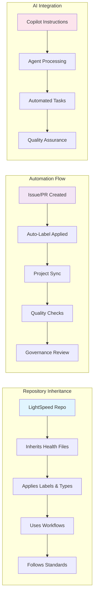
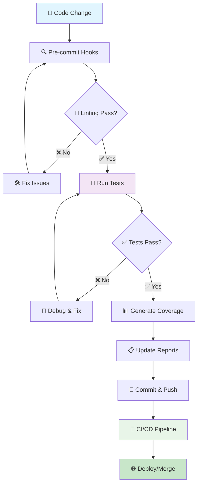
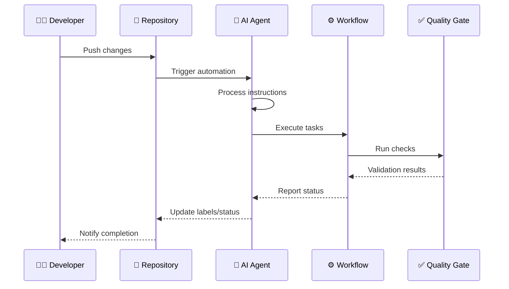
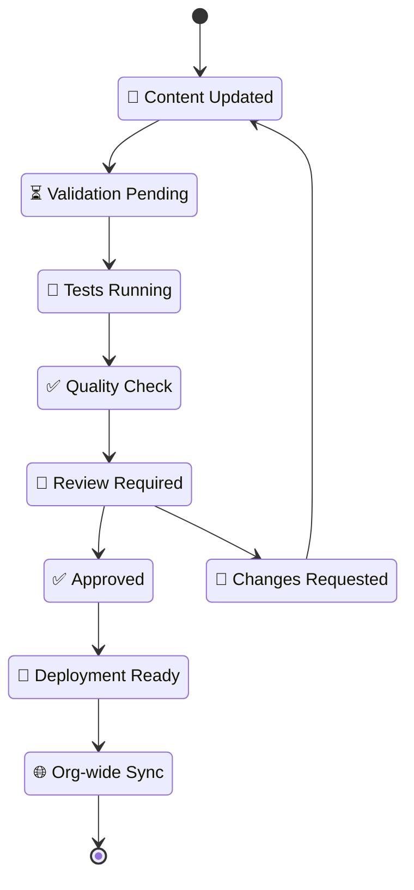
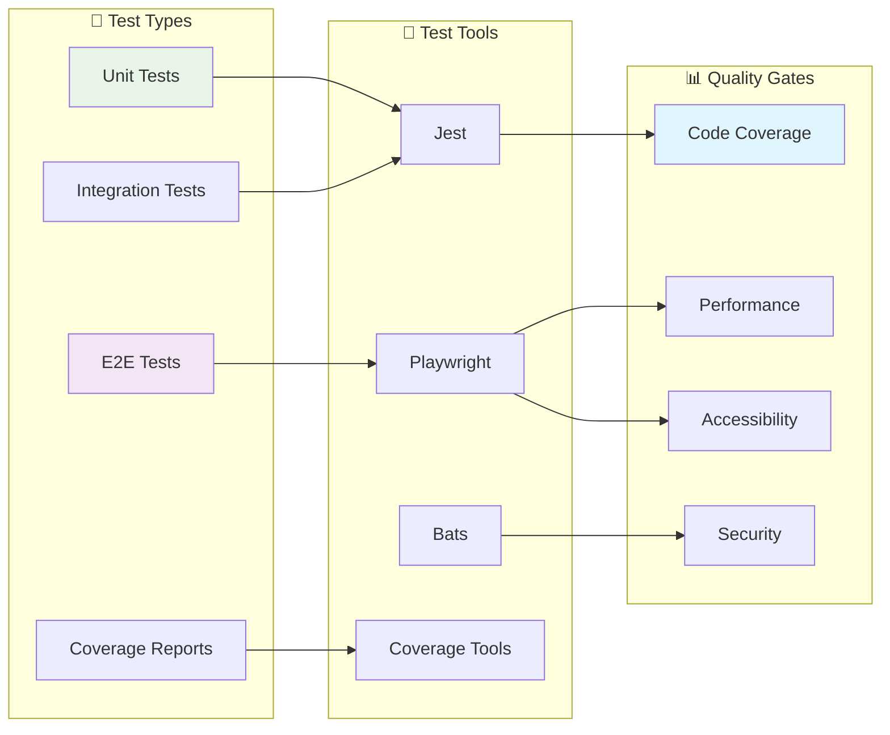

# 🏠 LightSpeed Community Health & Automation Repository

This repository is the **central hub** for the LightSpeed organization’s community health files, automation standards, label and issue type management, governance documentation, and org-wide resources on GitHub usage and contribution. All member repositories reference and inherit canonical files, workflows, and instructions from here—making it the backbone for consistency, quality, and automated project management across LightSpeed.

This repository is the **central hub** for the LightSpeed organization’s community health files, automation standards, label and issue type management, governance documentation, and org-wide resources on GitHub usage and contribution. All member repositories reference and inherit canonical files, workflows, and instructions from here—making it the backbone for consistency, quality, and automated project management across LightSpeed.

For a unified, always-up-to-date index of all documentation, see [DOCS.md](./DOCS.md).

## 📊 Repository Architecture

```mermaid
graph TD
    A[🏠 LightSpeed .github Repository] --> B[📁 Community Health Files]
    A --> C[🤖 Automation & Workflows]
    A --> D[🏷️ Labels & Issue Types]
    A --> E[🧠 AI & Copilot Resources]
    
    B --> B1[CONTRIBUTING.md]
    B --> B2[CODE_OF_CONDUCT.md]
    B --> B3[SUPPORT.md]
    B --> B4[Issue Templates]
    B --> B5[PR Templates]
    
    C --> C1[GitHub Actions]
    C --> C2[Labeler Configuration]
    C --> C3[Project Automation]
    C --> C4[Quality Gates]
    
    D --> D1[labels.yml]
    D --> D2[issue-types.yml]
    D --> D3[Label Documentation]
    
    E --> E1[Custom Instructions]
    E --> E2[Agent Specifications]
    E --> E3[Prompt Library]
    E --> E4[Chat Modes]
    
    style A fill:#e1f5fe
    style B fill:#f3e5f5
    style C fill:#e8f5e8
    style D fill:#fff3e0
    style E fill:#fce4ec
```

## 🔄 Comprehensive Workflow Overview

### Repository Inheritance & Automation Flow

### Development Workflow Process

### AI & Automation Integration Pipeline

## 🎯 Repository Overview

This comprehensive workflow diagram illustrates the complete ecosystem of the LightSpeed .github repository, showing how community health files, automation systems, AI integration, and quality gates work together to maintain consistent standards across all organization repositories.

### Complete Repository Ecosystem Flow

### Repository Maintenance & Update Cycle

## 🔧 Linting, Formatting, and Testing Workflow

All code quality, formatting, and automation standards are documented and enforced across the repository. See:

- [LINTING.md](./docs/LINTING.md) — Main linting strategy, tool configuration, and automation
- [HUSKY-PRECOMMITS.md](./docs/HUSKY-PRECOMMITS.md) — Pre-commit hook and automation details
- [docs/config/](./docs/config/) — All configuration file documentation (ESLint, Prettier, Stylelint, Playwright, Jest, npm scripts, etc.)

### Local Linting & Formatting

- `npm run lint` — Run all core linters (JS, CSS, YAML, package.json)
- `npm run lint:all` — Run all linters, including workflows and markdown
- `npm run lint:js` — Lint JavaScript/TypeScript
- `npm run lint:css` — Lint CSS/SCSS
- `npm run lint:yaml` — Lint YAML files
- `npm run lint:md` — Lint Markdown files
- `npm run lint:pkg-json` — Lint package.json
- `npm run format` — Format all supported files (Prettier, Stylelint, etc.)

### Testing Architecture & Flow

**Test Commands:**

- `npm test` — Run all JavaScript/TypeScript tests (Jest)
- `npm run test:js` — Run JS/TS tests with coverage
- `npm run test:e2e` — Run Playwright E2E tests

### VS Code Integration

- See `.vscode/settings.json`, `.vscode/tasks.json`, `.vscode/launch.json`, and `.vscode/extensions.json` for editor integration, tasks, debugging, and recommended extensions.
- All major linting, formatting, and test commands are available as VS Code tasks.

### Automation & Pre-commit

- Husky and lint-staged enforce linting and formatting before every commit. See [HUSKY-PRECOMMITS.md](./docs/HUSKY-PRECOMMITS.md).

### Troubleshooting & Updates

- For troubleshooting, see [docs/LINTING.md](./docs/LINTING.md) and [docs/config/](./docs/config/).
- To update rules, edit the relevant config in `docs/config/` and update npm scripts as needed.

---

GitHub supports [organization-wide community health files](https://github.blog/changelog/2019-02-21-organization-wide-community-health-files/) in a specially named `.github` repository to serve as organization-wide defaults for all repositories within their organization. Where sensible, custom community health files should be created for our repos, but that's not always necessary or practical.

The following are the default `CODE_OF_CONDUCT.md`, `CONTRIBUTING.md`, `ISSUE_TEMPLATES`, and `PULL_REQUEST_TEMPLATE.md` files for LightSpeed repositories that do not have custom ones themselves. Note that these default files won’t appear in the file browser or Git history for each repository, but they will be surfaced throughout developers’ workflows, such as when opening a new issue or when viewing the Community Profile, just as if it were committed to the repository directly.

## Purpose & Role

- **Canonical Source:** This repository contains the authoritative versions of all organizational health files, label definitions, issue/pr templates, saved replies, and automation workflows. All other LightSpeed repositories should reference and/or reuse resources from here.
- **Single Storage Area for Org Instructions:** Contribution, support, governance, and automation instructions are stored here and referenced across all projects.
- **Automation Strategy:** Key automation components like `labels.yml` and `issue-types.yml` are maintained here—these files are integral to our workflow automation, ensuring issues and PRs are triaged, labeled, and tracked consistently across the organization.
- **Org-wide Documentation:** We are building a comprehensive set of resources on GitHub usage and project standards, with all documentation centralized in this repository.
- **Agents & AI:** Agents for managing issue labels, types, and PR labels will be added to this repository. Org-wide defaults for these agents are defined here, together with governance and automation documentation.
- **Governance:** Policies on branching, automation, and contribution are maintained here to ensure consistent practices and oversight.

---

## Key Resources & Canonical Files

### Contributing & Support Guidelines

- [CONTRIBUTING.md (Canonical)](https://github.com/lightspeedwp/.github/blob/develop/CONTRIBUTING.md) – Referenced across all repos.
- [SUPPORT.md](https://github.com/lightspeedwp/.github/blob/develop/SUPPORT.md) – Org-wide support standards.

### Labels & Labeler Configuration

- [labels.yml](https://github.com/lightspeedwp/.github/blob/develop/.github/labels.yml) – **Canonical label definitions** for all issues and PRs.
- [labeler.yml](https://github.com/lightspeedwp/.github/blob/develop/.github/labeler.yml) – Automated file/branch-based label application.
- [ISSUE_LABELS.md](https://github.com/lightspeedwp/.github/blob/develop/.github/ISSUE_LABELS.md) – Issue label documentation.
- [PR_LABELS.md](https://github.com/lightspeedwp/.github/blob/develop/.github/PR_LABELS.md) – PR label documentation.

### Issue Types & Templates

- [issue-types.yml](https://github.com/lightspeedwp/.github/blob/develop/.github/issue-types.yml) – **Canonical issue types** for automation and triage.
- [ISSUE_TYPES.md](https://github.com/lightspeedwp/.github/blob/develop/.github/ISSUE_TYPES.md) – Issue type documentation.
- [Saved replies for issues](https://github.com/lightspeedwp/.github/blob/develop/.github/SAVED_REPLIES.md)
- [Bug report saved reply](https://github.com/lightspeedwp/.github/blob/develop/.github/SAVED_REPLIES/issues/bug-reports.md)
- [Issue templates directory](https://github.com/lightspeedwp/.github/tree/develop/.github/ISSUE_TEMPLATES)

### Pull Request Templates

- [PR templates directory](https://github.com/lightspeedwp/.github/tree/develop/.github/PULL_REQUEST_TEMPLATES)
- [PR_LABELS.md](https://github.com/lightspeedwp/.github/blob/develop/.github/PR_LABELS.md)
- [Pull Request Template (main)](https://github.com/lightspeedwp/.github/blob/master/.github/PULL_REQUEST_TEMPLATE.md)

### Workflows & Automation

- `.github/workflows/labels-issues-prs.yml` – Automated labeling for issues/PRs.
- `.github/workflows/project-meta-sync.yml` – Syncs issues/PRs with Projects (Beta) and fields.
- [AUTOMATION_GOVERNANCE.md](https://github.com/lightspeedwp/.github/blob/develop/.github/AUTOMATION_GOVERNANCE.md) – Orchestrates how automation is governed org-wide.

### Governance Documentation

- [BRANCHING_STRATEGY.md](https://github.com/lightspeedwp/.github/blob/develop/.github/BRANCHING_STRATEGY.md) – Defines branch protection and workflow.
- [AUTOMATION_GOVERNANCE.md](https://github.com/lightspeedwp/.github/blob/develop/.github/AUTOMATION_GOVERNANCE.md) – Automation standards and governance.

### Org-wide Instructions & AI Files

- [General Instructions](https://github.com/lightspeedwp/.github/blob/develop/.github/custom-instructions.md)
- [Chat modes](https://github.com/lightspeedwp/.github/blob/develop/.github/chatmodes/chatmodes.md)
- [Prompt templates](https://github.com/lightspeedwp/.github/blob/develop/.github/prompts/prompts.md)
- [Agent instructions](https://github.com/lightspeedwp/.github/blob/develop/.github/agents/agent.md)
- [AGENTS.md](https://github.com/lightspeedwp/.github/blob/develop/AGENTS.md)
- [GEMINI.md](https://github.com/lightspeedwp/.github/blob/develop/GEMINI.md)
- [CLAUDE.md](https://github.com/lightspeedwp/.github/blob/develop/CLAUDE.md)

### Coding & Contribution Guidelines

- [Coding Standards](https://github.com/lightspeedwp/.github/blob/master/.github/instructions/coding-standards.instructions.md)
- [HTML Templates](https://github.com/lightspeedwp/.github/blob/master/.github/instructions/html-template.instructions.md)
- [Pattern Development](https://github.com/lightspeedwp/.github/blob/master/.github/instructions/pattern-development.instructions.md)
- [PHP Block Instructions](https://github.com/lightspeedwp/.github/blob/master/.github/instructions/php-block.instructions.md)
- [Theme JSON](https://github.com/lightspeedwp/.github/blob/master/.github/instructions/theme-json.instructions.md)

---

## Automation & Agents Strategy

This repository will include and orchestrate org-wide agents for managing issue labels, issue types, and PR labels. The **default rules and mappings** for these agents are defined here—ensuring that new repositories or projects instantly inherit standardized automation, labeling, and triage procedures.

- **Agents:** Configurations, prompts, and agent instructions live here.
- **Integration:** All project boards and workflows reference canonical files here for automated syncing and status tracking.
- **Governance:** [AUTOMATION_GOVERNANCE.md](https://github.com/lightspeedwp/.github/blob/develop/.github/AUTOMATION_GOVERNANCE.md) details how agents and workflows are managed, updated, and rolled out org-wide.

---

## Documentation & Knowledge Resources

All organizational documentation—including contribution guidelines, support procedures, governance, GitHub usage tips, and more—is **centralized in this repository**. As our documentation grows, this is the authoritative source for LightSpeed team members and contributors.

All organizational documentation—including contribution guidelines, support procedures, governance, GitHub usage tips, and more—is **centralized in this repository**. As our documentation grows, this is the authoritative source for LightSpeed team members and contributors.

See [DOCS.md](./DOCS.md) for a full documentation index and quick links to all health, automation, and configuration docs.

- **GitHub Usage:** We are building up resources and best practices for effective use of GitHub and project automation.
- **Specialized Docs:** Even as we add specific documentation repositories, this remains the main storage and reference point for org-level docs.

---

## Referencing This Repository

All LightSpeed repositories should:

- Reference this repository for issue/PR templates, label and issue type configuration, and automation workflows.
- Link to contribution and support guidelines found here.
- Use the canonical `.github/labels.yml`, `.github/labeler.yml`, and `.github/issue-types.yml` for automation.
- Adopt governance and coding standards maintained here.

---

## Troubleshooting & Adoption

- **Labels/Types not applied:** Confirm your repo references `.github/labels.yml` and `.github/issue-types.yml` here.
- **Templates missing:** Ensure your repo points to `.github` for templates, or copies them from this repo.
- **Automation issues:** Reference [AUTOMATION_GOVERNANCE.md](https://github.com/lightspeedwp/.github/blob/develop/.github/AUTOMATION_GOVERNANCE.md) for setup and troubleshooting.
- For any org-wide questions, open an issue or discussion in this repository.

---

## Quick Links

- [Contributing Guidelines](https://github.com/lightspeedwp/.github/blob/develop/CONTRIBUTING.md)
- [Support](https://github.com/lightspeedwp/.github/blob/develop/SUPPORT.md)
- [Canonical Labels](https://github.com/lightspeedwp/.github/blob/develop/.github/labels.yml)
- [Canonical Issue Types](https://github.com/lightspeedwp/.github/blob/develop/.github/issue-types.yml)
- [Governance](https://github.com/lightspeedwp/.github/blob/develop/.github/AUTOMATION_GOVERNANCE.md)
- [General Instructions](https://github.com/lightspeedwp/.github/blob/develop/.github/custom-instructions.md)

- [Documentation Index (DOCS.md)](./DOCS.md)

---

## 📋 Table of Contents

- [Repository Architecture](#-repository-architecture)
- [Comprehensive Workflow Overview](#-comprehensive-workflow-overview)
- [Linting, Formatting, and Testing Workflow](#-linting-formatting-and-testing-workflow)
- [Key Resources & Canonical Files](#key-resources--canonical-files)
- [Automation & Agents Strategy](#automation--agents-strategy)
- [Documentation & Knowledge Resources](#documentation--knowledge-resources)
- [Quick Links](#quick-links)

---

## 📄 License

This project is licensed under the GNU General Public License v3.0 - see the [LICENSE](LICENSE) file for details.

## 🚀 Like what you see?

---

## 🔗 Related Documentation

### 📚 Core Documentation

- [📖 Documentation Index (DOCS.md)](./DOCS.md) - Comprehensive documentation catalog
- [🤝 Contributing Guidelines](./CONTRIBUTING.md) - How to contribute to LightSpeed projects
- [🛡️ Code of Conduct](./CODE_OF_CONDUCT.md) - Community standards and expectations
- [🆘 Support](./SUPPORT.md) - Getting help and support resources

### 🤖 AI & Automation

- [🧠 AI Agents Overview](./AGENTS.md) - Global AI rules and agent specifications
- [💬 Custom Instructions](./.github/custom-instructions.md) - Organization-wide Copilot settings
- [🎯 Prompt Library](./.github/prompts/prompts.md) - Reusable AI prompts and templates
- [💭 Chat Modes](./.github/chatmodes/chatmodes.md) - Specialized AI conversation modes

### ⚙️ Configuration & Standards

- [🏷️ Label Management](./.github/labels.yml) - Canonical label definitions
- [📋 Issue Types](./.github/issue-types.yml) - Standardized issue categorization
- [🔧 Coding Standards](./.github/instructions/coding-standards.instructions.md) - Development guidelines
- [🎨 Linting Configuration](./docs/LINTING.md) - Code quality and formatting standards

### 🔄 Workflows & Governance

- [⚖️ Governance](./GOVERNANCE.md) - Organizational policies and procedures
- [🤖 Automation Governance](./.github/AUTOMATION_GOVERNANCE.md) - Automation standards and oversight
- [🌿 Branching Strategy](./.github/BRANCHING_STRATEGY.md) - Git workflow and branch management
- [🔗 Workflow Templates](./.github/workflows/) - Reusable GitHub Actions workflows

---

**🏠 This repository is managed by the LightSpeed team. All organizational automation, policy, and documentation updates are maintained here.**

**📧 Questions?** [Open an issue](https://github.com/lightspeedwp/.github/issues/new) or [start a discussion](https://github.com/lightspeedwp/.github/discussions/new)
