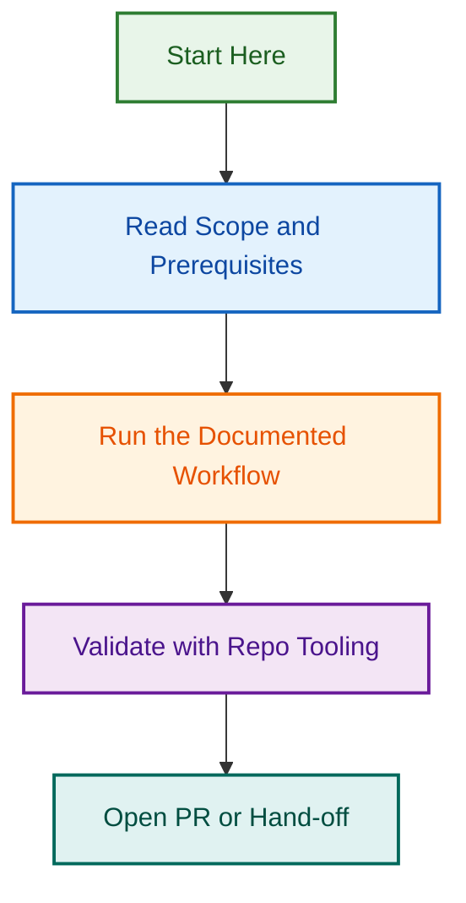

# Portable Agents

This directory contains portable, multi-file agent implementations that can be reused across LightSpeedWP repositories.

## Current Model

- `agents/` contains portable agents with provider-specific implementations.
- `.github/agents/` contains spec-based, GitHub-native control-plane agents.
- Agent standards are defined in `docs/AGENT_STANDARDS.md`.

## What Lives Here

Each agent directory can include:

- `AGENT.md` for metadata and capabilities.
- Provider folders such as `claude/`, `copilot/`, and `openai/` when applicable.
- Supporting `skills/`, `manifests/`, and docs.

## Current Agent Families

Examples in this directory include:

- `prd-agent/`
- `release/`
- `testing-agent/`
- `linear-advisor-agent/`
- `website-scope-estimator-agent/`

For full inventory and governance context, see:

- `ai/agents.md`
- `AGENTS.md`
- `CLAUDE.md`
## Visual Workflow

