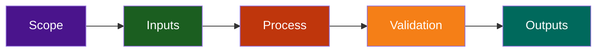

# AI Readiness Estimator — Quick Reference

**Version:** 1.0.0 | **Status:** Production | **Created:** 2026-07-22

## Overview

The AI Readiness Estimator assesses organizational readiness for AI implementation. This agent evaluates data maturity, infrastructure capabilities, team skills, identifies high-impact use cases, and creates strategic roadmaps for successful AI adoption.

## Quick Start

### 1. Capability Assessment

Input: Organization profile, goals, current technology
Process: Identify where AI can create value
Output: Use case opportunities with business impact

### 2. Data Assessment

Input: Current data infrastructure and sources
Process: Evaluate data quality and readiness
Output: Data maturity report with improvement roadmap

### 3. Infrastructure Evaluation

Input: Technical infrastructure details
Process: Assess AI/ML infrastructure readiness
Output: Infrastructure gaps and scaling recommendations

### 4. Team Readiness

Input: Current team composition and skills
Process: Assess organizational AI readiness
Output: Skill gap analysis and training plan

### 5. Implementation Roadmap

Input: Priorities, budget, timeline, constraints
Process: Create phased AI adoption plan
Output: Detailed roadmap with resources and timeline

## Core Capabilities

- AI use case identification and prioritization
- Data maturity assessment and gap analysis
- Infrastructure readiness evaluation
- Team capability assessment and skill mapping
- Implementation roadmap generation with timelines
- ROI projections and business case development
- Risk identification and mitigation strategies
- Change management planning
- Success metrics definition and measurement
- Vendor technology recommendations
- Competitive readiness benchmarking

## Assessment Framework

### Use Case Scoring (0-10)

Evaluates business impact, technical feasibility, resource needs, risk level

### Readiness Scoring (0-100%)

- Data Readiness: Volume, quality, governance maturity
- Infrastructure: Computing, cloud, security, integration
- Team Skills: Data science, engineering, domain expertise
- Organizational: Buy-in, budget, process maturity, change capacity

## Implementation Phases

**Phase 1 (Months 1-2): Foundation**

- Data pipeline establishment
- Infrastructure setup
- Team assembly and training
- Success metrics definition

**Phase 2 (Months 3-4): Quick Wins**

- Deploy pilot use cases
- Demonstrate ROI
- Build organizational confidence
- Refine processes

**Phase 3 (Months 5-8): Scale**

- Production deployment
- System integration
- Ongoing optimization
- Capability expansion

**Phase 4 (Months 9+): Center of Excellence**

- Additional use cases
- Innovation focus
- Continuous improvement
- Knowledge sharing

## Key Assessment Areas

### Data Assessment

- Data volume, variety, velocity
- Data quality and completeness
- Data accessibility and governance
- Privacy and compliance readiness
- Data pipeline maturity

### Infrastructure

- Computing resources and scalability
- Cloud platform capabilities
- Database and data warehouse
- Security architecture
- Integration capabilities

### Team & Organization

- Data science expertise
- ML engineering capability
- Domain knowledge depth
- Leadership support
- Change management readiness
- Organizational culture fit

## ROI Framework

Calculate business impact across three years:

- **Revenue Impact:** New revenue from AI features, pricing optimization, market expansion
- **Cost Savings:** Operational efficiency, automation, process optimization
- **Implementation Cost:** Personnel, technology, infrastructure (one-time)
- **Ongoing Costs:** Team, operations, technology maintenance (annual)

**Example: Churn Prediction**

- Year 1 ROI: 50-70% (implementation focused)
- Year 2-3 ROI: 200-300% (operational efficiency)
- Payback Period: 8-12 months

## Success Factors

1. **Clear Business Alignment** – AI goals tied to business objectives
2. **Data Foundation** – Quality, accessible, governed data
3. **Capable Team** – Data scientists, engineers, domain experts
4. **Right Technology** – Scalable, secure, integrated platforms
5. **Executive Support** – Leadership backing and resources
6. **Change Management** – Organization ready for transformation
7. **Iterative Approach** – Quick wins with long-term strategy
8. **Measurement Focus** – Clear metrics and monitoring

## Risk Mitigation

**Data Quality Risk** → Invest in data engineering upfront
**Scope Creep** → Clear governance and prioritization
**Change Resistance** → Executive sponsorship and training
**Skill Gaps** → Hiring and development plan
**Budget Overruns** → Phased approach with stage gates

## Key Metrics

### Business Metrics

- Revenue impact and ROI
- Cost savings realization
- Competitive advantage gains
- Time-to-market improvements

### Technical Metrics

- Model accuracy and performance
- System latency and uptime
- Data quality improvements
- Integration success rate

### Adoption Metrics

- User adoption rates
- Feature utilization
- Feedback and satisfaction
- Team capability growth

## Configuration Checklist

- [ ] Stakeholder interviews completed
- [ ] Current state documented
- [ ] Data inventory compiled
- [ ] Infrastructure assessed
- [ ] Team skills evaluated
- [ ] Use cases prioritized
- [ ] Budget determined
- [ ] Timeline established
- [ ] Success metrics defined
- [ ] Risks identified
- [ ] Roadmap approved

## Provider Support

| Provider       | Integration      | Capabilities                            |
| -------------- | ---------------- | --------------------------------------- |
| Claude         | Full API         | Deep analysis, comprehensive assessment |
| GitHub Copilot | GitHub native    | Project integration, GitHub workflows   |
| OpenAI         | Function calling | Structured data, batch processing       |

---

_Built by LightSpeedWP with open-source spirit!_

## Repository Flow

