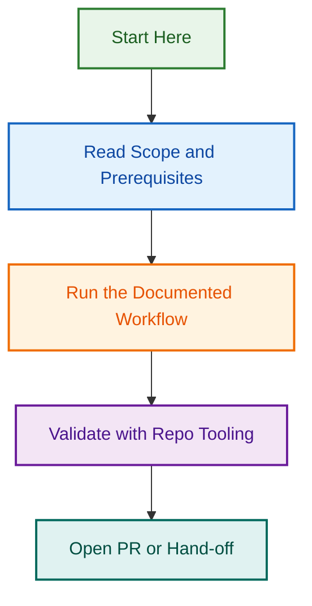

# LightSpeed AI Service Templates Overview

<!-- BADGES-START -->
[](https://github.com/lightspeedwp/.github/actions/workflows/awesome-github-site.yml)
[](https://github.com/lightspeedwp/.github/actions/workflows/changelog-auto-update.yml)
[](https://github.com/lightspeedwp/.github/actions/workflows/changelog-validate.yml)
[](https://github.com/lightspeedwp/.github/actions/workflows/checklist-finalisation.yml)
[](https://github.com/lightspeedwp/.github/actions/workflows/checks.yml)
[](https://github.com/lightspeedwp/.github/actions/workflows/dependabot-security-label.yml)
[](https://github.com/lightspeedwp/.github/actions/workflows/flaky-test-detection.yml)
[](https://github.com/lightspeedwp/.github/actions/workflows/issue-close-label-hygiene.yml)
[](https://github.com/lightspeedwp/.github/actions/workflows/issue-create-from-template.yml)
[](https://github.com/lightspeedwp/.github/actions/workflows/issues.yml)
[](https://github.com/lightspeedwp/.github/actions/workflows/labeling.yml)
[](https://github.com/lightspeedwp/.github/actions/workflows/linting.yml)
[](https://github.com/lightspeedwp/.github/actions/workflows/main-branch-guard.yml)
[](https://github.com/lightspeedwp/.github/actions/workflows/meta.yml)
[](https://github.com/lightspeedwp/.github/actions/workflows/metadata-governance.yml)
[](https://github.com/lightspeedwp/.github/actions/workflows/metrics-summary.yml)
[](https://github.com/lightspeedwp/.github/actions/workflows/metrics.yml)
[](https://github.com/lightspeedwp/.github/actions/workflows/planner.yml)
[](https://github.com/lightspeedwp/.github/actions/workflows/project-archival.yml)
[](https://github.com/lightspeedwp/.github/actions/workflows/project-meta-sync.yml)
[](https://github.com/lightspeedwp/.github/actions/workflows/readme-audit.yml)
[](https://github.com/lightspeedwp/.github/actions/workflows/readme-regen.yml)
[](https://github.com/lightspeedwp/.github/actions/workflows/readme-update.yml)
[](https://github.com/lightspeedwp/.github/actions/workflows/release.yml)
[](https://github.com/lightspeedwp/.github/actions/workflows/reporting.yml)
[](https://github.com/lightspeedwp/.github/actions/workflows/reviewer.yml)
[](https://github.com/lightspeedwp/.github/actions/workflows/template-enforcement.yml)
[](https://github.com/lightspeedwp/.github/actions/workflows/testing.yml)
[](https://github.com/lightspeedwp/.github/actions/workflows/validate-mermaid-pr.yml)
[](https://github.com/lightspeedwp/.github/actions/workflows/validate-pr-template.yml)
<!-- BADGES-END -->

This folder contains a structured collection of reusable Markdown templates for LightSpeed’s AI service packages. These files are organised by category to support assessments, chatbot planning, governance work, implementation discovery, QA, approvals, and delivery handover.

## Directory Structure

```text
service-templates/
├── shared/
├── readiness/
├── chatbot/
└── implementation/
```

## What This Adds To The Current Agent

The current file library already covers package routing, commercial rules, memory schemas, skill routing, and estimate logic.

This template library adds the reusable delivery artefacts that were mostly missing from the current setup:

- shared project registers and logs
- chatbot discovery and governance templates
- readiness audit and roadmap templates
- implementation, security, privacy, integration, and data-mapping templates

## How To Use This Library

- Start here when a task needs a reusable workshop, assessment, governance, implementation, QA, or handover document.
- Choose the narrowest template that matches the requested deliverable.
- Use the current package files, commercial rules, and approved sources to populate the templates.
- Do not invent values for placeholders. Replace them only with confirmed project information or clearly labelled assumptions.
- Use the shared registers to keep evidence, risks, decisions, commercial assumptions, and source approval aligned across the engagement.

## Folder Summary

### `shared/`

Reusable cross-project registers and logs:

- source-of-truth register
- claim register
- commercial assumptions sheet
- risk and review log
- decision log

### `readiness/`

Reusable readiness assessment outputs:

- AI readiness audit checklist
- AI readiness roadmap

### `chatbot/`

Reusable chatbot planning and governance outputs:

- chatbot discovery questionnaire
- chatbot recommendation memo
- source suitability checklist
- boundaries and escalation worksheet
- launch readiness checklist

### `implementation/`

Reusable delivery and solution-planning outputs:

- security and privacy review checklist
- data and source mapping sheet
- integration requirements template
- detailed solution discovery document

## Selection Rule

Use the template that is closest to the user’s requested outcome. If the task is still package scoping or estimate routing, use the package and commercial files first. Use these service templates when the user needs a reusable document, register, checklist, worksheet, memo, or implementation artefact

---

---

*Built by 🧱 LightSpeedWP with ☕, 🚀, and open-source spirit!*

## Visual Workflow


