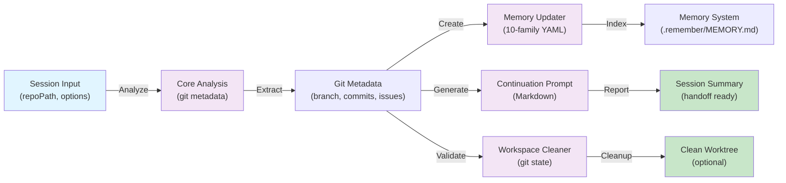
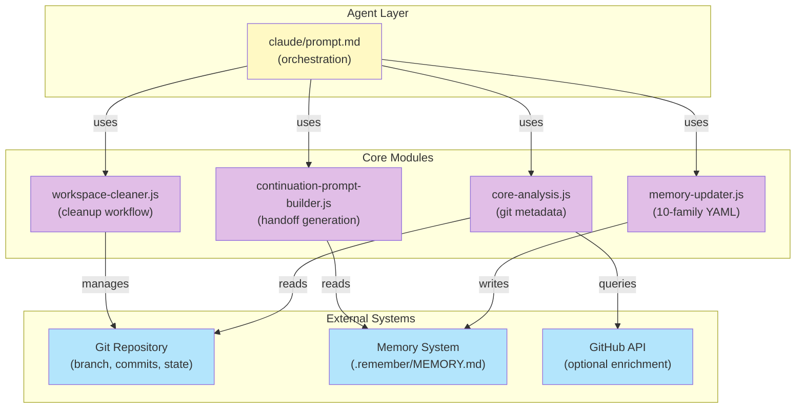
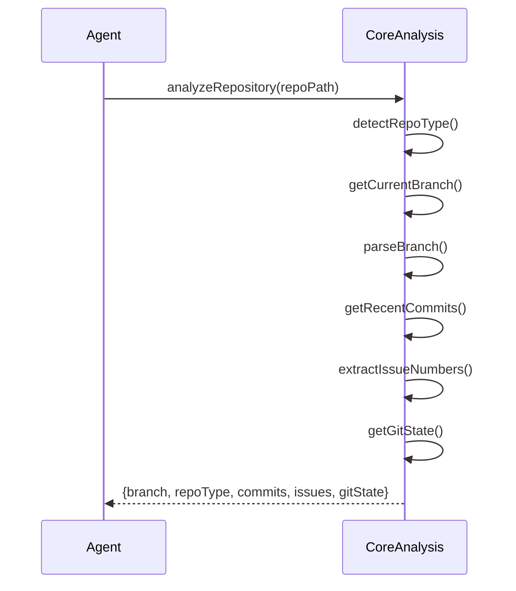
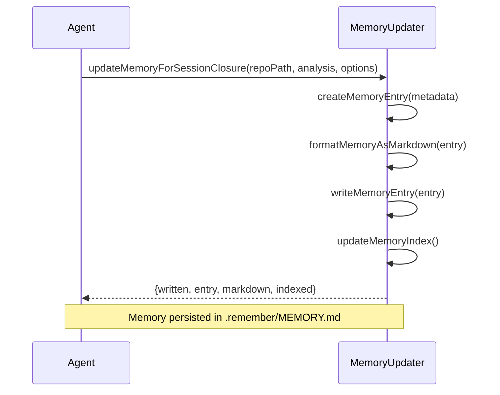
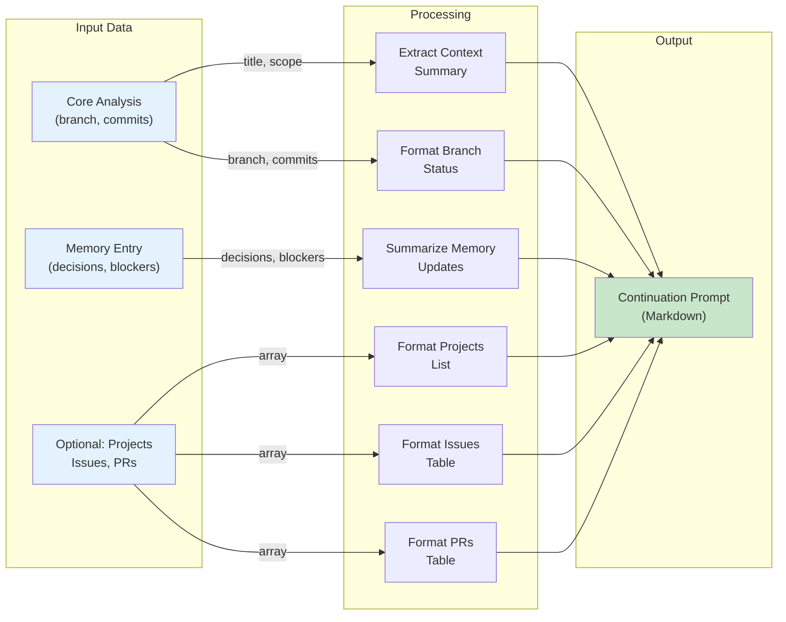
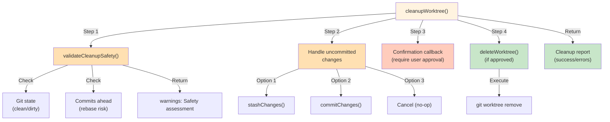
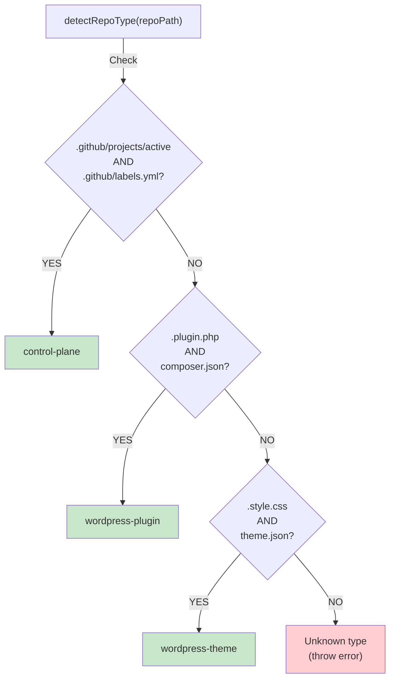
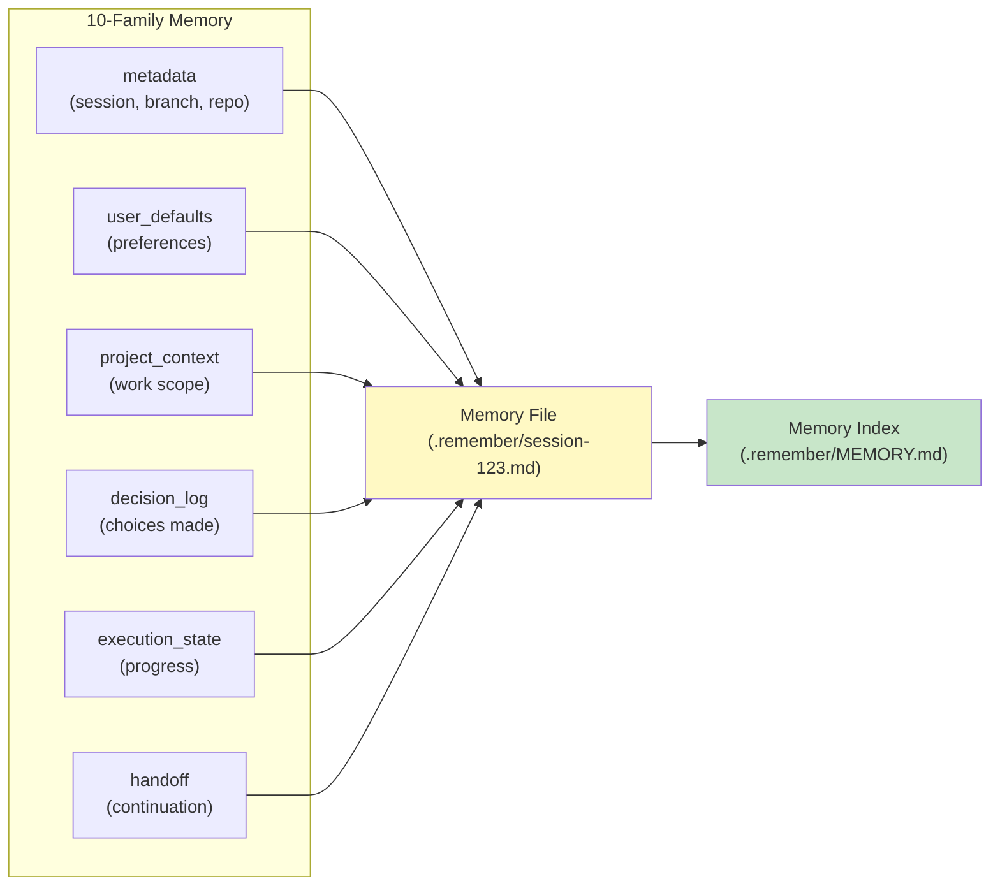
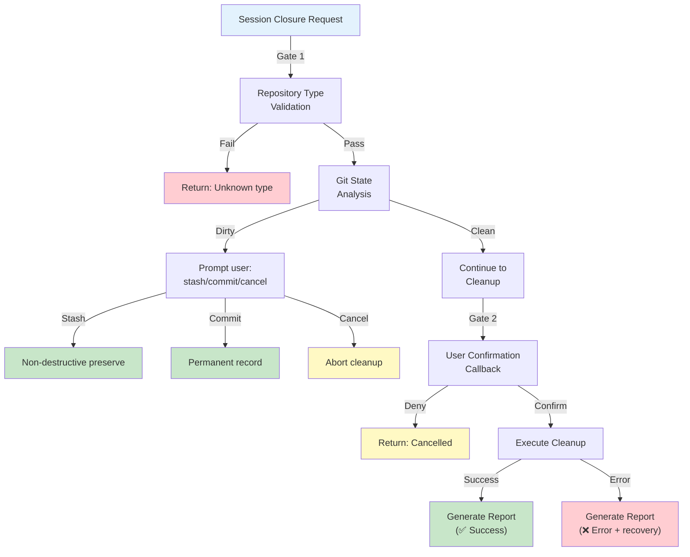

# Chat Closure Agent — Architecture & Design

**Overview:** The Chat Closure Agent is a Tier 1 portable agent that automates session closure workflows through modular, composable components. This document provides system architecture, component interactions, and design patterns.

## System Architecture

### High-Level Data Flow



### Component Stack



## Module Interactions

### 1. Core Analysis Module

**Purpose:** Extract git metadata and repository context



**Key Responsibilities:**

- Repository type detection (control-plane, plugin, theme)
- Branch parsing (type/scope extraction)
- Commit history analysis
- Issue number extraction from commit messages
- Git state validation (clean/dirty)

### 2. Memory Updater Module

**Purpose:** Create and persist session memory in 10-family YAML format



**Key Responsibilities:**

- Memory entry creation with 10-family structure
- Markdown formatting with frontmatter
- File I/O and persistence
- Index management and deduplication

### 3. Continuation Prompt Builder Module

**Purpose:** Generate professional handoff prompts with full context



**Key Responsibilities:**

- Context summary extraction
- Markdown table generation
- Prompt validation and formatting
- Multi-section orchestration

### 4. Workspace Cleaner Module

**Purpose:** Safe cleanup with validation and confirmation



**Key Responsibilities:**

- Pre-cleanup validation
- Git state analysis
- Confirmation workflow
- Non-destructive alternatives (stash/commit)
- Cleanup reporting

## Repository Type Detection

### Detection Logic



### Supported Repository Types

| Type | Markers | Purpose |
|------|---------|---------|
| **control-plane** | `.github/projects/active/` + `.github/labels.yml` | GitHub Actions workflows, org governance |
| **wordpress-plugin** | `plugin.php` + `composer.json` | WordPress plugin development |
| **wordpress-theme** | `style.css` + `theme.json` | WordPress theme development |

## Memory System Integration

### 10-Family YAML Structure



**Each family contains:**

```yaml
---
metadata:        # Agent tracking: session_id, branch, timestamp
---

## User Defaults
[4 standard user preferences]

## Project Context
- Branch: feat/implementation
- Repo type: control-plane
- Session date: 2026-08-12
- Work scope: [commit summary]

## Decision Log
✅ **decision-name**: Choice — Rationale

## Execution State
[Commits, issues referenced, blockers, next steps]

## Handoff
[Summary, continuation instructions, related issues]
```

## Error Handling & Recovery

### Validation & Safety Gates



## Design Patterns

### 1. Modular Composition

- Each module is **independent** with clear interfaces
- Modules can be used standalone or as a pipeline
- No cross-module state management

### 2. Safety-First Cleanup

- Validation before any destructive operation
- User confirmation for irreversible actions
- Non-destructive alternatives (stash/commit)
- Detailed error reporting

### 3. Memory Persistence

- Structured, human-readable format (10-family YAML)
- Automatic indexing and deduplication
- Frontmatter metadata for search/filtering
- Backward-compatible additions

### 4. Multi-Repository Support

- Detection-based adaptation (no configuration needed)
- Type-specific metadata parsing
- Unified interface across all types

## Performance Characteristics

| Operation | Time | Scalability |
|-----------|------|-------------|
| Repository analysis | ~100-300ms | Linear with commit count |
| Memory creation | ~50-100ms | Constant (file I/O) |
| Prompt generation | ~50-150ms | Linear with project/issue count |
| Workspace cleanup | ~500-2000ms | Depends on worktree size |
| **Total workflow** | **~1-3 seconds** | **Linear with context size** |

## Extension Points

The agent is designed for extension:

1. **New repository types** — Add detection logic + metadata parser
2. **Provider implementations** — Copilot/OpenAI via `copilot/prompt.md`, `openai/prompt.md`
3. **Memory enrichment** — GitHub API integration for issue/PR details
4. **Custom cleanup strategies** — Extend `workspace-cleaner.js` with new options
5. **Continuation prompt customization** — Template system for different audiences

## References

- [AGENT.md](../AGENT.md) — Full agent specification
- [claude/prompt.md](../claude/prompt.md) — Claude implementation
- [USAGE_GUIDE.md](./USAGE_GUIDE.md) — How to invoke and customize
- [TESTING_GUIDE.md](./TESTING_GUIDE.md) — Testing strategies
