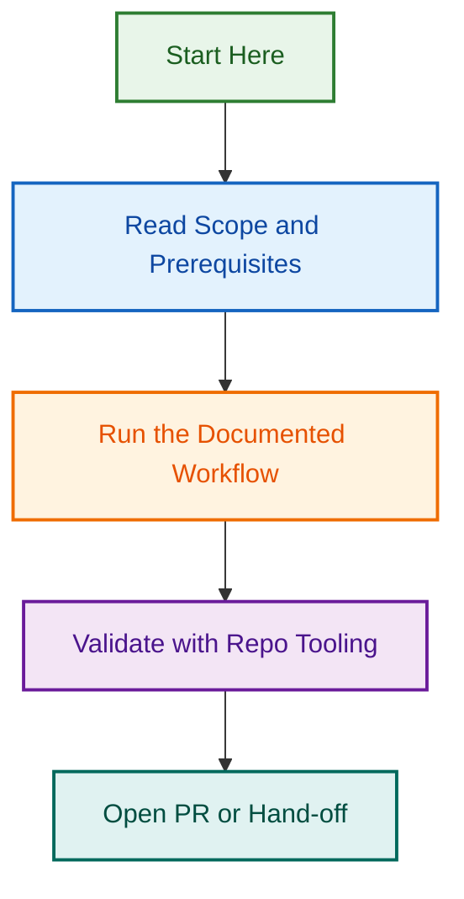

# Memory

<!-- BADGES-START -->

<!-- BADGES-END -->

Use this folder for **confirmed reusable working context** that should improve future runs of Design Partner.

Memory is for continuity, not for source-of-truth documentation.

## Files in this folder

- `user-preferences.md` — how the agent should work across runs
- `project-defaults.md` — recurring client, site, and project defaults
- `review-history.md` — compressed summaries of completed briefs, critiques, audits, and handoffs, including key findings, recommendations, approved directions, rejected directions, and follow-up continuity
- `todos.md` — unresolved follow-ups that should persist across runs
- `client-engagement-template.md` — the standard structure for new recurring client or project memory entries

## What belongs in Memory

- confirmed standing preferences
- durable client or project defaults
- repeated constraints that will matter again
- recommendations, approved directions, and rejected directions worth remembering
- unresolved follow-ups with clear next-action value

## What does not belong in Memory

- raw source material
- copied briefs, audits, or handoffs
- temporary assumptions
- one-off run notes
- speculative ideas that are not yet confirmed

## Operating rules

- Prefer updating an existing entry over adding duplicates.
- Keep entries short, decision-oriented, and easy to reuse.
- Separate confirmed defaults from open questions.
- If stronger current evidence conflicts with Memory, prefer the stronger current evidence.
- If a current request overrides a saved default for one run, follow the current request without rewriting the default unless the user makes the new preference explicit.

## Current Design Partner focus

This agent primarily supports:

- design briefs and page briefs
- critique and broader audits
- reference-site analysis
- UX writing
- bounded implementation and WordPress handoffs
- continuity across repeated client review cycles

## Maintenance checklist

- Move stable repeated context into `project-defaults.md`.
- Move completed review outcomes into `review-history.md`.
- Keep only unfinished follow-ups in `todos.md`.
- Keep agent-working preferences in `user-preferences.md`.
- Use `client-engagement-template.md` when starting a new long-running client or project memory block.

---

---

*Built by 🧱 LightSpeedWP with ☕, 🚀, and open-source spirit!*

## Visual Workflow

