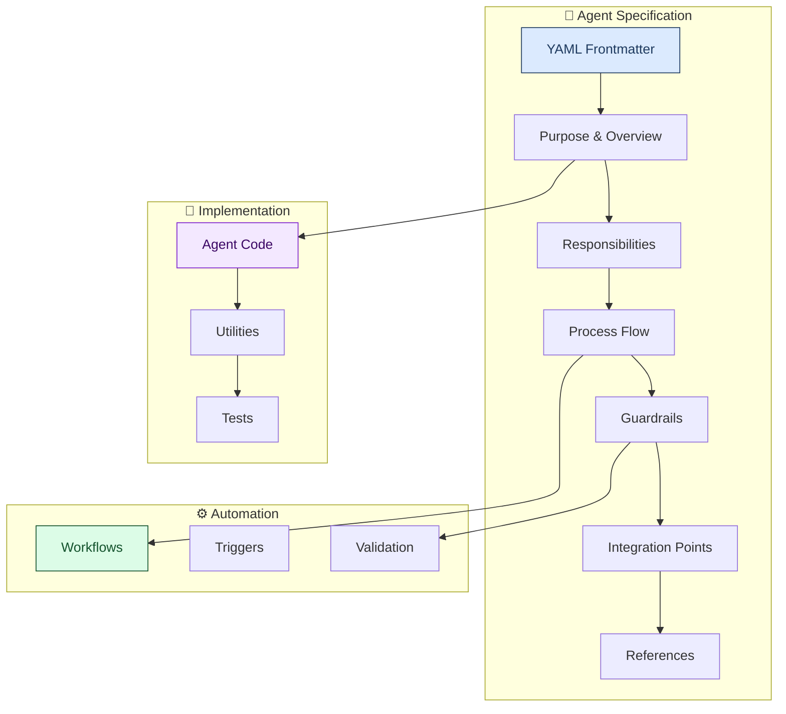
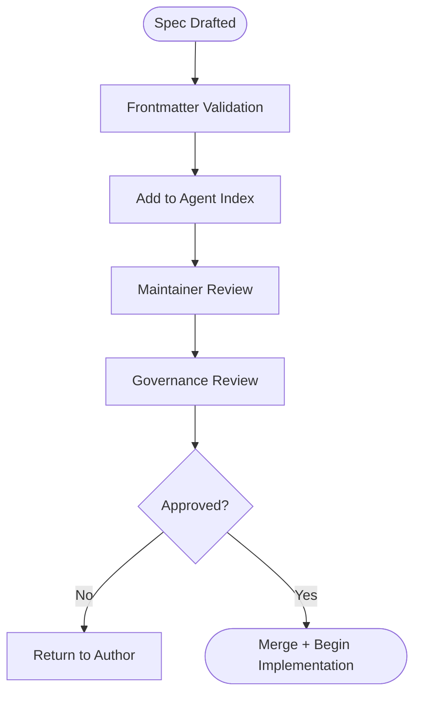
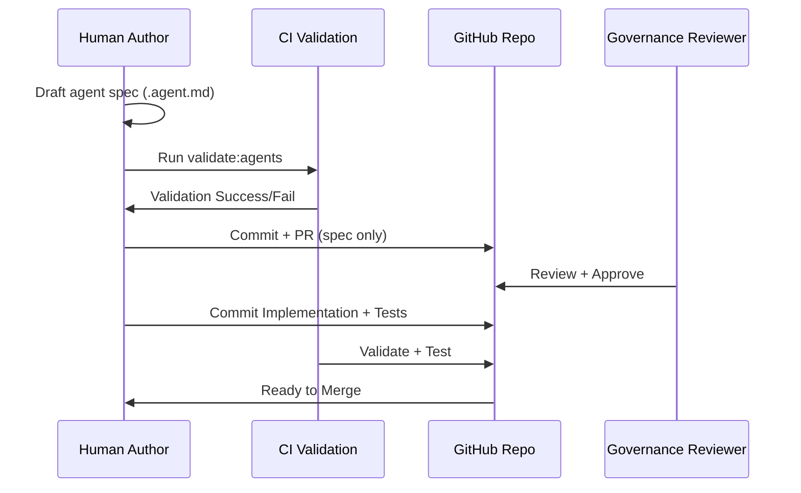
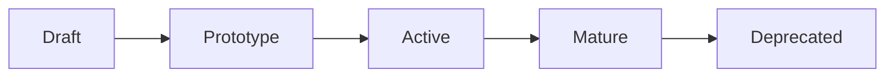
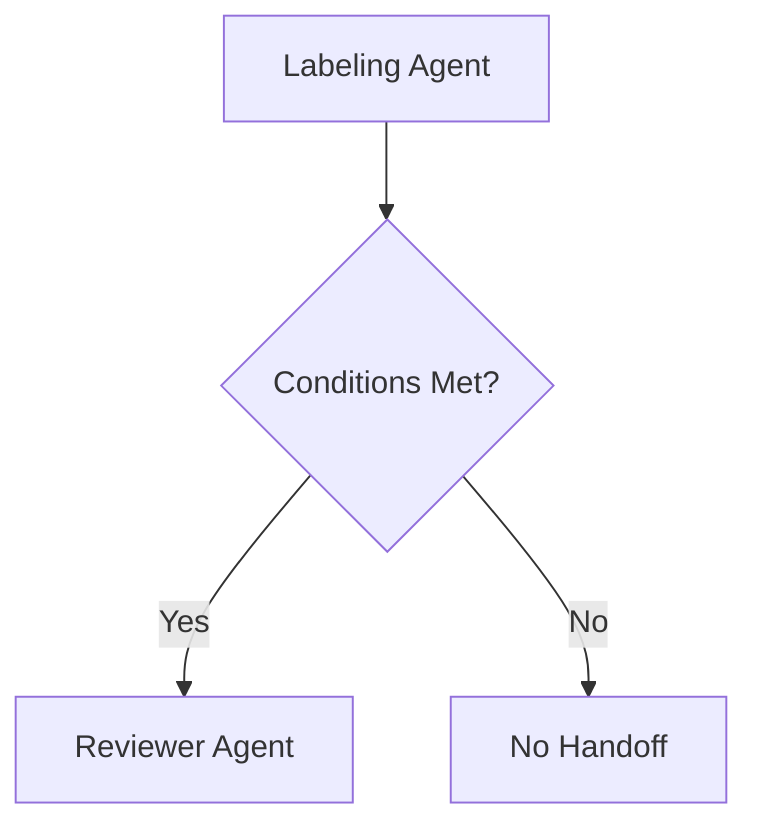

# 📝 Agent Specification Authoring Guide

[](../docs/)
[](../.github/instructions/)
[](../.github/schemas/)

> **Complete guide** for authoring agent specification files that follow LightSpeed organizational standards, including frontmatter requirements, documentation structure, implementation patterns, and validation processes.

---

## 📋 Table of Contents

- [Overview](#overview)
- [Agent Specification Architecture](#agent-specification-architecture)
- [0. Why This Document Exists](#0-why-this-document-exists)
- [1. When You Should Create a New Agent](#1-when-you-should-create-a-new-agent)
- [2. Pre-Creation Checklist (Human)](#2-pre-creation-checklist-human)
- [3. Required Structure of the Spec File](#3-required-structure-of-the-spec-file)
- [4. Writing Clear Human-Focused Behaviour](#4-writing-clear-human-focused-behaviour)
- [5. Governance: Approval & Ownership](#5-governance-approval-ownership)
- [6. Frontmatter Governance Rules](#6-frontmatter-governance-rules)
- [7. Publishing Workflow (Spec → Implementation)](#7-publishing-workflow-spec-implementation)
- [8. Long-Term Governance & Maintenance](#8-long-term-governance-maintenance)
- [9. Quality Gates (Human + Machine)](#9-quality-gates-human-machine)
- [10. Agent Lifecycle Maturity Model](#10-agent-lifecycle-maturity-model)
- [11. Cross-Agent Collaboration & Handoffs](#11-cross-agent-collaboration-handoffs)
- [12. Quick Start Template](#12-quick-start-template)
- [13. References](#13-references)

---

## Overview

### Purpose

Agent specification files (`.agent.md`) serve as the canonical documentation for automated agents in the LightSpeed ecosystem. They define:

- **Purpose and Responsibilities**: What the agent does and why
- **Behavioral Specifications**: How the agent operates
- **Integration Points**: How it connects with workflows and systems
- **Guardrails and Safety**: Constraints and validation rules
- **Testing Requirements**: How to validate functionality

**Human-Focused Governance for Authoring New AI Agents**
*Organisation-Wide Standards*

This document defines **how humans plan, draft, review, and publish agent specifications** across all LightSpeed repositories.
It complements—but does not duplicate:

- the **Agent Specification Template** (`template.agent.md`)
- **agent-spec.instructions.md** (Copilot behaviour rules)
- the **Agent Specification Authoring Guide** (technical writing reference)

This file is intentionally **non-technical**. It focuses on:

- governance
- safety
- ownership
- authoring behaviour
- lifecycle
- quality gates
- approvals
- documentation expectations

---

### File Naming Convention

```bash
# Pattern: {agent-name}.agent.md
labeling.agent.md
reviewer.agent.md
planner.agent.md
meta.agent.md
```

### Location

All agent specifications must be stored in:

```
.gith../.github/agents/{agent-name}.agent.md
```

---

## Agent Specification Architecture



---

## 0. Why This Document Exists

LightSpeed uses a growing ecosystem of specialised AI agents.
To ensure systems remain **safe, predictable, maintainable, and auditable**, every new agent must follow unified governance rules.

This document answers:

❓ *When should a new agent be created?*
❓ *Who approves it?*
❓ *What must be included in the spec?*
❓ *How do we prevent scope creep or unsafe behaviour?*
❓ *How do we ensure long-term maintainability?*

---

## 1. When You Should Create a New Agent

Create a new agent when:

- A workflow is **repetitive**, **rules-driven**, or **document-heavy**
- The behaviour can be described **deterministically**
- Safety guardrails can be stated clearly
- Humans currently perform manual steps that can be systematised
- The behaviour does **not** belong to an existing agent
- The workflow has **stable, governed rules**

### Mermaid: Should You Create a New Agent?

```mermaid
flowchart TD
%%{init: { 'accessibility': { 'diagWithoutTitle':true } }}%%
accTitle: Decision flow for creating a new agent
accDescr: Flowchart walking through whether a proposed workflow is deterministic and repeatable enough to justify creating a new agent, or whether it should remain manual.
    A([New Workflow Identified]) --> B{Is it deterministic?}
    B -->|No| N1[Do NOT create agent]
    B -->|Yes| C{Is there an existing agent<br/>that covers this scope?}
    C -->|Yes| N2[Extend/update existing agent]
    C -->|No| D{Can guardrails prevent<br/>harm or ambiguity?}
    D -->|No| N3[Do NOT create agent]
    D -->|Yes| E{Is a maintainer willing<br/>to own the lifecycle?}
    E -->|No| N4[Do NOT create agent]
    E -->|Yes| F([Proceed with Spec Draft])
````

---

## 2. Pre-Creation Checklist (Human)

Before drafting a spec:

- [ ] Define the **problem** the agent solves
- [ ] Determine whether this is an **organisation-wide** or **repo-specific** agent
- [ ] Confirm clear **handoff boundaries** with existing agents
- [ ] List the **allowed tools** (GitHub API scope, repository access, fs operations, read-only vs write)
- [ ] Document the **risk level** (Low, Medium, High)
- [ ] Define **guardrails** proportional to the risk
- [ ] Check for **overlap** with any existing agent
- [ ] Capture **inputs** (events, prompts, triggers)
- [ ] Decide how the agent’s success/failure is **observable**

### Mermaid: Pre-Creation Review Path

```mermaid
flowchart LR
%%{init: { 'accessibility': { 'diagWithoutTitle':true } }}%%
accTitle: Pre-creation review path
accDescr: Flowchart showing the steps for reviewing a proposed agent before creation, from defining the problem through assessing overlap with existing agents.
    Start([Start]) --> Check1[Define Problem]
    Check1 --> Check2[Assess Overlap]
    Check2 --> Check3[Define Tools + Permissions]
    Check3 --> Check4[Define Guardrails]
    Check4 --> Check5[Assign Owner]
    Check5 --> Decision{All Preconditions Met?}
    Decision -->|No| Stop([Stop - Revise Concept])
    Decision -->|Yes| Proceed([Write Spec File])
```

---

## 3. Required Structure of the Spec File

Every `.agent.md` MUST include:

### Mandatory Sections (from template.agent.md)

- **Role & Scope**
- **Responsibilities & Capabilities**
- **Allowed Tools & Integrations**
- **Input Specification**
- **Output Specification**
- **Safety Guardrails**
- **Failure & Rollback Strategy**
- **Test Tasks**
- **Observability & Logging**
- **Changelog**

### Why strict structure matters

Agents are reviewed, linted, validated, and audited. A consistent structure ensures:

- machine readability
- human readability
- auditability
- easier cross-agent governance
- predictable behaviour when deployed across repos

---

## 4. Writing Clear Human-Focused Behaviour

Unlike implementation instructions, this governance doc ensures **specs are written for humans**, not machines.

Write:

- In **plain, concrete language**
- In **imperative style**
- With **binary decisions** (“If X, do Y; otherwise Z”)
- With **hard limitations** (“The agent must never…”)
- With **fully defined success/failure conditions**

Avoid:

- Open-ended guidance (“use judgement”, “do your best”)
- Delegating to Copilot what humans should define
- Implicit powers (“The agent may update repo settings…”)
- Scope drift (“This agent also might handle …”)

Agents must not guess.
*If you can’t write the rule, the agent can’t follow it.*

---

## 5. Governance: Approval & Ownership {#5-governance-approval-ownership}

### Required approvals

A new agent spec requires:

- ✔ **Maintainer Review** — technical feasibility
- ✔ **Governance Review** — safety, scope, cross-agent consistency
- ✔ Optional: **Product Review** — if agent affects workflows

### Ownership rules

Frontmatter `owners:` must map to a team or individual who is responsible for:

- reviewing behavioural drift
- updating the spec when workflows change
- responding to incidents
- ensuring testing coverage remains valid

### Mermaid: Approval Workflow



---

## 6. Frontmatter Governance Rules

Frontmatter is **machine-validated**. Errors break CI.

### Required

- `file_type: "agent"`
- `name:` unique across repository
- `description:` concise behaviour overview
- `version:` semantic
- `last_updated:` ISO date
- `owners:` responsible maintainers

### Recommended (strongly encouraged)

- `category:` automation / governance / documentation
- `status:` draft / active / deprecated / experimental
- `tools:` list *exact* allowed capabilities
- `target:` github-copilot / actions / workspace
- `visibility:` public / internal
- `metadata.guardrails:` human-written hard limits

### Agent-specific fields

- `handoffs:` to specify multi-agent orchestration
- `references:` linking workflows, schemas, instructions
- `language:` default natural language for outputs

### Mermaid: Frontmatter Scope Map

```mermaid
mindmap
%%{init: { 'accessibility': { 'diagWithoutTitle':true } }}%%
accTitle: Frontmatter scope map
accDescr: Mindmap of the required and optional frontmatter fields for an agent specification.
  root((Frontmatter))
    Required
      file_type
      name
      description
      version
      last_updated
      owners
    Recommended
      category
      status
      visibility
      tools
    Agent-Specific
      handoffs
      references
      metadata.guardrails
    Validation
      semantic versioning
      ISO date
      unique naming
```

---

## 7. Publishing Workflow (Spec → Implementation) {#7-publishing-workflow-spec-implementation}

1. Draft `.agent.md` following this governance document
2. Validate frontmatter

   ```bash
   npm run validate:agents
   ```

3. Add entry to `.gith../.github/agents/agent.md`
4. Commit the **spec only**
5. Write the `.agent.js` implementation
6. Write tests (`__tests__/`)
7. Run validation, linting, and test suites
8. Submit PR containing:

   - spec
   - implementation
   - tests
   - agent index update

### Mermaid: Full Publishing Pipeline



---

## 8. Long-Term Governance & Maintenance {#8-long-term-governance-maintenance}

Agents are **living components** of the automation ecosystem.

Review an agent if:

- its behaviour drifts from the spec
- GitHub APIs or repository workflows change
- new organisational rules affect safety
- the toolchain changes (e.g., new CI patterns)
- its responsibilities grow beyond original scope

### Deprecation Rules

Deprecate an agent when:

- another agent supersedes it
- its workflow becomes obsolete
- it introduces unavoidable risk

Deprecation requires:

- updating status to `deprecated`
- documenting migration path
- removing from active orchestration

---

## 9. Quality Gates (Human + Machine) {#9-quality-gates-human-machine}

A spec **must not pass review** unless:

- Behaviour is deterministic
- Safety guardrails prevent destructive actions
- Scope is tightly written
- Inputs/outputs are fully defined
- References resolve correctly
- Responsibilities do NOT overlap another agent

CI quality gates:

- frontmatter schema validation
- markdown linting
- references must be resolvable
- tests must cover happy paths + edge cases + failure modes

---

### 10. Agent Lifecycle Maturity Model

To avoid premature complexity, agents evolve through stages:



### Draft

Spec written, no implementation.

### Prototype

Partial implementation exists, high iteration expected.

### Active

Fully implemented, tested, and used.

### Mature

Stable, minimal changes expected.

### Deprecated

Retired but kept for archive/migration purposes.

---

### 11. Cross-Agent Collaboration & Handoffs {#11-cross-agent-collaboration-handoffs}

Some workflows require multiple agents acting in sequence.

Use `handoffs:` to define:

- **what triggers a handoff**
- **what data or context is passed**
- **which agent receives the handoff**
- **whether the handoff is automatic or manual**

This enables predictable multi-agent orchestration.

Example patterns:

- Labeling → Reviewer
- Planner → Implementation Agent
- Auditor → Metadata Agent

#### Mermaid: Handoff Example



---

### 12. Quick Start Template

```bash
cp .gith../.github/agents/template.agent.md .gith../.github/agents/my-agent.agent.md
```

Then follow the governance checklist on this page.

---

### 13. References

- Organisation-wide agent index (`.gith../.github/agents/agent.md`)
- Agent Specification Authoring Guide
- Frontmatter schema (`.github/schemas/frontmatter.schema.json`)
- Agent instructions (`agent-spec.instructions.md`)

---

**📧 Questions?** Contact the LightSpeed team or [open an issue](https://github.com/lightspeedwp/.github/issues/new)

---

---

*Built by 🧱 LightSpeedWP with ☕, 🚀, and open-source spirit!*
