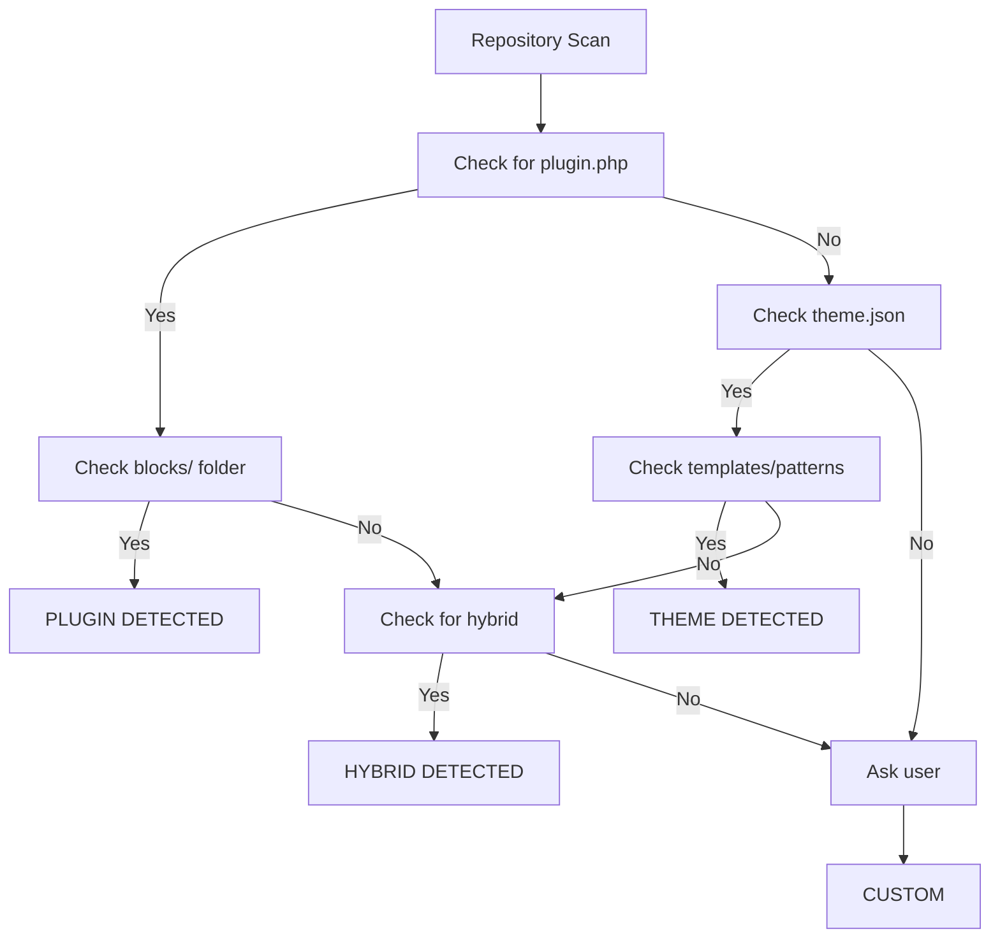

# Context Detection Technical Guide

<!-- BADGES-START -->


[](https://github.com/lightspeedwp/.github/actions/workflows/actions-minute-savings-watch.yml)
[](https://github.com/lightspeedwp/.github/actions/workflows/allocate-pr-issue-to-milestone.yml)
[](https://github.com/lightspeedwp/.github/actions/workflows/awesome-github-site.yml)
[](https://github.com/lightspeedwp/.github/actions/workflows/badges-documentation-update.yml)
[](https://github.com/lightspeedwp/.github/actions/workflows/badges-health-check.yml)
[](https://github.com/lightspeedwp/.github/actions/workflows/badges-readme-status.yml)
[](https://github.com/lightspeedwp/.github/actions/workflows/badges-workflow-audit.yml)
[](https://github.com/lightspeedwp/.github/actions/workflows/branch-name-validation.yml)
[](https://github.com/lightspeedwp/.github/actions/workflows/changelog-management.yml)
[](https://github.com/lightspeedwp/.github/actions/workflows/checklist-finalisation.yml)
[](https://github.com/lightspeedwp/.github/actions/workflows/checks.yml)
[](https://github.com/lightspeedwp/.github/actions/workflows/cleanup-branches.yml)
[](https://github.com/lightspeedwp/.github/actions/workflows/docs-maintenance.yml)
[](https://github.com/lightspeedwp/.github/actions/workflows/docs-validation.yml)
[](https://github.com/lightspeedwp/.github/actions/workflows/documentation.yml)
[](https://github.com/lightspeedwp/.github/actions/workflows/flaky-test-detection.yml)
[](https://github.com/lightspeedwp/.github/actions/workflows/gitleaks-reusable.yml)
[](https://github.com/lightspeedwp/.github/actions/workflows/gitleaks-update.yml)
[](https://github.com/lightspeedwp/.github/actions/workflows/gitleaks.yml)
[](https://github.com/lightspeedwp/.github/actions/workflows/issue-create-enhanced.yml)
[](https://github.com/lightspeedwp/.github/actions/workflows/issue-create-enhanced.yml)
[](https://github.com/lightspeedwp/.github/actions/workflows/issue-fields-backfill.yml)
[](https://github.com/lightspeedwp/.github/actions/workflows/issue-health-audit.yml)
[](https://github.com/lightspeedwp/.github/actions/workflows/issue-labeling-automation.yml)
[](https://github.com/lightspeedwp/.github/actions/workflows/issue-project-field-sync.yml)
[](https://github.com/lightspeedwp/.github/actions/workflows/issue-remediation-automation.yml)
[](https://github.com/lightspeedwp/.github/actions/workflows/issue-remediation-bulk.yml)
[](https://github.com/lightspeedwp/.github/actions/workflows/issues.yml)
[](https://github.com/lightspeedwp/.github/actions/workflows/label-audit-report.yml)
[](https://github.com/lightspeedwp/.github/actions/workflows/labeling-governance.yml)
[](https://github.com/lightspeedwp/.github/actions/workflows/labeling.yml)
[](https://github.com/lightspeedwp/.github/actions/workflows/main-branch-guard.yml)
[](https://github.com/lightspeedwp/.github/actions/workflows/manage-blocking-status-labels.yml)
[](https://github.com/lightspeedwp/.github/actions/workflows/meta-agent-validation.yml)
[](https://github.com/lightspeedwp/.github/actions/workflows/meta-labels-sync.yml)
[](https://github.com/lightspeedwp/.github/actions/workflows/meta.yml)
[](https://github.com/lightspeedwp/.github/actions/workflows/metadata-governance.yml)
[](https://github.com/lightspeedwp/.github/actions/workflows/metrics-pipeline.yml)
[](https://github.com/lightspeedwp/.github/actions/workflows/metrics-reporting.yml)
[](https://github.com/lightspeedwp/.github/actions/workflows/openspec-progress-phase.yml)
[](https://github.com/lightspeedwp/.github/actions/workflows/openspec-report-progression.yml)
[](https://github.com/lightspeedwp/.github/actions/workflows/openspec-sync-labels.yml)
[](https://github.com/lightspeedwp/.github/actions/workflows/openspec-validate-labels.yml)
[](https://github.com/lightspeedwp/.github/actions/workflows/planner.yml)
[](https://github.com/lightspeedwp/.github/actions/workflows/pr-template-validation.yml)
[](https://github.com/lightspeedwp/.github/actions/workflows/project-archival.yml)
[](https://github.com/lightspeedwp/.github/actions/workflows/project-maintenance-nightly.yml)
[](https://github.com/lightspeedwp/.github/actions/workflows/project-maintenance-on-demand.yml)
[](https://github.com/lightspeedwp/.github/actions/workflows/project-meta-sync.yml)
[](https://github.com/lightspeedwp/.github/actions/workflows/release.yml)
[](https://github.com/lightspeedwp/.github/actions/workflows/reporting.yml)
[](https://github.com/lightspeedwp/.github/actions/workflows/reviewer.yml)
[](https://github.com/lightspeedwp/.github/actions/workflows/template-enforcement.yml)
[](https://github.com/lightspeedwp/.github/actions/workflows/validate-blocking-issue-before-close.yml)
[](https://github.com/lightspeedwp/.github/actions/workflows/validate-blocking-status-before-close.yml)
[](https://github.com/lightspeedwp/.github/actions/workflows/validate-dor-dod-sections.yml)
[](https://github.com/lightspeedwp/.github/actions/workflows/validate-issue-dod-before-close.yml)
[](https://github.com/lightspeedwp/.github/actions/workflows/validate-mermaid-pr.yml)
[](https://github.com/lightspeedwp/.github/actions/workflows/validate-pr-template.yml)
[](https://github.com/lightspeedwp/.github/actions/workflows/validate-project-linking.yml)
<!-- BADGES-END -->

This document provides a technical deep-dive into how the PRD Agent v2.1 automatically detects project types and adapts PRD sections accordingly.

---

## Detection Algorithm

### Overview

The agent uses a decision tree to identify project type:



**Text-based flowchart:**

1. Check for `plugin.php` → if yes, go to step 2; if no, go to step 3
2. Check for `blocks/` folder → if yes, PLUGIN DETECTED; if no, go to step 4
3. Check for `theme.json` → if yes, go to step 5; if no, go to step 6
4. Check for both `plugin.php` AND `theme.json` → if yes, HYBRID DETECTED; if no, go to step 7
5. Check for `templates/` or `patterns/` → if yes, THEME DETECTED; if no, go to step 4
6. Ask user for clarification → CUSTOM DETECTED

### Step-by-Step Detection

#### Step 1: Check for `plugin.php`

**File:** Root `plugin.php`  
**Pattern Match:**

```php
<?php
/**
 * Plugin Name: [Plugin Name]
 * ...
 */
```

**Indicator:** File exists and contains WordPress plugin header

**Meaning:** Project is likely a WordPress plugin (could be block plugin, classic plugin, or hybrid)

---

#### Step 2: Check for Block Plugin Indicators

**Primary Marker:** `blocks/` folder exists

**Supporting Markers:**

- `blocks/my-block/block.json` — Block registration file
- `blocks/my-block/index.js` — Block JavaScript
- `blocks/my-block/index.php` — Optional block rendering PHP
- Multiple block folders in `blocks/` directory

**Detection Logic:**

```
If plugin.php exists AND (
    blocks/ folder exists OR
    Any folders in blocks/ contain block.json
)
    → BLOCK PLUGIN DETECTED
```

**PRD Adaptation:**
✓ Block inventory focus  
✓ Hooks and filters (custom hooks provided by plugin)  
✓ Block registration and settings  
✓ Accessibility in block editor interface  
✓ WordPress version compatibility matrix  

---

#### Step 3: Check for `theme.json`

**File:** Root `theme.json`  
**Pattern Match:**

```json
{
  "version": 2,
  "settings": { ... },
  "styles": { ... },
  "templateParts": [ ... ]
}
```

**Indicator:** File exists and contains valid theme.json structure

**Meaning:** Project is likely a WordPress block theme (FSE-capable)

---

#### Step 4: Check for Theme Indicators

**Primary Markers:** `templates/` or `patterns/` folder

**Supporting Markers:**

- `templates/index.html` — Main template file
- `templates/single.html` — Single post template
- `templates/archive.html` — Archive template
- `patterns/` folder — Block patterns
- `functions.php` — Theme setup
- `style.css` — Theme stylesheet

**Detection Logic:**

```
If theme.json exists AND (
    templates/ folder exists OR
    patterns/ folder exists OR
    HTML files in root/templates/
)
    → BLOCK THEME DETECTED
```

**PRD Adaptation:**
✓ Theme settings and design tokens  
✓ Block patterns and template structure  
✓ Full Site Editing (FSE) support level  
✓ Template hierarchy (required templates)  
✓ Browser support matrix  
✓ Design system consistency  

---

#### Step 5: Check for Hybrid Project

**Detection Logic:**

```
If (plugin.php exists AND blocks/ folder exists) AND
   (theme.json exists AND templates/ folder exists)
    → HYBRID PROJECT DETECTED
```

**Characteristics:**

- Both plugin infrastructure and theme infrastructure present
- Likely: Plugin provides blocks, theme provides interface to use them
- Likely: Tight coupling between plugin and theme components

**PRD Adaptation:**
✓ Separate plugin and theme requirement sections  
✓ Interdependencies and coordination points  
✓ Unified version compatibility matrix (both components)  
✓ Testing scenarios covering both plugin and theme  
✓ Deployment considerations (release timing, dependencies)  

---

#### Step 6: Custom WordPress Projects

**When Detection is Uncertain:**

- Repository doesn't match standard plugin/theme patterns
- Custom folder structure or naming conventions
- Multi-component project not fitting standard categories

**Agent Response:**
The agent asks clarifying questions:

```
I couldn't automatically determine your project type.
Let me ask a few questions:

1. What is the primary purpose of this project?
   (e.g., "Add custom blocks", "Custom theme", "Admin interface", etc.)

2. Which best describes your project?
   - Block Plugin (Gutenberg blocks)
   - Block Theme (Full Site Editing)
   - Hybrid (Plugin + Theme)
   - Classic Plugin (PHP-based, no blocks)
   - Admin/Custom Implementation
   - Other (describe)

3. What are the key WordPress features this depends on?
   (e.g., "Block Editor", "REST API", "Custom post types", etc.)
```

**User Input:** User specifies project type  
**Agent Behavior:** Adapts PRD sections accordingly

---

## File & Folder Markers

### Complete Detection Markers Reference

#### Block Plugin Markers

| Marker | Required | Weight | Indicates |
|--------|----------|--------|-----------|
| `plugin.php` | Yes | High | WordPress plugin |
| `blocks/` folder | Yes | High | Contains blocks |
| `blocks/*/block.json` | Yes | High | Block registration |
| `blocks/*/index.js` | Often | Medium | Block frontend |
| `blocks/*/index.php` | Sometimes | Medium | Block rendering |
| `src/` or `lib/` | Sometimes | Low | Source code |
| `package.json` | Often | Low | Node.js tooling |
| `.wp-env.json` | Sometimes | Low | Dev environment |

#### Block Theme Markers

| Marker | Required | Weight | Indicates |
|--------|----------|--------|-----------|
| `theme.json` | Yes | High | FSE theme |
| `templates/` folder | Often | High | FSE templates |
| `patterns/` folder | Sometimes | Medium | Block patterns |
| `templates/index.html` | Often | High | Main template |
| `templates/single.html` | Often | Medium | Single post template |
| `functions.php` | Yes | High | Theme setup |
| `style.css` | Yes | High | Theme stylesheet |
| `theme.json` version ≥ 2 | Yes | High | FSE support |

#### Hybrid Project Markers

| Marker | Required | Weight | Indicates |
|--------|----------|--------|-----------|
| `plugin.php` + `theme.json` | Yes | High | Hybrid project |
| `blocks/` + `templates/` | Yes | High | Plugin blocks + theme templates |
| Coordinated version files | Sometimes | Medium | Shared version strategy |
| Shared utilities folder | Sometimes | Low | Code sharing between components |

---

## Validation Questions

Once the agent detects a project type, it confirms with the user:

### For Block Plugins

```
I detected a Block Plugin based on:
  ✓ plugin.php found in root
  ✓ blocks/ folder with block definitions
  ✓ [block.json files found]

Let me confirm assumptions:
1. Primary WordPress Version Target: 6.4+ / 6.5+ / 6.6+ ?
2. Minimum PHP Version: 7.4 / 8.0+ ?
3. Key Dependencies: [Popular plugins this integrates with]
4. Core Focus: [Masonry gallery / Form builder / etc.]

Shall I proceed with Block Plugin PRD sections?
```

### For Block Themes

```
I detected a Block Theme based on:
  ✓ theme.json found in root
  ✓ templates/ folder with template files
  ✓ [Additional markers]

Let me confirm assumptions:
1. Full Site Editing (FSE) Support Level: MVP / Full / Extended ?
2. Target WordPress Version: 6.4+ / 6.5+ / 6.6+ ?
3. Minimum PHP Version: 7.4 / 8.0+ ?
4. Design System Scope: [Description]
5. Browser Support: Modern / Extended ?

Shall I proceed with Block Theme PRD sections?
```

### For Hybrid Projects

```
I detected a Hybrid Project based on:
  ✓ plugin.php and blocks/ folder found
  ✓ theme.json and templates/ folder found

Let me confirm assumptions:
1. Plugin Focus: [Custom blocks / Admin features / etc.]
2. Theme Focus: [FSE-ready / Starter / etc.]
3. Coupling Level: Tight / Loose / Modular ?
4. Shared Version Number: Yes / No (separate versions) ?
5. Target WordPress Version: 6.4+ / 6.5+ / 6.6+ ?

Shall I proceed with Hybrid Project PRD sections?
```

---

## Assumption Overrides

Users can override detected type or assumptions:

### Override Project Type

```
User: "Actually, treat this as a Hybrid project, not just a plugin"
Agent:   "Understood. I'll include plugin AND theme PRD sections."

User: "This is a custom WordPress implementation, not a standard type"
Agent:   "Got it. I'll ask clarifying questions about your specific needs."
```

### Override Assumptions

```
User: "We only support WP 6.5 and later, not 6.4"
Agent:   "Noted. WP 6.5+ support. No compatibility testing for 6.4."

User: "Multisite is not a requirement"
Agent:   "Understood. Removing multisite-specific testing from timeline."

User: "WCAG accessibility is optional for MVP"
Agent:   "Noted. Accessibility as Phase 2+, not MVP requirement."
```

---

## PRD Section Adaptation Based on Detection

### Block Plugin → PRD Includes

- ✓ Block Inventory (list of blocks)
- ✓ Block Registration & Settings (JSON, dynamic rendering)
- ✓ Hooks & Filters (custom hooks, filters, actions)
- ✓ WordPress Compatibility Matrix
- ✓ Plugin Dependencies
- ✓ Accessibility (block editor interface)
- ✗ Theme Settings (not applicable)
- ✗ Template Hierarchy (not applicable)

### Block Theme → PRD Includes

- ✓ Theme Settings & Design Tokens
- ✓ Block Composition Patterns
- ✓ Template System (required templates)
- ✓ Full Site Editing (FSE) Support
- ✓ Browser Support Matrix
- ✓ Accessibility (theme UI, block editor)
- ✗ Block Inventory (not plugin-specific)
- ✗ Custom Hooks (not theme-specific)

### Hybrid → PRD Includes

- ✓ **Plugin Section:**
  - Block Inventory
  - Hooks & Filters
  - Plugin Dependencies
- ✓ **Theme Section:**
  - Theme Settings
  - Block Patterns
  - Template System
- ✓ **Shared Sections:**
  - WordPress Compatibility Matrix
  - Interdependencies
  - Testing Matrix (both plugin & theme)
  - Release Coordination

---

## Related Documentation

- **[README.md](README.md)** — Usage examples for each project type
- **[ORGANIZATION_CONTEXT.md](ORGANIZATION_CONTEXT.md)** — How org-wide portability works
- **[INTEGRATION_GUIDE.md](INTEGRATION_GUIDE.md)** — GitHub workflows and CI/CD integration

---

*This page brought to you by the 🦄 Magic Automation Unicorns of LightSpeedWP.*
