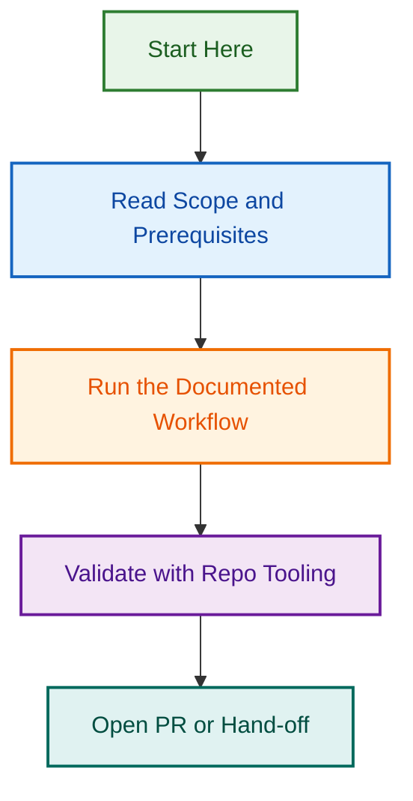

# PRD Factory & Planner UAT Guide

<!-- BADGES-START -->

<!-- BADGES-END -->

This folder contains user acceptance testing materials for the **PRD Factory & Planner** agent.

## Purpose

Use this UAT pack to verify that the agent can reliably turn LightSpeed project inputs into the right planning artefacts, with clear evidence handling, assumptions, risks, and next actions.

## What to Test

The agent should be able to:

- classify the project type correctly
- choose the smallest useful planning artefact first
- separate confirmed facts from assumptions
- identify risks, blockers, approvals, and open questions
- produce structured planning outputs in UK English
- use LightSpeed templates and files when relevant
- avoid inventing facts, approvals, scope, or implementation status

## Core UAT Scenarios

1. **New intake from rough inputs**
   - User provides mixed links, notes, or incomplete project context
   - Expected result: a clean intake summary with gaps and next step

2. **PRD generation from grounded context**
   - User provides enough planning input for a requirements document
   - Expected result: a structured PRD with evidence-aware assumptions and risks

3. **Technical brief routing**
   - User provides Figma and WordPress implementation context
   - Expected result: the agent chooses a technical brief instead of a generic summary

4. **Task breakdown or implementation planning**
   - User provides an approved or mature planning artefact
   - Expected result: the agent expands into sequenced implementation work

5. **Planning review or QA pass**
   - User asks the agent to assess an existing draft
   - Expected result: the agent flags unsupported claims, weak assumptions, and missing criteria

## UAT Approach

- Use real or reusable LightSpeed example contexts where possible
- Test both happy-path and incomplete-input scenarios
- Check whether the chosen artefact matches the user need
- Check whether the output stays grounded in provided evidence
- Record failures as specific behaviour gaps, not vague quality complaints

## Folder Contents

- `uat-checklist.md` — reusable UAT checklist
- `uat-test-script-template.md` — test case template for individual runs
- `uat-signoff-template.md` — final review and sign-off record

---

---

*Built by 🧱 LightSpeedWP with ☕, 🚀, and open-source spirit!*
## Visual Workflow

