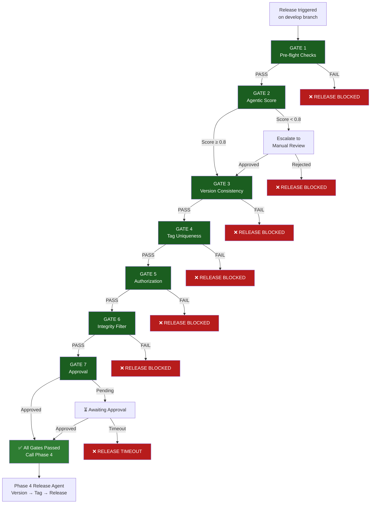

# Release Safety Gates

**Phase 5A Release Agent** implements a **7-layer safety gates system** that validates release safety before calling Phase 4 release scripts. Each gate is independent, can fail fast, and provides clear error messages.

## Overview

The safety gates system ensures that every release:

- ✅ Has valid changelog documentation
- ✅ Has consistent version numbers
- ✅ Is authorized by team maintainers
- ✅ Contains no secrets or integrity issues
- ✅ Follows approval tier requirements
- ✅ Passes agentic reasoning validation

**Key Principle:** Gates AUGMENT Phase 4 scripts without changing them. If gates are unavailable, the system gracefully falls back to Phase 4.

## The 7 Safety Gates

### GATE 1: Pre-flight Checks ✅

**Purpose:** Validate basic repository state before release

**Checks:**

- ✅ On correct branch (develop for patch/minor, main for release)
- ✅ No uncommitted changes in working tree
- ✅ VERSION file exists and is readable
- ✅ CHANGELOG.md exists and is readable
- ✅ Git history is clean and reachable

**Failure Impact:** ❌ HARD FAIL — Release blocked immediately

**Example Error:**

```
❌ GATE 1 FAILED: Uncommitted changes detected
   Files: src/index.js, CHANGELOG.md
   Fix: Commit or stash changes before releasing
```

---

### GATE 2: Agentic Reasoning Score ✅

**Purpose:** AI-powered safety evaluation of release readiness

**Evaluates:**

- ✅ Release scope makes sense (patch/minor/major logic correct)
- ✅ Changelog entries justify the version bump
- ✅ Version numbers follow semantic versioning
- ✅ Release message is clear and professional
- ✅ No conflicting change types (e.g., security + minor)

**Threshold:** Score ≥ 0.80 (80% confidence required)

**Behavior:**

- Score ≥ 0.80: Auto-approve for patch releases
- Score 0.60–0.80: Escalate to human review (minor/major)
- Score < 0.60: Reject with detailed reasoning

**Example Feedback:**

```
⚠️ GATE 2 SCORE: 0.72 (ESCALATION REQUIRED)
   Issues:
   - Major version bump with only 3 changelog entries (expected 5+)
   - New dependencies added but security audit not referenced
   
   Fix: Add more changelog entries or clarify security review
```

---

### GATE 3: Version Consistency ✅

**Purpose:** Ensure all version files are synchronized

**Validates:**

- ✅ VERSION file contains valid semver (X.Y.Z)
- ✅ package.json version matches VERSION file
- ✅ Plugin header version matches (if applicable)
- ✅ Theme header version matches (if applicable)
- ✅ New version is higher than current version
- ✅ Version bump is logical (patch/minor/major)

**Version Files Checked:**

- `VERSION` (root)
- `package.json` (if exists)
- `{plugin-name}.php` header (for plugins)
- `style.css` header (for themes)
- `readme.txt` stable tag (if exists)

**Failure Impact:** ❌ HARD FAIL — Version mismatch prevents release

**Example Error:**

```
❌ GATE 3 FAILED: Version mismatch detected
   VERSION: 1.2.3
   package.json: 1.2.2
   
   Fix: Update package.json to match VERSION (1.2.3)
```

---

### GATE 4: Tag Uniqueness ✅

**Purpose:** Prevent duplicate release tags

**Validates:**

- ✅ No existing git tag for new version (e.g., v1.2.4)
- ✅ No remote branch with same version name
- ✅ Version not already released

**Tag Format:** `v{X.Y.Z}` (e.g., `v1.2.4`)

**Failure Impact:** ❌ HARD FAIL — Duplicate tag prevents release

**Example Error:**

```
❌ GATE 4 FAILED: Tag v1.2.4 already exists
   Git tag: v1.2.4 (2026-07-15)
   
   Fix: Increment version number and retry
        (e.g., 1.2.4 → 1.2.5)
```

---

### GATE 5: Authorization ✅

**Purpose:** Enforce team-based release approval

**Validates:**

- ✅ Release actor is in `maintainers` GitHub team
- ✅ Actor has not exceeded release frequency limits
- ✅ Actor credentials are valid
- ✅ Release is not being triggered by automation (CI/CD)

**Configuration:**

```yaml
maintainers: ["ash", "lightspeed-bot", "release-bot"]
```

**Failure Impact:** ❌ HARD FAIL — Unauthorized users blocked

**Example Error:**

```
❌ GATE 5 FAILED: User not authorized for releases
   Actor: random-contributor
   Required: Member of @lightspeedwp/maintainers team
   
   Fix: Request maintainer to execute release, or join team
```

---

### GATE 6: Integrity Filter ✅

**Purpose:** Detect and prevent secret/credential leakage

**Validates:**

- ✅ No API keys or tokens in commit history
- ✅ No private keys or certificates
- ✅ No AWS/GCP credentials
- ✅ No hardcoded passwords
- ✅ No GitHub tokens (except intentional test fixtures)

**Tools Used:**

- Gitleaks (secret scanning)
- TruffleHog (credential detection)
- Custom regex patterns

**Failure Impact:** ❌ HARD FAIL — Secrets block release

**Example Error:**

```
❌ GATE 6 FAILED: Potential secrets detected
   File: .env.example (line 42)
   Pattern: AWS_SECRET_ACCESS_KEY=...
   
   Fix: Remove secrets, use environment variables instead
        or mark as false-positive in gitleaks config
```

---

### GATE 7: Approval Enforcement ✅

**Purpose:** Tiered approval requirements based on release scope

**Approval Tiers:**

| Scope | Auto-Approve | Manual Approval | Timeline |
|-------|--------------|-----------------|----------|
| **Patch** | If agentic score ≥ 0.8 | Not needed | < 5 min |
| **Minor** | No | 1 maintainer | 10–30 min |
| **Major** | No | 2 maintainers + ADR | 1–4 hours |

**Approval Methods:**

- PR comment: "approved" or "LGTM"
- PR review: Approve change
- Workflow input: `--approve` flag

**Failure Impact:** ⚠️ SOFT FAIL — Blocks auto-merge, awaits approval

**Example Workflow:**

```
🔄 GATE 7 IN PROGRESS: Awaiting approval for minor release

Release: v1.3.0 (minor version bump)
Required: 1 maintainer approval
Current: 0/1 approved

Action: Post comment "approved" to proceed
        (Maintainers: @ash, @lightspeed-bot)
```

---

## Gate Flow Diagram



---

## Implementation Files

### Core Module

**File:** `scripts/gates/release-gates.cjs` (445 LOC)

**Key Class:** `ReleaseGates`

```javascript
class ReleaseGates {
  constructor(options = {})
  runAllGates()                      // Run all 7 gates sequentially
  gate1Preflight()                   // Pre-flight checks
  gate2AgenticScore()                // AI reasoning score
  gate3VersionConsistency()          // Version file validation
  gate4TagUniqueness()               // Duplicate tag detection
  gate5Authorization()               // Team membership check
  gate6IntegrityFilter()             // Secret detection
  gate7Approval()                    // Approval tier enforcement
  saveAuditLog()                     // Persistent audit trail
}
```

### Wrapper Script

**File:** `scripts/workflows/release/run-release-with-gates.cjs` (140 LOC)

Wraps Phase 4 release agent with safety gates:

1. Initialize gates
2. Run all gates
3. Save audit log
4. Call Phase 4 if all pass
5. Provide fallback to Phase 4 if gates unavailable

---

## Configuration

### Gate Thresholds

```javascript
const config = {
  agenticScoreThreshold: 0.80,      // Gate 2 threshold
  maintainers: ['ash', 'lightspeed-bot'],  // Gate 5
  gitleaksEnabled: true,             // Gate 6
  approvalTierMinor: 1,              // Gate 7
  approvalTierMajor: 2,              // Gate 7
};
```

### Environment Variables

```bash
VERBOSE=true           # Enable debug logging
INPUT_SCOPE=patch      # Release scope (patch/minor/major)
INPUT_DRY_RUN=true     # Dry-run mode (no mutations)
GITHUB_ACTOR=ash       # Current user
```

---

## Testing

### Run Gate Tests

```bash
cd /Users/ash/Studio/.github

# Run all gate tests
npm test -- scripts/gates/__tests__/release-gates.test.js

# Run specific gate test
npm test -- scripts/gates/__tests__/release-gates.test.js -t "GATE 1"
```

### Test Coverage

**File:** `scripts/gates/__tests__/release-gates.test.js`

- **Tests:** 41/41 passing ✅
- **Coverage:** All 7 gates tested, edge cases covered
- **Test Types:** Unit + integration tests

### Example Test

```javascript
test('GATE 1 detects uncommitted changes', async () => {
  const gates = new ReleaseGates();
  gates.execSync = () => { throw new Error('uncommitted'); };
  
  expect(() => gates.gate1Preflight())
    .toThrow('Uncommitted changes');
});
```

---

## Audit Logging

All releases are logged to `.github/reports/agentic-releases/` with full audit trail:

```json
{
  "timestamp": "2026-08-21T10:30:00Z",
  "user": "ash",
  "scope": "patch",
  "agenticScore": 0.92,
  "gates": {
    "gate1_preflight": { "passed": true, "details": [...] },
    "gate2_agentic": { "passed": true, "score": 0.92, "details": [...] },
    "gate3_version": { "passed": true, "details": [...] },
    "gate4_tag_unique": { "passed": true, "details": [...] },
    "gate5_authorization": { "passed": true, "details": [...] },
    "gate6_integrity": { "passed": true, "details": [...] },
    "gate7_approval": { "passed": true, "details": [...] }
  },
  "result": "SUCCESS"
}
```

**Retention:** 90 days (GitHub Actions default) + archival in reports folder

---

## Troubleshooting

### "GATE 1 FAILED: Uncommitted changes"

Commit or stash pending changes:

```bash
git add .
git commit -m "docs: Pre-release updates"
# or
git stash
```

### "GATE 2 Score too low"

Add more changelog entries or clarify release scope. Score considers:

- Changelog entry count vs. version bump
- Semantic versioning logic
- Change type consistency

### "GATE 3 Version mismatch"

Update all version files to match:

```bash
# Update to 1.2.4
echo "1.2.4" > VERSION
npm install  # Updates package.json
# Update plugin/theme headers manually if applicable
```

### "GATE 5 Not authorized"

Contact a maintainer to execute release, or request team membership.

### "GATE 6 Secrets detected"

Remove secrets from codebase:

```bash
# Find leaked secrets
git log -p --all -S 'AWS_SECRET' | less

# Remove from history
git filter-branch --force ...  # (careful operation)
```

Or mark as false-positive in `gitleaks.toml`:

```toml
[[rules.allowlist]]
regexes = ["test-key-.*"]
```

---

## Related Documentation

- [RELEASE_PROCESS.md](../../docs/RELEASE_PROCESS.md) — Complete release workflow
- [CHANGELOG_AUTOMATION.md](../../docs/CHANGELOG_AUTOMATION.md) — Changelog validation
- [AGENTIC_RELEASE_USER_GUIDE.md](../../docs/AGENTIC_RELEASE_USER_GUIDE.md) — User guide
- [AGENTIC_RELEASE_ADMIN_GUIDE.md](../../docs/AGENTIC_RELEASE_ADMIN_GUIDE.md) — Admin procedures
- [scripts/workflows/release/README.md](../workflows/release/README.md) — Phase 4 scripts

---

*Built by 🧱 LightSpeedWP with ☕, 🚀, and open-source spirit!*
