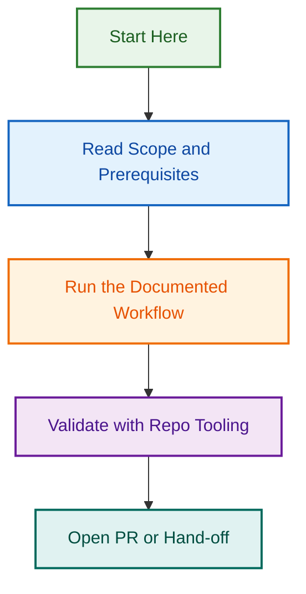

# Schemas

<!-- BADGES-START -->

<!-- BADGES-END -->

Use this folder for reusable JSON schemas and schema-based validation assets for the Tour Operator Website Configuration Agent.

## Folder purpose

This folder contains:

- output schemas for core agent deliverables
- schema files used by file validators
- memory validation schema assets

## Naming conventions

Prefer these patterns where practical:

- `<deliverable>-schema.json`
- `<folder>-file-validation-schema.json`
- `<system>-audit-schema.json`

## Current file inventory

### Deliverable and workflow schemas

- `site-discovery-schema.json`
- `enquiry-form-schema.json`
- `tour-operator-plugin-audit-schema.json`
- `gravity-forms-plan-schema.json`
- `yoast-seo-audit-schema.json`

### Validation schemas

- `template-file-validation-schema.json`
- `example-file-validation-schema.json`
- `schema-file-validation-schema.json`
- `memory-file-validation-schema.json`

## Usage guidance

- Use deliverable schemas to validate structured outputs before relying on them for QA or handoff work.
- Use validation schemas to support checks run by the scripts in `scripts/`.
- Treat this folder as schema assets only; do not use it for markdown examples, templates, or general notes.

## Maintenance rules

- Keep this README aligned with the actual schema file set.
- When a schema is added or renamed, update the relevant validation docs in `tests/`.
- If a validator depends on a schema here, document that dependency in `tests/validation-readme.md` or the relevant test plan.

---

---

*Built by 🧱 LightSpeedWP with ☕, 🚀, and open-source spirit!*
## Visual Workflow

